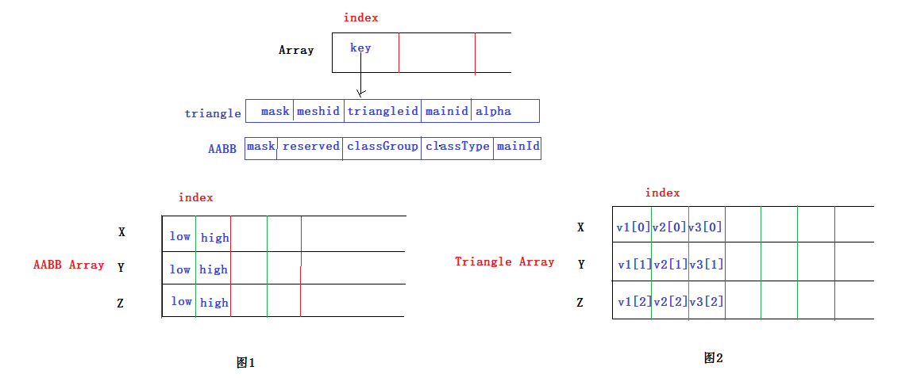
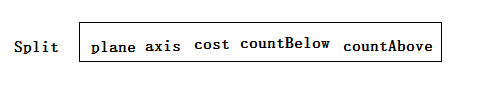
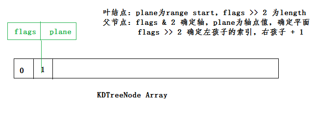
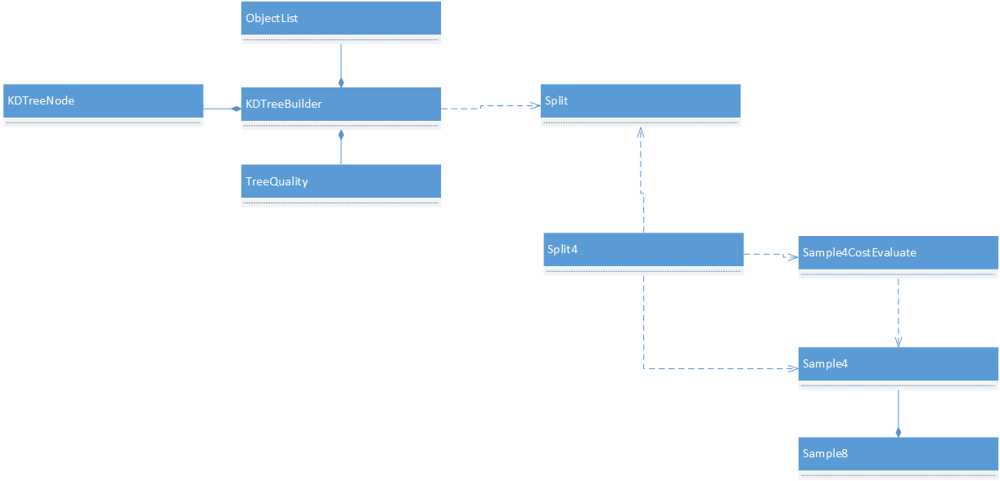

[<< 返回到上级](index.md)

**这里将介绍空间划分的博客文章**  

实时渲染中加速渲染算法如下：  
1. 常用空间数据结构（Spatial Data Structures）  
    1. 层次包围盒（BVH ,Bounding Volume Hierarchies）  
    2. BSP树（BSP Trees）  
    3. 八叉树（Octrees）  
    4. 场景图（Scene Graphs）  
2. 各种裁剪技术（Culling Techniques）  
    1. 背面裁剪（Backface Culling）  
    2. 视锥裁剪（View Frustum Culling）  
    3. 遮挡剔除（Occlusion Culling）  
    4. 层次视锥裁剪（Hierarchical View Frustum Culling）  
    5. 入口裁剪（Portal Culling）  
    6. 细节裁剪（Detail Culling）  
3. 各种层次细节（LOD，Level of Detail）技术  
    1. 几种LOD切换技术（Discrete Geometry LODs、Blend LODs、Alpha LODs、CLODs and Geomorph LODs）  
    2. 几种LOD的选取技术（Range-Based、Projected Area-Based、Hysteresis）  
4. 大型模型的渲染（Large Model Rendering）  
5. 点渲染（Point Rendering）  

空间数据结构（Spatial Data Structures）是将几何体组织在N维空间中的一系列数据结构，而且我们可以很容易地将二维和三维的一些概念扩展到高维之中。这些空间数据结构可以用于很多实时渲染相关操作的加速查询中，如场景管理，裁减算法、相交测试、光线追踪、以及碰撞检测等。  

空间数据结构的组织通常是层次结构的。宽泛地说，即最顶层包含它之下的层次，后者又包含更下层的层次，以此类推。因此，这种结构具有嵌套和递归的特点。用层次结构的实现方式对访问速度的提升很有帮助，复杂度可以从O(n)提升到O(log n)。但同时，使用了层次结构的大多数空间数据结构的构造开销都比较大，虽然也可以在实时过程中进行渐进更新，但是通常需要作为一个预处理的过程来完成。

BSP树和八叉树都是基于空间细分（Space Subdivision）的数据结构，这说明它们是对整个场景空间进行细分并编码到数据结构中的。例如，所有叶子节点的空间集合等同于整个场景空间，而且叶子节点不相互重叠。  

BSP树的大多数变种形式都是不规则的，而松散地意味着空间可以被任意细分。  

八叉树是规则的，意味着空间是以一种均匀的形式进行分割，虽然这种均匀性限制比较大，但这种均匀性常常是效率的源泉。另外值得注意的是，八叉树是四叉树的三维空间推广。  

另一方面，层次包围盒不是空间细分结构，它仅将几何物体周围的空间包围起来，所以包围层次不需要包围所有的空间。  

这里只介绍 BVH 和 BSP算法的变种KDTree(Fast KDTree).  

## **1. Fast KDTree 场景划分**  

**1.1 数据组织**  

场景中含有m个物体，每个物体使用简单的AABB轴对齐包围盒，且物体是由n个三角面组成。  
在这样一个背景下，几何数据组织结构ObjectList如下：  
  
这个图解释：  
物体分两种:三角面和AABB，三角面的数据存储在TriangleArray，AABB存储在AABBArray里。    
a. 将数据按照坐标轴来存储，那么就分成了x,y,z三个类型，这些数据封装在一个数组里。    
b. 一个AABB结构，有两个坐标点Point low(x,y,z), high(x,y,z). 则存储aabb的数据就按照每个轴的最小和最大值保存，每个轴同时保存两个数值，且共用一个物体索引index。如此AABBArray保存了一个AABB模型    
c. 一个三角面结构，有三个顶点Point v1(x,y,z), v2(x,y,z), v3(x,y,z).则类似上面的格式每三个存储在一个索引下，如此TriangleArray保存了一个三角面的数据，另外每个三角面计算一个AABB，保存到AABBArray里。此时TriangleArray和AABBArray的索引值相同  

另外每一个模型都会有一个key来标记，比如三角面是第几个模型的第几个三角面，这里都是索引。这样就可以锁定到外部的模型了。  

经过上面的分析，所有的模型数据就已经建立好。  

接下来看一下分割平面的数据结构:  
  
其中axis和plane确定一个分割平面;cost指代价值，后面介绍SAH时会介绍;countBelow和countAbove表明物体在分割平面上下的数量。  
这里就先认识到这里，后面会具体讲解。  

当物体数据准备好以及分割平面也准备好，那就可以这样的分割下去。分割过程抽象图如下:   
  
说明一下，当ObjectList创建好后，每一个物体都会有一个索引值，那么这里的arena就是记录的索引值，初始化时索引值与下标值相等。  
这里引入一个range，这个range记录的是arena的索引范围(start和end，注意表示的是arena的下标值)表示，通过这个范围可以确定arena的范围，而arena的值对应的是ObjectList的index。有点绕，需要理清楚这里的指向关系。  

当每次去分割一个range时，会把range分成两个子range，就是两个孩子。这里的处理方式为根据分割平面，遍历父range对应的物体，并且判断哪些物体位于split的下面和上面，做一个分类。将少的那些物体扩展arena数组，追加到末尾；将剩下的覆盖父的range.这样就得到两个range。  

分割的结果就是创建一棵树，树节点的表示是一个数组，其结构如下：  
   
这个与递归过程相关，初始化时数组大小为2。其中第0号是无用的，从1开始有效，且1代表着根节点索引。然后每次创建节点都是2个创建，然后前一个是左孩子，后一个是右孩子。比如：目前size是4，那么创建两个子节点size就成为6，然后返回起始索引为6-2=4，则4表示左孩子，5表示右孩子。  
数组有一个性质：两个元素的指针差值代表相隔的字节数dif_size，指针占4个字节，那么dif_size除以4得到一个index。那么指针可通过移动index个单位就可以到后一个指针。  

连接这个性质之后，父节点记录左孩子可以通过这个长度值，右孩子为这个长度值+1。这就是每次创建2个索引作为子节点。  

通过上面粗略的介绍，一棵树就创建完成  
接下来看一些具体的代码，来分析整个流程(Split的选择在后面介绍)  

**1.2 KDTree 构造过程**   

添加一个AABB和三角面的函数：
```
//add for AABB data
inline __u32 AddData( const HexAABBox &aabb, const __u8 option, const __u8 classGroup, const __u8 classType, const __u32 object )
{
    //update key map
    HexKey key(option, classGroup, classType, object);
    aabbKeys[size] = key;

    //add aabb data
    aabbData[X_AXIS][size].low = aabb.low[X_AXIS];
    aabbData[X_AXIS][size].high = aabb.high[X_AXIS];
    aabbData[Y_AXIS][size].low = aabb.low[Y_AXIS];
    aabbData[Y_AXIS][size].high = aabb.high[Y_AXIS];
    aabbData[Z_AXIS][size].low = aabb.low[Z_AXIS];
    aabbData[Z_AXIS][size].high = aabb.high[Z_AXIS];
    costData[size] = 1.0f;

    //calculate total cost and world bounds
    *(float *)&totalCost += costData[size];
    *(HexAABBox *)&worldBounds = AABBUnion(worldBounds, aabb);

    //finally, size ++ and return current index
    *((__u32 *)(&size)) = size + 1;
    return size - 1;
}
//add for Triangle data
inline __u32 AddData( const HexPoint &v1, const HexPoint &v2, const HexPoint &v3, const __u8 option, const __u8 mesh, const __u16 triangle, const __u32 object, const float Alpha = 1.0f )
{
    //update key map
    HexKey key(option, mesh, triangle, object, Alpha );
    aabbKeys[size] = key;

    //add triangle data
    triangleData[X_AXIS][size].v1 = v1[X_AXIS];
    triangleData[X_AXIS][size].v2 = v2[X_AXIS];
    triangleData[X_AXIS][size].v3 = v3[X_AXIS];
    triangleData[Y_AXIS][size].v1 = v1[Y_AXIS];
    triangleData[Y_AXIS][size].v2 = v2[Y_AXIS];
    triangleData[Y_AXIS][size].v3 = v3[Y_AXIS];
    triangleData[Z_AXIS][size].v1 = v1[Z_AXIS];
    triangleData[Z_AXIS][size].v2 = v2[Z_AXIS];
    triangleData[Z_AXIS][size].v3 = v3[Z_AXIS];

    //add aabb data
    HexAABBox aabb(v1, v2, v3);
    aabb.MakeNonPlanar();
    //open loop for speeding up
    aabbData[X_AXIS][size].low = aabb.low[X_AXIS];
    aabbData[X_AXIS][size].high = aabb.high[X_AXIS];
    aabbData[Y_AXIS][size].low = aabb.low[Y_AXIS];
    aabbData[Y_AXIS][size].high = aabb.high[Y_AXIS];
    aabbData[Z_AXIS][size].low = aabb.low[Z_AXIS];
    aabbData[Z_AXIS][size].high = aabb.high[Z_AXIS];
    costData[size] = 1.0f;

    //calculate total cost and world bounds
    *(float *)&totalCost += costData[size];
    *(HexAABBox *)&worldBounds = AABBUnion(worldBounds, aabb);

    //finally, size ++ and return current index
    *((__u32 *)(&size)) = size + 1;
    return size - 1;
}
```
上面准备好基础数据后，下面构建树的上层行数： 
```
void HexKDTreeBuilder::BuildTree(const HexObjectList *objectList)
{
    HexReferenceArena *arena = LockBuildingArena();
    arena->~HexReferenceArena();
    new (arena) HexReferenceArena(objectList->size);
    ((HexObjectList *)objectList)->ResetCostData();
    top = 2;
    HexArray<HexKDTreeNode> *buildingNodes = LockBuildingNodes();
    HexKDTreeFrame frame(*this, *objectList, arena);
    BuildKDTreeNode(frame, 1, buildingNodes);
    ReleaseBuildingNodes();
    ReleaseBuildingArena();
}
```
首先初始化arena以及objectList的cost，并全局设置buildingNodes  
然后对BuildKDTreeNode代码分析
```
// The function to build a kd-tree node
void HexKDTreeBuilder::BuildKDTreeNode( HexKDTreeFrame &frame, const __u32 index, HexArray<HexKDTreeNode> *buildingNodes )
{
    const __u32 input_count = frame.range.Length();
    // build the default split cost using the quality metrics
    HexSplit bestSplit(HexSample4CostEvaluationCache::CountToCostMagic(frame.totalCost)*treeQuality.leafBonus - treeQuality.traversalStepCost);
    // choose the best split according to the quality
    if ( input_count == 1 )
        bestSplit <= ChooseSplitBounds(frame, frame.FirstAABBox());
    else 
        if ( input_count <= treeQuality.smallCutoff )
            bestSplit <= ChooseSplitScanAll(frame);
        else 
            if ( input_count <= treeQuality.largeCutoff )
                bestSplit <= ChooseSplit(frame, treeQuality.smallValue);
            else
                bestSplit <= ChooseSplit(frame, treeQuality.largeValue);

    // 如果找不到分割面，最为一个叶结点保存到index位置
    // 这里 node记录的是 frame.range的长度作为cost值  
    // 且分割平面为NO_AXIS  
    if ( bestSplit.axis == NO_AXIS )
        new (&(*buildingNodes)[index]) HexKDTreeNode(frame.range);
    else
    {
        // 转换frame，并构建两个子节点  
        HexPair<HexKDTreeFrame, HexKDTreeFrame> childFrames = frame.Sift(bestSplit);
        HexKDTreeFrame &frameLower = childFrames.first;
        HexKDTreeFrame &frameUpper = childFrames.second;

        // 确定左右孩子的索引值，buildingNodes的 size = size + 2，并返回 size - 2
        const __u32 childrenIndex = GetNextFree(buildingNodes);
        // 下面均是递归操作
        if ( frameLower.range.start < frameUpper.range.start )
        {
            // 处理左孩子
            if ( *(__s32 *)&bestSplit.countBelow != 0 )
                BuildKDTreeNode(frameLower, childrenIndex, buildingNodes);
            else
                // 此处插入空节点
                new (&(*buildingNodes)[childrenIndex]) HexKDTreeNode();
            // 处理右孩子
            if ( *(__s32 *)&bestSplit.countAbove != 0 )
                BuildKDTreeNode(frameUpper, childrenIndex + 1, buildingNodes);
            else
                // 此处插入空节点
                new (&(*buildingNodes)[childrenIndex + 1]) HexKDTreeNode();
        }
        else
        {
            // 处理右孩子
            if ( *(__s32 *)&bestSplit.countAbove != 0 )
                BuildKDTreeNode(frameUpper, childrenIndex + 1, buildingNodes);
            else
                // 此处插入空节点
                new (&(*buildingNodes)[childrenIndex + 1]) HexKDTreeNode();
            // 处理左孩子
            if ( *(__s32 *)&bestSplit.countBelow != 0 )
                BuildKDTreeNode(frameLower, childrenIndex, buildingNodes);
            else
                // 此处插入空节点
                new (&(*buildingNodes)[childrenIndex]) HexKDTreeNode();
        }
        // 左右孩子处理完后，处理父节点。只需要记录左孩子的索引值
        // bestSplit分割平面也保存
        new (&(*buildingNodes)[index]) HexKDTreeNode(bestSplit, &(*buildingNodes)[childrenIndex]);
    }
}
```
对于一个frame(引用了ObjectList和Arena数据)，进行分割前，选择一个最优的HexSplit  
Split，这里先不做介绍如何选取最优，暂时认为已经找到了。  
真正处理分割的代码如下：  
```
// 指定一个分割平面
inline HexPair<HexKDTreeFrame, HexKDTreeFrame> Sift( const HexSplit &split )
{
    assert(split.axis != NO_AXIS);
    // 知道哪一个轴和这个轴上的一个值，则垂直这个轴且经过这个值的平面就可以确定
    // 分割平面的值
    const float plane = split.plane;
    // 锁定到分割轴上的数据
    const HexArray<HexBoundsPair> &boundsList = objectList[split.axis];

    // 记录cost值
    float totalCostLower = 0.0f;
    float totalCostUpper = 0.0f;

    // 接下来的分割会对arena数组做操作
    // 此处记录 arena top值。后面再Append处理过程中，会动态插入数据到arena，top会变化
    // 这里的top是一个起始值
    const __u32 top = arena.GetTop();
    // 这步是设置arena当前记录位置
    arena.Seek(range.start);
    // 这一步将分割平面确定的上下计数值做一个差值，可确定哪一边较多
    // 这里就可以判断哪一个可能会是 0 
    float tmp = split.countBelow - split.countAbove;
    if ( *(int *)&tmp < 0 ) 
    {
        // 没有物体在分割面的下侧，则全部在上侧
        // 故下侧的节点其实是个空节点
        if ( *(int *)&split.countBelow == 0 )
        {
            totalCostUpper = totalCost;
            arena.Seek(range.end);
        }
        else
        {
            // countBelow < countAbove,这里将 < plane的列表追加到末尾构成一个列表
            // 将 > plane 的列表覆盖原来的列表，构成一个新的列表
            // 这里需要构造两个列表：一个在arena的末尾，一个在原来的列表(范围缩小)
            // 因为追加会扩充内存，选择小的放在末尾比较好
            __u32 cursor = range.start;
            while (cursor<range.end)
            {
                const __u32 index = arena[cursor];
                const HexBoundsPair bounds = boundsList[index];
                if (objectList.IsDeletedData(index))
                {
                    cursor ++;
                    continue;
                }
                const float currentCost = objectList.Cost(index);
                tmp = bounds.low - plane;
                // 如果 plane在 low和high之间，会记录两次，放在不同的列表  
                // 第一步： low 小于 plane 的进行 Append 追加
                if ( *(int *)&tmp < 0 )
                {
                    arena.Append(cursor);
                    totalCostLower += currentCost;
                }
                tmp = plane - bounds.high;
                // high > plane， Justify覆盖原来的数组
                if ( *(int *)&tmp < 0 )
                {
                    arena.Justify(cursor);
                    totalCostUpper += currentCost;
                }
                cursor ++;
            }
        }
        // 分割成两个frame
        return MakePair(HexKDTreeFrame(*this, voxelBounds.BoundUpper(split.axis, split.plane), HexRange(top, arena.GetTop()),              totalCostLower),
                        HexKDTreeFrame(*this, voxelBounds.BoundLower(split.axis, split.plane), HexRange(range.start, arena.GetPosition()), totalCostUpper));
    }
    else
    {
        // above可能为0，做处理
        if ( *(int *)&split.countAbove == 0 )
        {
            totalCostLower = totalCost;
            arena.Seek(range.end);
        }
        else
        {
            // 数量少的追加到末尾
            // 数量多的覆盖原来的
            // plane在low和high之间的，记录两次
            __u32 cursor = range.start;
            while (cursor < range.end)
            {
                const __u32 index = arena[cursor];
                const HexBoundsPair bounds = boundsList[index];
                if (objectList.IsDeletedData(index))
                {
                    cursor ++;
                    continue;
                }
                const float currentCost = objectList.Cost(index);
                float tmp = plane - bounds.high;
                if ( *(int *)&tmp < 0 )
                {
                    arena.Append(cursor);
                    totalCostUpper += currentCost;
                }
                tmp = bounds.low - plane;
                if ( *(int *)&tmp < 0 )
                {
                    arena.Justify(cursor);
                    totalCostLower += currentCost;
                }
                cursor ++;
            }
        }
        return MakePair(HexKDTreeFrame(*this, voxelBounds.BoundUpper(split.axis, split.plane), HexRange(range.start, arena.GetPosition()), totalCostLower),
                        HexKDTreeFrame(*this, voxelBounds.BoundLower(split.axis, split.plane), HexRange(top, arena.GetTop()),              totalCostUpper));
    }
}
```
上面介绍了分割的核心代码，接下来介绍SAH来选择最优的Split面  

**1.3 SAH介绍**  

SAH(Surface Area Heuristic)启发式表面积算法，利用这个算法可以评估出选择合适的轴进行分割。  
这里假设一条均匀分布的光线射入场景，每个节点Node的cost值：  
cost(x) =  Ci + Cl(x) \* Sl(v,x) / S(v) + Cr(x) \* Sr(v,x) / S(v)  
x为分割平面，v为Node含有物体集。Ci为常值，指遍历Node自身的代价；Cl(x)指x分割v的左孩子的cost；Cr(x)指x分割v的右孩子的cost；S(v)指v的面积；Sl(v,x)指左孩子的面积；Sr(v,x)指右孩子的面积。  
Pl = Sl(v,x) / S(v)，表明光线进入左孩子的概率  
Pr = Sr(v,x) / S(v)，表明光线进入右孩子的概率  
若Node不进行划分，初始值即为：  
cost = totalCost \* leafBonus -  travelStep  
leafBonus是一个0到1的加成系数，分割后的cost值在不分割时存在一个差值，可以控制差值在什么范围内是不处理的。而travelStep作为一个控制系数，作为对上面差值的一个修正。  
则比较  
```
if (cost < min(cost(x)))
{
    // 作为叶结点  
}
else
{
    // 以分割平面x进行分割
}
```
另外当前Node的AABB比较小时，不做分割处理。  

一般来说，计算一个Node的cost值，需要递归遍历所有Node的cost值，然后回溯叠加。这样得到的值是准确的。然而，这样的计算时kdtree已经划分好了，这是一个动态规划。这样计算的复杂度就太昂贵了，所以选择贪心计算来近似全局值。  

上面的公式，x的选取很重要。当完成一次分割后，两个概率值很容易计算。接下来说明分割面x的选择方式。  

确定一个原则：选择的平面属于AABB的6个面，那么整个平面的可能性就是有限的。对于每一个平面的计算处理，优化的一个方式是SSE指令，向量计算。则可以将计算量快速下降。一个AABB用2个点标识low和high，则(Xmin, Xmax), (Ymin, Ymax), (Zmin, Zmax)    

确定轴的选取：3个轴均计算选择最优的和选择1个轴计算。其中3个轴计算最后会退化成1个轴计算，然后选择最优的。而1个轴计算，一般选择AABB最长的那一维作为分割轴。  

确定选择方式：排序和采样(采样有全部和部分之分),排序和采样最终的时间复杂度一样O(nlogn).对于采样，部分采样需做两次，自适应选择最优的。而全部采样则不需要。     

接下来分析一个轴上的排序和采样。  
先看一下SAH参数：
```
// Structure containing information related to the quality of a kd-tree split
struct HexKDTreeQuality 
{
    const __u32 smallCutoff;
    const HexSAHType smallValue;
    const __u32 largeCutoff;
    const HexSAHType largeValue;
    const float leafBonus;
    const float traversalStepCost;
};
```
下面是使用代码： 
```
enum HexSAHType { SCANALL_ONE, SCANALL_ALL, SCANSAMPLE_ONE, SCANSAMPLE_ALL, SORT_ONE, SORT_ALL };  
HexSplit bestSplit(totalCost*quality.leafBonus - quality.traversalStepCost);
if ( input_count == 1 )
    bestSplit <= ChooseSplitBounds(frame, frame.FirstAABBox());
else 
    if ( input_count <= treeQuality.smallCutoff )
        bestSplit <= ChooseSplitScanAll(frame);
    else 
        if ( input_count <= treeQuality.largeCutoff )
            bestSplit <= ChooseSplit(frame, treeQuality.smallValue);
        else
            bestSplit <= ChooseSplit(frame, treeQuality.largeValue);
if ( bestSplit.axis == NO_AXIS )
    new (&(*buildingNodes)[index]) HexKDTreeNode(frame.range);
```
初始化时bestSplit为一个cost值，与选择的最优分割面的cost进行比较，判断是否需要进一步分割  
smallCutoff ： Node的节点数 小于 smallCutoff，选择 ScanAll 计算分割面  
largeCutoff ： Node的节点数 小于 largeCutoff，根据 smallValue 参数计算；大于 largeCutoff时，根据 largeValue 参数计算    
leafBonus ：  初始化Node cost的系数  
traversalStepCost ： 初始化Node cost的偏置值  

**部分采样**  
对于采样计算，利用SSE 向量化计算，每此对4个平面做处理，从而构造一个封装类  
```
class HexSample4CostEvaluationCache 
{
    __m128 offsetLower;
    __m128 offsetUpper;
    __m128 scale;
    // computes the cost of a set of samples
    inline __m128 Cost( const HexSample4 &samples ) const
    {
#ifdef __SSE__
        const __m128 scaledPlane = _mm_mul_ps(scale, samples.plane);
        const __m128 scaledAreaLower = _mm_add_ps(offsetLower, scaledPlane);
        const __m128 scaledAreaUpper = _mm_sub_ps(offsetUpper, scaledPlane);
        return _mm_add_ps(_mm_mul_ps(scaledAreaLower, CountToCostMagic(samples.countBelow)),
               _mm_mul_ps(scaledAreaUpper, CountToCostMagic(samples.countAbove)));
#else

#endif
    }
}
```
这里对AABB以及对应的AXIS轴做了封装处理。比如现在对x轴有4个采样点，那么对应4个平面，每个平面都有一个below和above来记录AABBs的数量。根据上面的公司，就是
```
_mm_mul_ps(scaledAreaLower, CountToCostMagic(samples.countBelow))
```
计算below的那部分  
```
_mm_mul_ps(scaledAreaUpper, CountToCostMagic(samples.countAbove))
```
计算above的那部分 
```
_mm_add_ps(,)
```
计算的是和值。最终就可以一次性计算4个采样点的cost值。  
这样每一次处理的结果保存在HexSplit4类中:
```
struct HexSplit 
{
    const float plane;
    const HexAxis axis;
    const float cost;
    float countBelow;
    float countAbove;
}

struct HexSplit4 
{
    const HexAxis axis;
    const __m128 plane;
    const __m128 cost;
    __m128 countBelow;
    __m128 countAbove;
    inline HexSplit Best( void ) const;
        inline HexSplit4 &operator <=( const HexSplit4 &input )
        {
#ifdef __SSE__
            const __m128 mask = _mm_cmplt_ps(input.cost, cost);
#else
            __i128 mask;
            mask[0] = input.cost[0] < cost[0] ? 0xffffffff : 0x0;
            mask[1] = input.cost[1] < cost[1] ? 0xffffffff : 0x0;
            mask[2] = input.cost[2] < cost[2] ? 0xffffffff : 0x0;
            mask[3] = input.cost[3] < cost[3] ? 0xffffffff : 0x0;
#endif
            *(__m128 *)&plane = Blend(*(__m128i *)(&mask), input.plane, plane);
            *(__m128 *)&cost = Blend(*(__m128i *)(&mask), input.cost, cost);
            countBelow = Blend(*(__m128i *)(&mask), input.countBelow, countBelow);
            countAbove = Blend(*(__m128i *)(&mask), input.countAbove, countAbove);
            return *this;
        }
}
```
HexSplit4 是每4个点处理的一个cost类，最终如果存在多个 HexSplit4结果进行比较，使用 <= 操作，得到最好的并覆盖原来的。最后通过Best()函数得到最优的HexSplit.  
注意：部分采样时，采样点个数一般设置为 8.  
回顾一下代码：
```
// Uses the adaptive scanning technique to attempt the best split across a given axis
inline HexSplit ChooseSplitScanSample( const HexKDTreeFrame &frame, const HexAxis axis )
{
    if ( FastMath::VeryClose(frame.voxelBounds.low[axis], frame.voxelBounds.high[axis]) )
        return frame.DefaultSplit();
    //float bounds_lower, bounds_upper;
    const HexSample4CostEvaluationCache costCache(frame.voxelBounds, axis);

    // comb scan
    HexSample8 firstSamples(frame.voxelBounds, axis);
    const HexBoundsPair bound = Scan(firstSamples, frame, axis);

    // adaptive scan
    HexSample8 secondSamples(frame.voxelBounds, axis, firstSamples, costCache);
    Scan(secondSamples, frame, axis);

    return ProjectBest(firstSamples, secondSamples, costCache, axis)
        <= ChooseSplitBounds(frame, axis, costCache, bound);
}
```
部分采样就是对AABB分割成8分，这里做了两次处理。后一次在签一次分割以及分割的结果下做自适应你和计算得到新的分割面，然后再做一次扫描计算cost。然后合并两次的分割面和结果得到一个最优分割面。`ChooseSplitBounds`AABB的边界面来构造分割面。    
  
**全部采样**  
全部采样就是对Node下所有的AABB都遍历一次。上面部分采样计算过程，同样适用于这里。判断全部的AABB个数，然后根据4的倍数来做处理，因为一个AABB有low和high两个值，即对应两个分割面。**最大的区别就是：不需要做自适应处理。**  

**排序**  
排序很简单，对所有的分割面做一个排序。然后遍历计算每一个分割面的below和above。  
主要的是排序带来的复杂度。  

最后简图来回顾构造过程：  


**1.4 查询**  
ObjectsInSpere    
```
unsigned int HexKDTreeBuilder::ObjectsInSphere( HexArray<__u32> &targetList, const HexObjectList *objectList, const HexPoint &center, const float radius )
{
    unsigned int count = 0;
    HexArray<HexKDTreeNode> *queryingNodes = LockQueryingNodes();
    HexReferenceArena *arena = LockQueryingArena(); 
    InitializeChoosenMasks(objectList->size);
    if( queryingNodes->size > 1 )
        RecursiveObjectsInSphere(targetList, objectList, arena, queryingNodes, (*queryingNodes)[1], 1, objectList->worldBounds, center, radius, &count );
    ReleaseQueryingNodes();
    ReleaseQueryingArena();
    return count;
}
void HexKDTreeBuilder::RecursiveObjectsInSphere( HexArray<__u32> &targetList, const HexObjectList *objectList, const HexReferenceArena *arena, const HexArray<HexKDTreeNode> *queryingNodes, const HexKDTreeNode &node, const __u32 currentIndex, const HexAABBox &bound, const HexPoint &center, const float radius, unsigned int *count )
{
    if (node.Leaf())
    {
        if (*count + node.LeafSize() >= targetList.size)
            targetList.Resize(targetList.size + (node.LeafSize() << 2));
        __u32 index;
        //leaf node, add aabb to the result array
        for (unsigned int i = node.RangeStart(); i < node.RangeStart() + node.LeafSize(); i++)
        {
            index = (*arena)[i];
            if (!choosenMasks[index] && OverlapSphereAABB(objectList->AABB(index), center, radius))
            {
                targetList[*count] = index;
                choosenMasks[index] = true;
                (*count) ++;
            }
        }
        return;
    }
    //get child offset and bounds
    __u32 firstChild = currentIndex + node.ChildOffset();
    const HexAABBox leftBound  = bound.BoundUpper(node.Axis(), node.Plane());
    const HexAABBox rightBound  = bound.BoundLower(node.Axis(), node.Plane());
    if (OverlapSphereAABB(leftBound, center, radius) )
        RecursiveObjectsInSphere(targetList, objectList, arena, queryingNodes, (*queryingNodes)[firstChild], firstChild, leftBound, center, radius, count);
    if (OverlapSphereAABB(rightBound, center, radius) )
        RecursiveObjectsInSphere(targetList, objectList, arena, queryingNodes, (*queryingNodes)[firstChild+1], firstChild + 1, rightBound, center, radius, count);
}
```
从根节点开始查询：索引为1.  
这里主要计算球体与AABB是否相交，如果相交则进一步查询，递归下去，知道叶子节点。然后计算叶子节点中的物体是否与球体相交，记录相交的物体索引值。  

ObjectsInAABB    
这里类似上面的过程，主要是计算AABB与AABB相交计算  

RaycastAABB    
主要计算射线与AABB是否相交  

RaycastTriangle    
先计算射线与AABB是否相交，叶子节点做射线计算三角面是否相交

FrustumCulling    
主要计算截头体是否与AABB相交。每个截头体有6个面。    

## **2. BVH构造**  
这里只简单介绍BVH的实现框架，并没有结合SAH算法。  


