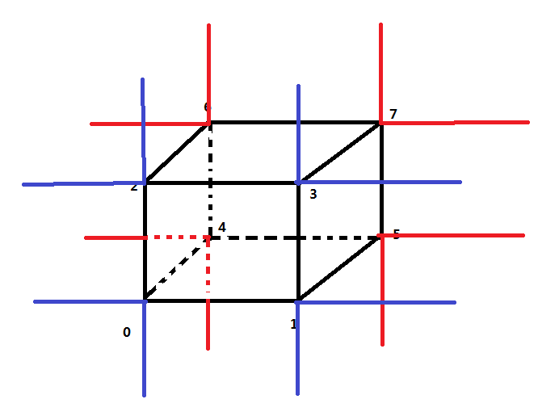

[<< 返回到上级](index.md)

**这里将介绍图形学裁剪和光栅化的博客文章**  

[1. 裁剪算法](#1)  
[2. 光栅化算法](#2)  
[3. 遮挡剔除算法](#3)  

在实现遮挡剔除算法之前，需要明确裁剪和光栅算法：  
a. 遮挡剔除假设已经做了截头体剔除  
b. 剔除包含相机位置的物体(保证所有观察到的物体都在相机的前面)  

<span id="1"></span>  
## **1. 裁剪算法**  
这里介绍的裁剪算法主要针对三角面与长方体或立方体的裁剪算法，裁剪算法在计算机图形学书籍上有很多介绍，这里介绍三维裁剪算法  

**1.1 透视投影变换后**  
裁剪不能在透视除法之后，原因是除法不是线性关系，不能直接插值计算。透视投影变换后的空间，我们称之为齐次裁剪空间，在此空间做裁剪，原因是经过前面几次变换，都是仿射变换，能够进行线性插值。  
齐次坐标是一个四元素 P = (x, y, z, w)。根据前面的假设，此处的 w > 0。现在我们假设在规范化对称立方体(-1 <= x, y, z <= 1)的边界做裁剪, 则点 P 满足如下不等式时该点位于规范化观察体内：  
-1 <= x / w <= 1, -1 <= y / w <= 1, -1 <= z / w <= 1  
即 -w <= x, y, z <= w  
**1.2 区域码概念**  
由上面式子，确定区域码值(区域码为6位000000)  
|6位|5位|4位|3位|2位|1位|  
|:---:|:---:|:---:|:---:|:---:|:---:|  
|远|近|上|下|右|左|  
远近平面针对z值，上下平面针对y值，左右平面针对x值，每个点的分量由其中2位表示：0表示中间。存在一个特殊情况，区域码值位000000，即表示点在内部  

| | | |  
|:---:|:---:|:---:|  
|011001|011000|011010|  
|010001|010000|010010|  
|010101|010100|010110|  
近平面之前的区域码  
| | | |  
|:---:|:---:|:---:|  
|001001|001000|001010|   
|000001|000000|000010|  
|000101|000100|000110|  
远近平面之间的区域码  
| | | |  
|:---:|:---:|:---:|  
|101001|101000|101010|   
|100001|100000|100010|  
|100101|100100|100110|  
近平面之前的区域码  

**1.3 三角面裁剪**  
对于点而言，区域码值不是000000的点都被剔除  
对于线段而言，两端点的区域码p1和p2，逻辑"或"操作值为0，则线段在里面，完全接受；逻辑"与"操作为非零，则剔除，表明线段在6个面的某一外侧；上述操作后，通过测试，则进一步判断该线段是否保留一部分。  
对于三角面而言，是对线段的一个扩展  
下面代码是针对三角面的，有三条线段(mVertexI存放3个顶点，透视投影之后的)  
```
unsigned int clipOr = 0;
unsigned int clipAnd = 0xffffffff;
mVertexCount = n;
for (int i = 0; i < mVertexCount; i++)
{
    // 区域码赋值 mVertexI[i][3] 即 w > 0
    unsigned int clipMask = 0;
    if (mVertexI[i][0] < -mVertexI[i][3])
        clipMask |= 1; // 左平面
    if (mVertexI[i][0] > mVertexI[i][3])
        clipMask |= 2; // 右平面
    if (mVertexI[i][1] < -mVertexI[i][3])
        clipMask |= 4; // 下平面
    if (mVertexI[i][1] > mVertexI[i][3])
        clipMask |= 8; // 上平面
    if (mVertexI[i][2] < -mVertexI[i][3])
        clipMask |= 16;// 近平面
    if (mVertexI[i][2] > mVertexI[i][3])
        clipMask |= 32;// 远平面
    clipOr |= clipMask;
    clipAnd &= clipMask;
}
if (clipAnd > 0)
{
    // 全部在外部且同侧
    mVertexCount = 0;
    return 0;
}
if (clipOr == 0)
{
    // 全部在内部
}
else // 进一步处理
{
    // 确定某一裁剪平面，并进行裁剪
    if (clipOr & 1)
    {
        // 此处的计算，只有相邻的两个点出现一正一负，才存在裁剪的可能性
        // 因为三角面有3个点，可能其中相邻的两个点在同一侧，是不需要裁剪的  
        // 为接下来的测试做准备  
        // 此处裁剪平面为左平面，则dd的值，至少有一个<0，一个>=0
        for (int i = 0; i < mVertexCount; i++)
        {
            dd[i] = mVertexI[i][3] + mVertexI[i][0];
        }
        {
            FastMath::Vector4 *tmp;
            int k = 0;
            for (int i = 0; i < mVertexCount; i++)
            {
                int j = i + 1;
                if (j == mVertexCount)
                {
                    j = 0;
                }
                // i的dd值 >= 0, 则不在左平面
                if (!(*((int *)(&dd[i])) < 0))
                {
                    // 只有不在左平面时，记录这个点到输出列表
                    mVertexO[k++] = mVertexI[i];
                    if ((*((int *)(&dd[j])) < 0))
                    {
                        // j的dd值 < 0, 则在左平面
                        // 通过左平面进行裁剪  
                        // dd[i] / (dd[i] - dd[j]) 计算插值比例 
                        // i不在左平面，j一定在左平面。按照i->j的方向,起始点为i
                        // 插值计算裁剪点，并记录到输出列表
                        FastMath::VectorLerp4f(mVertexI[i].data, mVertexI[j].data, dd[i] / (dd[i] - dd[j]), &mVertexO[k++].data);
                    }
                }
                // i的dd值 < 0, 则在左平面
                else if (!(*((int *)(&dd[j])) < 0))
                {
                    // j的dd值 >= 0, 则不在左平面
                    // 通过左平面进行裁剪
                    // j不在左平面，i一定在左平面。则从j->i方向插值
                    // 插值系数dd[j] / (dd[j] - dd[i])
                    // 计算插值点记录到输出列表，此时并不保存起始点，上一步会进行处理
                    FastMath::VectorLerp4f(mVertexI[j].data, mVertexI[i].data, dd[j] / (dd[j] - dd[i]), &mVertexO[k++].data);
                }
            }
            // 则保存最后的数据，供下一步处理
            // 这一次裁剪的结果，作为下一次裁剪的输入。这个交换很重要
            mVertexCount = k;
            tmp = mVertexI;
            mVertexI = mVertexO;
            mVertexO = tmp;
        }
        // < 3 不构成3角面，失败
        if (mVertexCount < 3)
            return 0;
    }
    if (clipOr & 2)
    {
        // 原理同上，dd值计算方式改变  
        // 右平面裁剪计算
        for (int i = 0; i < mVertexCount; i++)
        {
            dd[i] = mVertexI[i][3] - mVertexI[i][0];
        }
        Clip();
        if (mVertexCount < 3)
            return 0;
    }
    if (clipOr & 4)
    if (clipOr & 8)
    if (clipOr & 16)
    if (clipOr & 32)
}
```
最后裁剪的结果保存在 mVertexI 处，顶点个数 mVertexCount  
之后做一步透视除法并做视口变换得到屏幕坐标  
```
for (int i = 0; i < mVertexCount; i++)
{
    float invh = 1.0f / mVertexI[i][3];
    mVertexI[i].x() = (mVertexI[i][0] * invh + 1.0f) * mXScale;
    mVertexI[i].y() = mYDelta - mVertexI[i][1] * invh * mYDelta;
    mVertexS[i][0] = ((int)(mVertexI[i][0])) | 1;
    mVertexS[i][1] = ((int)(mVertexI[i][1])) | 1;
}
```

这个算法也很容易扩展到多面体，另外两个凸多面体相交裁剪后一定也是凸多面体  

<span id="2"></span>
## **2. 光栅化算法**  
这里介绍的光栅化算法主要针对凸多边形(包括三角形)的光栅化算法  

对任意简单多边形进行光栅化时，可以选择扫描线进行填充，不过处理凸多边形时，可以选择更高效的算法  
对于扫描线算法，可以去查看相关文档  

对于凸多边形，存在一个性质:在封闭的区域内，一条扫描线相交且只与两条边相交  
基于这个性质，可以对凸多边形所在的矩形区域进行扫描线计算，并开辟一个一维数组记录扫描时相交的交点的x值。  
下面分析具体代码：  
```
// 输入参数：2d 点数组围成的凸多边形，vp表示点数
void DrawOPolygon(Vector2i *vs, int vp)
{
    for (int i = 0; i < vp; i++)
    {
        // 线段首位相连
        int j = i + 1;
        if (j == vp)
        {
            j = 0;
        }
        // 根据边两点的y值，从y值小的开始向上遍历
        if (vs[i][1] < vs[j][1])
        {
            // 绘制边
            DrawEdge(vs, i, j);
        }
        else
        {
            DrawEdge(vs, j, i);
        }
    }
}

// 画边参数：顶点数组，起始索引和结束索引
void DrawEdge(Vector2i *vs, int i, int j)
{
    // 此处不用管，ya，yb为顶点的y值
    int ya = (vs[i][1] + 16) >> 5;
    int yb = ((vs[j][1] + 16) >> 5) - 1;
    if (ya > yb)
        return;
    // 计算边的斜率(x = k * y),y增加1各单位，x增加k个
    // 此处是64位除法，对精准度要求较高
    int temp = vs[j][0] - vs[i][0];
    long long t1 = (long long)temp;
    int t2 = vs[j][1] - vs[i][1];
    t1 = t1 << 16;
    int dxi = t1 / t2;
    int sxi = 32768 + (vs[i][0] << 11) + dxi * ((16 - vs[i][1]) & 31) / 32;
    unsigned int* adr = mResultMap + ya*mMapXresb;

    // y值遍历
    while (ya <= yb)
    {
        int x = (int)sxi >> 16;
        // mEdgeTable记录每一个y值扫描线与边的交点的x值
        // 最开始初始化，第一次相交的时候记录一个x1值，再次与另一条边相交的时候，得到另一个交点的x2值  
        // x1与x2，从小到大的顺序，可以计算所有的x整数值。y值给定，那么所有的点就能够计算得到
        int xe = mEdgeTable[ya];
        if (xe == OOCE_NULL)
        {
            mEdgeTable[ya] = x;
        }
        else
        {
            mEdgeTable[ya] = OOCE_NULL;
            if (x < xe)
            {
                DrawSpan(adr, x, xe);
            }
            else if (x > xe)
            {
                DrawSpan(adr, xe, x);
            }
        }
        sxi += dxi;
        ya++;
        adr += mMapXresb;
    }
}

// 画两个交点x值之间的所有x值
void DrawSpan(unsigned int *adr, int min, int max)
{
    int xl = min >> 5;
    int xr = max >> 5;
    unsigned int ml = 0xffffffff >> (min & 31);
    unsigned int mr = 0xffffffff >> (max & 31);

    unsigned int* ptr = adr + xl;
    if (xl == xr)
    {
        (*ptr) |= (ml ^ mr);
    }
    else
    {
        unsigned int* pte = adr + xr;
        (*(ptr++)) |= ml;
        while (ptr < pte)
        {
            (*(ptr++)) = 0xffffffff;
        }
        (*ptr) |= (mr ^ 0xffffffff);
    }
}
```
上面的代码主要是应用于遮挡剔除算法里，故对原来的光栅化做了一些修饰，但具体的原理是非常简单和高效  

<span id="3"></span>
## **3. 遮挡剔除算法**  
上面介绍了裁剪算法和光栅化算法，这两个算法在接下来介绍的遮挡剔除算法里都会用到。  
遮挡剔除描述的是这么个问题：在相机截头体区域内，物体存在前后关系，若后面的物体被前面的物体全部遮挡，则后面的物体是不需要做计算的，可以直接剔除掉。  
那么遮挡剔除的一般过程：  
1. 物体按照顺序进行排序(与相机的距离)  
2. 按由近到远的顺序遍历物体，并进行计算  
    1. 确定相机位置所处包围盒的哪一个区域  
    2. 找出相机能看到包围盒的哪些顶点(最多6个点可见)，构成一个多边形面  
    3. 将顶点变换到齐次裁剪空间  
    4. 进行裁剪得到凸多边形  
    5. 对凸多边形光栅化，判断对应的点的标识值，如果所有点都存在值，表示这个包围盒里的物体会被完全遮挡，物体直接剔除掉;否则更新点的标识值，然后进入下一个环节  
    6. 对物体进行计算，更新点的标识值  

如下为简易的AABB分区：  
  
如下为相机的位置对应能看到的顶点索引：  
```
int OcclusionCullingStab[48][7] =
{
    { 0, 0, 0, 0, 0, 0, 0 }, { 4, 0, 2, 6, 4, 0, 0 }, 
    { 4, 3, 1, 5, 7, 0, 0 }, { 0, 0, 0, 0, 0, 0, 0 },
    { 4, 1, 0, 4, 5, 0, 0 }, { 6, 1, 0, 2, 6, 4, 5 }, 
    { 6, 3, 1, 0, 4, 5, 7 }, { 0, 0, 0, 0, 0, 0, 0 },
    { 4, 2, 3, 7, 6, 0, 0 }, { 6, 0, 2, 3, 7, 6, 4 }, 
    { 6, 2, 3, 1, 5, 7, 6 }, { 0, 0, 0, 0, 0, 0, 0 },
    { 0, 0, 0, 0, 0, 0, 0 }, { 0, 0, 0, 0, 0, 0, 0 },
    { 0, 0, 0, 0, 0, 0, 0 }, { 0, 0, 0, 0, 0, 0, 0 },

    { 4, 0, 1, 3, 2, 0, 0 }, { 6, 4, 0, 1, 3, 2, 6 }, 
    { 6, 0, 1, 5, 7, 3, 2 }, { 0, 0, 0, 0, 0, 0, 0 },
    { 6, 5, 1, 3, 2, 0, 4 }, { 6, 4, 5, 1, 3, 2, 6 }, 
    { 6, 0, 4, 5, 7, 3, 2 }, { 0, 0, 0, 0, 0, 0, 0 },
    { 6, 1, 3, 7, 6, 2, 0 }, { 6, 0, 1, 3, 7, 6, 4 }, 
    { 6, 0, 1, 5, 7, 6, 2 }, { 0, 0, 0, 0, 0, 0, 0 },
    { 0, 0, 0, 0, 0, 0, 0 }, { 0, 0, 0, 0, 0, 0, 0 }, 
    { 0, 0, 0, 0, 0, 0, 0 }, { 0, 0, 0, 0, 0, 0, 0 },

    { 4, 6, 7, 5, 4, 0, 0 }, { 6, 2, 6, 7, 5, 4, 0 }, 
    { 6, 6, 7, 3, 1, 5, 4 }, { 0, 0, 0, 0, 0, 0, 0 },
    { 6, 0, 4, 6, 7, 5, 1 }, { 6, 2, 6, 7, 5, 1, 0 }, 
    { 6, 0, 4, 6, 7, 3, 1 }, { 0, 0, 0, 0, 0, 0, 0 },
    { 6, 3, 7, 5, 4, 6, 2 }, { 6, 2, 3, 7, 5, 4, 0 },
    { 6, 2, 3, 1, 5, 4, 6 }, { 0, 0, 0, 0, 0, 0, 0 },
    { 0, 0, 0, 0, 0, 0, 0 }, { 0, 0, 0, 0, 0, 0, 0 }, 
    { 0, 0, 0, 0, 0, 0, 0 }, { 0, 0, 0, 0, 0, 0, 0 }
};
```

判断相机的位置以及对应的索引代码为：  
```
unsigned int cd = 0;
if (mCameraPosition[0] < min[0])
    cd |= 1;
if (mCameraPosition[0] > max[0])
    cd |= 2;
if (mCameraPosition[1] < min[1])
    cd |= 4;
if (mCameraPosition[1] > max[1])
    cd |= 8;
if (mCameraPosition[2] < min[2])
    cd |= 16;
if (mCameraPosition[2] > max[2])
    cd |= 32;
```

相机看到的顶点做投影变换并裁剪：  
```
int *stt = OcclusionCullingStab[cd];
int vp = *stt++;
for (int i = 0; i < vp; i++)
{
    int j = *stt++;
    mViewProjectionMatrix.TransformVector(vxt[j], &mOcclusionCullingClipper.mVertexI[i]);
}
vp = mOcclusionCullingClipper.ClipAndProject(vp);
if (vp < 3)
{
    return 0;
}
```

当通过裁剪后，则测试裁剪的片段是否被完全遮挡：  
```
mOcclusionCullingMap.QueryOPolygon(mOcclusionCullingClipper.mVertexS, vp)
{
    mYmin = 100000; 
    mYmax = 0;
    for (int i = 0; i < vp; i++)
    {
        int j = i + 1;
        if (j == vp)
        {
            j = 0;
        }
        if (vs[i][1] < vs[j][1])
        {
            ConvertEdge(vs, i, j);
        }
        else
        {
            ConvertEdge(vs, j, i);
        }
    }
    int res = TestPolygon();
    for (int i = mYmin; i <= mYmax; i++)
    {
        mBorders[i][0] = 100000;
        mBorders[i][1] = 0;
    }
    return res;
}
```
其中TestPolygon()函数即为检测多边形区域下的像素点是否全部都被之前的物体所占有  

经过上一轮快速剔除后，得知包围盒下的物体是否还需要进行计算。如果需要，则执行如下流程：  
```
bool DrawOccluder()
{
    1. 将模型三角面投影到相机空间，然后做消隐  
    2. 进一步变换到齐次裁剪空间做裁剪  
    3. 将得到的凸多边形光栅化，更新像素点对应的标示值  
}
```
上一步操作是针对不需要剔除的物体，则计算完成后，需要将物体添加到对应的渲染队列。带有透明材质的物体不参与计算。  

注意：  
1. 在计算过程中，我们设置图片的像素宽高w和h值  
2. 为了节省内存空间，将w值按32位压缩，即 w << 32 + 1 个整数且每个整数表示32个整数  
3. 对于斜率的精确度，采用64位除法，这样确保后面的累加过程更加准确  
4. 这里有三角面和3D多边形的裁剪，裁剪算法一样  

