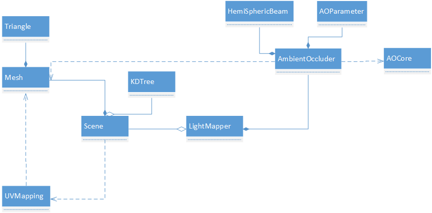

[<< 返回到上级](index.md)

**这里将介绍图形学光照模型的博客文章**  

本文概念部分引用[这里](https://zhuanlan.zhihu.com/p/21376124)  
需要清楚BRDF是什么？辐射度量学是什么？  

[1. 经验光照](#1)  
[2. 物理光照](#2)  
[3. 表面绘制算法](#3)  
[4. 光线跟踪](#4)  

  
## **1. 经验光照**  

一般的光照模型：  
  
其中包含了环境，漫反射，镜面发射三种光照模型，这里使用的是Phong光照模型。  
Blinn Phong光照模型：  
  
对Phong光照模型使用半角向量h  
  

下标a表示环境光，d表示漫反射光，s表示高光，k表示发射系数或者材质颜色，I表示光的颜色或亮度，alpha表示表面的粗糙程度，值越小越粗糙，越大越光滑。r为反射向量，v表示观察向量，n表示法线向量，l表示入射向量，h表示(v, l)的角平分线即半角向量     
Blinn Phong是对Phong的一个优化和改进。其计算简单，效果更接近真实。  

  
## **2. 物理光照**  

辐射度量学基础概念理解：  
能量，通量，辐照度，辐射度，立体角，辐射率，微平面，法线分布函数，Shadow和Masking，折射率等等  

  
## **3. 表面绘制算法**  

表面绘制也称为明暗处理算法，主要指应用光照模型获得投影表面位置像素颜色的过程。  

恒定光强绘制，平面所有点应用一种光强来绘制   

Gouraud着色绘制，平滑着色，使用亮度插值来绘制其内部点。先计算每个多边形顶点的平均单位法线，再对每个点应用光照模型计算光强值，最后内部点进行插值计算光强  

Phong明暗处理，也称为法矢量插值明暗处理。这里与Gouraud处理不同，使用顶点的法线对内部点进行插值，然后对每个内部点应用光照模型计算光强。   

恒定光强计算简单，效果差；Gouraud效果适中，计算量较大；Phong效果好，计算量大。  

  
## **4. 光线跟踪**  

光线追踪方法模拟物理光在空间中的传播（考虑反射和折射），从投影平面的一个像素点发出一条或多条光线进入场景，遇到物体表面就提取表面的材质信息，沿反射光线继续前进（若是透明物体，再分出一条折射光线），这样递归下去直到光线到达光源、场景之外（环境）或光亮度减小到规定的临界值，将过程中所有颜色信息相加就是显示在这一点的颜色。  
全局光照带来真实感效果，但其计算量很大，难以做到实时性，一般采用离线计算获得全局的光照贴图。光线跟踪就是其中一种全局光照，原理简单，实现起来容易。  
接下来介绍Ambient Occlusion(环境光遮挡)，实现场景中的明暗处理，增强游戏的真实感。光线跟踪的相关原理就不做图解释了，主要是分析代码。  

看一个整体的架构图：  
  
场景Scene包含了很多Mesh(Mesh有很多Triangle),使用UVMapping对所有Mesh划分一套光照贴图UV，保存在模型中。并且对所有的Mesh构建一颗fast KDTree，便于后面进行光线检测计算。   
上面这步基础工作，准备好后，实例化LightMapper(将Scene实例传入)，LightMapper中目前主要是做AO处理(后期可以加 ShadowCaster等操作)，实例化AmbientOccluder类(设置好AOParameter参数以及创建一个HemiSphericBeam半球体射线)。当LightMapper进行AO处理时，调用AmbientOccluder类。由于场景中存在大量的模型和三角面片，这里加入多线程处理(AOCore表示一个线程的执行封装，只处理一个面片)。  

整体的架构流程就介绍完成，那么最核心的就是如何处理一个面片。    
其中UV划分([这里可查看UV划分的基本计算](uv_split.md))和Fast KDTree([这里可查看KDTree](bsp.md))都介绍过了，那么确定半球体射线的方式：     
**确定半球射线HemiSphericBeam**  
当光线入射到面上一点时，在该点和点法方向确定的平面上，构建一个半球体模拟射线。  
构建的一般过程：  
参数为 起始角度startAngle，结束角度endAngle，线段个数segment
首先根据角度范围和线段数量确定角度间隔  
然后遍历每一个角度，计算在每一个角度下确定一个圆(半径r和圆所在的高度y)  
最后以确定的圆构建多个点，这些点与球心构造成一条射线   

当确定空间的一个点和法向量是，可以创建一个主动旋转矩阵，将半球体射线对齐到该点，这才是后面处理的真是射线。  

**AO参数设置**   
    AO范围设置，表明能够影响的范围  

**模型处理**  
1. 遍历所有模型Mesh  
    1. 遍历每一个三角面片  
        1. 读取三角面的UV三角形  
            1. 对uv三角形插值得到每一个uv值(可以将uv放大然后填充得到所有的点)  
                1. 得到的uv值计算三角面片的点vertex  
                2. 如果需要插值法线，则法线插值；否则用三角面的法线表示，得到normal  
                3. 根据vertex和normal得到一个旋转平移变换矩阵  
                4. 将半球体的数据变换过去，得到射线数组  
                    1. 对每一个光线做处理  
                        1. kdtree光线检测，得到相交模型(模型分带有透明度和不带透明度)，得到一个距离值    
                        2. 根据距离值和AO参数计算一个光强值保存到贴图里  

注意：  
此过程需要做三角面的双线性插值得到内部点坐标   
对于最后的AO贴图，存在锯齿可能需要进一步处理    

上面的AO处理，并没有做光线的跟踪，只是很简单的模拟，若后面在介绍的ShadowCaster的话，里面会进一步跟踪射线(添加地形)，其计算结构与AO差不多。  
光线跟踪最核心的就是查询相交的处理，加速计算采用了FastKDTree。  

