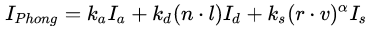
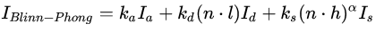
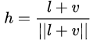

[<< 返回到上级](index.md)

**这里将介绍图形学光照模型的博客文章**  

**http://blog.csdn.net/silangquan/article/details/45629149**  
**http://blog.csdn.net/Jurbo/article/details/75151200**  
**https://www.cnblogs.com/luxishi/p/6409716.html**    

## **简单介绍**  

光学根据研究的尺度可以分为波动光学（Wave Optics）和几何光学（Geometric Optics），波动光学比几何光学复杂，而由于图形学领域关注的尺度远大于可见光的波长，也很少涉及光的偏振、干涉和衍射等波动光学才能解释的现象，所以我们一般用几何光学来建立光照模型。  

**光学平面和非光学平面的散射**  
光学平面： 当一束光线从一种物质照射到平面边界上时，其中一部分在平面边界被反射回这种物质，反射方向为入射方向关于平面法线的对称向量`r = 2(n·l)n - l`(r为反射向量，n为平面法向量，l为入射方向，n·l表示夹角cosine值)，另一部分光穿过平面边界折射进入另一种物质，折射方向可由Snell法则。   
sin(theta1) / sin(theta2) = v1 / v2 = lamda1 / lamda2 = n1 / n2  
theta表示介质中的角度， v表示介质中的速度， lamda表示介质中的波长，n表示介质的折射率  

非光学平面：因为表面是粗糙的，且粗糙的尺度远大于光的波长，反射方向是异向，异向的程度由表面的粗糙程度决定。这类平面看成是由大量朝向各异的微小平面组成。光线照射到微小平面，一部分在表面发生反射，不同方向的微平面反射方向不同。另一部分光线发生折射，折射的光线在物质内部也发生反射和折射，其中有一部分的光线会再次穿过表面被观察到，这种现象称之为次表面散射，也有一部分被吸收。另外透视到面的另一侧的光线的分析，称为BTDF(研究透视)。BRDF描述的是次表面散射的出色点与入射点，反射点比较接近的时候；若出射点偏离反射点，入射点时，称之为BSSRDF,这个分析比BRDF要复杂很多.   

BRDF光线中，有一部分光线方向上比较集中在某一个方向，这类称之为镜面反射；其他的光线方向比较分散，称之为漫反射。  

[1. 经验光照](#1)  
[2. 物理光照](#2)  
[3. 多边形绘制算法](#3)  
[4. 光线跟踪](#4)  

  
## **1. 经验光照**  

一般的光照模型：  
  
其中包含了环境，漫反射，镜面发射三种光照模型，这里使用的是Phong光照模型。  
Blinn Phong光照模型：  
  
对Phong光照模型使用半角向量h  
  

下标a表示环境光，d表示漫反射光，s表示高光，k表示发射系数或者材质颜色，I表示光的颜色或亮度，alpha表示表面的粗糙程度，值越小越粗糙，越大越光滑。r为反射向量，v表示观察向量，n表示法线向量，l表示入射向量，h表示(v, l)的角平分线即半角向量     
Blinn Phong是对Phong的一个优化和改进。其计算简单，效果更接近真实。  

  
## **2. 物理关照**  

讲辐射强度前，我们需要先知道立体角（Solid Angle）的概念，立体角可以看成是弧度的三维扩展。我们知道弧度是度量二维角度的量，等于角度在单位圆上对应的弧长，单位圆的周长是2\pi ，所以整个圆对应的弧度也是2\pi 。立体角则是度量三维角度的量，用符号\omega 表示，单位为立体弧度（也叫球面度，Steradian，简写为sr），等于立体角在单位球上对应的区域的面积（实际上也就是在任意半径的球上的面积除以半径的平方\omega = \frac{s}{r^{2} } ），单位球的表面积是4\pi ，所以整个球面的立体角也是4\pi 。

  
## **3. 多边形绘制算法**  

  
## **4. 光线跟踪**  

光线追踪方法模拟物理光在空间中的传播（考虑反射和折射），从投影平面的一个像素点发出一条或多条光线进入场景，遇到物体表面就提取表面的材质信息，沿反射光线继续前进（若是透明物体，再分出一条折射光线），这样递归下去直到光线到达光源、场景之外（环境）或光亮度减小到规定的临界值，将过程中所有颜色信息相加就是显示在这一点的颜色。  