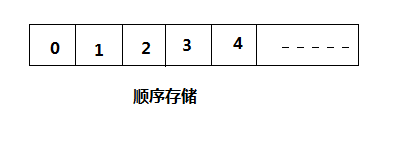
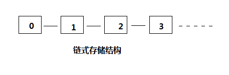

[<< 返回到主页](index.md)

**这里将介绍队列和桟博客文章**  

[1. 认识数组和线性表](#1)  
[2. 线性表顺序结构实现](#2)  
[3. 线性表链式结构实现](#3)  
[4. 桟和队列的一般实现](#4)  

<span id = "1"></span>  
## **1. 认识数组和线性表**  
线性表分顺序存储和链式存储  
  
  
  

数组是一块连续的内存地址空间，且初始化时确定了其大小且不能改变。  
顺序存储与数组类似，最大的区别是元素个数能动态改变，本质上是对数组的扩展。  
链式存储与数组和顺序存储的主要区别是内存不是连续的。  

|结构|数组|顺序存储|链式存储|  
|:-:|:-:|:-:|:-:|  
|分配方式|连续的存储单元依次存储数据元素|连续的存储单元依次存储数据元素|一组任意的存储单元存放元素|  
|时间性能|查找O(1),不支持增加和删除|查找O（1）、插入和删除O（n）|查找O（n）、插入和删除O（1）|  
|空间性能|大小固定|不固定，分大了浪费内存，分小了后期扩展耗性能|可以随时添加，内存开销较小，与实际需要近似，不存在浪费|  

通过分析，可以看出：  
1. 若线性表需要频繁查找，很少进行插入和删除操作时，宜采用顺序存储结构。若需要频繁插入和删除时，宜采用单链表结构。  
2. 当线性表中的元素个数变化较大或者根本不知道有多大时，最好用单链表结构，这样可以不需要考虑存储空间的大小问题。而如果事先知道线性表的大致长度，用顺序存储结构效率会高很多。  
3. 数组则是你确定需要多少个的时候使用(没有删除和增加的操作)  

<span id = "2"></span>  
## **2. 线性表顺序结构实现**  
 
在处理增加操作时，存在空间满的情形，此时：  
1. 扩充空间，一般在现有的空间大小上乘以2 + 1  
2. 拷贝原先的元素到新的空间上  
3. 释放原来的内存空间  
所以，增加操作动态扩展时，比较耗性能并且内存分配大造成浪费  

线性表的顺序存储方式的一般性代码结构:  
```
template <class list_type>
class List
{
public:
    /// Default constructor
    List();   
    /// Destructor
    virtual ~List();   
    /// Copy constructor
    /// \param[in]  original_copy The list to duplicate
    List( const List& original_copy ); 
    /// Assign one list to another
    List& operator= ( const List& original_copy );  
    /// Access an element by its index in the array
    /// \param[in]  position The index into the array.
    /// \return The element at position \a position.
    list_type& operator[] ( const unsigned int position ) const; 
    /// Push an element at the end of the stack
    /// \param[in] input The new element.
    void Push(const list_type &input);   
    /// Pop an element from the end of the stack
    /// \pre Size()>0
    /// \return The element at the end.
    list_type& Pop(void);   
    /// Insert an element at position \a position in the list
    /// \param[in] input The new element.
    /// \param[in] position The position of the new element.
    void Insert( const list_type &input, const unsigned int position );   
    /// Insert at the end of the list.
    /// \param[in] input The new element.
    void Insert( const list_type &input );   
    /// Replace the value at \a position by \a input.  If the size of
    /// the list is less than @em position, it increase the capacity of
    /// the list and fill slot with @em filler.
    /// \param[in] input The element to replace at position @em position.
    /// \param[in] filler The element use to fill new allocated capacity.
    /// \param[in] position The position of input in the list.
    void Replace( const list_type &input, const list_type &filler, const unsigned int position );   
    /// Replace the last element of the list by \a input .
    /// \param[in] input The element used to replace the last element.
    void Replace( const list_type &input );
    
    /// Delete the element at position \a position.
    /// \param[in] position The index of the element to delete
    void RemoveAtIndex( const unsigned int position );   
    /// Delete the element at position \a position.
    /// \note - swaps middle with end of list, only use if list order does not matter
    /// \param[in] position The index of the element to delete
    void RemoveAtIndexFast( const unsigned int position );   
    /// Delete the element at the end of the list
    void RemoveFromEnd(const unsigned num=1);    
    /// Returns the index of the specified item or MAX_UNSIGNED_LONG if not found
    /// \param[in] input The element to check for
    /// \return The index or position of @em input in the list.
    /// \retval MAX_UNSIGNED_LONG The object is not in the list
    /// \retval [Integer] The index of the element in the list
    unsigned int GetIndexOf( const list_type &input ) const;   
    /// \return The number of elements in the list
    unsigned int Size( void ) const;    
    /// Clear the list
    void Clear( bool doNotDeallocateSmallBlocks=false );  
    // Preallocate the list, so it needs fewer reallocations at runtime
    void Preallocate( unsigned countNeeded );  
    /// Frees overallocated members, to use the minimum memory necessary
    /// \attention
    /// This is a slow operation
    void Compress( void );
    
private:
    /// An array of user values
    list_type* listArray;   
    /// Number of elements in the list
    unsigned int list_size;  
    /// Size of \a array
    unsigned int allocation_size;
};
```


<span id = "3"></span>  
## **3. 线性表链式结构实现**   

增删操作时，元素与前一个和后一个元素之间的连接要小心  

双向循环链表的代码结构:  
```
template <class CircularLinkedListType>
class CircularLinkedList
{
public:
    struct node
    {
        CircularLinkedListType item;
        node* previous;
        node* next;
    };
    CircularLinkedList();
    ~CircularLinkedList();
    CircularLinkedList( const CircularLinkedList& original_copy );
    // CircularLinkedList(LinkedList<CircularLinkedListType> original_copy) {CircularLinkedList(original_copy);}  // Converts linked list to circular type
    bool operator= ( const CircularLinkedList& original_copy );
    CircularLinkedList& operator++();  // CircularLinkedList A; ++A;
    CircularLinkedList& operator++( int );  // Circular_Linked List A; A++;
    CircularLinkedList& operator--();  // CircularLinkedList A; --A;
    CircularLinkedList& operator--( int );  // Circular_Linked List A; A--;
    bool IsIn( const CircularLinkedListType& input );
    bool Find( const CircularLinkedListType& input );
    bool IsAtBeginning(); //return true if at beginning
    bool IsAtEnd(); //return true if at end
    void Insert( const CircularLinkedListType& input );
    CircularLinkedListType& Add ( const CircularLinkedListType& input )
        ; // Adds after the current position
    void Replace( const CircularLinkedListType& input );
    void Del( void );
    unsigned int Size( void );
    CircularLinkedListType& Peek( void );
    CircularLinkedListType Pop( void );
    void Clear( void );
    void Sort( void );
    void Beginning( void );
    void End( void );
    void Concatenate( const CircularLinkedList& L );
protected:
    unsigned int list_size;
    node *root;
    node *position;
    node* FindPointer( const CircularLinkedListType& input );
private:
    CircularLinkedList Merge( CircularLinkedList L1, CircularLinkedList L2 );
    CircularLinkedList Mergesort( const CircularLinkedList& L );
};

template <class LinkedListType>
class LinkedList : public CircularLinkedList<LinkedListType>
{
public:
    LinkedList(){}
    LinkedList( const LinkedList& original_copy );
    ~LinkedList();
    bool operator= ( const LinkedList<LinkedListType>& original_copy );
    LinkedList& operator++();  // LinkedList A; ++A;
    LinkedList& operator++( int );  // Linked List A; A++;
    LinkedList& operator--();  // LinkedList A; --A;
    LinkedList& operator--( int );  // Linked List A; A--;
private:
    LinkedList Merge( LinkedList L1, LinkedList L2 );
    LinkedList Mergesort( const LinkedList& L );
};
```

此处是循环双链表元素结构：  
```
struct node
{
    CircularLinkedListType item;
    node* previous;
    node* next;
};
```

若是双链表,对上述的循环列表在增删操作时，不需要将head和tail连接    

若是单链表(只存在node* next，而没有previous)：  
```
struct node
{
    CircularLinkedListType item;
    node* next;
};
```

<span id = "4"></span>  
## **4. 桟和队列的一般实现**  

桟：元素先进后出  
队列：元素先进先出  
两种常用的线性数据结构均可采用顺序或链式实现  

**4.1 桟**  
泛型代码结构:  
```
template<class T>
class Stack
{
public:
    Stack();
    void Push(T);  //push an item onto the stack
    T Pop();       //pop an item from stack
    T Peek();

    bool IsEmpty(); 
    void Clear();
    ~Stack();
private:
    struct StackNode 
    {
        T _current;
        StackNode *_below;
        StackNode(T C, StackNode *B = 0) : _current(C), _below(B) {}
    };
    int _size;
    StackNode *_top;
};
```
上述代码结构是桟用顺序存储的实现方式。同样，线性表的链式和顺序存储也适用于桟的规则。  

**4.1 队列**  

下面泛型代码为队列的顺序存储实现(先进先出)：  
```
/// \brief A queue implemented as an array with a read and write index.
template <class queue_type>
class Queue
{
public:
    Queue();
    Queue(unsigned int _allocation_size);
    virtual ~Queue();
    Queue( Queue& original_copy );
    bool operator= ( const Queue& original_copy );
    void Push( const queue_type& input );
    void PushAtHead( const queue_type& input, unsigned index=0 );
    queue_type& operator[] ( unsigned int position ) const; // Not a normal thing you do with a queue but can be used for efficiency
    void RemoveAtIndex( unsigned int position ); // Not a normal thing you do with a queue but can be used for efficiency
    inline queue_type Peek( void ) const;
    inline queue_type PeekTail( void ) const;
    inline queue_type Pop( void );
    inline unsigned int Size( void ) const;
    inline bool IsEmpty(void) const;
    inline unsigned int AllocationSize( void ) const;
    inline void Clear( void );
    void Compress( void );
    bool Find ( queue_type q );
    unsigned int GetItemIndex ( queue_type q );
    void ClearAndForceAllocation( int size ); // Force a memory allocation to a certain larger size
private:
    queue_type* array;
    unsigned int head;  // Array index for the head of the queue
    unsigned int tail; // Array index for the tail of the queue
    unsigned int allocation_size;
};
```

下面泛型代码为队列的链式存储实现(先进先出)：  
```
template <class QueueType>
class QueueLinkedList
{

public:
    QueueLinkedList();
    QueueLinkedList( const QueueLinkedList& original_copy );
    bool operator= ( const QueueLinkedList& original_copy );
    QueueType Pop( void );
    QueueType& Peek( void );
    QueueType& EndPeek( void );
    void Push( const QueueType& input );
    unsigned int Size( void );
    void Clear( void );
    void Compress( void );
    
private:
    LinkedList<QueueType> data;
};
```


