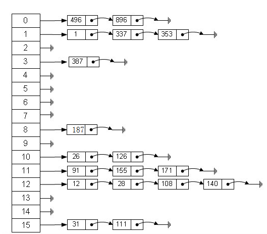

[<< 返回到主页](index.md)

**这里将介绍hash map的博客文章**  

哈希表也成为散列表，根据关键key值进行数据访问。其中关键key值按照一个映射函数获得hash值，然后通过hash和key值寻到具体的数据值。  
下图为示例图：  
   
上图使用了一个数组和一个链表来同时记录数据。计算过程为hash = hash_func(key)计算得到的hash值找到数组的索引值，根据索引值找对应的链表，然后根据key来遍历链表找到对应的数据。  

一般进行hash函数计算得到索引值，分两步：  
1. 根据key获得散列值(散列函数可以找相关文章查看)  
2. 根据散列值与数组的大小求余数，得到数组的索引值  

假定n为所有的数据元素数量，m为数组的数量，那么链表的平均长度是n/m    

对于插入操作：  
1. 找到链表的head(O(1))   
2. 将数据查到head即可(O(1))  

对于查找操作：  
1. 找到链表的head(O(1))    
2. 遍历链表(O(n/m))  

对于删除操作：  
1. 找到链表的head(O(1))    
2. 遍历链表并删除(O(n/m))  

在对HashTable做添加操作时，链表的平均长度会越来越大，导致每次遍历链表的时间会增加，故设定一些阈值来控制HashTable的m值。有些代码默认的m值为89，且threshold = n / m = 0.75，即当增加元素使得n/m > threshold时，对hash表进行扩展。第一次扩展可认为是89 \* 0.75 = 67时发生一次扩展，扩展公式为 2 \* n + 1 。  
扩展时需要注意：原有的数据需要重新计算数组索引，因为现在总容量变了，hash值求余的对数据变了，rehash一下，再释放就的空间。  

```
    template <class KeyType, class DataType> 
    class HashTable 
    {
    public:
        class HashNode 
        {
        public:
            KeyType key;
            DataType data;
            //pointer to the next storage location in the hasnNode.a has node is essentially just a linked list.
            HashNode *prev;
            HashNode *next;
            //returns a newly instantiated object of type HashNode.
            HashNode(const KeyType &_key, const DataType &_data, HashNode *_prev = 0, HashNode *_next = 0 );
            HashNode() { key = 0; data = DataType(); prev = 0; next = 0; }
        };
        //java's built-in hash table uses Ko=89 as the default bucket size, as Kn = 2Kn+1 + 1 is a prime number after as many as 5 repetitions.
        const static int DEFAULT_BUCKETS = 89;
        const static double THRESHOLD;
    private:
        HashNode **hashNodes;
        int numberHashNodes;
        int numberHashEntries;

        int CalcuHash( const KeyType &key ) const;
        void ReHash(int newSize = 0);
        //grow() increases the size of the array based on the formula new_size = 2*old_size + 1
        void Grow();

        int defaultHashSize;
    public:
        HashTable(int startingHashNodes = DEFAULT_BUCKETS);
        ~HashTable();

        HashTable &operator = (const HashTable &table);
        DataType &operator [] ( const KeyType &key );

        bool InHashTable(const KeyType &key);

        inline int GetHashTableSize() { return numberHashNodes; }
        inline int GetHashEntriesSize() { return numberHashEntries; }

        HashNode *Add(const KeyType &key, const DataType &data);
        bool Del(const KeyType &key);
        HashNode *FindHashNode(const KeyType &key);
        bool SetData(const KeyType &key, const DataType &data);

        HashTable &Clear();
    };
```
上述代码描述了Hash表的常用操作以及内部运转函数  