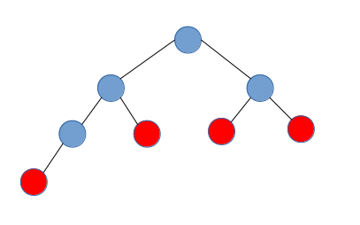
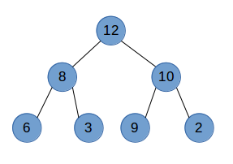
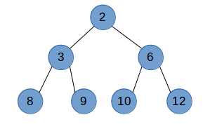

[<< 返回到主页](index.md)

**这里将介绍堆和优先队列的博客文章**  

## **1. 堆基础原理**  

堆排序分小根堆和大根堆，也可以说是二叉堆。  
堆是一颗完全二叉树，除了最后一层（可以满也可以不满）则是一颗满二叉树，且最后一层的叶结点都位于最左端。  
  
上图就是一个标准的完全二叉树，红色的是其叶子节点，可以看到最后一层的节点都位于左端，并且除了最后一层都是满的。  
大根堆就是指任意父节点大于两个子节点的堆,如下:  
    
小根堆可以堆就是任意父节点小于子节点的堆,如下:  
  

堆采用顺序存储，parent(i) childL(i*2+1) childR(i*2+2)。注意，二叉堆并不一定中序遍历有序  

## **2. 优先队列代码实现**  
堆常用的操作为增加和删除  

添加操作：  
1. 首先将数据插入到末尾  
2. 从下往上寻找父节点，并进行与父节点权重值比较，直到满足条件返回  

删除操作：  
1. 保留需要删除的数据，最后返回结果  
2. 将末尾的数据与删除的数据交换，并删除末尾的数据  
3. 将删除的数据位置索引，从上往下，根据权重大小值与左右孩子的值进行交换，直到满足条件  


如下建立优先队列代码实现，即用堆数据结构：  
```
namespace DataStructures
{
    template <class weight_type, class data_type, bool isMaxHeap>
    class Heap
    {
    public:
        struct HeapNode
        {
            HeapNode() {}
            HeapNode(const weight_type &w, const data_type &d) : weight(w), data(d) {}
            weight_type weight; // I'm assuming key is a native numerical type - float or int
            data_type data;
        };

        Heap();
        ~Heap();
        void Push(const weight_type &weight, const data_type &data);
        data_type Pop(const unsigned startingIndex);
        data_type Peek(const unsigned startingIndex=0) const;
        weight_type PeekWeight(const unsigned startingIndex=0) const;
        void Clear(void);
        data_type& operator[] ( const unsigned int position ) const;
        unsigned Size(void) const;

    protected:
        // 获得索引i的左右孩子索引值
        unsigned LeftChild(const unsigned i) const;
        unsigned RightChild(const unsigned i) const;
        // 获取索引i的父节点索引值
        unsigned Parent(const unsigned i) const;
        // 交换两个索引对应的数据
        void Swap(const unsigned i, const unsigned j);
        // 此处为顺出存储列表
        DataStructures::List<HeapNode> heap;
    };

    template  <class weight_type, class data_type, bool isMaxHeap>
        Heap<weight_type, data_type, isMaxHeap>::Heap()
    {
    }

    template  <class weight_type, class data_type, bool isMaxHeap>
        Heap<weight_type, data_type, isMaxHeap>::~Heap()
    {
        Clear();
    }

    // 添加操作
    template  <class weight_type, class data_type, bool isMaxHeap>
    void Heap<weight_type, data_type, isMaxHeap>::Push(const weight_type &weight, const data_type &data)
    {
        // 确认当前元素个数，将新元素先添加到末尾
        unsigned currentIndex = heap.Size();
        unsigned parentIndex;
        heap.Insert(HeapNode(weight, data));
        // currentIndex初始值为最后一个索引值，然后从后往前操作
        while (currentIndex!=0)
        {
            // 获得父节点index
            parentIndex = Parent(currentIndex);
            // 大根堆判断
            if (isMaxHeap)
            {
                // 父节点权重小于孩子节点
                if (heap[parentIndex].weight < weight)
                {
                    // 进行交换父子和孩子节点数据
                    Swap(currentIndex, parentIndex);
                    // 重置当前索引为父节点索引，重复上一次处理，故最坏的情形是O(log(n))
                    currentIndex=parentIndex;
                }
                else
                    // 父节点权重大于孩子节点，插入成功
                    break;
            }
            else
            {
                // 小根堆情形
                // 父节点权重大于孩子节点
                if (heap[parentIndex].weight > weight)
                {
                    // 进行交换父子和孩子节点数据
                    Swap(currentIndex, parentIndex);
                    // 重置当前索引为父节点索引，重复上一次处理，故最坏的情形是O(log(n))
                    currentIndex=parentIndex;
                }
                else
                    // 父节点权重小于孩子节点，插入成功
                    break;
            }
        }
    }

    // 删除操作，一般为0
    template  <class weight_type, class data_type, bool isMaxHeap>
    data_type Heap<weight_type, data_type, isMaxHeap>::Pop(const unsigned startingIndex)
    {
        // 此处要判断索引越界
        // 记录删除的数据，并重新建堆
        data_type returnValue=heap[startingIndex].data;
        // 将末尾的数据赋值到startingIndex位置
        heap[startingIndex]=heap[heap.Size()-1];
        unsigned currentIndex,leftChild,rightChild;
        weight_type currentWeight;
        currentIndex=startingIndex;
        currentWeight=heap[startingIndex].weight;
        // 快速删除最后一个元素(这个元素被赋值在startingIndex处)
        heap.RemoveFromEnd();
        // 重新建堆
        while (1)
        {
            // 获得左右孩子索引值
            leftChild=LeftChild(currentIndex);
            rightChild=RightChild(currentIndex);
            if (leftChild >= heap.Size())
            {
                // 左孩子超过元素总数，则结束
                return returnValue;
            }
            if (rightChild >= heap.Size())
            {
                // 只存在左节点。
                // 若为大根堆且权重值小于左节点权重值
                // 若为小根堆且权重值大于左节点权重值
                // 则交换leftChild和父节点数据，并结束返回
                if ((isMaxHeap==true && currentWeight < heap[leftChild].weight) ||
                    (isMaxHeap==false && currentWeight > heap[leftChild].weight))
                        Swap(leftChild, currentIndex);

                return returnValue;
            }
            else
            {
                if (isMaxHeap)
                {
                    // 大根堆情形
                    // 若左孩子和右孩子权重值都小于父节点值，结束并返回
                    if (heap[leftChild].weight <= currentWeight && heap[rightChild].weight <= currentWeight)
                        return returnValue;
                    // 若左孩子大于右孩子权重值值
                    if (heap[leftChild].weight > heap[rightChild].weight)
                    {
                        // 交换左孩子和父节点的值
                        Swap(leftChild, currentIndex);
                        // 设置当前的父节点索引为左孩子索引
                        currentIndex=leftChild;
                    }
                    else
                    {
                        // 若右孩子大于左孩子权重值值
                        // 交换右孩子和父节点的值
                        Swap(rightChild, currentIndex);
                        // 设置当前的父节点索引为右孩子索引
                        currentIndex=rightChild;
                    }
                }
                else
                {
                    // 小根堆情形
                    // 若左孩子和右孩子权重值都大于父节点值，结束并返回
                    if (heap[leftChild].weight >= currentWeight && heap[rightChild].weight >= currentWeight)
                        return returnValue;
                    // 若左孩子小于右孩子权重值值
                    if (heap[leftChild].weight < heap[rightChild].weight)
                    {
                        // 交换左孩子和父节点的值
                        Swap(leftChild, currentIndex);
                        // 设置当前的父节点索引为左孩子索引
                        currentIndex=leftChild;
                    }
                    else
                    {
                        // 若右孩子小于左孩子权重值值
                        // 交换右孩子和父节点的值
                        Swap(rightChild, currentIndex);
                        // 设置当前的父节点索引为右孩子索引
                        currentIndex=rightChild;
                    }
                }
            }
        }
    }

    template  <class weight_type, class data_type, bool isMaxHeap>
    data_type Heap<weight_type, data_type, isMaxHeap>::Peek(const unsigned startingIndex) const
    {
        return heap[startingIndex].data;
    }

    template  <class weight_type, class data_type, bool isMaxHeap>
    weight_type Heap<weight_type, data_type, isMaxHeap>::PeekWeight(const unsigned startingIndex) const
    {
        return heap[startingIndex].weight;
    }

    template  <class weight_type, class data_type, bool isMaxHeap>
        void Heap<weight_type, data_type, isMaxHeap>::Clear(void)
    {
        heap.Clear();
    }

    template <class weight_type, class data_type, bool isMaxHeap>
    data_type& Heap<weight_type, data_type, isMaxHeap>::operator[] ( const unsigned int position ) const
    {
        return heap[position].data;
    }
    template <class weight_type, class data_type, bool isMaxHeap>
        unsigned Heap<weight_type, data_type, isMaxHeap>::Size(void) const
    {
        return heap.Size();
    }

    template <class weight_type, class data_type, bool isMaxHeap>
    unsigned Heap<weight_type, data_type, isMaxHeap>::LeftChild(const unsigned i) const
    {
        return i*2+1;
    }

    template <class weight_type, class data_type, bool isMaxHeap>
    unsigned Heap<weight_type, data_type, isMaxHeap>::RightChild(const unsigned i) const
    {
        return i*2+2;
    }

    template <class weight_type, class data_type, bool isMaxHeap>
    unsigned Heap<weight_type, data_type, isMaxHeap>::Parent(const unsigned i) const
    {
        return (i-1)/2;
    }

    template <class weight_type, class data_type, bool isMaxHeap>
    void Heap<weight_type, data_type, isMaxHeap>::Swap(const unsigned i, const unsigned j)
    {
        HeapNode temp;
        temp=heap[i];
        heap[i]=heap[j];
        heap[j]=temp;
    }
}
```