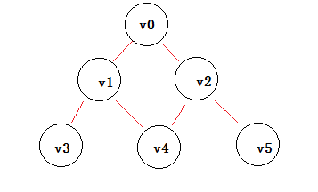

[<< 返回到主页](index.md)

**这里将介绍常用的搜索算法的博客文章**  

[1. 深度优先与广度优先搜索](#1)  
[2. 二分查找](#2)  

<span id="1"></span>
## **1. 深度优先与广度优先搜索**  

这两种搜索针对有层次结构的数据，常用于图论，树等。现在大致先认识一下他们描述的现象。  

  

上图有6个点，其中v0->(v1, v2), v1->(v0,v3,v4),v2->(v0,v4,v5),v3->(v1),v4->(v1,v2),v5->(v2)顶点的连接关系  
现想从v0遍历所有的顶点，那么：  
使用深度搜索，结果可能为：v0->v1->v3->v4->v2->v5  
使用广度搜索，结果可能为：v0->v1->v2->v3->v4->v5  
使用广度搜索，用水波向外扩展的现象比较形象，这种搜索方式可以寻找一个到到另一个点的最短路径，最近的总是最先被搜索出来。  

严书中介绍DFS的伪代码:  
```
Boolean visited[MAX]; //标志数组 
Status (*VisitFunction)(int v); //访问函数
void DFSTraverse(Graph G, Status (*Visit)(int v))
{
     VisitFunction = Visit;
     for(v = 0; v < G.vexnum; ++v) //初始化标志数组
         visited[v] = false;
     for(v = 0; v < G.vexnum; ++v) //对未访问过的顶点调用DFS
         if(!visited[v])
             DFS(G, v);
}
  
void DFS(Graph G, int v) //从顶点v出发进行DFS
{
     visited[v] = true;
     VisitFunction(v);
     for(w = FirstAdjVex(G, v); w >= 0; w = NextAdjVex(G, v, w))
         if(!visited[w])
             DFS(G, w); //递归调用未访问的邻接顶点w
} 
```

严书中介绍BFS的伪代码:  
```
void BFSTraverse(Graph G, Status (*Visit)(int v))
{
    for(v = 0; v < G.vexnum; ++v)
        visited[v] = false;   
    InitQueue(Q);
    for(v = 0; v < G.vexnum; ++v)
        if(!visited[v])
        {
            visited[v] = true;
            Visit(v);
            EnQueue(Q, v);
            while(!QueueEmpty(Q))
            {
                DeQueue(Q, u);
                for(w = FirstAdjVex(G, u); w >= 0; w = NextAdjVex(G, u, w))
                    if(!visited[w])
                    {
                        visited[w] = true;
                        visit(w);
                        EnQueue(Q, w);
                    }
            }
        }
}
```

上述DFS和BFS伪代码说明了一般执行过程，其实质上可以对两段代码进行合并：  
1. 准备一个列表 queue (支持 PushFront ， PushEnd ，Pop 操作)  
2. 初始化队列init  
3. 对队列 queue 做遍历操作
    1. 临时创建一个列表tmp，用于保存遍历到的节点(没有被访问过)  
    2. 如果是深度搜索，则将tmp所有的数据用PushFront插入到queue的头部    
    3. 如果是广度搜索，则将tmp所有的数据用PushEnd插入到queue的尾部  
    4. 继续循环遍历  

```
void Travel(Graph G, bool isDFS)
{
    Queue queue;
    Init(G, queue);
    while (queue.Size() > 0)
    {
        Vert v = queue.Pop();
        if (!isVisted(v))
        {
            isVisted(v, true);
            Doingsomething(v);
            Queue tmp;
            FirstAdjVex(G, v, &tmp);
            // 这里即为深度和广度搜索的本质区别  
            if (isDFS)
            {
                queue.PushFront(tmp);
            }
            else
            {
                queue.PushEnd(tmp);
            }
        }
    }
}
```

<span id="2"></span>
## **2. 二分查找**  
这个搜索主要是针对有序数据，每次都与中间的数据进行比较。  
若现在有一个从小到大的有序数组，需要查找到x值；如果不存在，返回如果插入的话，应该插入到数组的索引值  
1. 如果找到，则返回true  
2. 当小于中间的数据则选择前一半继续重复处理  
3. 当大于中间的数据，则选择后一半数据进行处理  
4. 找不到数据(前一半和后一半的数据个数为0)，则返回false，保存当前的索引值  

```
int BinarySearch(List<float> list, float value)
{
    int count = list.Count;
    if (count > 0)
    {
        int low = 0;
        int high = list.Count - 1;
        while (low < high)
        {
            int mid = (low + high) >> 1;
            if (list[mid] > value)
            {
                high = mid;
            }
            else if (list[mid] < value)
            {
                low = mid + 1;
            }
            else
            {
                return mid;
            }
        }
        return low;
    }
    return -1;
}
```
