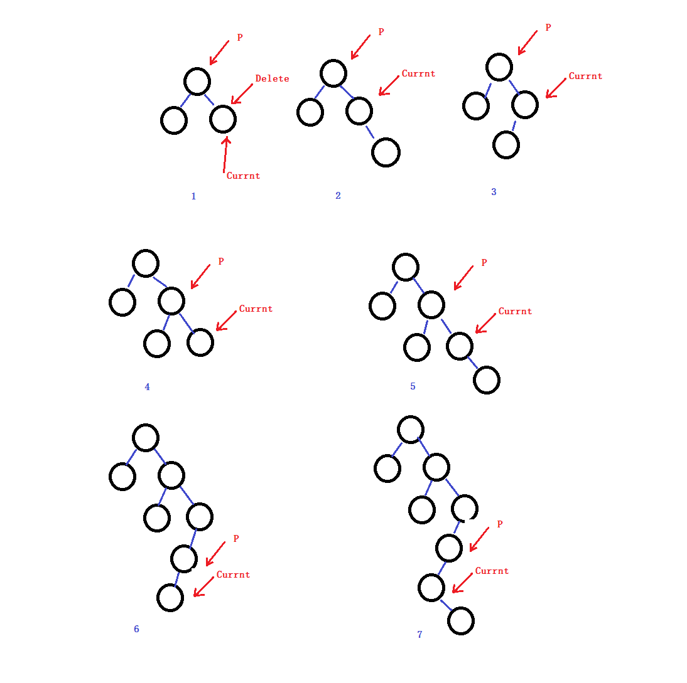

[<< 返回到主页](index.md)

**这里将介绍树结构的博客文章**  

[1. 二叉树](#1)  
[2. 二叉搜索树和平衡二叉树](#2)  
[3. 多叉树](#3)  

<span id="1"></span>
## **1. 二叉树**  

**1.1 基本术语**  

|名称|释义|    
|:-:|:-:|  
|根|即根结点(没有前驱)|  
|叶子|即终端结点(没有后继)|  
|森林|指m棵不相交的树的集合|  
|有序树|结点各子树从左至右有序，不能互换|  
|无序树|结点各子树可互换位置。|  
|双亲|即上层的那个结点(直接前驱)|  
|孩子|即下层结点的子树的根(直接后继)|  
|兄弟|同一双亲下的同层结点(孩子之间互称为兄弟)|  
|堂兄弟|即双亲位于同一层的结点(但并非同一双亲|  
|祖先|即从根到该结点所经分支的所有结点|  
|子孙|即该结点下层子树种的任一结点|  
|结点|即树的数据元素|  
|结点的度|结点挂接的子树数|  
|结点的层次|从根到该结点的层数(根结点算第一层)|  
|终端结点|即度为0的结点，即叶子|  
|分支结点|即度不为0的结点(也称为内部结点)|  
|树的度|所有结点度中的最大值|  
|树的深度|指所有结点中最大的层数(或高度)|   

**1.2 二叉树的性质**  

性质1： 一棵非空二叉树的第i层上最多有2^i-1个结点(i≥1)。  
性质2： 若规定空树的深度为0，则深度为k的二叉树最多有(2^k)-1个结点
(k≥0)。  
性质3： 具有n个结点的完全二叉树的深度k为log2n+1。  
性质4： 对于一棵非空二叉树，如果度为0的结点数目为n0，度为2的结点数目为n2，则有n0= n2+1。  
性质5： 对于具有n个结点的完全二叉树，如果按照从上到下和从左到右的顺序对所有结点从1开始编号，则对于序号为i的结点，有：  
    1. 如果i>1，则序号为i的结点的双亲结点的序号为i/2(“/”表示整除)；如果i=1，则该结点是根结点，无双亲结点。  
    2. 如果2i≤n，则该结点的左孩子结点的序号为2i；若2i>n，则该结点无左孩子。  
    3. 如果2i+1≤n，则该结点的右孩子结点的序号为2i+1；若2i+1>n，则该结点无右孩子。  


<span id="2"></span>
## **2. 二叉搜索树和平衡二叉树**  
删除时对应的结构可能图形：  
  
二叉搜索树的插入和删除。  
```
    template <class BinarySearchTreeType>
    typename BinarySearchTree<BinarySearchTreeType>::node* BinarySearchTree<BinarySearchTreeType>::Add ( const BinarySearchTreeType& input )
    { 
        if ( BinarySearchTree_size == 0 )
        {
            // 空树的处理
            BinarySearchTree_size = 1;
            root = new typename BinarySearchTree::node;
            root->item = new BinarySearchTreeType;
            *( root->item ) = input;
            root->left = 0;
            root->right = 0;
            direction = ROOT;
            return root;
        }
        else
        {
            // 按下面操作顺序进行添加:
            typename BinarySearchTree::node *current;   
            // 从根节点开始
            current = root;
            // 循环遍历，找到插入点
            while ( true )    
            {
                // 插入节点数据与当前节点数据比较，选择左右分支
                if ( input < *( current->item ) )
                {
                    // 选择左子树
                    if ( current->left == 0 )
                    {
                        // 左子树不存在，将插入数据作为左子树插入到当前节点  
                        current->left = new typename BinarySearchTree::node;
                        current->left->item = new BinarySearchTreeType;  
                        current = current->left;
                        current->left = 0;
                        current->right = 0;
                        *( current->item ) = input;
                        BinarySearchTree_size++;
                        direction = LEFT;
                        return current;
                    }
                    else
                        // 左子树存在，则重置当前节点为左子树根
                        current = current->left;
                }
                else
                    if ( input > *( current->item ) )
                    {
                        // 选择右子树
                        if ( current->right == 0 )
                        {
                            // 右子树不存在，则将插入数据作为右子树插入到当前节点
                            current->right = new typename BinarySearchTree::node;
                            current->right->item = new BinarySearchTreeType;
                            current = current->right;
                            current->left = 0;
                            current->right = 0;
                            *( current->item ) = input;
                            BinarySearchTree_size++;
                            direction = RIGHT;
                            return current;
                        }
                        else
                            current = current->right;
                    }
                else
                    // 数据已经存在树中，不作处理  
                    return 0;
            }
        }
    }

    template <class BinarySearchTreeType>
    typename BinarySearchTree<BinarySearchTreeType>::node* BinarySearchTree<BinarySearchTreeType>::Del( const BinarySearchTreeType& input, bool *deleted )
    {
        typename BinarySearchTree::node * node_to_delete, *current, *parent;
        // 空树
        if ( BinarySearchTree_size == 0 )
        {
            if (deleted)
                *deleted = false;
            return 0;
        }
        // 只有根节点
        if ( BinarySearchTree_size == 1 )
        {
            if (*root->item == input)
            {
                Clear();
                if (deleted)
                    *deleted = true;
            }
            else
            {
                if (deleted)
                    *deleted = false;
            }
            return 0;
        }
        // 查找到数据所在的节点，并锁定父节点
        node_to_delete = Find( input, &parent );
        // 不存在，没找到
        if ( direction == NOT_FOUND )
        {
            if (deleted)
                *deleted = false;
            return 0;  // Couldn't find the element
        }
        // 记录当前需要删除的节点指针
        current = node_to_delete;

        // 若是叶结点，直接删除
        if ( ( current->right ) == 0 && ( current->left ) == 0 )
        {
            // 更新父节点
            if ( parent )
            {
                // 删除的是左孩子
                if ( direction == LEFT )
                    parent->left = 0;
                // 删除的是右孩子
                else
                    parent->right = 0;
            }
            delete node_to_delete->item;
            delete node_to_delete;
            BinarySearchTree_size--;
            if (deleted)
                *deleted = true;
            return parent;
        }
        else     
            if ( ( current->right ) != 0 && ( current->left ) == 0 )
            {
                // 若待删节点有右孩子，没有左孩子
                if ( parent )
                {
                    // 存在父节点
                    if ( direction == RIGHT )
                        // 若是父亲的右孩子，则设置父亲的右孩子为当前删除节点的右孩子
                        parent->right = current->right;
                    else
                        // 若是父亲的左孩子，则设置父亲的左孩子为当前删除节点的右孩子
                        parent->left = current->right;
                }
                else
                {
                    // 没有父节点即根节点
                    root = current->right;
                }   
                delete node_to_delete->item;
                delete node_to_delete;
                BinarySearchTree_size--;
                if (deleted)
                    *deleted = true;
                return 0;
                return parent;
            }
            else
                if ( ( current->right ) == 0 && ( current->left ) != 0 )
                {
                    // 若待删节点有左孩子，没有右孩子
                    if ( parent )
                    {
                        // 存在父节点
                        if ( direction == RIGHT )
                            // 若是父亲的右孩子，则设置父亲的右孩子为当前删除节点的左孩子
                            parent->right = current->left;
                        else
                            // 若是父亲的左孩子，则设置父亲的右孩子为当前删除节点的左孩子
                            parent->left = current->left;
                    }
                    else
                    {
                        // 没有父节点即根节点
                        root = current->left; 
                    }
                    delete node_to_delete->item;
                    delete node_to_delete;
                    BinarySearchTree_size--;
                    if (deleted)
                        *deleted = true;
                    return parent;
                }
                else // Go right, then as left as far as you can
                {
                    // 待删节点同时存在两个孩子
                    // 这里需要遍历到待删节点右孩子树中找到最小的值，即右子树的最左边
                    parent = current;
                    direction = RIGHT;
                    current = current->right;               
                    while ( current->left )
                    {
                        direction = LEFT;
                        parent = current;
                        current = current->left;
                    }
                    // 上面的操作已经找到最左边的节点，即保存在 current 指针
                    // 这里将node_to_delete这里的值设置为current的值
                    *( node_to_delete->item ) = *( current->item );
                    // 下面是删除current节点
                    // 此处需要判断current存不存在右子树
                    if ( current->right == 0 )
                    {
                        // 不存在右子树
                        if ( direction == RIGHT )
                            // 这里表明寻找左孩子时，是一直不存在的，则直接将此时的父节点的右孩子设置为0，即删除
                            parent->right = 0;
                        else
                            // 直接删除左孩子节点
                            parent->left = 0;
                        delete current->item;
                        delete current;
                        BinarySearchTree_size--;
                        if (deleted)
                            *deleted = true;
                        return parent;
                    }
                    else
                    {
                        if ( direction == RIGHT )
                            // 这里表明寻找左孩子时，是一直不存在的，则直接将此时的父节点的右孩子设置为当前的右孩子
                            parent->right = current->right;
                        else
                            // 当前的右子树的数据设置到父节点的左子树上
                            parent->left = current->right;
                        delete current->item;
                        delete current;
                        BinarySearchTree_size--;
                        if (deleted)
                            *deleted = true;
                        return parent;
                    }
                }
    }
```
删除时，该节点存在两个孩子的处理，需要递归遍历待删除节点的右子树中最左边的节点，并且在删除时需要判断最左边节点是不是存在，存在的情况还要判断其有没有右孩子。   

二叉平衡树，是基于二叉搜素树在左右孩子的深度上做了一个平衡操作。平衡主要是降低树的深度，从而在搜索时能够更快速高效，避免二叉树出现最坏的情况。  
```
    /// An AVLBalancedBinarySearchTree is a binary tree that is always balanced
    template <class BinarySearchTreeType>
    class AVLBalancedBinarySearchTree : public BinarySearchTree<BinarySearchTreeType>
    {
    public:
        AVLBalancedBinarySearchTree()   {}
        virtual ~AVLBalancedBinarySearchTree();
        bool Add ( const BinarySearchTreeType& input );
        bool Del( const BinarySearchTreeType& input );
        BinarySearchTree<BinarySearchTreeType>& operator= ( BinarySearchTree<BinarySearchTreeType>& original_copy )
        {
            return BinarySearchTree<BinarySearchTreeType>::operator= ( original_copy );
        }
        
    private:
        void BalanceTree( typename BinarySearchTree<BinarySearchTreeType>::node* current, bool rotateOnce );
        void RotateRight( typename BinarySearchTree<BinarySearchTreeType>::node *C );
        void RotateLeft( typename BinarySearchTree<BinarySearchTreeType>::node* C );
        void DoubleRotateRight( typename BinarySearchTree<BinarySearchTreeType>::node *A );
        void DoubleRotateLeft( typename BinarySearchTree<BinarySearchTreeType>::node* A );
        bool RightHigher( typename BinarySearchTree<BinarySearchTreeType>::node* A );
        bool LeftHigher( typename BinarySearchTree<BinarySearchTreeType>::node* A );
    };
```
在插入和删除时，主要涉及到判断树的深度，当出现左右子树深度差大于1时，需要平衡操作。平衡处理有四中不平衡情况，操作时用单旋转和双旋转来完成，具体的细节部分，后期再补上。  

## **3. 多叉树**  

数据结构在某些时候二叉树并不能满足需求，比如目录结构树，这里会存在很多孩子结点。这里引入多叉树的结构：  
```
template <class TreeType>
class Tree
{
public:
    Tree();
    Tree(TreeType &inputData);
    ~Tree();
    void LevelOrderTraversal(DataStructures::List<Tree*> &output);
    void AddChild(TreeType &newData);
    void DeleteDecendants(void);

    TreeType data;
    DataStructures::List<Tree *> children;
};

template <class TreeType>
Tree<TreeType>::Tree()
{

}

template <class TreeType>
Tree<TreeType>::Tree(TreeType &inputData)
{
    data=inputData;
}

template <class TreeType>
Tree<TreeType>::~Tree()
{
}

template <class TreeType>
void Tree<TreeType>::LevelOrderTraversal(DataStructures::List<Tree*> &output)
{
    unsigned i;
    Tree<TreeType> *node;
    DataStructures::Queue<Tree<TreeType>*> queue;

    for (i=0; i < children.Size(); i++)
        queue.Push(children[i]);

    while (queue.Size())
    {
        node=queue.Pop();
        output.Insert(node);
        for (i=0; i < node->children.Size(); i++)
            queue.Push(node->children[i]);
    }
}

template <class TreeType>
void Tree<TreeType>::AddChild(TreeType &newData)
{
    children.Insert(new Tree(newData));
}

template <class TreeType>
void Tree<TreeType>::DeleteDecendants(void)
{
    DataStructures::List<Tree*> output;
    LevelOrderTraversal(output);
    unsigned i;
    for (i=0; i < output.Size(); i++)
        delete output[i];
}
```

写在最后，介绍一个接口丰富的tree.hh[源码](http://tree.phi-sci.com/documentation.html)   


