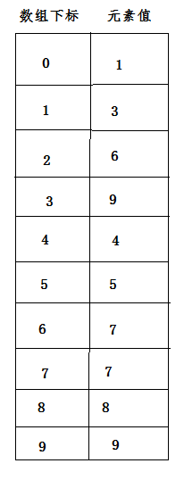

[<< 返回到主页](index.md)

## **这里将介绍并查集的博客文章**  

**认识并查集算法**  
先举个例子：目前有很多边(边有两个顶点的索引值)，边与边之间存在共享的顶点，问题是将有共顶点的边归为一组(这里具有传递性，如果边A与边B存在共顶点关系，A与边C存在共顶点关系，则边A，B，C需要分在一组)，即将所有的边按这个规则进行分组。  

并查集算法很适合处理这类问题，当了解这个算法原理后，容易扩展判断是否存在环的情形，比如最小生成树Kruskal算法的核心就在此。  

接着上面的问题来讲，如下图所示：  
  
现在有10条边，边与边的关系拓扑结构如图所示，最终的结果应该分为3组：  
第一组：e1,e2,e4,e10  
第二组：e3,e6,e7,e8,e9  
第三组：e5  

那么计算过程如下：  
数据初始化，每两队边是否有连接，存在连接就记录(i,j)下标对并保存到List<ClosestPair>  pairs 。复杂度0.5 \* n^2.
```
private void GeneratorPairs(ref List<ClosestPair> pairs)
{
    pairs.Clear();
    int size = mObjects.Count;
    for (int i = 0; i < size - 1; ++i)
    {
        T objectI = mObjects[i];
        for (int j = i + 1; j < size; ++j)
        {
            if (objectI.IsCloseTo(mObjects[j]))
            {
                pairs.Add(new ClosestPair(i, j));
            }
        }
    }
}
```
得到下表对数组为：  
(0, 1),(1,3),(2,6),(2,7),(3,9),(5,8),(6,7),(7,8)  
此过程看成是初始化过程，接下来就是并查集的核心过程，对上面的8对进行合并。  
第一步：并查集初始化，数组大小为 物体的数量`mUnion.Initialize(mObjects.Count);`且初始化时 **下标值即为元素值**。  
```
private List<int> mIndexTable;
public void Initialize(int size)
{
    for (int i = 0; i < size; ++i)
    {
        mIndexTable.Add(i);
    }
}
```
  

第二步：并与查  
```
int size = pairs.Count;
for (int i = 0; i < size; ++i)
{
    mUnion.Unite(pairs[i].mI, pairs[i].mJ);
}
```
遍历每一个下标数组对，进行Unite操作  
```
public void Unite(int i, int j)
{
    int ii = Find(i);
    int jj = Find(j);
    if (ii != jj)
    {
        mIndexTable[ii] = jj;
    }
}
public int Find(int x)
{
    while (mIndexTable[x] != x)
    {
        int id = mIndexTable[mIndexTable[x]];
        mIndexTable[x] = id;
        x = id;
    }
    return x;
}
```

按照上面的逻辑，分布执行几次：  
第一次：Unite(0, 1)  
```
ii = Find(0) = 0
{
    // mIndexTable[0] != 0 不通过(此时mIndexTable[0] == 0)
    while (mIndexTable[x] != x)
    {
        int id = mIndexTable[mIndexTable[x]];
        mIndexTable[x] = id;
        x = id;
    }
    // x = 0，返回
    return x;
}
jj = Find(1) = 1
{
    // mIndexTable[1] != 1 不通过(此时mIndexTable[1] == 1)
    while (mIndexTable[x] != x)
    {
        int id = mIndexTable[mIndexTable[x]];
        mIndexTable[x] = id;
        x = id;
    }
    // x = 1，返回
    return x;
}
if (ii != jj) // 0 != 1 成立
{
    mIndexTable[ii] = jj; // mIndexTable[0] = 1;
}
```
此时数组的数据更新为：  
  

第二次：Unite(1, 3)  
```
ii = Find(1) = 1
{
    // mIndexTable[1] != 1 不通过(此时mIndexTable[1] == 1)
    while (mIndexTable[x] != x)
    {
        int id = mIndexTable[mIndexTable[x]];
        mIndexTable[x] = id;
        x = id;
    }
    // x = 1，返回
    return x;
}
jj = Find(3) = 3
{
    // mIndexTable[3] != 1 不通过(此时mIndexTable[3] == 3)
    while (mIndexTable[x] != x)
    {
        int id = mIndexTable[mIndexTable[x]];
        mIndexTable[x] = id;
        x = id;
    }
    // x = 3，返回
    return x;
}
if (ii != jj) // 1 != 3 成立
{
    mIndexTable[ii] = jj; // mIndexTable[1] = 3;
}
```
此时数组的数据更新为：  
  

第三次：Unite(2, 6)  
```
ii = Find(2) = 2
{
    // mIndexTable[2] != 2 不通过(此时mIndexTable[2] == 2)
    while (mIndexTable[x] != x)
    {
        int id = mIndexTable[mIndexTable[x]];
        mIndexTable[x] = id;
        x = id;
    }
    // x = 0，返回
    return x;
}
jj = Find(6) = 6
{
    // mIndexTable[6] != 6 不通过(此时mIndexTable[6] == 6)
    while (mIndexTable[x] != x)
    {
        int id = mIndexTable[mIndexTable[x]];
        mIndexTable[x] = id;
        x = id;
    }
    // x = 6，返回
    return x;
}
if (ii != jj) // 2 != 6 成立
{
    mIndexTable[ii] = jj; // mIndexTable[2] = 6;
}
```
此时数组的数据更新为：  
  

第四次：Unite(2, 7)  
```
ii = Find(2) = 6
{
    // 第一次 x = 2, mIndexTable[2] != 2通过(此时mIndexTable[2] == 6)
    // 第二次 x = 6, mIndexTable[6] != 6不通过(此时mIndexTable[6] == 6)
    while (mIndexTable[x] != x)
    {
        // mIndexTable[2] = 6,id = mIndexTable[6] = 6
        int id = mIndexTable[mIndexTable[x]];
        // mIndexTable[2] = 6
        mIndexTable[x] = id;
        // x = 6
        x = id;
    }
    // x = 6，返回
    return x;
}
jj = Find(7) = 7
{
    // mIndexTable[7] != 7 不通过(此时mIndexTable[7] == 7)
    while (mIndexTable[x] != x)
    {
        int id = mIndexTable[mIndexTable[x]];
        mIndexTable[x] = id;
        x = id;
    }
    // x = 7，返回
    return x;
}
if (ii != jj) // 6 != 7 成立
{
    mIndexTable[ii] = jj; // mIndexTable[6] = 7;
}
```
此时数组的数据更新为：  
  

第五次：Unite(3, 9)  
```
ii = Find(3) = 3
{
    // mIndexTable[3] != 3 不通过(此时mIndexTable[3] == 3)
    while (mIndexTable[x] != x)
    {
        int id = mIndexTable[mIndexTable[x]];
        mIndexTable[x] = id;
        x = id;
    }
    // x = 3，返回
    return x;
}
jj = Find(9) = 9
{
    // mIndexTable[9] != 9 不通过(此时mIndexTable[9] == 9)
    while (mIndexTable[x] != x)
    {
        int id = mIndexTable[mIndexTable[x]];
        mIndexTable[x] = id;
        x = id;
    }
    // x = 9，返回
    return x;
}
if (ii != jj) // 3 != 9 成立
{
    mIndexTable[ii] = jj; // mIndexTable[3] = 9;
}
```
此时数组的数据更新为：  
  

第六次：Unite(5, 8)  
```
ii = Find(5) = 5
{
    // mIndexTable[5] != 5 不通过(此时mIndexTable[5] == 5)
    while (mIndexTable[x] != x)
    {
        int id = mIndexTable[mIndexTable[x]];
        mIndexTable[x] = id;
        x = id;
    }
    // x = 5，返回
    return x;
}
jj = Find(8) = 8
{
    // mIndexTable[8] != 8 不通过(此时mIndexTable[8] == 8)
    while (mIndexTable[x] != x)
    {
        int id = mIndexTable[mIndexTable[x]];
        mIndexTable[x] = id;
        x = id;
    }
    // x = 8，返回
    return x;
}
if (ii != jj) // 5 != 8 成立
{
    mIndexTable[ii] = jj; // mIndexTable[5] = 8;
}
```
此时数组的数据更新为：  
  

第七次：Unite(6, 7)  
```
ii = Find(6) = 7
{
    // 第一次 x = 6，mIndexTable[6] != 6 通过(此时mIndexTable[6] == 7)
    // 第二次 x = 7，mIndexTable[7] != 7 不通过(此时mIndexTable[7] == 7)
    while (mIndexTable[x] != x)
    {
        int id = mIndexTable[mIndexTable[x]]; // id = mIndexTable[7] = 7    
        mIndexTable[x] = id;// mIndexTable[6] = 7   
        x = id;// x = 7
    }
    // x = 7，返回
    return x;
}
jj = Find(7) = 7
{
    // mIndexTable[7] != 7 不通过(此时mIndexTable[7] == 7)
    while (mIndexTable[x] != x)
    {
        int id = mIndexTable[mIndexTable[x]];
        mIndexTable[x] = id;
        x = id;
    }
    // x = 7，返回
    return x;
}
if (ii != jj) // 7 != 7 不成立成立
{
    mIndexTable[ii] = jj; 
}
```
此时数组的数据更新为：  
  

第七次：Unite(7, 8)  
```
ii = Find(7) = 7
{
    // 第二次 x = 7，mIndexTable[7] != 7 不通过(此时mIndexTable[7] == 7)
    while (mIndexTable[x] != x)
    {
        int id = mIndexTable[mIndexTable[x]]; 
        mIndexTable[x] = id;
        x = id;
    }
    // x = 7，返回
    return x;
}
jj = Find(8) = 8
{
    // mIndexTable[8] != 8 不通过(此时mIndexTable[8] == 8)
    while (mIndexTable[x] != x)
    {
        int id = mIndexTable[mIndexTable[x]];
        mIndexTable[x] = id;
        x = id;
    }
    // x = 8，返回
    return x;
}
if (ii != jj) // 7 != 8 不成立成立
{
    mIndexTable[ii] = jj; // mIndexTable[7] = 8; 
}
```
此时数组的数据更新为：  
  

最后对最终的索引数组遍历分组：  
```
public void Group()
{
    int size = mIndexTable.Count;
    for (int i = 0; i < size; ++i)
    {
        int groupId = Find(i);
        if (!mGroups.ContainsKey(groupId))
        {
            mGroups.Add(groupId, new List<int>());
        }
        mGroups[groupId].Add(i);
    }
}
```
i = 0时，groupId = Find(0) = 9  
i = 1时，groupId = Find(0) = 9  
i = 2时，groupId = Find(0) = 8  
i = 3时，groupId = Find(0) = 9  
i = 4时，groupId = Find(0) = 4  
i = 5时，groupId = Find(0) = 8  
i = 6时，groupId = Find(0) = 8  
i = 7时，groupId = Find(0) = 8  
i = 8时，groupId = Find(0) = 8  
i = 9时，groupId = Find(0) = 9  
则分组为：  
[0, 1, 3, 9],[2, 5, 6, 7, 8], [4]  
对应的边为：  
[e1, e2, e4, e10],[e3, e6, e7, e8, e9], [e5]  

对n个数据做分组分析:  
最好的情况是分成n组O(n)  
最坏的情况是分成1组O(n^2)  

**并查集泛型设计**  

  

全部代码如下（C#）：  
```
public abstract class ClosestObject
{
    public abstract bool IsCloseTo(ClosestObject other);
}

public class ClosestUnion
{
    public ClosestUnion()
    {
        mGroups = new Dictionary<int, List<int>>();
        mIndexTable = new List<int>();
    }

    public void Initialize(int size)
    {
        for (int i = 0; i < size; ++i)
        {
            mIndexTable.Add(i);
        }
    }

    public int Find(int x)
    {
        while (mIndexTable[x] != x)
        {
            int id = mIndexTable[mIndexTable[x]];
            mIndexTable[x] = id;
            x = id;
        }
        return x;
    }

    public void Unite(int i, int j)
    {
        int ii = Find(i);
        int jj = Find(j);
        if (ii != jj)
        {
            mIndexTable[ii] = jj;
        }
    }

    public void Group()
    {
        int size = mIndexTable.Count;
        for (int i = 0; i < size; ++i)
        {
            int groupId = Find(i);
            if (!mGroups.ContainsKey(groupId))
            {
                mGroups.Add(groupId, new List<int>());
            }
            mGroups[groupId].Add(i);
        }
    }

    public Dictionary<int, List<int>> GetResult()
    {
        return mGroups;
    }

    private Dictionary<int, List<int>> mGroups;
    private List<int> mIndexTable;
}

public class GroupClosest<T> where T : ClosestObject
{
    class ClosestPair
    {
        public int mI;
        public int mJ;
        public ClosestPair(int i, int j)
        {
            mI = i;
            mJ = j;
        }
    }
    public GroupClosest()
    {
        mUnion = new ClosestUnion();
        mObjects = new List<T>();
    }

    public GroupClosest(List<T> t)
    {
        mUnion = new ClosestUnion();
        mObjects = t;
    }
    public void AddRange(List<T> t)
    {
        mObjects.AddRange(t);
    }

    public void Add(T t)
    {
        mObjects.Add(t);
    }
    public List<List<T>> Group()
    {
        mUnion.Initialize(mObjects.Count);
        List<ClosestPair> pairs = new List<ClosestPair>();
        GeneratorPairs(ref pairs);
        int size = pairs.Count;
        for (int i = 0; i < size; ++i)
        {
            mUnion.Unite(pairs[i].mI, pairs[i].mJ);
        }
        pairs.Clear();
        mUnion.Group();
        Dictionary<int, List<int>> rst = mUnion.GetResult();
        List<List<T>> groupResult = new List<List<T>>();
        foreach (List<int> group in rst.Values)
        {
            List<T> tmp = new List<T>();
            foreach (int idx in group)
            {
                tmp.Add(mObjects[idx]);
            }
            groupResult.Add(tmp);
        }
        return groupResult;
    }
    private void GeneratorPairs(ref List<ClosestPair> pairs)
    {
        pairs.Clear();
        int size = mObjects.Count;
        for (int i = 0; i < size - 1; ++i)
        {
            T objectI = mObjects[i];
            for (int j = i + 1; j < size; ++j)
            {
                if (objectI.IsCloseTo(mObjects[j]))
                {
                    pairs.Add(new ClosestPair(i, j));
                }
            }
        }
    }

    private ClosestUnion mUnion;
    private List<T> mObjects;
}
```

使用测试代码：  
```
List<EdgeObject> oneList;
GroupClosest<EdgeObject> group = new GroupClosest<EdgeObject>(oneList);
List<List<EdgeObject>> results = group.Group();
```

**并查集算法应用**  

1. 根据算法核心思想，可以检测元素之间是否构成圆环  
2. 根据相似度对数据分组  
