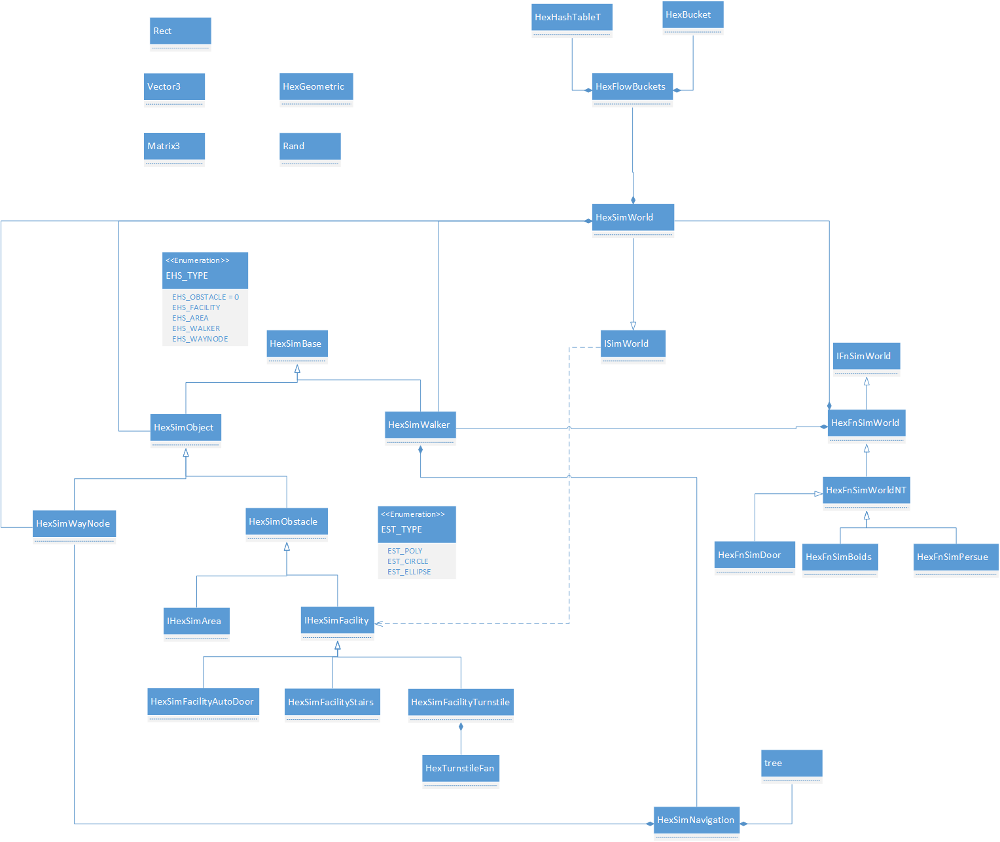
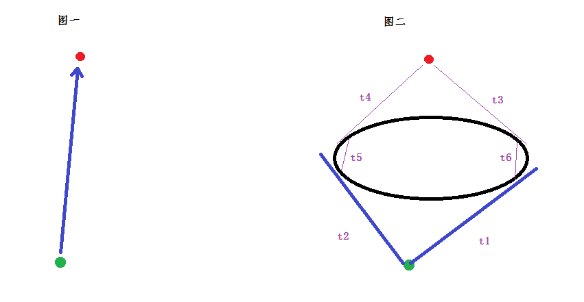

[<< 返回到主页](index.md)

**这里将介绍寻路算法的博客文章**  

目前在寻路算法中，使用最多的就是AStar算法。A*算法原理很简单。   
A*存在的缺陷：  
1. 需要对地形单位化分块，基于这个来计算   
2. 当地图比较大，则分快很多，计算量会比较大  
3. A*只能上下左右，或者加上斜方向最多8方向，不够真实   
4. 若物体的体积比较大，可能显示时碰到不可行走区域   

为了解决上面的一些问题，使用路点WayPoint来计算路径。路点的自由添加，可以减小AStar的节点数量。缺陷：  
1. 大地图，路点数量太少显得生硬  
2. 需要考虑的比较多，比如直线上忘记加路点，会出现绕着走到目的地。   

为了更好的解决上面的问题，导航网格Navmesh出现了。导航网格可以看成是对可行走区域进行凸分解，得到很多凸多边形。  
有点：  
1. 几点数量大大减少，且多边形覆盖任意区域，而不用分块。编辑操作的效率也大大提高    
2. 通过计算直线两点和网格的相邻点的关系位置，可以计算两点是否可以直接行走，不用想分块或者路点绕过去  
3. 转角方位不一定经过相邻点，可以加上单位体积的半径，这样不同体积的物体都可以合理的通过转角   

对于静态地图，可以使用navmesh生成导航网格，然后对凸多边形的每一条边取中点作为路点Waypoint并建立路点之间的连接。然后用Dijkstra算法预先计算好最短路径。Dijkstra是单源多路径，不是启发式算法，最终计算的结果是最优可靠的，Dijkstra不适应动态的地图。  
导航网格Navmesh可由recast生成，导航网格多边形共边为1的边外面是不可行走区域。   
[Recast生成NavMesh可参考](http://www.critterai.org/projects/nmgen_study/detailgen.html)    

**Steer Behaviour**  

目前做的项目基于SourceForge [OpenSteer](https://sourceforge.net/projects/opensteer/?source=directory)   
[论文地址](http://www.red3d.com/cwr/steer/)   

转向行为(steering behaviors)这一术语，指的是一系列使对象行动起来像似长有智商的算法。这些行为都归于人工智能或人工生命一类，是让对象呈现出拥有生命一般，对如何移动到目的地、捕捉或逃避其它对象、避开障碍物、寻求路径等做出因地适宜的决定。这个术语创造于Craig Reynolds在1999年的游戏开发者大会上发布的一篇标题为《自主角色的转向行为》(Steering Behaviors for Autonomous Characters)的论文。它描述了一系列算法，用来创建出一个部队系统，应用于模拟或者游戏中的角色。部队通常会给角色在行动上带来各种影响。他们围绕着力度在强弱上也各不相同，比如鸟群。实际上，Reynolds的"boids" 就是用来模拟鸟群的。  

预览一下几个基本行为   
1. 寻找seek，角色试图移动到一个指定点。该点可以是一个固定点也可以是把另一个角色作为目标的移动点   
2. 避开flee，与寻找正好相反。角色试图避开一个给定点。这个点也可以是固定点或者移动点。   
3. 到达arrive，和寻找相同，除了角色的速度在接近目的地时会减慢，最终以一个渐变运动恰好停留在目标处。   
4. 追捕pursue，寻找的加强版。由于目标会做加速运动，所以角色会事先预测然后再移动到该点。很明显，由于固定点是不会有速度概念的，所以这里用目标代替点的概念。   
5. 躲避evade，与追捕正好相反。角色对目标的速度做出预测，然后尽可能躲避开来。   
6. 漫游(wander)：随机但平滑又真实的运动。   
7. 对象回避(object avoidance)：角色预测出对象的行动路径，然后避开他们。   
8. 路径跟随(path following)：角色尽可能的沿着自己的路径移动，但要考虑符合一些真实的物理现象，以及使用其它行为后的影响。   

除了这些行为，还有复杂的类似鸟群这样的复合行为，它大致上由以下三种简易行为合成：   
1. 分离(separation)：鸟群中每个角色都试着和相邻角色保持一定的距离。   
2. 凝聚(cohesion)：每个角色尽量不掉队，不落下太远。   
3. 队列(alignment)：每个角色尽可能与相邻角色行动于同一方向。   
虽然是三个相对简单的行为，但合在一起时就能产生出难以想象的群体效果，像鸟群或是其它生物群体。调整这三个行为中的各个参数会改变群体的性质，有经常分散的松散型队伍，有紧密的小团体，还有有一个带头的率领着的队伍，等等多种变化。    

大致说一下OpenSteer源码：demo入口以OpenSteerDemo开始，这其实是所有demo的入口，每一个demo实质上是一个PlugIn。在plugins目录下，有Boids，CaptureTheFlag，MultiplePursuit等demo。通过Tab按键可以切换plugin，观看不同的demo。   
SteerLibrary这个很核心，每种行为都提供一个计算方式，具体可查看代码。   

看一下CaptureTheFlag，实质上是CtfPlugIn这么一个插件。这个demo是一个寻找目标点且被敌方追击的演示。   
seeker和enermy都继承CtfBase，另外障碍物都是sphere，起始值为40个。   
seeker寻找target时，需要避开障碍物和enermy。enermy不需要清楚seeker的意图，只是去追逐seeker，需要避开障碍物。   
活动的物体存在running，tagged，atgoal三个状态，分别表示还在继续，enermy追到seeker，seeker找到目标点。running转其他状态，有一个减速效果  

核心逻辑代码如下：  
```
void CtfPlugIn::update (const float currentTime, const float elapsedTime)
{
    // update the seeker
    ctfSeeker->update (currentTime, elapsedTime);
  
    // update each enemy
    for (int i = 0; i < ctfEnemyCount; i++)
    {
        ctfEnemies[i]->update (currentTime, elapsedTime);
    }
}
void CtfSeeker::update (const float currentTime, const float elapsedTime)
{
    // do behavioral state transitions, as needed
    updateState (currentTime);

    // determine and apply steering/braking forces
    Vec3 steer (0, 0, 0);
    if (state == running)
    {
        steer = steeringForSeeker ();
    }
    else
    {
        applyBrakingForce (gBrakingRate, elapsedTime);
    }
    applySteeringForce (steer, elapsedTime);

    // annotation
    annotationVelocityAcceleration ();
    recordTrailVertex (currentTime, position());
}

void CtfEnemy::update (const float currentTime, const float elapsedTime)
{
    // determine upper bound for pursuit prediction time
    const float seekerToGoalDist = Vec3::distance (gHomeBaseCenter,
                                                   gSeeker->position());
    const float adjustedDistance = seekerToGoalDist - radius()-gHomeBaseRadius;
    const float seekerToGoalTime = ((adjustedDistance < 0 ) ?
                                    0 :
                                    (adjustedDistance/gSeeker->speed()));
    const float maxPredictionTime = seekerToGoalTime * 0.9f;

    // determine steering (pursuit, obstacle avoidance, or braking)
    Vec3 steer (0, 0, 0);
    if (gSeeker->state == running)
    {
        const Vec3 avoidance =
            steerToAvoidObstacles (gAvoidancePredictTimeMin,
                                   (ObstacleGroup&) allObstacles);

        // saved for annotation
        avoiding = (avoidance == Vec3::zero);

        if (avoiding)
            steer = steerForPursuit (*gSeeker, maxPredictionTime);
        else
            steer = avoidance;
    }
    else
    {
        applyBrakingForce (gBrakingRate, elapsedTime);
    }
    applySteeringForce (steer, elapsedTime);

    // annotation
    annotationVelocityAcceleration ();
    recordTrailVertex (currentTime, position());


    // detect and record interceptions ("tags") of seeker
    const float seekerToMeDist = Vec3::distance (position(), 
                                                 gSeeker->position());
    const float sumOfRadii = radius() + gSeeker->radius();
    if (seekerToMeDist < sumOfRadii)
    {
        if (gSeeker->state == running) gSeeker->state = tagged;

        // annotation:
        if (gSeeker->state == tagged)
        {
            const Color color (0.8f, 0.5f, 0.5f);
            annotationXZDisk (sumOfRadii,
                        (position() + gSeeker->position()) / 2,
                        color,
                        20);
        }
    }
}
```
对于物体的数据，主要改变位置的数据有速度speed，方向forward。最终的方向由力force来替换，force与质量求得加速度，加速度与时间求得速度，速度与时间求得位置。   
对于seeker，首先是判断了当前位置与目标之间有没有enermy。这里通过一个预估计算是否会碰撞。然后计算与障碍物会不会交叉；最后得到一个force，然后将force应用到seeker上。   

接下来介绍一下自身的项目，总体类图：   
   
这里主要介绍的是群体追击寻路，简单介绍下类之间的关系：   
对于场景中的物体HexSimBase进行分类:障碍物，路点，行人，设备(自动门，旋转门，楼梯等)，区域。   
其中行人HexSimWalker和其他的物体HexSimObject分开，进一步将HexSimWayNode和障碍物分开，其中障碍物分为设备IHexSimFacility(AutoDoor, Stairs和旋转门)和区域IHexSimArea，且障碍物自身包含了多边形(可看成折线段)，圆和椭圆三种。   
对于物体的查询，采用spatial Hashing来分块，用HexFlowBuckets，有一个HexHashTableT和HexBucket元素构成。对于行人寻路时，需要路点参考，用HexSimNavigation表示，导航是一颗树形结构，元素为HexSimWayNode.   
按照上面的结构，组建成一个世界HexSimWorld。因为AI行为有很多种，则对应到HexFnSimWorld。这个类就是来处理HexSimWorld里的Walker的行为参数，目前使用的是群体追击，用HexFnSimWorldNT来表示。   
其他的类还有工具类和几何基础类等。   

行人在追击目标避开障碍物的核心计算     
   
红色的点是目标，绿色的点为行人。图一为没有障碍物时，行人可以直接计算方向，在原有的速度上移动过去。图二添加一个椭圆障碍物，则行人是需要避开障碍物的，具体计算如下：  
1. 计算行人与目标点之间的方向向量，做一条射线与所有的障碍物做相交计算，将最短的障碍物保留，设最近的距离为d。若距离d大于行人到目标点的距离，则表明可以直接过去；否则进一步计算  
2. 确定避开障碍物的方向。计算行人所在位置点到椭圆的两条切线t1和t2，可以获得两个切点. 再通过计算目标点到障碍物的两个切线t3和t4，也得到两个切点，然后对应连接两个切点构成两条线段t5和t6.   
3. t1+t3+t6和t2+t4+t5的长度计算权重值，权重值小的表明距离短，则选择该切线为行走方向，将切点作为当前目标点。  
4. 走到切点后，再按照第3步计算  
如果在附近加上其他的行人，则为了避开与其他行人碰撞，也需要做一些额外的控制。  

核心的数据分析如下   
1. Walker的基础数据   
```
bool m_finish; // 是否完成追击
bool m_in_door; // 是否在门内  
bool m_Cruise; // 是否是巡逻者  
bool m_Hunter; // 是否是追击者  
float m_norm_speed; // 正常速度  
float m_max_speed; // 最大行走速度
float m_size; // 尺寸大小
bool m_idle; //行人在路点前排队时每寻路一次进入进入等待状态约2s(m_idle_period)
float m_last_idle_time; //上次开始等待时刻
float m_idle_period; //等待持续时间
int m_steps_since_last_avoid_obstacle; //自上次绕行障碍物持续步数。
float m_lazy; // 惰性
bool m_hyperactivity; // 好动，急躁，不能等候排队。
bool m_initiative_avoid; // 主动绕行障碍物：只要前方视线有障碍物就选择绕行方向，否则只有走到障碍物跟前才转弯。     
float m_sight_distance; //视距，用于障碍物绕行，超出范围不再判断远近(m)
float m_perspective;//动态视角，用于行人避让（deg)    
HexSimNavigation m_sim_nav; // 导航路点   
struct WalkerData
{
    HexSimWalkingParam m_walking_param_current; // 当前位置，速度，方向等信息
    HexSimWalkingParam m_walking_param_estimate;// 预期位置，速度，方向等信息
    HexVector3 m_temp_goal_target; // 切点位置
} m_data;

EWalkingStat m_walking_stat; // 当前行人的状态(躲避障碍物，躲避行人等)
float m_min_distance_to_obstacle;// 与障碍物最短距离。
float m_current_tick; // 模拟时长
bool m_last_decision; // 上次绕行决策，true为左侧绕行，false为右侧绕行
float m_last_decision_time; // 上次决策时间
float m_decision_delay; // 重新选择路径的时间间隔  
float m_inertia; // 惯性，取值[0，1]，用于保持上次选择的路径不易改变。
HexSimBase *m_obstacle; // 记录躲避的障碍物
```

2. HexSimWorld基础数据   
```
DataStructures::List<HexSimObstacle*> m_sim_objects;  // 一般的障碍物
DataStructures::List<HexSimObstacle*> m_obstacle_of_facilities;// 设备障碍物(能运动)
DataStructures::List<HexSimWayNode*> m_sim_way_nodes;// 路点
DataStructures::LinkedList<HexSimWalker*> m_active_walkers; //当前寻找的行人
DataStructures::LinkedList<HexSimWalker*> m_finished_walkers; //找到后的行人
HexFlowBuckets m_flow_buckets;// 空间哈希分区块  
float m_average_norm_speed;// 平均速度
float m_time_to_seek_goal;// 找到时长
bool m_first_run;// 初始化时使用，是否初始化设备  
```

3. HexFnSimWorld基础数据   
```
HexSimWorld *m_world_ptr; // 保留了基础世界的实例
DataStructures::List<HexSimWalker*> m_nearby_walkers; //邻域行人
float m_distance_to_turn; // 转向系数距离(m)
float m_distance_to_next; // 行人与路点距离小于此值时，目标改为下一路点。

float m_time_to_seek_goal;//寻径时间(sec)
float m_time_to_avoid_obstacle;//根据当前速度估算与障碍物碰撞的时间，在此时间之内做绕行计算(sec)
float m_time_to_avoid_walker;//估算与行人相遇时间，在此时间之内做行人时间相互影响计算(sec)
float m_adjacent_distance; //行人邻域，用于避让(m)
float m_min_between_walkers;//行人间的最小距离(m)
float m_distance_to_stop_avoid_obstacle;//当行人距目标点小于此值时，不再做绕行计算。
float m_distance_to_avalanche;//当行人在目标点等候长度大于此距离时会触发雪崩效应，即原有排队被打乱，后面行人拥到前面(m)
float m_avoid_walker_speed_fact;//行人（左右）避让速度因子，乘以正常行走速度即为避让速度(m/s)
float m_avoid_walker_step;//行人（左右）必然距离(m)
float m_simulation_time; // 模拟时长
```

4. HexSimWayNode和HexSimNavigation基础数据   
这里的tree是一个类似stl的树，做了很多扩展[tree.hh源码](http://tree.phi-sci.com/documentation.html)   
```
HexSimNavigation数据
{
    tree<HexSimWayNode*> m_way_points; // 路点以树的形式存在
    tree<HexSimWayNode*>::iterator m_current_iter;
    DataStructures::List<tree<HexSimWayNode*>::iterator> m_optional_targets;
}
HexSimWayNode数据
{
    HexSimWayNode *m_parent; //父节点
    bool m_inactivating; //是否激活状态
    //到这个点的长度值
    float m_length;
    //距离偏置值: distance = length + m_weight
    float m_weight;
    //距离系数: distance = length * m_factor
    float m_factor;
    // 下面三个参数可以构造一个椭圆。默认是一个点，即两个半径等于0  
    //target way point
    HexVector3 *m_point;
    //radius of point
    float m_longradius;
    float m_shortradius;
    //旋转角度，针对长轴而言。
    float m_rotation;
    float m_crowd; //拥挤度，每一个等待行人对拥挤度贡献为1，路点附近非等待行人对拥挤度贡献为0.1，单位拥挤度对距离的贡献为1
    bool m_transparent; //透明路点，路径决策由下一路点状态决定。
}

```

5. HexFlowBuckets基础数据   
```
HexHashTableT<HexBucket*> m_hash_buckets;// 块的散列表
DataStructures::List<HexBucket*> m_buckets;// 块的列表
float m_adjacent_distance; // 块的大小
int m_ad;// 块的大小，整数表示
```

在计算行人行走方向时，完全是一个控制系统，根据不同的处境标记行人的状态，在不同状态下做不同的计算。这里是一个积分过程，每一帧都对行人做处理。  

另外。附上Fast AStar基础算法：   
这里用一维数组来表示存放的Grid    
```
using System;
using System.Collections.Generic;
using System.Linq;
using System.Text;
using KayDatastructure;
using KayMath;
using KayUtils;
namespace KayAlgorithm
{
    class AStarDirection
    {
        public static sbyte[,] DiagonalDirection = new sbyte[8, 2] { { 0, -1 }, { 1, 0 }, { 0, 1 }, { -1, 0 }, { 1, -1 }, { 1, 1 }, { -1, 1 }, { -1, -1 } };
        public static sbyte[,] NormalDirection = new sbyte[4, 2] { { 0, -1 }, { 1, 0 }, { 0, 1 }, { -1, 0 } };
    }

    public enum AStarFormula
    {
        Manhattan,
        MaxDXDY,
        DiagonalShortCut,
        Euclidean,
        EuclideanNoSQR,
        Custom
    }

    struct PathNode
    {
        public int F;
        public int G;
        // parent
        public ushort PX;
        public ushort PY;
        public int Status;
    }

    class PathNodeResult
    {
        public int F;
        public int G;
        public int H;
        public int X;
        public int Y;
        // parent
        public ushort PX;
        public ushort PY;
    }

    /// <summary>
    /// 基于优先队列(堆排序)
    /// 快速A* 
    /// 传统A*暂未处理
    /// </summary>
    public class AStarFast
    {
        bool _useDiagonal = true;
        bool _usePunish = true;
        bool _useTieBreaker = true;
        bool _reuseClose = true;
        int _hEstimate = 2;
        int _searchLimit = 10000;
        float _multiple = 0.01f;
        AStarFormula _useFormula = AStarFormula.Manhattan;

        public bool ReuseClose
        {
            get
            {
                return _reuseClose;
            }
            set
            {
                _reuseClose = value;
            }
        }
        public bool Diagonal
        {
            get
            {
                return _useDiagonal;
            }
            set
            {
                _useDiagonal = value;
            }
        }
        public bool Punish
        {
            get
            {
                return _usePunish;
            }
            set
            {
                _usePunish = value;
            }
        }
        public bool TieBreaker
        {
            get
            {
                return _useTieBreaker;
            }
            set
            {
                _useTieBreaker = value;
            }
        }
        public AStarFormula Formula
        {
            get
            {
                return _useFormula;
            }
            set
            {
                _useFormula = value;
            }
        }
        byte[,] mGrid;
        ushort mGridX;
        ushort mGridY;
        ushort mGridXMod;
        ushort mGridXLog2;
        PathNode[] mGridNode = null;
        KeyedPriorityQueue<ushort, ushort, float> mOpenTable;
        List<PathNodeResult> mResultPath = new List<PathNodeResult>();
        int mOpenStatusValue = 0;
        int mCloseStatusValue = 1;
        public static ushort UpperPow2(ushort x)
        {
            ushort i = 1;
            while (i < x)
            {
                i <<= 1;
            }
            return i;
        }

        public static bool IsPower2(ushort x)
        {
            ushort y = UpperPow2(x);
            return x == y;
        }

        public static AStarFast CreateAStarFast(byte[,] grid)
        {
            ushort x = (ushort)grid.GetLength(0);
            ushort y = (ushort)grid.GetLength(1);
            ushort x1 = UpperPow2(x);
            ushort y1 = UpperPow2(y);
            
            if (x1 != x || y1 != y)
            {
                byte[,] newGrid = new byte[x1, y1];
                for (int i = 0; i < x1; ++i)
                {
                    for (int j = 0; j < y1; ++j)
                    {
                        newGrid[i, j] = 0; // zero is not reachable
                    }
                }

                for (int i = 0; i < x; ++i)
                {
                    for (int j = 0; j < y; ++j)
                    {
                        newGrid[i, j] = grid[i, j];
                    }
                }
                return new AStarFast(newGrid);
            }
            else
            {
                return new AStarFast(grid);
            }
            
        }

        public AStarFast(byte[,] grid)
        {
            if (grid == null)
                throw new Exception("Grid null");
            mGrid = grid;
            mGridX = (ushort)mGrid.GetLength(0);
            mGridY = (ushort)mGrid.GetLength(1);
            if (!IsPower2(mGridX) || !IsPower2(mGridY))
                throw new Exception("must be power of 2, check size X, Y");
            mGridXMod = (ushort)(mGridX - 1);
            mGridXLog2 = (ushort)Math.Log(mGridX, 2);
            mGridNode = new PathNode[mGridX * mGridY];
            mOpenTable = new KeyedPriorityQueue<ushort, ushort, float>();
            _multiple = 1.0f / mGridX;
        }

        public List<Vector2i> PathFind(Vector2i start, Vector2i end)
        {
            bool found = false;
            mOpenTable.Clear();
            mResultPath.Clear();
            mOpenStatusValue += 2;
            mCloseStatusValue += 2;
            int closeNodeCounter = 0;
            ushort location = (ushort)((start[1] << mGridXLog2) + start[0]);
            ushort endLocation = (ushort)((end[1] << mGridXLog2) + end[0]);
            mGridNode[location].G = 0;
            mGridNode[location].F = _hEstimate;
            mGridNode[location].PX = (ushort)start[0];
            mGridNode[location].PY = (ushort)start[1];
            mGridNode[location].Status = mOpenStatusValue;

            mOpenTable.Enqueue(location, location, mGridNode[location].F);

            ushort locationX;
            ushort locationY;
            ushort mHoriz = 0;

            sbyte[,] direction = _useDiagonal ? AStarDirection.DiagonalDirection : AStarDirection.NormalDirection;
            int directionCount = _useDiagonal ? 8 : 4;

            while (mOpenTable.Count > 0)
            {
                location = mOpenTable.Dequeue();
                if (mGridNode[location].Status == mCloseStatusValue)
                    continue;
                if (location == endLocation)
                {
                    mGridNode[location].Status = mCloseStatusValue;
                    found = true;
                    break;
                }
                if (closeNodeCounter > _searchLimit)
                {
                    break;
                }
                locationX = (ushort)(location & mGridXMod);
                locationY = (ushort)(location >> mGridXLog2);
                if (_usePunish)
                    mHoriz = (ushort)(locationX - mGridNode[location].PX);
                int newG;
                for (int i = 0; i < directionCount; i++)
                {
                    ushort newLocationX = (ushort)(locationX + direction[i, 0]);
                    ushort newLocationY = (ushort)(locationY + direction[i, 1]);
                    ushort newLocation = (ushort)((newLocationY << mGridXLog2) + newLocationX);
                    if (newLocationX >= mGridX || newLocationY >= mGridY)
                        continue;
                    if (mGridNode[newLocation].Status == mCloseStatusValue && !ReuseClose)
                        continue;
                    if (mGrid[newLocationX, newLocationY] == 0)
                        continue;
                    if (_useDiagonal && i > 3)
                    {
                        newG = mGridNode[location].G + (int)(mGrid[newLocationX, newLocationY] * 2.41);
                    }
                    else
                    {
                        newG = mGridNode[location].G + mGrid[newLocationX, newLocationY];
                    }
                    if (Punish)
                    {
                        if ((newLocationX - locationX) != 0)
                        {
                            if (mHoriz == 0)
                                newG += Math.Abs(newLocationX - end[0]) + Math.Abs(newLocationY - end[1]);
                        }
                        if ((newLocationY - locationY) != 0)
                        {
                            if (mHoriz != 0)
                                newG += Math.Abs(newLocationX - end[0]) + Math.Abs(newLocationY - end[1]);
                        }
                    }
                    if (mGridNode[newLocation].Status == mOpenStatusValue || mGridNode[newLocation].Status == mCloseStatusValue)
                    {
                        if (mGridNode[newLocation].G <= newG)
                            continue;
                    }
                    mGridNode[newLocation].PX = locationX;
                    mGridNode[newLocation].PY = locationY;
                    mGridNode[newLocation].G = newG;

                    int newH = 0;
                    switch (_useFormula)
                    {
                        case AStarFormula.Manhattan:
                            newH = _hEstimate * (Math.Abs(newLocationX - end[0]) + Math.Abs(newLocationY - end[1]));
                            break;
                        case AStarFormula.MaxDXDY:
                            newH = _hEstimate * (Math.Max(Math.Abs(newLocationX - end[0]), Math.Abs(newLocationY - end[1])));
                            break;
                        case AStarFormula.DiagonalShortCut:
                            int h_diagonal = Math.Min(Math.Abs(newLocationX - end[0]), Math.Abs(newLocationY - end[1]));
                            int h_straight = (Math.Abs(newLocationX - end[0]) + Math.Abs(newLocationY - end[1]));
                            newH = (_hEstimate * 2) * h_diagonal + _hEstimate * (h_straight - 2 * h_diagonal);
                            break;
                        case AStarFormula.Euclidean:
                            newH = (int)(_hEstimate * Math.Sqrt(Math.Pow((newLocationY - end[0]), 2) + Math.Pow((newLocationY - end[1]), 2)));
                            break;
                        case AStarFormula.EuclideanNoSQR:
                            newH = (int)(_hEstimate * (Math.Pow((newLocationX - end[0]), 2) + Math.Pow((newLocationY - end[1]), 2)));
                            break;
                        case AStarFormula.Custom:
                            Vector2i dxy = new Vector2i(Math.Abs(end[0] - newLocationX), Math.Abs(end[1] - newLocationY));
                            int Orthogonal = Math.Abs(dxy[0] - dxy[1]);
                            int Diagonal = Math.Abs(((dxy[0] + dxy[1]) - Orthogonal) / 2);
                            newH = _hEstimate * (Diagonal + Orthogonal + dxy[0] + dxy[1]);
                            break;
                    }
                    if (_useTieBreaker)
                    {
                        int dx1 = locationX - end[0];
                        int dy1 = locationY - end[1];
                        int dx2 = start[0] - end[0];
                        int dy2 = start[1] - end[1];
                        int cross = Math.Abs(dx1 * dy2 - dx2 * dy1);
                        newH = (int)(newH + cross * _multiple);
                    }
                    mGridNode[newLocation].F = newG + newH;
                    mOpenTable.Enqueue(newLocation, newLocation, mGridNode[newLocation].F);
                    mGridNode[newLocation].Status = mOpenStatusValue;
                }
                closeNodeCounter++;
                mGridNode[location].Status = mCloseStatusValue; 
            }
            if (found)
            {
                mResultPath.Clear();
                PathNode tmp = mGridNode[(end[1] << mGridXLog2) + end[0]];
                PathNodeResult node = new PathNodeResult();
                node.F = tmp.F;
                node.G = tmp.G;
                node.H = 0;
                node.PX = tmp.PX;
                node.PY = tmp.PY;
                node.X = end[0];
                node.Y = end[1];
                while (node.X != node.PX || node.Y != node.PY)
                {
                    mResultPath.Add(node);
                    ushort posX = node.PX;
                    ushort posY = node.PY;
                    tmp = mGridNode[(posY << mGridXLog2) + posX];
                    node = new PathNodeResult();
                    node.F = tmp.F;
                    node.G = tmp.G;
                    node.H = 0;
                    node.PX = tmp.PX;
                    node.PY = tmp.PY;
                    node.X = posX;
                    node.Y = posY;
                }
                mResultPath.Add(node);
                mResultPath.Reverse(0, mResultPath.Count);
                List<Vector2i> res = new List<Vector2i>();
                foreach (PathNodeResult n in mResultPath)
                {
                    res.Add(new Vector2i(n.X, n.Y));
                }
                return res;
            }
            return null;
        }
    }
}

```


