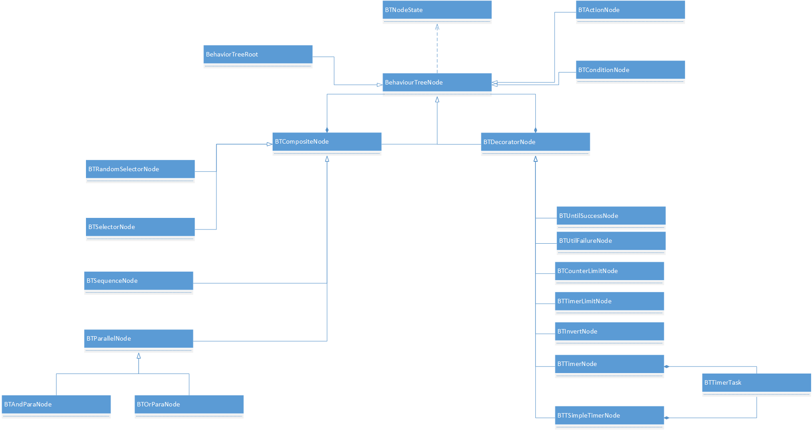

[<< 返回到主页](index.md)

**这里将介绍行为树的博客文章**  

一般游戏中的行为AI可以用状态机和行为树来描述。有限状态机适用于不太复杂的行为逻辑，行为树可以适用于较复杂的行为逻辑；行为树是每帧都主动感知世界的变化，因此性能要低；而状态机是事件触发，不需要每帧都去感知世界，性能要比行为树好。   
状态机的原理较简单，对行为逻辑进行状态标记，然后建立条件转换关系。这里主要介绍行为树，描述复杂的行为逻辑。   

感知  
1. 感知：知道世界正发生的事  
2. 感知方式：事件驱动和轮询  
3. 触发器：与事件驱动系统相对应，刺激源；触发事件;时间触发器，输入触发器，阈值触发器，区域范围触发器等等  
4. 感知实现：Trigger触发器基类 Sensor感知器基类(触发器触发后，感知器需要判断是否真正被感知器感觉到);事件管理器；视觉和听觉的触发器和感知器  
5. 记忆感知： SensorMemory MemoryItem  
6. 血包，宝物，生命值等感知  

有限状态机FSM(Finite State Machine)    
1. 有限状态机：一组状态、输入和根据输入及现有状态转化为下一个状态的转换函数组成  
2. 常见行为状态：空闲、行走、奔跑、进攻、躲避和死亡等  
3. 常见情绪状态：高兴、生气、害怕和悲伤等  
4. 拓扑结构：有向连通图。节点为状态，连接线为转换函数，输入为事件  
5. FSM框架：FSMState、FSMStateManager、EventTrigger(事件驱动或轮询)  

行为树(Behaviour Tree)  
1. 行为树：一棵多叉树。层析清晰，容易调试维护  
2. 描述行为逻辑，分4种节点：顺序节点、选择节点、条件节点和行为节点  
3. 结构上，分2种：组合节点和叶节点;组合节点：顺序节点和选择节点;叶节点：条件节点和行为节点  
4. 释义   
    1. 条件节点：bool success = 条件测试。 return success  
    2. 行为节点：完成实际工作   
    3. 选择节点：if Any is true， return true。 else return false  
    4. 顺序节点：if Any is false， return false。 else return true  
    5. 随机选择：对选择节点的执行顺序，随机化.shuffle  
    6. 修饰节点：只包含一个子节点。Until Success 和 Until Fail。过滤器以及定时器，计数器等  
    7. 并行节点：与选择节点不同，子节点同时处理(协程处理)，any is false，return false;else return true  
5. 节点处理的状态码 False True Running Ready Visit  
6. 子树复用  
        
有限状态机和行为树权衡  
1. 对于状态机，每个时刻都处于某种状态中，等待某个时间的发生。事件没发生，则保持当前状态；事件发生，那么转换到另一个状态。  
2. 对于行为树，处理周围世界变化的任务是有条件节点来完成，相当于每次遍历行为树时，条件节点都想周围世界发出询问，以此监视世界发生的事情。  
3. 行为树不太适合表示事件驱动的行为，行为树的逻辑层次很清晰，适用复杂的逻辑。状态机适合轮询与事件驱动。  

代码抽象封装：   
   

主要包括：BehaviourTreeNode，BehaviorTreeRoot  
```
using Object = System.Object;
using UnityEngine;

namespace AI
{
    public enum BTNodeState
    {
        Failure = 0,
        Success,
        Running,
        Ready,
        Error
    }

    public abstract class BehaviourTreeNode
    {
        protected BehaviourTreeNode mRunningNode;
        protected BTNodeState mNodeState;
        protected string mName = "";
        public BehaviourTreeNode()
        {
            mRunningNode = null;
            mNodeState = BTNodeState.Ready;
        }
        public virtual void Enter(Object obj)
        {

        }

        public string Name
        {
            get
            {
                return mName;
            }
            set
            {
                mName = value;
            }
        }

        public virtual BTNodeState Run(Object obj)
        {
            Enter(obj);
            mNodeState = Process(obj);
            Leave(obj);
            return mNodeState;
        }

        public virtual void Leave(Object obj)
        {
            // Debug.Log(mName + " " + mNodeState);
        }

        public abstract BTNodeState Process(Object obj);
    }

    public class BehaviorTreeRoot : BehaviourTreeNode
    {
        BehaviourTreeNode mRoot;
        
        public BehaviorTreeRoot()
        {

        }

        public BehaviorTreeRoot(BehaviourTreeNode root)
        {
            Root = root;
        }

        public override BTNodeState Process(Object obj)
        {
            mNodeState = Root.Run(obj);
            return mNodeState;
        }

        public BehaviourTreeNode Root
        {
            get
            {
                return mRoot;
            }
            set
            {
                mRoot = value;
            }
        }
    }
}

```
看下继承类  
BTCompositeNode,BTSelectorNode,BTSequenceNode,BTRandomSelectorNode,BTParallelNode,BTAndParaNode,BTOrParaNode    
```
using System;
using System.Collections.Generic;

using KayUtils;
using System.Collections;
using Object = System.Object;
using UnityEngine;

namespace AI
{
    public class BTCompositeNode : BehaviourTreeNode
    {
        protected List<BehaviourTreeNode> mChildren;
        public BTCompositeNode() : base()
        {
            mChildren = new List<BehaviourTreeNode>();
        }

        public void AddChild(BehaviourTreeNode node)
        {
            mChildren.Add(node);
        }

        public override BTNodeState Process(Object obj)
        {
            return BTNodeState.Ready;
        }
    }

    public class BTSelectorNode : BTCompositeNode
    {
        public override BTNodeState Process(Object obj)
        {
            int index = 0;
            if (mNodeState == BTNodeState.Running && mRunningNode != null)
            {
                index = mChildren.IndexOf(mRunningNode);
                if (index == -1)
                {
                    mNodeState = BTNodeState.Ready;
                    index = 0;
                }
            }
            for (int i = index; i < mChildren.Count; ++i)
            {
                mNodeState = mChildren[i].Run(obj);
                if (mNodeState == BTNodeState.Running)
                {
                    mRunningNode = mChildren[i];
                    return mNodeState;
                }
                if (mNodeState == BTNodeState.Success)
                {
                    return mNodeState;
                }
            }
            mNodeState = BTNodeState.Failure;
            return mNodeState;
        }
    }

    public class BTSequenceNode : BTCompositeNode
    {
        public override BTNodeState Process(Object obj)
        {
            int index = 0;
            if (mNodeState == BTNodeState.Running && mRunningNode != null)
            {
                index = mChildren.IndexOf(mRunningNode);
                if (index == -1)
                {
                    mNodeState = BTNodeState.Ready;
                    index = 0;
                }
            }
            for (int i = index; i < mChildren.Count; ++i)
            {
                mNodeState = mChildren[i].Run(obj);
                if (mNodeState == BTNodeState.Running)
                {
                    mRunningNode = mChildren[i];
                    return mNodeState;
                }
                if (mNodeState == BTNodeState.Failure)
                {
                    return mNodeState;
                }
            }
            mNodeState = BTNodeState.Success;
            return mNodeState;
        }
    }

    public class BTRandomSelectorNode : BTCompositeNode
    {
        public override BTNodeState Process(Object obj)
        {
            int[] seq = RandomShuffle(mChildren.Count);
            foreach (int index in seq)
            {
                if (mChildren[index].Run(obj) == BTNodeState.Success)
                {
                    return BTNodeState.Success;
                }
            }
            return BTNodeState.Failure;
        }

        private int[] RandomShuffle(int indexCount)
        {
            int[] res = new int[indexCount];
            for (int i = 0; i < indexCount; ++i)
            {
                res[i] = i;
            }
            for (int i = 0; i < indexCount; ++i)
            {
                int j = UnityEngine.Random.Range(0, indexCount);
                while (j == i)
                {
                    j = UnityEngine.Random.Range(0, indexCount);
                }
                int temp = res[i];
                res[i] = res[j];
                res[j] = temp;
            }
            return res;
        }
    }

    // 并行，与 Sequence 不同，节点同时运行
    //  &&  || 操作
    // 只是优化 可使用 协程 StartCor
    public abstract class BTParallelNode : BTCompositeNode
    {
        // 并行节点除了继承 BehaviourTreeNode 外，还需要实现 BTParallelFunc
        public interface IBTParallelFunc
        {
            IEnumerator RunCode();
            BTNodeState NodeStatus();
        }

        List<Coroutine> mCoroutines = new List<Coroutine>();
        MonoBehaviour behaviour;
        public override BTNodeState Process(Object obj)
        {
            if (mNodeState == BTNodeState.Ready || mNodeState == BTNodeState.Success)
            {
                if (!(obj is MonoBehaviour))
                {
                    throw new Exception("exception: " + "obj should extends MonoBehaviour");
                }
                behaviour = (MonoBehaviour)obj;
                foreach (BehaviourTreeNode node in mChildren)
                {
                    if (typeof(IBTParallelFunc).IsAssignableFrom(node.GetType()))
                    {
                        mCoroutines.Add(behaviour.StartCoroutine(((IBTParallelFunc)node).RunCode()));
                    }
                    else
                    {
                        throw new Exception("exception: " + node.GetType().Name + " should implements IBTParallelFunc");
                    }
                }
                mNodeState = BTNodeState.Running;
            }
            else if (mNodeState == BTNodeState.Running)
            {
                mNodeState = Handle();
            }
            return mNodeState;
        }

        protected abstract BTNodeState Handle();

        protected void Cancel()
        {
            if (behaviour != null)
            {
                foreach (Coroutine cor in mCoroutines)
                {
                    behaviour.StopCoroutine(cor);
                }
            }
        }
    }

    public class BTAndParaNode : BTParallelNode
    {
        protected override BTNodeState Handle()
        {
            BTNodeState result = BTNodeState.Running;
            int count = 0;
            foreach (BehaviourTreeNode node in mChildren)
            {
                if (((IBTParallelFunc)node).NodeStatus() == BTNodeState.Failure)
                {
                    result = BTNodeState.Failure;
                    break;
                }
                else if (((IBTParallelFunc)node).NodeStatus() == BTNodeState.Running)
                {
                    continue;
                }
                else if (((IBTParallelFunc)node).NodeStatus() == BTNodeState.Success)
                {
                    count++;
                }
            }
            if (count == mChildren.Count)
            {
                result = BTNodeState.Success;
            }
            return result;
        }
    }

    public class BTOrParaNode : BTParallelNode
    {
        protected override BTNodeState Handle()
        {
            BTNodeState result = BTNodeState.Running;
            int count = 0;
            foreach (BehaviourTreeNode node in mChildren)
            {
                if (((IBTParallelFunc)node).NodeStatus() == BTNodeState.Success)
                {
                    result = BTNodeState.Success;
                    break;
                }
                else if (((IBTParallelFunc)node).NodeStatus() == BTNodeState.Running)
                {
                    continue;
                }
                else if (((IBTParallelFunc)node).NodeStatus() == BTNodeState.Failure)
                {
                    count++;
                }
            }
            if (count == mChildren.Count)
            {
                result = BTNodeState.Failure;
            }
            return result;
        }
    }

}

```
对叶结点：行为节点和条件节点的处理   
```

using System;

namespace AI
{
    public class BTActionNode : BehaviourTreeNode
    {
        public override BTNodeState Process(Object obj)
        {
            return BTNodeState.Ready;
        }
    }

    public class BTConditionNode : BehaviourTreeNode
    {
        public override BTNodeState Process(Object obj)
        {
            return BTNodeState.Ready;
        }
    }
}
```

装饰节点和定时器类的处理：   
```
using System;
namespace AI
{
    public class BTDecoratorNode : BehaviourTreeNode
    {
        protected BehaviourTreeNode mChild = null;
        public override BTNodeState Process(Object obj)
        {
            return BTNodeState.Ready;
        }
        public void Proxy(BehaviourTreeNode child)
        {
            mChild = child;
        }
    }
    // 直到 success
    public class BTUntilSuccessNode : BTDecoratorNode
    {
        public override BTNodeState Process(Object obj)
        {
            if (mChild.Process(obj) == BTNodeState.Success)
            {
                return BTNodeState.Success;
            }
            return BTNodeState.Running;
        }
    }

    // 直到 fail
    public class BTUtilFailureNode : BTDecoratorNode
    {
        public override BTNodeState Process(Object obj)
        {
            if (mChild.Process(obj) == BTNodeState.Failure)
            {
                return BTNodeState.Success;
            }
            return BTNodeState.Running;
        }
    }

    // 计数器
    public class BTCounterLimitNode : BTDecoratorNode
    {
        int mRunningLimitCount;
        int mRunningCount = 0;
        public BTCounterLimitNode(int limit) : base()
        {
            mRunningLimitCount = limit;
        }
        public override BTNodeState Process(Object obj)
        {
            mNodeState = mChild.Process(obj);
            if (mNodeState == BTNodeState.Running)
            {
                mRunningCount++;
                if (mRunningCount > mRunningLimitCount)
                {
                    mRunningCount = 0;
                    mNodeState = BTNodeState.Failure;
                }
            }
            else
            {
                mRunningCount = 0;
            }
            return mNodeState;
        }
    }

    // 运行时间内
    public class BTTimerLimitNode : BTDecoratorNode
    {
        BTTimerTask mTimerTask;
        public BTTimerLimitNode(float interval) : base()
        {
            mTimerTask = new BTTimerTask(interval, null);
        }

        public override BTNodeState Process(Object obj)
        {
            mNodeState = mChild.Process(obj);
            if (mNodeState == BTNodeState.Running)
            {
                bool flag = mTimerTask.Process(obj);
                if (flag)
                {
                    mNodeState = BTNodeState.Failure;
                }
            }
            else
            {
                mTimerTask.Stop();
            }
            return mNodeState;
        }
    }

    // 定时器
    public class BTTimerNode : BTDecoratorNode
    {
        BTTimerTask mTimerTask;
        public BTTimerNode(float interval) : base()
        {
            mTimerTask = new BTTimerTask(interval, null);
        }

        public override BTNodeState Process(Object obj)
        {
            bool flag = mTimerTask.Process(obj);
            if (flag)
            {
                mNodeState = mChild.Process(obj);
            }
            return mNodeState;
        }
    }

    // 直接装饰器 定时器
    public class BTTSimpleTimerNode : BehaviourTreeNode
    {
        BTTimerTask mTimerTask;
        public BTTSimpleTimerNode(float interval, Action<Object> action) : base()
        {
            mTimerTask = new BTTimerTask(interval, action);
        }

        public override BTNodeState Process(Object obj)
        {
            bool flag = mTimerTask.Process(obj);
            if (flag)
            {
                return BTNodeState.Success;
            }
            return BTNodeState.Failure;
        }
    }

    // 取非
    public class BTInvertNode : BTDecoratorNode
    {
        public override BTNodeState Process(Object obj)
        {
            mNodeState = mChild.Process(obj);
            if (mNodeState == BTNodeState.Failure)
            {
                mNodeState = BTNodeState.Success;
            }
            else if (mNodeState == BTNodeState.Success)
            {
                mNodeState = BTNodeState.Failure;
            }
            return mNodeState;
        }
    }

    public class BTTimerTask
    {
        long mCurrentTicks;
        long mInterval;
        long mNextTicks;
        Callback<Object> mCallback = null;
        bool isStop;
        public BTTimerTask(float interval, Action<Object> action)
        {
            if (action != null)
            {
                mCallback = new Callback<object>();
                mCallback.Handler = action;
            }
            mCurrentTicks = System.DateTime.Now.Ticks;
            mInterval = (long)(interval * 10000000);
            mNextTicks = mCurrentTicks + mInterval;
            isStop = true;
        }

        public bool Process(Object obj)
        {
            Start();
            if (System.DateTime.Now.Ticks > mNextTicks)
            {
                if (mCallback != null)
                {
                    mCallback.Arg1 = obj;
                    mCallback.Run();
                }
                Stop();
                return true;
            }
            return false;
        }

        void Start()
        {
            if (isStop)
            {
                isStop = false;
                mCurrentTicks = System.DateTime.Now.Ticks;
                mNextTicks = mCurrentTicks + mInterval;
            }
        }

        public void Stop()
        {
            isStop = true;
            mCurrentTicks = 0;
        }
    }
}

```