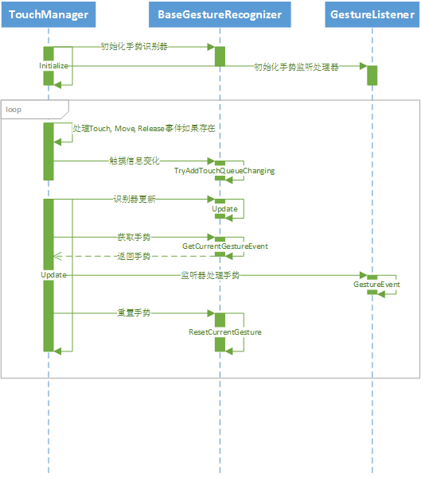
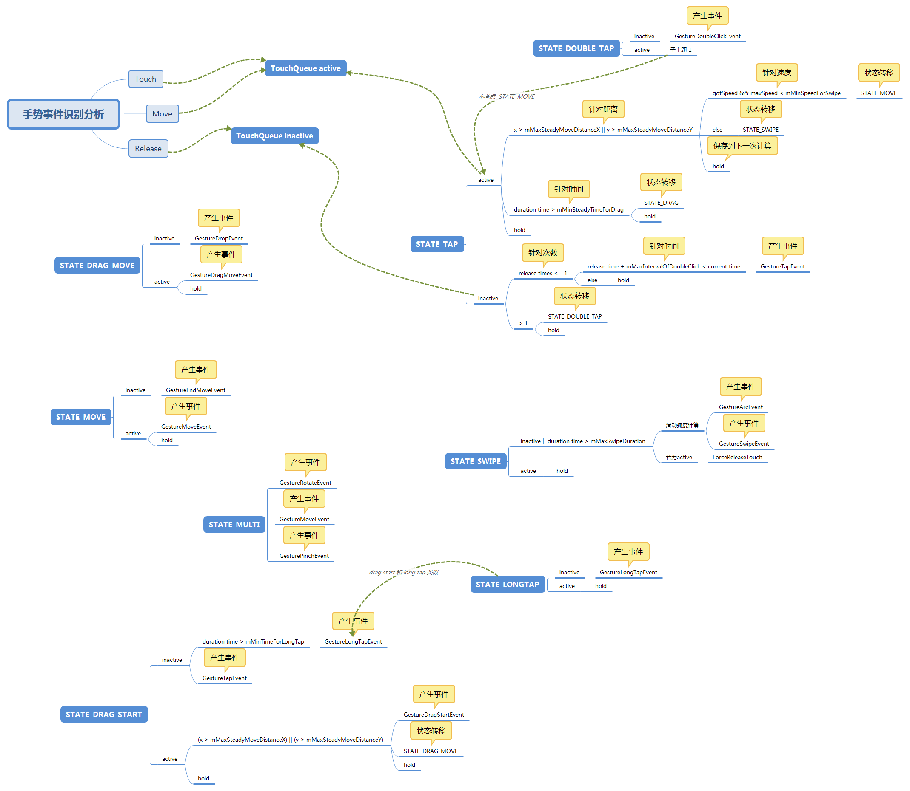
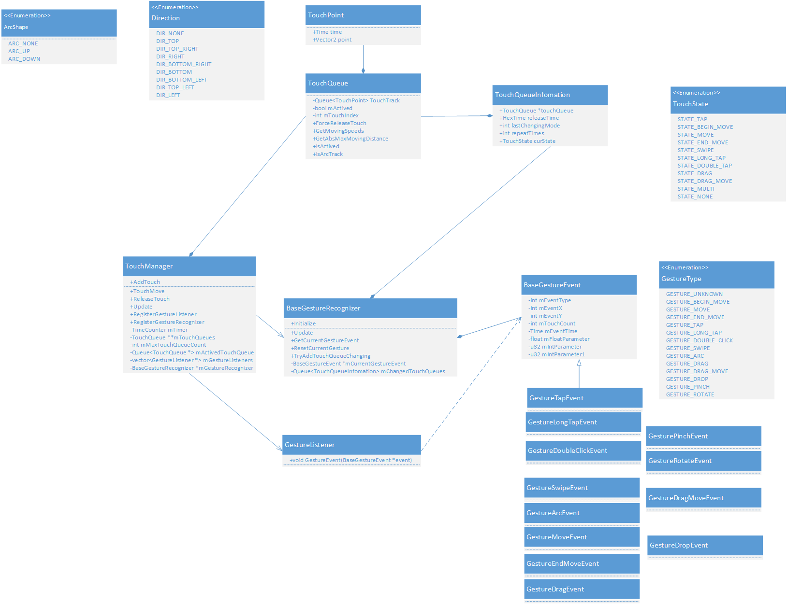

[<< 返回到主页](index.md)

**这里将介绍手势操作的博客文章**  

手势识别在某些游戏中需要使用到，这里介绍手势识别的封装  

首先看一下外部调用轮廓图：  
   
TouchManager接收窗口原生的三个事件：Touch,Move和Release  
基于这三个事件，对每根手指的数据记录并计算，然后识别手势类型  

接下来看一下有哪些手势以及手势之间的转移：  
   
对持续时间，移动距离，释放次数，滑动的弧度，两个手指等计算   

接下来是手势类图介绍：   
   
最外层的类为TouchManager，其内部封装了TouchQueue，记录手指的数据TouchPoint；BaseGestureRecognizer用于处理TouchQueue，获得TouchQueueInformation标记手势状态；在Update函数中处理TouchQueueInformation，获得GestureEvent，调用GestureListner。   

TouchManager.h  
```
#ifndef TOUCH_MANAGER_H_
#define TOUCH_MANAGER_H_

#include "input/TouchQueue.h"
#include "HexTimeCounter.h"
#include <vector.h>

using namespace HexmillEngine;

class BaseGestureEvent;
class BaseGestureRecognizer;

class TouchManager
{
public:
    class GestureListener
    {
    public:
        GestureListener() {}
        
        virtual ~GestureListener() { }
        
        virtual void GestureEvent(BaseGestureEvent *event) = 0;
    };
public:
    TouchManager(unsigned int maxCount = 10);
    virtual ~TouchManager();
    
    virtual void AddTouch(int x, int y, unsigned int touchIndex);
    virtual void TouchMove(int x, int y, unsigned int touchIndex);
    virtual void ReleaseTouch(int x, int y, unsigned int touchIndex);

    virtual void Update();
    
    inline bool IsEnabled() const { return mGestureRecognizer && (mGestureListeners.size() > 0); }

    void RegisterGestureListener(TouchManager::GestureListener *listener);
    void UnRegisterGestureListener(TouchManager::GestureListener *listener);
    
    void RegisterGestureRecognizer(const char *recognizerName);
protected:
    virtual void Clear();
    void TryActiveTouchManager();
    
    HexTimeCounter mTimer;
    
    TouchQueue **mTouchQueues;
    unsigned int mMaxTouchQueueCount;
    
    DataStructures::Queue<TouchQueue *> mActivedTouchQueue;
    
    std::vector<TouchManager::GestureListener *> mGestureListeners;

    BaseGestureRecognizer *mGestureRecognizer;
};


#endif

```

TouchManager.cpp    
```
#include "input/TouchManager.h"
#include "input/BaseGestureRecognizer.h"

//--------------------------------------------------- TouchManager --------------------------------------------------
TouchManager::TouchManager(unsigned int maxCount) : mMaxTouchQueueCount(maxCount), mGestureRecognizer(0)
{
    assert(mMaxTouchQueueCount >= 1);
    mTouchQueues = (TouchQueue **)malloc(sizeof(TouchQueue *) * mMaxTouchQueueCount);
    for (unsigned int i=0; i<mMaxTouchQueueCount; i++)
        mTouchQueues[i] = new TouchQueue(i);
}

TouchManager::~TouchManager()
{
    mTimer.StopTimer();
    Clear();
}
    
void TouchManager::Clear()
{
    for (unsigned int i=0; i<mMaxTouchQueueCount; i++)
        delete mTouchQueues[i];
    free(mTouchQueues);
    mTouchQueues = 0;
    mActivedTouchQueue.Clear();
    mGestureRecognizer = 0;
    mGestureListeners.clear();
}
    
void TouchManager::AddTouch(int x, int y, unsigned int touchIndex)
{
    if (touchIndex >= mMaxTouchQueueCount)
        return;
    mTouchQueues[touchIndex]->AddTouch(x, y, mTimer.GetTimeSlapped());
    if (mGestureRecognizer)
        mGestureRecognizer->TryAddTouchQueueChanging(mTouchQueues[touchIndex], 1, mTimer.GetTimeSlapped());
}

void TouchManager::TouchMove(int x, int y, unsigned int touchIndex)
{
    if (touchIndex >= mMaxTouchQueueCount)
        return;
    mTouchQueues[touchIndex]->TouchMove(x, y, mTimer.GetTimeSlapped());
    if (mGestureRecognizer)
        mGestureRecognizer->TryAddTouchQueueChanging(mTouchQueues[touchIndex], 2, mTimer.GetTimeSlapped());
}

void TouchManager::ReleaseTouch(int x, int y, unsigned int touchIndex)
{
    if (touchIndex >= mMaxTouchQueueCount)
        return;
    mTouchQueues[touchIndex]->ReleaseTouch(x, y, mTimer.GetTimeSlapped());
    if (mGestureRecognizer)
        mGestureRecognizer->TryAddTouchQueueChanging(mTouchQueues[touchIndex], 3, mTimer.GetTimeSlapped());
}
    
void TouchManager::Update()
{
    if (mTimer.IsTimerStopped())
        return;
    mGestureRecognizer->Update(mTimer.GetTimeSlapped());
    BaseGestureEvent *event = mGestureRecognizer->GetCurrentGestureEvent();
    if (!event)
        return;
    for (unsigned int i=0; i<mGestureListeners.size(); i++)
    {
        mGestureListeners[i]->GestureEvent(event);
    }
    mGestureRecognizer->ResetCurrentGesture();
}

void TouchManager::RegisterGestureListener(TouchManager::GestureListener *listener)
{
    for (unsigned int i=0; i<mGestureListeners.size(); i++)
    {
        if (listener == mGestureListeners[i])
            return;
    }
    mGestureListeners.push_back(listener);
    TryActiveTouchManager();
}

void TouchManager::UnRegisterGestureListener(TouchManager::GestureListener *listener)
{
    for (std::vector<TouchManager::GestureListener *>::iterator it = mGestureListeners.begin(); it != mGestureListeners.end(); it++)
    {
        if (*it == listener)
        {
            mGestureListeners.erase(it);
            break;
        }
    }
    TryActiveTouchManager();
}

void TouchManager::RegisterGestureRecognizer(const char *recognizerName)
{
    //delete the old one
    if (mGestureRecognizer)
    {
        if (strcmp(recognizerName, mGestureRecognizer->GetId()) == 0)
            return;
        SAFE_DELETE(mGestureRecognizer);
    }
    //try create a new one
    mGestureRecognizer = BaseGestureRecognizer::Create(recognizerName);
    mGestureRecognizer->Initialize();
    
    TryActiveTouchManager();
}

void TouchManager::TryActiveTouchManager()
{
    bool lastEnabled = !mTimer.IsTimerStopped();
    bool currentEnabled = IsEnabled();
    if (lastEnabled == currentEnabled)
        return;
    if (currentEnabled)
        mTimer.StartTimer();
    else
        mTimer.StopTimer();
}

```

TouchQueue.h   
```
#ifndef TOUCH_QUEUE_H_
#define TOUCH_QUEUE_H_

#include "HexmillEngine.h"
#include "DS_Queue.h"

using namespace HexmillEngine;

struct TouchPoint
{
    TouchPoint() : point(FastMath::Vector2::Zero()), time(0) {}
    TouchPoint(const FastMath::Vector2 &p, HexTime t) : point(p), time(t) {}
    
    inline bool IsValid() { return time != 0; }
    
    FastMath::Vector2 point;
    HexTime time;
};

class TouchQueue
{
public:
    typedef DataStructures::Queue<TouchPoint> TouchTrack;
    
    enum ArcShape
    {
        ARC_NONE    = 0,
        ARC_UP      = 1,
        ARC_DOWN    = 2,
    };
    
    enum Direction
    {
        DIR_NONE            = 0x00000000,
        DIR_TOP             = 0x00000001,
        DIR_TOP_RIGHT       = 0x00000002,
        DIR_RIGHT           = 0x00000004,
        DIR_BOTTOM_RIGHT    = 0x00000008,
        DIR_BOTTOM          = 0x00000010,
        DIR_BOTTOM_LEFT     = 0x00000020,
        DIR_LEFT            = 0x00000040,
        DIR_TOP_LEFT        = 0x00000080,
    };
public:
    TouchQueue(unsigned int index);
    virtual ~TouchQueue();
    
    virtual void Clear();
    
    virtual inline bool IsActived() const { return mActived; }
    virtual inline unsigned int GetTouchIndex() const { return mTouchIndex; }
    
    //try add touch point in track queue, if the queue is not actived, the input will be ignored
    virtual void AddTouch(int x, int y, HexTime time);
    virtual void TouchMove(int x, int y, HexTime time);
    virtual void ReleaseTouch(int x, int y, HexTime time);

    //try deactive the queue, after these calls, the input should be ignored, even the touch event still triggered
    virtual void ForceReleaseTouch(int x, int y, HexTime time);
    virtual void ForceReleaseTouch();
    
    HexTime GetDuration();
    HexTime GetCurrentDuration(HexTime current);
    bool GetMovingSpeeds(float &maxSpeed, float &avgSpeed);
    unsigned int GetTouchPointCount() const;
    bool IsArcTrack(int minXDistance, float minYChangePersent, TouchQueue::ArcShape &arcType, Direction &direction);
    void GetAbsMaxMovingDistance(int &x, int &y);
    void GetTrackStartingPosition(int &x, int &y);
    void GetTrackEndingPosition(int &x, int &y);
protected:
    TouchTrack mTouchTrack;
    bool mActived;
    unsigned int mTouchIndex;
};


#endif

```

TouchQueue.cpp   
```
#include "input/TouchQueue.h"

//--------------------------------------------------- TouchQueue --------------------------------------------------
TouchQueue::TouchQueue(unsigned int index) : mActived(false), mTouchIndex(index)
{
    mTouchTrack.ClearAndForceAllocation(32);
}

TouchQueue::~TouchQueue()
{
    mTouchTrack.Clear();
}

void TouchQueue::Clear()
{
    mActived = false;
    while (!mTouchTrack.IsEmpty())
        mTouchTrack.Pop();
}

void TouchQueue::AddTouch(int x, int y, HexTime time)
{
    Clear();
    mActived = true;
    mTouchTrack.Push(TouchPoint(FastMath::Vector2((float)x, (float)y), time));
}

void TouchQueue::TouchMove(int x, int y, HexTime time)
{
    if (mActived)
        mTouchTrack.Push(TouchPoint(FastMath::Vector2((float)x, (float)y), time));
}

void TouchQueue::ReleaseTouch(int x, int y, HexTime time)
{
    if (!mActived)
        return;
    mTouchTrack.Push(TouchPoint(FastMath::Vector2((float)x, (float)y), time));
    mActived = false;
}

void TouchQueue::ForceReleaseTouch(int x, int y, HexTime time)
{
    ReleaseTouch(x, y, time);
}

void TouchQueue::ForceReleaseTouch()
{
    if (!mActived)
        return;
    if (mTouchTrack.Size() == 1)
    {
        TouchPoint &p = mTouchTrack[0];
        ReleaseTouch((int)p.point.x(), (int)p.point.y(), p.time + 200);
    }
    mActived = false;
}

HexTime TouchQueue::GetDuration()
{
    if (mTouchTrack.Size() < 2)
        return 0;
    return mTouchTrack.PeekTail().time - mTouchTrack.Peek().time;
}

HexTime TouchQueue::GetCurrentDuration(HexTime current)
{
    if (mTouchTrack.IsEmpty())
        return 0;
    return current - mTouchTrack.Peek().time;
}

bool TouchQueue::GetMovingSpeeds(float &maxSpeed, float &avgSpeed)
{
    if (mTouchTrack.Size() < 2)
        return false;
    maxSpeed = 0.0f;
    bool res = false;
    for (unsigned int i=1; i<mTouchTrack.Size(); i++)
    {
        TouchPoint &p0 = mTouchTrack[i - 1];
        TouchPoint &p1 = mTouchTrack[i];
        int dt = p1.time - p0.time;
        if (dt == 0)
            continue;
        float speed = (p1.point - p0.point).Length() * 1000.0f / (float)dt;
        if (speed > maxSpeed)
            maxSpeed = speed;
        res = true;
    }
    avgSpeed = 0.0f;
    if (res)
    {
        TouchPoint p0 = mTouchTrack.Peek();
        TouchPoint p1 = mTouchTrack.PeekTail();
        int dt = p1.time - p0.time;
        if (dt != 0)
            avgSpeed = (p1.point - p0.point).Length() * 1000.0f / (float)dt;
    }
    return true;
}

unsigned int TouchQueue::GetTouchPointCount() const
{
    return mTouchTrack.Size();
}

bool TouchQueue::IsArcTrack(int minXDistance, float minYChangePersent, TouchQueue::ArcShape &arcType, Direction &direction)
{
    arcType = TouchQueue::ARC_NONE;
    direction = TouchQueue::DIR_NONE;
    
    unsigned int trackCount = mTouchTrack.Size();

    TouchPoint &p0 = mTouchTrack[0];
    TouchPoint &p1 = mTouchTrack[trackCount - 1];

    if (trackCount >= 4)
    {
        int dx = abs((int)p1.point.x() - (int)p0.point.x());
        if (dx > minXDistance)
        {
            //identity matrix
            FastMath::Matrix4x4f m;
            //build rotation matrix
            static FastMath::Point3f _x_vector = {1.0f, 0.0f, 0.0f};
            FastMath::Point3f vec = {p1.point.x() - p0.point.x(), p1.point.y() - p0.point.y(), 0.0f};
            FastMath::NormalizeVector3f(vec);
            FastMath::CreateRotationMatrix4f(_x_vector, vec, m);
            
            std::vector<float> yArray;
            unsigned int topYIndex = 0;
            float maxYDist = -1e20f;
            for (unsigned int i=1; i<trackCount - 1; i++)
            {
                TouchPoint &p = mTouchTrack[i];
                FastMath::Point3f pt = {p.point.x() - p0.point.x(), p.point.y()-p0.point.y(), 0.0f};
                FastMath::Point3f myPt;
                FastMath::PositionTransform3f(pt, m, myPt);
                yArray.push_back(myPt[1]);
                float yDist = myPt[1] - vec[1];
                if (fabs(yDist) > maxYDist)
                {
                    maxYDist = fabs(yDist);
                    topYIndex = i;
                }
            }
            
            float dist = (p1.point - p0.point).Length();
            float yChangePersent = maxYDist / dist;
            if (yChangePersent >= minYChangePersent)
            {
                if (yArray[topYIndex] > 0)
                    arcType = TouchQueue::ARC_UP;
                else
                    arcType = TouchQueue::ARC_DOWN;

                if (p1.point.x() > p0.point.x())
                    direction = TouchQueue::DIR_RIGHT;
                else
                    direction = TouchQueue::DIR_LEFT;
                
                return true;
            }
        }
    }
    //not a movement in curve, determin the direction
    static const FastMath::Point3f _const_directions[8] =
    {
        {0.0f, -1.0f, 0.0f},                //top
        {0.707107f, -0.707107f, 0.0f},      //right-top
        {1.0f, 0.0f, 0.0f},                 //right
        {0.707107f, 0.707107f, 0.0f},       //right-bottom
        {0.0f, 1.0f, 0.0f},                 //bottom
        {-0.707107f, 0.707107f, 0.0f},      //left-bottom
        {-1.0f, 0.0f, 0.0f},                //left
        {-0.707107f, -0.707107f, 0.0f}      //left-top
    };
    
    FastMath::Point3f vec = {p1.point.x() - p0.point.x(), p1.point.y() - p0.point.y(), 0.0f};
    FastMath::NormalizeVector3f(vec);
    
    unsigned int closestIndex = 100;
    float maxDot = -1e20f;
    for (unsigned int i=0; i<8; i++)
    {
        float dot = FastMath::VectorDotProduct3f(vec, _const_directions[i]);
        if (dot > maxDot)
        {
            maxDot = dot;
            closestIndex = i;
        }
    }
    switch (closestIndex)
    {
        case 0:
            direction = TouchQueue::DIR_TOP;
            break;
        case 1:
            direction = TouchQueue::DIR_TOP_RIGHT;
            break;
        case 2:
            direction = TouchQueue::DIR_RIGHT;
            break;
        case 3:
            direction = TouchQueue::DIR_BOTTOM_RIGHT;
            break;
        case 4:
            direction = TouchQueue::DIR_BOTTOM;
            break;
        case 5:
            direction = TouchQueue::DIR_BOTTOM_LEFT;
            break;
        case 6:
            direction = TouchQueue::DIR_LEFT;
            break;
        case 7:
            direction = TouchQueue::DIR_TOP_LEFT;
            break;
        default:
            direction = TouchQueue::DIR_NONE;
            assert(false);
            break;
    }
    return false;
}

void TouchQueue::GetAbsMaxMovingDistance(int &x, int &y)
{
    if (mTouchTrack.Size() < 2)
    {
        x = y = 0;
    }
    else
    {
        x = y = -1e20;
        for (unsigned int i=1; i<mTouchTrack.Size(); i++)
        {
            TouchPoint &p1 = mTouchTrack[i];
            TouchPoint &p0 = mTouchTrack[i - 1];
            int tx = fabs(p1.point.x() - p0.point.x());
            int ty = fabs(p1.point.y() - p0.point.y());
            if (x < tx)
                x = tx;
            if (y < ty)
                y = ty;
        }
    }
}

void TouchQueue::GetTrackStartingPosition(int &x, int &y)
{
    if (mTouchTrack.IsEmpty())
    {
        x = y = 0;
    }
    else
    {
        TouchPoint &p = mTouchTrack[0];
        x = p.point.x();
        y = p.point.y();
    }
}

void TouchQueue::GetTrackEndingPosition(int &x, int &y)
{
    if (mTouchTrack.IsEmpty())
    {
        x = y = 0;
    }
    else
    {
        TouchPoint &p = mTouchTrack[mTouchTrack.Size() - 1];
        x = p.point.x();
        y = p.point.y();
    }
}

```

GestureEvent.h   
```
#ifndef BASE_GESTURE_EVENTS_H_
#define BASE_GESTURE_EVENTS_H_

#include "input/TouchQueue.h"

#define GESTURE_UNKNOWN         0
#define GESTURE_BEGIN_MOVE      1
#define GESTURE_MOVE            2
#define GESTURE_END_MOVE        3
#define GESTURE_TAP             4
#define GESTURE_LONG_TAP        5
#define GESTURE_DOUBLE_CLICK    6
#define GESTURE_SWIPE           7
#define GESTURE_ARC             8
#define GESTURE_DRAG            9
#define GESTURE_DRAG_MOVE       10
#define GESTURE_DROP            11
#define GESTURE_PINCH           12
#define GESTURE_ROTATE          13

//---------------------------- class for basic gesture event ----------------------------
// note: the BaseGestureEvent includes all data, DO NOT introduce ANY DATA in the sub class(es)
// so, we can using new (eventInstance) GestureXXXEvent without any memory-fragment
class BaseGestureEvent
{
public:
    BaseGestureEvent() : mEventX(0), mEventY(0), mEventTime(0), mTouchCount(1), mEventType(GESTURE_UNKNOWN), mFloatParameter(0.0f), mIntParameter(0)
    {}
    
    BaseGestureEvent(int x, int y, HexTime time, unsigned int touchCount) : mEventX(x), mEventY(y), mEventTime(time), mTouchCount(touchCount), mEventType(GESTURE_UNKNOWN), mFloatParameter(0.0f), mIntParameter(0), mIntParameter1(0)
    {}
    
    virtual ~BaseGestureEvent() {}

    inline const __u8 GetEventType() const { return mEventType; }
    
    inline const int GetEventX() const { return mEventX; }
    inline const int GetEventY() const { return mEventY; }
    inline void GetEventCoordinate(int &x, int &y) const { x = mEventX; y = mEventY; }
    
    inline const HexTime GetEventTime() const { return mEventTime; }
    inline const unsigned int GetTouchCount() const { return mTouchCount; }
    
    virtual inline bool IsValid() const { return false; }
protected:
    __u8 mEventType;
    int mEventX;
    int mEventY;
    unsigned int mTouchCount;
    HexTime mEventTime;
    float mFloatParameter;
    __u32 mIntParameter;
    __u32 mIntParameter1;
};

//---------------------------- class for tap gesture event ----------------------------
class GestureTapEvent : public BaseGestureEvent
{
public:
    GestureTapEvent(int x, int y, HexTime time, unsigned int touchCount) : BaseGestureEvent(x, y, time, touchCount)
    {
        mEventType = GESTURE_TAP;
    }

    virtual inline bool IsValid() const { return true; }
};

//---------------------------- class for long-tap gesture event ----------------------------
class GestureLongTapEvent : public BaseGestureEvent
{
public:
    GestureLongTapEvent(int x, int y, HexTime time, unsigned int touchCount, HexTime duration) : BaseGestureEvent(x, y, time, touchCount)
    {
        mEventType = GESTURE_LONG_TAP;
        mIntParameter = static_cast<__u32>(duration);
    }
    
    inline const HexTime GetDuration() const { return static_cast<HexTime>(mIntParameter); }

    virtual inline bool IsValid() const { return true; }
};

//---------------------------- class for double-click gesture event ----------------------------
class GestureDoubleClickEvent : public BaseGestureEvent
{
public:
    GestureDoubleClickEvent(int x, int y, HexTime time, unsigned int touchCount) : BaseGestureEvent(x, y, time, touchCount)
    {
        mEventType = GESTURE_DOUBLE_CLICK;
    }

    virtual inline bool IsValid() const { return true; }
};

//---------------------------- class for swipe gesture event ----------------------------
class GestureSwipeEvent : public BaseGestureEvent
{
public:
    GestureSwipeEvent(int x, int y, HexTime time, unsigned int touchCount, TouchQueue::Direction direction) : BaseGestureEvent(x, y, time, touchCount)
    {
        mEventType = GESTURE_SWIPE;
        mIntParameter = static_cast<__u32>(direction);
    }
    
    inline const TouchQueue::Direction GetDirection() const { return static_cast<TouchQueue::Direction>(mIntParameter); }

    virtual inline bool IsValid() const { return true; }
};

//---------------------------- class for arc gesture event ----------------------------
class GestureArcEvent : public BaseGestureEvent
{
public:
    GestureArcEvent(int x, int y, HexTime time, unsigned int touchCount, TouchQueue::ArcShape arcShape, TouchQueue::Direction direction) : BaseGestureEvent(x, y, time, touchCount)
    {
        mEventType = GESTURE_ARC;
        mIntParameter = static_cast<__u32>(arcShape);
        mIntParameter1 = static_cast<__u32>(direction);
    }

    inline const TouchQueue::ArcShape GetArcShape() const { return static_cast<TouchQueue::ArcShape>(mIntParameter); }
    inline const TouchQueue::Direction GetDirection() const { return static_cast<TouchQueue::Direction>(mIntParameter1); }
    
    virtual inline bool IsValid() const { return true; }
};

//---------------------------- class for move gesture event ----------------------------
class GestureMoveEvent : public BaseGestureEvent
{
public:
    GestureMoveEvent(int x, int y, HexTime time, unsigned int touchCount) : BaseGestureEvent(x, y, time, touchCount)
    {
        mEventType = GESTURE_MOVE;
    }
    
    virtual inline bool IsValid() const { return true; }
};

//---------------------------- class for end move gesture event ----------------------------
class GestureEndMoveEvent : public BaseGestureEvent
{
public:
    GestureEndMoveEvent(int x, int y, HexTime time, unsigned int touchCount) : BaseGestureEvent(x, y, time, touchCount)
    {
        mEventType = GESTURE_END_MOVE;
    }
    
    virtual inline bool IsValid() const { return true; }
};

//---------------------------- class for drag gesture event ----------------------------
class GestureDragEvent : public BaseGestureEvent
{
public:
    GestureDragEvent(int x, int y, HexTime time, unsigned int touchCount) : BaseGestureEvent(x, y, time, touchCount)
    {
        mEventType = GESTURE_DRAG;
    }

    virtual inline bool IsValid() const { return true; }
};

//---------------------------- class for drag-move gesture event ----------------------------
class GestureDragMoveEvent : public BaseGestureEvent
{
public:
    GestureDragMoveEvent(int x, int y, HexTime time, unsigned int touchCount) : BaseGestureEvent(x, y, time, touchCount)
    {
        mEventType = GESTURE_DRAG_MOVE;
    }

    virtual inline bool IsValid() const { return true; }
};

//---------------------------- class for drop gesture event ----------------------------
class GestureDropEvent : public BaseGestureEvent
{
public:
    GestureDropEvent(int x, int y, HexTime time, unsigned int touchCount) : BaseGestureEvent(x, y, time, touchCount)
    {
        mEventType = GESTURE_DROP;
    }

    virtual inline bool IsValid() const { return true; }
};

//---------------------------- class for pinch gesture event ----------------------------
class GesturePinchEvent : public BaseGestureEvent
{
public:
    GesturePinchEvent(int x, int y, HexTime time, unsigned int touchCount, float scale) : BaseGestureEvent(x, y, time, touchCount)
    {
        mEventType = GESTURE_PINCH;
        mFloatParameter = scale;
    }
    
    inline const float GetScale() const { return mFloatParameter; }

    virtual inline bool IsValid() const { return true; }
};

//---------------------------- class for rotate gesture event ----------------------------
class GestureRotateEvent : public BaseGestureEvent
{
public:
    GestureRotateEvent(int x, int y, HexTime time, unsigned int touchCount, float angle) : BaseGestureEvent(x, y, time, touchCount)
    {
        mEventType = GESTURE_ROTATE;
        mFloatParameter = angle;
    }
    
    inline const float GetAngle() const { return mFloatParameter; }

    virtual inline bool IsValid() const { return true; }
};

#endif

```

BaseGestureRecognizer.h   
```
#ifndef BASE_GESTURE_RECOGNIZER_H_
#define BASE_GESTURE_RECOGNIZER_H_

#include "HexmillEngine.h"
#include "HexTimeCounter.h"
#include "DS_Queue.h"
#include "input/GestureEvents.h"

class TouchQueue;

class BaseGestureRecognizer
{
public:
    BaseGestureRecognizer();
    virtual ~BaseGestureRecognizer();

    inline const char *GetId() const { return mId.c_str(); }
    
    static BaseGestureRecognizer *Create(const char *id);
    
    virtual void Initialize();
    
    virtual void ResetCurrentGesture();
    inline BaseGestureEvent *GetCurrentGestureEvent() const { return mCurrentGestureEvent->IsValid() ? mCurrentGestureEvent : 0; }
    
    virtual void Update(HexTime currentTime);
    
protected:
    std::string mId;
    BaseGestureEvent *mCurrentGestureEvent;
    
    HexTime mMaxIntervalOfDoubleClick;
    HexTime mMinSteadyTimeForDrag;
    HexTime mMinTimeForLongTap;
    HexTime mMaxSwipeDuration;
    float mMinSpeedForSwipe;
    float mMaxAngleCosValForRotate;
    int mMinXDistanceForArc;
    float mMinYChangePersentForArc;
    int mMaxSteadyMoveDistanceX;
    int mMaxSteadyMoveDistanceY;

private:
    void InitializeDefaultParameters();

protected:
    
    enum TouchState
    {
        STATE_TAP         = 0,
        STATE_BEGIN_MOVE  = 1,
        STATE_MOVE        = 2,
        STATE_END_MOVE    = 3,
        STATE_SWIPE       = 4,
        STATE_LONG_TAP    = 5,
        STATE_DOUBLE_TAP  = 6,
        STATE_DRAG        = 7,
        STATE_DRAG_MOVE   = 8,
        STATE_MULTI       = 9,
        STATE_NONE        = 10,
    };
    
    struct TouchQueueInfomation
    {
        TouchQueueInfomation() : touchQueue(0), releaseTime(0), lastChangingMode(0), repeatTimes(0) {}
        TouchQueueInfomation(TouchQueue *queue, int changingMode, HexTime time) : touchQueue(queue), releaseTime(time), lastChangingMode(changingMode), repeatTimes(0),
                curState(STATE_NONE)
        {
            if (touchQueue->IsActived())
                curState = STATE_TAP;
        }
        
        inline bool IsEmpty() const { return !touchQueue && !releaseTime; }
        
        TouchQueue *touchQueue;
        HexTime releaseTime;
        int lastChangingMode;
        int repeatTimes;
        TouchState curState;
    };
    
    TouchQueueInfomation &FindQueueInfomation(TouchQueue *queue);
    void TryRemoveTouchQueueInfomation(TouchQueue *queue);
    
    DataStructures::Queue<TouchQueueInfomation> mChangedTouchQueues;
    unsigned int GetActiveTouchQueueCount();
    
    
public:
    bool TryAddTouchQueueChanging(TouchQueue *queue, int changingMode, HexTime time);

protected:
    virtual void OnTapState(TouchQueueInfomation &info, HexTime time);
    virtual void OnMoveState(TouchQueueInfomation &info, HexTime time);
    virtual void OnSwipeState(TouchQueueInfomation &info, HexTime time);
    virtual void OnLongTapState(TouchQueueInfomation &info, HexTime time);
    virtual void OnDoubleTapState(TouchQueueInfomation &info, HexTime time);
    virtual void OnDragState(TouchQueueInfomation &info, HexTime time);
    virtual void OnDragMoveState(TouchQueueInfomation &info, HexTime time);
    virtual void OnMultiTouch(HexTime time);
    
};

#endif

```

BaseGestureRecognizer.cpp   
```
#include "input/BaseGestureRecognizer.h"

static unsigned int _MAX_INTERVAL_OF_DOUBLE_CLICK_      = 300;
static unsigned int _MIN_STEADY_TIME_FOR_DRAG           = 200;
static unsigned int _MIN_TIME_FOR_LONG_TAP              = 500;
static unsigned int _MAX_TIME_FOR_SWIPE                 = 700;
static float _MIN_X_RATIO_FOR_ARC                       = 0.5f;
static float _MIN_Y_CHANGE_PERSENT_FOR_ARC              = 0.25f;
static float _MAX_DISTANCE_RATIO_FOR_STEADY             = 0.005f;
static float _MAX_ANGLE_COS_VALUE_FOR_ROTATE            = 0.98f;
static float _MAX_SWIPE_DURATION_FOR_WHOLE_SCREEN       = 0.5f;

enum TouchQueueChangingMode
{
    TQC_NONE        = 0,
    TQC_PRESS       = 1,
    TQC_MOVE        = 2,
    TQC_RELEASE     = 3,
};

//--------------------------------------------- BaseGestureRecognizer ---------------------------------------------
BaseGestureRecognizer::BaseGestureRecognizer() : mId("BaseGestureRecognizer")
{
    mCurrentGestureEvent = new BaseGestureEvent();
    InitializeDefaultParameters();
}

BaseGestureRecognizer::~BaseGestureRecognizer()
{
    SAFE_DELETE(mCurrentGestureEvent);
}

BaseGestureRecognizer *BaseGestureRecognizer::Create(const char *id)
{
    if (strcmp("BaseGestureRecognizer", id) == 0)
        return new BaseGestureRecognizer();
    return 0;
}

void BaseGestureRecognizer::Initialize()
{
    InitializeDefaultParameters();
}

void BaseGestureRecognizer::InitializeDefaultParameters()
{
    mMaxIntervalOfDoubleClick = _MAX_INTERVAL_OF_DOUBLE_CLICK_;
    mMinSteadyTimeForDrag = _MIN_STEADY_TIME_FOR_DRAG;
    mMinTimeForLongTap = _MIN_TIME_FOR_LONG_TAP;
    mMinYChangePersentForArc = _MIN_Y_CHANGE_PERSENT_FOR_ARC;
    mMaxSwipeDuration = _MAX_TIME_FOR_SWIPE;

    mMaxAngleCosValForRotate = _MAX_ANGLE_COS_VALUE_FOR_ROTATE;
    
    unsigned int width = Game::GetInstance()->GetViewport().width;
    mMinXDistanceForArc = (int)(_MIN_X_RATIO_FOR_ARC * width + 0.5f);
    
    mMaxSteadyMoveDistanceX = (int)(_MAX_DISTANCE_RATIO_FOR_STEADY * width + 0.5f);
    unsigned int height = Game::GetInstance()->GetViewport().height;
    mMaxSteadyMoveDistanceY = (int)(_MAX_DISTANCE_RATIO_FOR_STEADY * height + 0.5f);
    
    mMinSpeedForSwipe = sqrtf((float)((width * width) + (height * height))) / _MAX_SWIPE_DURATION_FOR_WHOLE_SCREEN;
}

void BaseGestureRecognizer::ResetCurrentGesture()
{
    mCurrentGestureEvent->~BaseGestureEvent();
    new (mCurrentGestureEvent) BaseGestureEvent();
}

BaseGestureRecognizer::TouchQueueInfomation &BaseGestureRecognizer::FindQueueInfomation(TouchQueue *queue)
{
    static BaseGestureRecognizer::TouchQueueInfomation _empty_infomation;
    for (unsigned int i=0; i<mChangedTouchQueues.Size(); i++)
    {
        if (mChangedTouchQueues[i].touchQueue == queue)
            return mChangedTouchQueues[i];
    }
    return _empty_infomation;
}

void BaseGestureRecognizer::TryRemoveTouchQueueInfomation(TouchQueue *queue)
{
    for (unsigned int i=0; i<mChangedTouchQueues.Size(); i++)
    {
        if (mChangedTouchQueues[i].touchQueue == queue)
        {
            mChangedTouchQueues.RemoveAtIndex(i);
            queue->Clear();
            break;
        }
    }
}

bool BaseGestureRecognizer::TryAddTouchQueueChanging(TouchQueue *queue, int changingMode, HexTime time)
{
    BaseGestureRecognizer::TouchQueueInfomation &info = FindQueueInfomation(queue);
    if (info.IsEmpty())
    {
        if (changingMode == TQC_PRESS)
        {
            BaseGestureRecognizer::TouchQueueInfomation tqcInfo(queue, changingMode, time);
            mChangedTouchQueues.Push(tqcInfo);
            return true;
        }
        return false;
    }
    else
    {
        if (changingMode == TQC_RELEASE)
        {
            assert((info.lastChangingMode == TQC_PRESS) || (info.lastChangingMode == TQC_MOVE));
            info.releaseTime = time;
            info.repeatTimes ++;
        }
        bool changed = (info.lastChangingMode == changingMode);
        info.lastChangingMode = changingMode;
        
        return changed;
    }
}


void BaseGestureRecognizer::OnTapState(TouchQueueInfomation &info, HexTime time)
{
    int x, y;
    if (!info.touchQueue->IsActived())
    {
        // touch release
        if (info.repeatTimes <= 1)
        {
            info.touchQueue->GetTrackStartingPosition(x, y);
            if (info.releaseTime + mMaxIntervalOfDoubleClick < time)
            {
                // tap event
                ResetCurrentGesture();
                new (mCurrentGestureEvent) GestureTapEvent(x, y, time, 1);
            }
            else
            {
                mChangedTouchQueues.Push(info);
            }
            return;
        }
        else
        {
            // double click
            info.curState = STATE_DOUBLE_TAP;
            mChangedTouchQueues.Push(info);
            return;
        }
    }
    else
    {
        info.touchQueue->GetAbsMaxMovingDistance(x, y);
        if ((x > mMaxSteadyMoveDistanceX) || (y > mMaxSteadyMoveDistanceY))
        {
            // point moved, change to swipe or move state
            float maxSpeed;
            float avgSpeed;
            bool gotSpeed = info.touchQueue->GetMovingSpeeds(maxSpeed, avgSpeed);
            if (gotSpeed && (maxSpeed < mMinSpeedForSwipe))
            {
                info.curState = STATE_MOVE;
            }
            else
            {
                info.curState = STATE_SWIPE;
            }
            mChangedTouchQueues.Push(info);
            return;
        }
        //printf("OnTapState %u\n", info.touchQueue->GetCurrentDuration(time));
        info.touchQueue->GetTrackStartingPosition(x, y);
        if (info.touchQueue->GetCurrentDuration(time) > mMinSteadyTimeForDrag)
        {
            info.curState = STATE_DRAG;
            /*
            ResetCurrentGesture();
            new (mCurrentGestureEvent) GestureDragEvent(x, y, time, 1);
            */
            mChangedTouchQueues.Push(info);
            return;
        }
        mChangedTouchQueues.Push(info);
    }
}

void BaseGestureRecognizer::OnSwipeState(TouchQueueInfomation &info, HexTime time)
{
    int x, y;
    info.touchQueue->GetTrackStartingPosition(x, y);
    if (!info.touchQueue->IsActived() || (info.touchQueue->GetCurrentDuration(time) >= mMaxSwipeDuration))
    {
        ResetCurrentGesture();

        TouchQueue::ArcShape arcType;
        TouchQueue::Direction direction;
        bool isArc = info.touchQueue->IsArcTrack(mMinXDistanceForArc, mMinYChangePersentForArc, arcType, direction);
        if (isArc)
            new (mCurrentGestureEvent) GestureArcEvent(x, y, time, 1, arcType, direction);
        else
            new (mCurrentGestureEvent) GestureSwipeEvent(x, y, time, 1, direction);
        
        //force deactive the touch queue when it expired
        if (info.touchQueue->IsActived())
            info.touchQueue->ForceReleaseTouch();
    }
    else
    {
        mChangedTouchQueues.Push(info);
    }
}

void BaseGestureRecognizer::OnLongTapState(TouchQueueInfomation &info, HexTime time)
{
    int x, y;
    info.touchQueue->GetTrackStartingPosition(x, y);
    if (!info.touchQueue->IsActived())
    {
        ResetCurrentGesture();
        new (mCurrentGestureEvent) GestureLongTapEvent(x, y, time, 1, info.touchQueue->GetDuration());
    }
    else
    {
        mChangedTouchQueues.Push(info);
    }
}

void BaseGestureRecognizer::OnDoubleTapState(TouchQueueInfomation &info, HexTime time)
{
    int x, y;
    if (!info.touchQueue->IsActived())
    {
        ResetCurrentGesture();
        info.touchQueue->GetTrackStartingPosition(x, y);
        new (mCurrentGestureEvent) GestureDoubleClickEvent(x, y, time, 1);
    }
    else
    {
        info.touchQueue->GetAbsMaxMovingDistance(x, y);
        if ((x > mMaxSteadyMoveDistanceX) || (y > mMaxSteadyMoveDistanceY))
        {
            // point moved, change to swipe state
            info.curState = STATE_SWIPE;
            mChangedTouchQueues.Push(info);
            return;
        }
        if (info.touchQueue->GetCurrentDuration(time) > mMinSteadyTimeForDrag)
        {
            info.curState = STATE_DRAG;
            mChangedTouchQueues.Push(info);
            return;
        }
        mChangedTouchQueues.Push(info);
    }
}

void BaseGestureRecognizer::OnMoveState(TouchQueueInfomation &info, HexTime time)
{
    int x, y;
    info.touchQueue->GetTrackEndingPosition(x, y);
    if (!info.touchQueue->IsActived())
    {
        ResetCurrentGesture();
        new (mCurrentGestureEvent) GestureEndMoveEvent(x, y, time, 1);
    }
    else
    {
        ResetCurrentGesture();
        new (mCurrentGestureEvent) GestureMoveEvent(x, y, time, 1);
        mChangedTouchQueues.Push(info);
    }
}

void BaseGestureRecognizer::OnDragState(TouchQueueInfomation &info, HexTime time)
{
    int x, y;
    if (!info.touchQueue->IsActived())
    {
        //release touch in drag state, triggered tap or long-tap event
        ResetCurrentGesture();
        info.touchQueue->GetTrackStartingPosition(x, y);
        if (info.touchQueue->GetCurrentDuration(time) >= mMinTimeForLongTap)
            new (mCurrentGestureEvent) GestureLongTapEvent(x, y, time, 1, info.touchQueue->GetDuration());
        else
            new (mCurrentGestureEvent) GestureTapEvent(x, y, time, 1);
    }
    else
    {
        info.touchQueue->GetAbsMaxMovingDistance(x, y);
        if ((x > mMaxSteadyMoveDistanceX) || (y > mMaxSteadyMoveDistanceY))
        {
            // point moved, trigger drag event and change to drag-move state
            info.touchQueue->GetTrackStartingPosition(x, y);
            ResetCurrentGesture();
            new (mCurrentGestureEvent) GestureDragEvent(x, y, time, 1);
            info.curState = STATE_DRAG_MOVE;
            mChangedTouchQueues.Push(info);
            return;
        }
        mChangedTouchQueues.Push(info);
    }
}

void BaseGestureRecognizer::OnDragMoveState(TouchQueueInfomation &info, HexTime time)
{
    int x, y;
    info.touchQueue->GetTrackEndingPosition(x, y);
    if (!info.touchQueue->IsActived())
    {
        ResetCurrentGesture();
        new (mCurrentGestureEvent) GestureDropEvent(x, y, time, 1);
    }
    else
    {
        ResetCurrentGesture();
        new (mCurrentGestureEvent) GestureDragMoveEvent(x, y, time, 1);
        mChangedTouchQueues.Push(info);
    }
}

static bool _inMultiTouchMove = false;
static int _lastMultiTouchMoveX = 0;
static int _lastMultiTouchMoveY = 0;

void BaseGestureRecognizer::OnMultiTouch(HexTime time)
{
    DataStructures::Queue<TouchQueue *> temp;
    int count = mChangedTouchQueues.Size();
    for (int i = 0; i < count; ++i)
    {
        if (mChangedTouchQueues[i].touchQueue->IsActived())
        {
            temp.Push(mChangedTouchQueues[i].touchQueue);
            mChangedTouchQueues[i].curState = STATE_MULTI;
        }
    }
    count = temp.Size();
    if (count == 2) // rotate pinch
    {
        int x0, y0, x1, y1;
        temp[0]->GetTrackStartingPosition(x0, y0);
        FastMath::Vector3 p0 = FastMath::Vector3(x0, y0, 0.0f);
        temp[0]->GetTrackEndingPosition(x1, y1);
        FastMath::Vector3 p1 = FastMath::Vector3(x1, y1, 0.0f);
        FastMath::Vector3 v0 = FastMath::Vector3(x1 - x0, y1 - y0, 0.0f);
        temp[1]->GetTrackStartingPosition(x0, y0);
        FastMath::Vector3 p2 = FastMath::Vector3(x0, y0, 0.0f);
        temp[1]->GetTrackEndingPosition(x1, y1);
        FastMath::Vector3 p3 = FastMath::Vector3(x1, y1, 0.0f);
        FastMath::Vector3 v1 = FastMath::Vector3(x1 - x0, y1 - y0, 0.0f);
        float len1 = v0.Length();
        float len2 = v1.Length();
        if ((len1 < _MAX_DISTANCE_RATIO_FOR_STEADY) && (len2 < _MAX_DISTANCE_RATIO_FOR_STEADY))
        {
            //hold stady, exit anyway
            return;
        }
        if ((len1 < _MAX_DISTANCE_RATIO_FOR_STEADY) || (len2 < _MAX_DISTANCE_RATIO_FOR_STEADY))
        {
            //roc todo, buggy here
            ResetCurrentGesture();
            new (mCurrentGestureEvent) GestureRotateEvent(p1.x(), p1.y(), time, 2, 1.0f);
        }
        else
        {
            float dot = v0.DotProduct(v1);
            if (dot > 0.0f)
            {
                //two tracks in the same direction, move
                p0 = (p1 + p3) * 0.5f;
                ResetCurrentGesture();
                new (mCurrentGestureEvent) GestureMoveEvent(p0.x(), p0.y(), time, 2);
                _inMultiTouchMove = true;
                _lastMultiTouchMoveX = p0.x();
                _lastMultiTouchMoveY = p0.y();
            }
            else
            {
                //pinch
                ResetCurrentGesture();
                new (mCurrentGestureEvent) GesturePinchEvent(p3.x(), p3.y(), time, 2, p1.DistanceSquared(p3) / p0.DistanceSquared(p2));
            }
        }
        /*
        int x, y;
        temp[0]->GetTrackStartingPosition(x, y);
        FastMath::Point3f p0 = {x, y, 0.0f};
        temp[0]->GetTrackEndingPosition(x, y);
        FastMath::Point3f p1 = {x, y, 0.0f};
        temp[1]->GetTrackStartingPosition(x, y);
        FastMath::Point3f p2 = {x, y, 0.0f};
        temp[1]->GetTrackEndingPosition(x, y);
        FastMath::Point3f p3 = {x, y, 0.0f};
        FastMath::Point3f v1 = {p2[0] - p0[0], p2[1] - p0[1], 0.0f};
        FastMath::Point3f v2 = {p3[0] - p1[0], p3[1] - p1[1], 0.0f};
        float VectorAngleCos = 0.0f;
        FastMath::VectorAngleCosine3f(v1, v2, &VectorAngleCos);
        if(VectorAngleCos <= mMaxAngleCosValForRotate)
        {
            // rotate
            float angle;
            FastMath::FastArcCos(VectorAngleCos, &angle);
            ResetCurrentGesture();
            new (mCurrentGestureEvent) GestureRotateEvent(p3[0], p3[1], time, 2, angle);
        }
        else
        {
            float r1;
            FastMath::VectorDistanceSqr3f(p0, p2, &r1);
            float r2;
            FastMath::VectorDistanceSqr3f(p1, p3, &r2);
            // pinch
            ResetCurrentGesture();
            new (mCurrentGestureEvent) GesturePinchEvent(p3[0], p3[1], time, 2, r2/r1);
        }
        */
    }
}

void BaseGestureRecognizer::Update(HexTime currentTime)
{
    unsigned int count = mChangedTouchQueues.Size();
    if (GetActiveTouchQueueCount() > 1)
    {
        OnMultiTouch(currentTime);
    }
    else
    {
        if (_inMultiTouchMove)
        {
            ResetCurrentGesture();
            new (mCurrentGestureEvent) GestureEndMoveEvent(_lastMultiTouchMoveX, _lastMultiTouchMoveY, currentTime, 2);
            _lastMultiTouchMoveX = _lastMultiTouchMoveY = 0;
            _inMultiTouchMove = false;
        }
        unsigned int idx = 0;
        while (!mChangedTouchQueues.IsEmpty() && (idx < count))
        {
            BaseGestureRecognizer::TouchQueueInfomation info = mChangedTouchQueues.Pop();
            idx ++;
            int x, y;
            info.touchQueue->GetTrackStartingPosition(x, y);
            switch (info.curState)
            {
                case STATE_TAP:
                    OnTapState(info, currentTime);
                    break;
                case STATE_SWIPE:
                    OnSwipeState(info, currentTime);
                    break;
                case STATE_MOVE:
                    OnMoveState(info, currentTime);
                    break;
                case STATE_LONG_TAP:
                    OnLongTapState(info, currentTime);
                    break;
                case STATE_DOUBLE_TAP:
                    OnDoubleTapState(info, currentTime);
                    break;
                case STATE_DRAG:
                    OnDragState(info, currentTime);
                    break;
                case STATE_DRAG_MOVE:
                    OnDragMoveState(info, currentTime);
                    break;
                case STATE_MULTI:
                    info.touchQueue->ForceReleaseTouch();
                    break;
                case STATE_NONE:
                    info.touchQueue->ForceReleaseTouch();
                    break;
                default:
                    info.touchQueue->ForceReleaseTouch();
                    break;
            }
        }
    }
}

unsigned int BaseGestureRecognizer::GetActiveTouchQueueCount()
{
    unsigned int count = mChangedTouchQueues.Size();
    unsigned int val = 0;
    for (int i = 0; i < count; ++i)
    {
        if (mChangedTouchQueues[i].touchQueue->IsActived())
        {
            val++;
        }
    }
    return val;
}
```