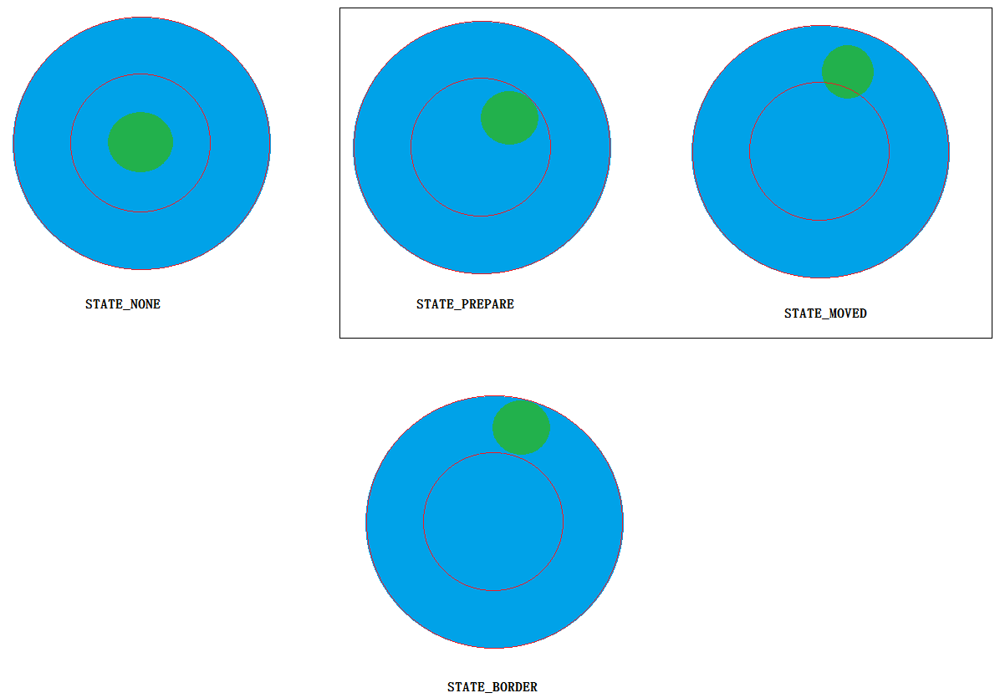

[<< 返回到主页](index.md)

**这里将介绍遥感设计的博客文章**  

遥感代码实现，对需求做一个分析：  
1. 遥感UI的状态  
2. 角色方向的同步  

**遥感UI**  
  
上面有一个最短距离和最大距离来触发状态   
事件输入:TouchPress，TouchRelease和TouchMove  

UI状态可以简单分为：STATE_NONE，STATE_PREPARE，STATE_MOVED, STATE_BORDER   
STATE_NONE: 没有触碰到遥感UI时的状态   
STATE_PREPARE: 当TouchPress发生，且移动距离小于最小值时  
STATE_MOVED: 当STATE_PREPARE状态，移动距离大于最小值且小于最大值  
STATE_BORDER: 当STATE_MOVED或者STATE_PREPARE，移动距离大于最大值  

状态转移过程：
STATE_NONE -> STATE_PREPARE: TouchPress事件触发  
STATE_PREPARE -> STATE_MOVED: 移动距离大于最小值小于最大值      
STATE_PREPARE -> STATE_BORDER: 移动距离大于最大值     
STATE_MOVED -> STATE_BORDER: 移动距离大于最大值   
STATE_MOVED，STATE_BORDER -> STATE_NONE: TouchRelease时响应  

STATE_BORDER -> STATE_MOVED: 移动距离小于最大距离时转换   

注意：STATE_MOVED和STATE_BORDER状态时，角色需要朝着遥感的方向移动  
STATE_PREPARE只有STATE_NONE转化  

**角色方向同步**   
只有STATE_MOVED，STATE_BORDER两个状态需要同步角色的方向  
1. 调整UI的位置  
2. 计算遥感屏幕的方向且单位化，然后对应到相机空间的方位。如果旋转轴为Y轴，则屏幕方向(x, y)对应到相机空间的方位即(x, 0, -y)。注意：屏幕坐标系的y轴是向下为正  
3. 将(x, 0, -y)根据ViewMatrix变换到到世界坐标系，得到新的(wx, 0, wy)  
4. 计算角色的forward与(wx, 0, wy)计算旋转矩阵q，然后累积到变换矩阵M中  
5. 则角色的朝向就会与遥感屏幕的朝向一致   

