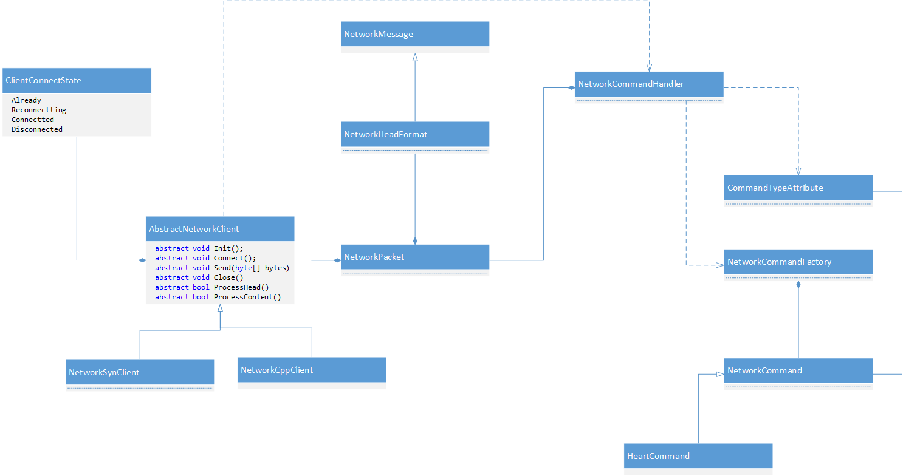

[<< 返回到主页](index.md)

**这里将介绍客户端网络的文章**  

客户端tcp网络主要包含：socket连接，断线重连，心跳包和协议处理   

1. socket连接，断线重连，心跳包放在一起处理  
2. 协议处理   

   
在网络进行通信时，最关注的是发出去的包怎么处理？那就会有一个协议号的概念，每个协议号都会对应一个函数来处理。   
这里使用NetworkCommandFactory，做一个HashMap来保存协议号对应的NetWorkCommand。这个初始化，通过c#通过class的属性CommandTypeAttribute来自动完成。   
当网络AbstractNetworkClient收到消息后，将NetworkPacket放进NetworkCommandHandler队列。这里NetworkCommandHandler是一个单例，作为消费者，通过信号的方式来激活并处理NetworkPacket数据。处理时，会根据NetworkPacket的协议号，找到NetworkCommandFactory里对应的NetworkCommand类，接下来就是处理。   
对于Socket连接，这里封装在AbstractNetworkClient，包含协议头的解析和包体的读取，socket连接和socket断线重连，以及作为生产者将收到的包保存到NetworkCommandHandler做处理。当连接成功后，则设置心跳包的定时处理器，避免连接主动断开。另外，心跳包在执行过程中，当检测到连接断开，会自动重连。至于重连的处理，可以自定义，这里只给出一个断线事件。   

对于AbstractNetworkClient，有两个子类继承，一个是使用c#原生类实现，一个是封装libc.so库实现,其逻辑都是一样的.   

AbstractNetworkClient.cs:  
```
using System;
using System.Net;
using System.Collections.Generic;

using System.Threading;
using KayUtils;

using UnityEngine;
using NetCommand;

namespace NetworkWrapper
{
    public enum ClientConnectState
    {
        Already,
        Connectted,
        Reconnectting,
        Disconnected
    }

    public abstract class AbstractNetworkClient
    {
        static object mSendLock = new object();
        static int mReconnectInterval = 5000;
        static int mHeartbeatInterval = 5000;
        static byte[] mHeartBytes = null;
        static EventWaitHandle mSendWait = new AutoResetEvent(false);
        static EventWaitHandle mReceiveWait = new AutoResetEvent(false);

        Queue<byte[]> mNeedSendMessages = new Queue<byte[]>();

        uint mReconnectTimerId = uint.MaxValue;
        uint mHeartTimerId = uint.MaxValue;

        protected ClientConnectState mConnectState;
        protected string mIP = null;
        protected int mPort;
        protected NetworkHeadFormat mHead;
        protected byte[] mContents;
       
        private Thread mReceiveThread;
        private Thread mSendThread;
        private bool isStop;
        public int mSessionId = -1;
        public AbstractNetworkClient(string ip, int port)
        {
            try
            {
                InitMember(ip, port);
                Init();
            }
            catch (Exception e)
            {
                Debug.Log("error: " + e.Message);
            }
        }

        public void Run()
        {
            if (IsConnectState(ClientConnectState.Already))
            {
                Connect();
                InitThread();
            }
        }
        
        public void Enqueue(byte[] msg)
        {
            if (IsConnectState(ClientConnectState.Connectted))
            {
                lock (mSendLock)
                {
                    mNeedSendMessages.Enqueue(msg);
                }
            }
        }
        public virtual void Stop()
        {
            isStop = true;
            mSendWait.Set();
            mReceiveWait.Set();
            Close();
            mSendWait.Close();
            mReceiveWait.Close();
        }
        protected abstract void Init();
        protected abstract void Connect();
        protected abstract void Send(byte[] bytes);
        protected abstract void Close();
        protected abstract bool ProcessHead();
        protected abstract bool ProcessContent();

        public ClientConnectState ConnectState
        {
            get
            {
                return mConnectState;
            }

        }

        private void Reconnect()
        {
            Connect();
            if (IsConnectState(ClientConnectState.Connectted))
            {
                // to do
            }
        }
        private void Receive()
        {
            if (ProcessHead() && ProcessContent())
            {
                ProcessPacket();
            }
        }
        private void ProcessPacket()
        {
            NetworkPacket packet = new NetworkPacket(mHead.Clone(), mContents, this);
            NetworkCommandHandler.Instance.AddPacket(packet);
        }
        protected void SetConnectState(ClientConnectState state)
        {
            mConnectState = state;
            if (IsConnectState(ClientConnectState.Disconnected))
            {
                if (mReconnectTimerId == uint.MaxValue)
                {
                    mReconnectTimerId = TimerTaskQueue.AddTimer(1000, mReconnectInterval, StartConnect);
                }
                if (mHeartTimerId != uint.MaxValue)
                {
                    TimerTaskQueue.DelTimer(mHeartTimerId);
                    mHeartTimerId = uint.MaxValue;
                }
            }
            else if (IsConnectState(ClientConnectState.Connectted))
            {
                if (mReconnectTimerId != uint.MaxValue)
                {
                    TimerTaskQueue.DelTimer(mReconnectTimerId);
                    mReconnectTimerId = uint.MaxValue;
                }
                if (mHeartTimerId == uint.MaxValue)
                {
                    mHeartTimerId = TimerTaskQueue.AddTimer(1000, mHeartbeatInterval, HeartBeat);
                }
                mSendWait.Set();
                mReceiveWait.Set();
            }
        }
        private bool IsConnectState(ClientConnectState state)
        {
            return mConnectState == state;
        }
        private void GetIP(string ip)
        {
            IPHostEntry entry = Dns.GetHostEntry(ip);
            foreach (var item in entry.AddressList)
            {
                string[] valus = item.ToString().Split('.');
                bool flag = true;
                int it;
                foreach (string v in valus)
                {
                    if (!int.TryParse(v, out it))
                    {
                        flag = false;
                        break;
                    }
                }
                if (flag)
                {
                    mIP = item.ToString();
                    break;
                }
            }
            if (mIP == null)
            {
                throw new Exception("IP BUG");
            }
        }
        private void InitThread()
        {
            mReceiveThread = new Thread(ReceiveMessage);
            mReceiveThread.IsBackground = true;
            mReceiveThread.Start();
            mSendThread = new Thread(SendMessage);
            mSendThread.IsBackground = true;
            mSendThread.Start();
        }
        private void StartConnect()
        {
            if (IsConnectState(ClientConnectState.Disconnected))
            {
                Close();
                mNeedSendMessages.Clear();
                mConnectState = ClientConnectState.Reconnectting;
                Reconnect();
            }
        }
        private void SendMessage()
        {
            while (!isStop)
            {
                try
                {
                    if (IsConnectState(ClientConnectState.Connectted))
                    {
                        while (mNeedSendMessages.Count > 0)
                        {
                            byte[] msg = null;
                            lock (mSendLock)
                            {
                                msg = mNeedSendMessages.Dequeue();
                            }
                            if (msg != null)
                            {
                                Send(msg);
                            }
                        }
                    }
                    else
                    {
                        mSendWait.WaitOne();
                    }
                }
                catch (Exception e)
                {
                    if (isStop)
                    {
                        break;
                    }
                    SetConnectState(ClientConnectState.Disconnected);
                    Debug.Log(e.Message);
                }
                Thread.Sleep(0);
            }
        }
        private void ReceiveMessage()
        {
            while (!isStop)
            {
                try
                {
                    if (IsConnectState(ClientConnectState.Connectted))
                    {
                        Receive();
                    }
                    else
                    {
                        mReceiveWait.WaitOne();
                    }
                }
                catch (Exception e)
                {
                    if (isStop)
                    {
                        break;
                    }
                    SetConnectState(ClientConnectState.Disconnected);
                    Debug.Log(e.Message);
                }
                Thread.Sleep(0);
            }
        }
        private void InitMember(string ip, int port)
        {
            isStop = false;
            mIP = ip;
            GetIP(ip);
            mHead = new NetworkHeadFormat();
            mContents = null;
            mPort = port;
            mConnectState = ClientConnectState.Already;
            NetworkHeadFormat temp = new NetworkHeadFormat();
            temp.mType = CommandType.HeartCodec;
            mHeartBytes = temp.Merge(null);
        }
        private void HeartBeat()
        {
            Enqueue(mHeartBytes);
        }
    }

}

```

NetworkCommand.cs:   
```
using System;
using System.Collections.Generic;
using System.Reflection;
using System.Diagnostics;
using System.Threading;
using NetCommand;
namespace NetworkWrapper
{
    public abstract class NetworkCommand
    {
        public abstract void HandlePacket(NetworkPacket packet);

    }

    [AttributeUsage(AttributeTargets.Class)]
    public class CommandTypeAttribute : Attribute
    {
        int mId;
        string mDescription;
        public CommandTypeAttribute(int id, string desc)
        {
            mId = id;
            mDescription = desc;
        }
        public CommandTypeAttribute()
        {

        }
        public int ID
        {
            get
            {
                return mId;
            }
            set
            {
                mId = value;
            }
        }

        public string Description
        {
            get
            {
                return mDescription;
            }
            set
            {
                mDescription = value;
            }
        }

    }

    public class NetworkCommandFactory
    {
        static Dictionary<int, Type> mAllCommandClasses = new Dictionary<int, Type>();
        static bool isRegistered = false;

        public static void RegisterCommand()
        {
            if (!isRegistered)
            {
                mAllCommandClasses.Add(CommandType.HeartCodec, typeof(HeartCommand));
                isRegistered = true;
            }
        }
        public static void RegisterCommand(string spacename, Assembly ass)
        {
            if (!isRegistered)
            {
                var types = ass.GetTypes();
                foreach (var item in types)
                {
                    if (item.Namespace == spacename)
                    {
                        var type = item.BaseType;
                        while (type != null)
                        {
                            if (type == typeof(NetworkCommand))
                            {
                                CommandTypeAttribute attr = CommandTypeAttribute.GetCustomAttribute(item, typeof(CommandTypeAttribute), false) as CommandTypeAttribute;
                                if (!mAllCommandClasses.ContainsKey(attr.ID))
                                {
                                    mAllCommandClasses.Add(attr.ID, item);
                                }
                                break;
                            }
                            else
                            {
                                type = type.BaseType;
                            }
                        }
                    }
                }
                isRegistered = true;
            }
        }

        public static NetworkCommand GetCommand(int mid)
        {
            if (mAllCommandClasses.ContainsKey(mid))
            {
                return (NetworkCommand)Activator.CreateInstance(mAllCommandClasses[mid]);
            }
            return null;
        }
    }

    /// <summary>
    /// should initialize firstly
    /// </summary>
    public class NetworkCommandHandler
    {
        public static NetworkCommandHandler Instance = new NetworkCommandHandler();
        static object mLock = new object();
        Queue<NetworkPacket> mCommandPacket;
        static EventWaitHandle mWaitHandle;
        public Thread mHandleThread = null;
        static bool isClose;
        static bool isInitialized = false;

        private NetworkCommandHandler()
        {

        }
        public void Initialize()
        {
            if (!isInitialized)
            {
                NetworkCommandFactory.RegisterCommand();
                isInitialized = true;
                mWaitHandle = new AutoResetEvent(false);
                mCommandPacket = new Queue<NetworkPacket>();
                isClose = false;
                mHandleThread = new Thread(HandlePacket) { IsBackground = true };
                mHandleThread.Start();
            }
        }
        public void Initialize(string spacename, Assembly ass)
        {
            if (!isInitialized)
            {
                NetworkCommandFactory.RegisterCommand(spacename, ass);
                isInitialized = true;
                mWaitHandle = new AutoResetEvent(false);
                mCommandPacket = new Queue<NetworkPacket>();
                isClose = false;
                mHandleThread = new Thread(HandlePacket) { IsBackground = true };
                mHandleThread.Start();
            }
        }

        public void Close()
        {
            mWaitHandle.Set();
            isClose = true;
            mHandleThread.Join();
            mWaitHandle.Close();
            mCommandPacket.Clear();
        }

        public void HandlePacket()
        {
            while (!isClose)
            {
                NetworkPacket packet = null;
                lock (mLock)
                {
                    if (mCommandPacket.Count > 0)
                    {
                        packet = mCommandPacket.Dequeue();
                    }
                }
                if (packet != null)
                {
                    Handle(packet);
                }
                else
                {
                    mWaitHandle.WaitOne();
                }
            }

        }

        private void Handle(NetworkPacket packet)
        {
            NetworkCommand command = NetworkCommandFactory.GetCommand(packet.mHead.mType);
            if (command != null)
            {
                command.HandlePacket(packet);
            }
        }

        public void AddPacket(NetworkPacket packet)
        {
            lock (mLock)
            {
                mCommandPacket.Enqueue(packet);
            }
            mWaitHandle.Set();
        }
    }


}

```

NetworkCppClient.cs:   
```
using System;
using System.Net.Sockets;
using System.Runtime.InteropServices;
using UnityEngine;

namespace NetworkWrapper
{
    #region c# call c
    [StructLayout(LayoutKind.Sequential)]
    public struct in_addr
    {
        public UInt32 s_addr;
    };

    [StructLayoutAttribute(LayoutKind.Sequential)]
    public struct sockaddr_in
    {
        /// short
        public Int16 sin_family;
        /// short
        public UInt16 sin_port;
        /// in_addr
        public in_addr sin_addr;
        /// char[8]
        [MarshalAsAttribute(UnmanagedType.ByValTStr, SizeConst = 8)]
        public string sin_zero;
    }

    [StructLayoutAttribute(LayoutKind.Sequential)]
    public struct sockaddr
    {
        /// u_short->unsigned short
        public ushort sa_family;
        /// char[14]
        [MarshalAsAttribute(UnmanagedType.ByValTStr, SizeConst = 14)]
        public string sa_data;
    }
    #endregion c# call c

    public class NetworkCppClient : AbstractNetworkClient
    {
        #region dll import
        const string LibraryName = "libc";
        [DllImport(LibraryName)]
        public static extern int socket(int domain, int type, int protocol);

        [DllImport(LibraryName)]
        public static extern int connect(int fd, IntPtr addr, int len);

        [DllImport(LibraryName)]
        public static extern int read(int fd, System.IntPtr buf, [MarshalAsAttribute(UnmanagedType.SysUInt)] uint nbytes);

        [DllImport(LibraryName)]
        public static extern int recv(int fd, System.IntPtr buf, [MarshalAsAttribute(UnmanagedType.SysUInt)] uint n, int flags);

        [DllImport(LibraryName)]
        public static extern int send(int fd, System.IntPtr buf, [MarshalAsAttribute(UnmanagedType.SysUInt)] uint n, int flags);

        [DllImport(LibraryName)]
        public static extern int write(int fd, System.IntPtr buf, [MarshalAsAttribute(UnmanagedType.SysUInt)] uint n);

        [DllImport(LibraryName)]
        public static extern int setsockopt(int fd, int level, int optname, System.IntPtr optval, int optlen);

        [DllImport(LibraryName)] // windows closesocket()
        public static extern int close(int fd);

        [DllImport(LibraryName)]
        public static extern uint inet_addr(string cp);
        #endregion dll import

        int mSocket;
        uint mBufferHeadSize;
        IntPtr mBufferHead;

        public NetworkCppClient(string ip, int port) : base(ip, port)
        {

        }

        protected override void Connect()
        {
            try
            {
                {
                    int AF_INET = 2;
                    int SOCK_STREAM = 1;
                    mSocket = socket(AF_INET, SOCK_STREAM, 0);
                }
                if (mSocket != -1)
                {
                    int conn = -1;
                    sockaddr_in addr;
                    {
                        int SOL_SOCKET = 1;
                        int SO_KEEPALIVE = 9;
                        int SO_REUSEADDR = 2;
                        int IPPROTO_TCP = 6;
                        int TCP_NODELAY = 1;
                        int size = 4;
                        IntPtr value = Marshal.AllocHGlobal(size);
                        Marshal.StructureToPtr(1, value, true);
                        int opt = setsockopt(mSocket, SOL_SOCKET, SO_KEEPALIVE, value, size);
                        opt = setsockopt(mSocket, SOL_SOCKET, SO_REUSEADDR, value, size);
                        opt = setsockopt(mSocket, IPPROTO_TCP, TCP_NODELAY, value, size);
                        Marshal.FreeHGlobal(value);
                    }
                    {
                        addr = new sockaddr_in();
                        addr.sin_family = (short)AddressFamily.InterNetwork;
                        addr.sin_addr = new in_addr();
                        addr.sin_addr.s_addr = inet_addr(mIP);
                        addr.sin_port = (ushort)System.Net.IPAddress.HostToNetworkOrder((short)mPort);
                    }
                    {
                        int len = Marshal.SizeOf(addr);
                        IntPtr addPtr = Marshal.AllocHGlobal(len);
                        Marshal.StructureToPtr(addr, addPtr, true);
                        conn = connect(mSocket, addPtr, len);
                        Marshal.FreeHGlobal(addPtr);
                    }
                    if (conn != -1)
                    {
                        SetConnectState(ClientConnectState.Connectted);
                    }
                    else
                    {
                        SetConnectState(ClientConnectState.Disconnected);
                    }
                }
            }
            catch (Exception e)
            {
                SetConnectState(ClientConnectState.Disconnected);
            }
        }
        protected override void Send(byte[] msg)
        {
            if (msg != null && msg.Length > 0)
            {
                IntPtr ptr = Marshal.AllocHGlobal(msg.Length);
                Marshal.Copy(msg, 0, ptr, msg.Length);
                if (send(mSocket, ptr, (uint)msg.Length, 0) == -1)
                {
                    SetConnectState(ClientConnectState.Disconnected);
                }
                Marshal.FreeHGlobal(ptr);
            }
        }
        protected override void Close()
        {
            if (mSocket != -1)
            {
                close(mSocket);
                mSocket = -1;
            }
        }
        public override void Stop()
        {
            base.Stop();
            if (mBufferHead != IntPtr.Zero)
            {
                Marshal.FreeHGlobal(mBufferHead);
                mBufferHead = IntPtr.Zero;
            }
        }
        protected override bool ProcessHead()
        {
            bool flag = Receive(ref mBufferHead, (int)mBufferHeadSize);
            if (flag)
            {
                byte[] bytes = new byte[mBufferHeadSize];
                Marshal.Copy(mBufferHead, bytes, 0, (int)mBufferHeadSize);
                mHead.InitializeBy(bytes);
            }
            return flag;
        }
        protected override bool ProcessContent()
        {
            bool flag = true;
            mContents = null; // reset
            if (mHead.mLength > 0)
            {
                IntPtr buffContent = Marshal.AllocHGlobal(mHead.mLength);
                flag = Receive(ref buffContent, mHead.mLength);
                if (flag)
                {
                    mContents = new byte[mHead.mLength];
                    Marshal.Copy(buffContent, mContents, 0, mHead.mLength);
                }
                Marshal.FreeHGlobal(buffContent);
            }
            return flag;
        }
        private bool Receive(ref IntPtr ptr, int total)
        {
            int len = 0;
            do
            {
                int size = recv(mSocket, ptr, (uint)(total - len), 0);
                if (size == -1 || size == 0)
                {
                    Debug.Log("receive 0 -1");
                    SetConnectState(ClientConnectState.Disconnected);
                    return false;
                }
                else
                {
                    len += size;
                }
            } while (len < total);
            return true;
        }
        protected override void Init()
        {
            mSocket = -1;
            mHead = new NetworkHeadFormat();
            mBufferHeadSize = (uint)NetworkHeadFormat.Size();
            mBufferHead = Marshal.AllocHGlobal((int)mBufferHeadSize);
        }
    }
}

```

NetworkHeadFormat.cs:   
```
using System;

namespace NetworkWrapper
{
    public class NetworkHeadFormat : NetworkMessage
    {
        // 消息类型，如果不是合法的消息，服务器直接关闭TCP接口
        public int mType = 0;
        // 报文长度，不包含消息头，目前最大允许1K
        // 单包大于1k的上行请求消息，将会被丢弃并且会关闭SOCKET
        public int mLength = 0;
        // 返回码
        public int mResult = 0;
        // 会话id，供服务之间使用，客户端无需关心
        public int mSession = 0;
        // 源地址，接入服务会将此项值与SOCKET绑定，是应答或者通知消息下发路由的一句
        // 具体的游戏需要使用相同的填充规则，比如同一田聪USERID
        public Int64 mFrom = 0;

        // 目的地址，功能与from字段类似
        public Int64 mTo = 0;

        // 业务掩码，服务器根据此字段对消息做路由转发
        // 比如：如果填充房间id，那么消息会转发到相同的服务节点
        // 如果填0，则做负载均衡分发
        public Int64 mMask = 0;
        // 附加的字段，服务端会鸳鸯返回
        // 客户端可填充序列号，用于确认一条特定的消息的应答
        public Int64 mAddition = 0;


        public bool mIsInitialized = false;

        public static int Size()
        {
            int size = 0;
            size += sizeof(int);
            size += sizeof(int);
            size += sizeof(int);
            size += sizeof(int);
            size += sizeof(Int64);
            size += sizeof(Int64);
            size += sizeof(Int64);
            size += sizeof(Int64);
            return size;
        }

        public NetworkHeadFormat Clone()
        {
            NetworkHeadFormat head = new NetworkHeadFormat();
            head.mType = mType;
            head.mLength = mLength;
            head.mResult = mResult;
            head.mFrom = mFrom;
            head.mTo = mTo;
            head.mSession = mSession;
            head.mAddition = mAddition;
            head.mMask = mMask;
            mIsInitialized = true;
            mSendBytes.Clear();
            return head;
        }

        public void CopyFrom(NetworkHeadFormat other)
        {
            mSendBytes.Clear();
            this.mType = other.mType;
            this.mLength = other.mLength;
            this.mResult = other.mResult;
            this.mFrom = other.mFrom;
            this.mTo = other.mTo;
            this.mSession = other.mSession;
            this.mAddition = other.mAddition;
            this.mMask = other.mMask;
            mIsInitialized = true;
        }

        public virtual byte[] ToBytes()
        {
            mSendBytes.Clear();
            WritePacket();
            return mSendBytes.ToArray();
        }

        public byte[] Merge(byte[] other)
        {
            if (other != null && other.Length != 0)
            {
                mLength = other.Length;
                byte[] me = ToBytes();
                byte[] bytes = new byte[me.Length + other.Length];
                Array.Copy(me, 0, bytes, 0, me.Length);
                Array.Copy(other, 0, bytes, me.Length, other.Length);
                return bytes;
            }
            else
            {
                mLength = 0;
                return ToBytes();
            }
        }

        public override void ReadPacket()
        {
            mType = ReadInt32();
            mLength = ReadInt32();
            mResult = ReadInt32();
            mSession = ReadInt32();

            mFrom = ReadInt64();
            mTo = ReadInt64();
            mMask = ReadInt64();
            mAddition = ReadInt64();

            mType = System.Net.IPAddress.NetworkToHostOrder(mType);
            mLength = System.Net.IPAddress.NetworkToHostOrder(mLength);
            mResult = System.Net.IPAddress.NetworkToHostOrder(mResult);
            mFrom = System.Net.IPAddress.NetworkToHostOrder(mFrom);
            mTo = System.Net.IPAddress.NetworkToHostOrder(mTo);
            mSession = System.Net.IPAddress.NetworkToHostOrder(mSession);
            mAddition = System.Net.IPAddress.NetworkToHostOrder(mAddition);
            mMask = System.Net.IPAddress.NetworkToHostOrder(mMask);
            mIsInitialized = true;
        }

        public override void WritePacket()
        {
            WriteInt32(System.Net.IPAddress.HostToNetworkOrder(mType));
            WriteInt32(System.Net.IPAddress.HostToNetworkOrder(mLength));
            WriteInt32(System.Net.IPAddress.HostToNetworkOrder(mResult));
            WriteInt32(System.Net.IPAddress.HostToNetworkOrder(mSession));

            WriteInt64(System.Net.IPAddress.HostToNetworkOrder(mFrom));
            WriteInt64(System.Net.IPAddress.HostToNetworkOrder(mTo));
            WriteInt64(System.Net.IPAddress.HostToNetworkOrder(mMask));
            WriteInt64(System.Net.IPAddress.HostToNetworkOrder(mAddition));
        }

        public override void Initialize()
        {
            mIsInitialized = false;
        }

    }
}
```

NetworkMessage.cs:   
```
using System;
using System.Collections.Generic;
using System.Text;

namespace NetworkWrapper
{
    public abstract class NetworkMessage
    {
        protected byte[] mCacheBytes = null;
        int mReadIndex = 0;
        protected List<Byte> mSendBytes = new List<byte>();

        public NetworkMessage()
        {
            Initialize();
        }

        public abstract void ReadPacket();
        public abstract void WritePacket();
        public abstract void Initialize();

        public virtual void InitializeBy(byte[] bytes)
        {
            mReadIndex = 0;
            mSendBytes.Clear();
            mCacheBytes = bytes;
            ReadPacket();
        }

        public void WriteLength()
        {
            byte[] size = System.BitConverter.GetBytes(mSendBytes.Count);
            for (int i = size.Length - 1; i >= 0; --i)
            {
                mSendBytes.Insert(0, size[i]);
            }
        }

        public Int16 ReadInt16()
        {
            if (CanRead(sizeof(Int16)))
            {
                Int16 value = System.BitConverter.ToInt16(mCacheBytes, mReadIndex);
                mReadIndex += sizeof(Int16);
                return value;
            }
            return Int16.MaxValue;
        }

        public UInt16 ReadUInt16()
        {
            if (CanRead(sizeof(Int16)))
            {
                UInt16 value = System.BitConverter.ToUInt16(mCacheBytes, mReadIndex);
                mReadIndex += sizeof(Int16);
                return value;
            }
            return UInt16.MaxValue;
        }

        public void WriteUInt16(UInt16 value)
        {
            byte[] bytes = System.BitConverter.GetBytes(value);
            foreach (byte b in bytes)
            {
                mSendBytes.Add(b);
            }
        }

        public void WriteInt16(Int16 value)
        {
            byte[] bytes = System.BitConverter.GetBytes(value);
            foreach (byte b in bytes)
            {
                mSendBytes.Add(b);
            }
        }

        public Int32 ReadInt32()
        {
            if (CanRead(sizeof(Int32)))
            {
                int value = System.BitConverter.ToInt32(mCacheBytes, mReadIndex);
                mReadIndex += sizeof(Int32);
                return value;
            }
            return Int32.MaxValue;
        }

        public void WriteInt32(int value)
        {
            byte[] bytes = System.BitConverter.GetBytes(value);
            foreach (byte b in bytes)
            {
                mSendBytes.Add(b);
            }
        }

        public Int64 ReadInt64()
        {
            if (CanRead(sizeof(Int64)))
            {
                Int64 value = System.BitConverter.ToInt64(mCacheBytes, mReadIndex);
                mReadIndex += sizeof(Int64);
                return value;
            }
            return Int64.MaxValue;
        }

        public void WriteInt64(Int64 value)
        {
            byte[] bytes = System.BitConverter.GetBytes(value);
            foreach (byte b in bytes)
            {
                mSendBytes.Add(b);
            }
        }

        public void WriteBoolean(bool value)
        {
            byte b = (byte)(value ? 1 : 0);
            mSendBytes.Add(b);
        }

        public Boolean ReadBoolean()
        {
            if (CanRead(sizeof(Boolean)))
            {
                Boolean value = System.BitConverter.ToBoolean(mCacheBytes, mReadIndex);
                mReadIndex += sizeof(Boolean);
                return value;
            }
            return false;
        }

        public float ReadFloat()
        {
            if (CanRead(sizeof(float)))
            {
                float value = System.BitConverter.ToSingle(mCacheBytes, mReadIndex);
                mReadIndex += sizeof(float);
                return value;
            }
            return float.MaxValue;
        }

        public void WriteFloat(float value)
        {
            byte[] bytes = System.BitConverter.GetBytes(value);
            foreach (byte b in bytes)
            {
                mSendBytes.Add(b);
            }
        }

        public double ReadDouble()
        {
            if (CanRead(sizeof(double)))
            {
                double value = System.BitConverter.ToDouble(mCacheBytes, mReadIndex);
                mReadIndex += sizeof(double);
                return value;
            }
            return double.MaxValue;
        }

        public void WriteDouble(double value)
        {
            byte[] bytes = System.BitConverter.GetBytes(value);
            foreach (byte b in bytes)
            {
                mSendBytes.Add(b);
            }
        }

        public string ReadWString()
        {
            int len = ReadInt32();
            if (len != Int32.MaxValue)
            {
                byte[] bytes = ReadBytes(len);
                if (bytes != null)
                {
                    return Encoding.Unicode.GetString(bytes);
                }
            }
            return null;
        }

        public string ReadString()
        {
            int len = ReadInt32();
            if (len != Int32.MaxValue)
            {
                byte[] bytes = ReadBytes(len);
                if (bytes != null)
                {
                    return Encoding.UTF8.GetString(bytes);
                }
            }
            return null;
        }

        public byte[] ReadBytes(int len)
        {
            if (CanRead(len))
            {
                byte[] bytes = new byte[len];
                Array.Copy(mCacheBytes, mReadIndex, bytes, 0, len);
                mReadIndex += len;
                return bytes;
            }
            return null;
        }

        public void WriteBytes(byte[] bytes)
        {
            foreach (byte b in bytes)
            {
                mSendBytes.Add(b);
            }
        }

        public void WriteString(string value)
        {
            byte[] bytes = Encoding.UTF8.GetBytes(value);
            WriteInt32(bytes.Length);
            foreach (byte b in bytes)
            {
                mSendBytes.Add(b);
            }
        }

        public void WriteWString(string value)
        {
            byte[] bytes = Encoding.Unicode.GetBytes(value);
            WriteInt32(bytes.Length);
            foreach (byte b in bytes)
            {
                mSendBytes.Add(b);
            }
        }

        public bool CanRead(int len)
        {
            if (mReadIndex + len <= mCacheBytes.Length)
            {
                return true;
            }
            return false;
        }

    }
}
```

NetworkPacket.cs:   
```
namespace NetworkWrapper
{
    public class NetworkPacket
    {
        public NetworkHeadFormat mHead;
        public byte[] mContent;
        public AbstractNetworkClient mClient;
        public NetworkPacket()
        {

        }
        public NetworkPacket(NetworkHeadFormat head, byte[] content, AbstractNetworkClient client)
        {
            mHead = head;
            mContent = content;
            mClient = client;
        }

        public byte[] GetBytes()
        {
            return mHead.Merge(mContent);
        }
    }

}
```

NetworkSynClient.cs:   
```
using System;
using System.Net;
using System.Net.Sockets;
using UnityEngine;

namespace NetworkWrapper
{
    public class NetworkSynClient : AbstractNetworkClient
    {
        private byte[] mBufferHead = new byte[NetworkHeadFormat.Size()];
        private IPAddress mAddress;
        private Socket mClientSocket;
        public NetworkSynClient(string ip, int port) : base(ip, port)
        {

        }
        protected override void Close()
        {
            if (mClientSocket != null && mClientSocket.Connected)
            {
                mClientSocket.Shutdown(SocketShutdown.Both);
                mClientSocket.Close();
                mClientSocket = null;
            }
        }
        protected override void Connect()
        {
            try
            {
                mClientSocket = new Socket(AddressFamily.InterNetwork, SocketType.Stream, ProtocolType.Tcp);
                mClientSocket.SetSocketOption(SocketOptionLevel.Socket, SocketOptionName.KeepAlive, true);
                mClientSocket.SetSocketOption(SocketOptionLevel.Socket, SocketOptionName.ReuseAddress, true);
                mClientSocket.NoDelay = true;
                IAsyncResult result = mClientSocket.BeginConnect(mAddress, mPort,
                    (IAsyncResult res) =>
                    {
                        mClientSocket.EndConnect(res);
                    }, mClientSocket);
                bool connect = result.AsyncWaitHandle.WaitOne(3000, true);
                if (connect)
                {
                    SetConnectState(ClientConnectState.Connectted);
                    Debug.Log("connect: " + mIP);
                }
                else
                {
                    SetConnectState(ClientConnectState.Disconnected);
                }
            }
            catch (Exception e)
            {
                SetConnectState(ClientConnectState.Disconnected);
                Debug.Log("test Connect Exception: " + e.Message);
            }

        }
        protected override bool ProcessHead()
        {
            bool flag = Receive(ref mBufferHead, mBufferHead.Length);
            if (flag)
            {
                mHead.InitializeBy(mBufferHead);
            }
            return flag;
        }
        protected override bool ProcessContent()
        {
            bool flag = true;
            mContents = null; // reset
            if (mHead.mLength > 0)
            {
                mContents = new byte[mHead.mLength];
                flag = Receive(ref mContents, mHead.mLength);
            }
            return flag;
        }
        protected override void Send(byte[] bytes)
        {
            if (bytes != null && bytes.Length > 0)
            {
                int len = mClientSocket.Send(bytes, 0, bytes.Length, SocketFlags.None);
                if (len <= 0)
                {
                    SetConnectState(ClientConnectState.Disconnected);
                }
            }
        }
        private void SendAsyn(byte[] bytes)
        {
            IAsyncResult result = mClientSocket.BeginSend(bytes, 0, bytes.Length, SocketFlags.None,
            (IAsyncResult iar) =>
            {
                Socket callback = iar.AsyncState as Socket;
                if (callback != null)
                {
                    callback.EndSend(iar);
                }
            }, mClientSocket);
        }
        private bool Receive(ref byte[] ptr, int total)
        {
            int len = 0;
            do
            {
                int size = mClientSocket.Receive(ptr, len, total - len, SocketFlags.None);
                if (size == -1 || size == 0)
                {
                    SetConnectState(ClientConnectState.Disconnected);
                    return false;
                }
                else
                {
                    len += size;
                }
            } while (len < total);
            return true;
        }
        protected override void Init()
        {
            mAddress = IPAddress.Parse(mIP);
        }
    }
}

```

HeartCommand.cs:   
```
namespace NetCommand
{
    public static class CommandType
    {
        public const int HeartCodec = 1;
    }

    [CommandTypeAttribute(CommandType.HeartCodec, "心跳")]
    public class HeartCommand : NetworkCommand
    {
        public override void HandlePacket(NetworkPacket packet)
        {
            Debug.Log("received: " + packet.mHead.mType);
        }
    }
}
```
