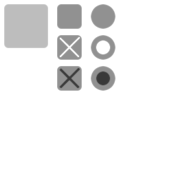

[<< 返回到主页](index.md)

**这里将介绍UI框架的博客文章**  

这里简单介绍UI设计代码以及简单控件   
   

UI设计主要分了几个大模块：   
1. Theme主题  
2. Control控件  
3. Layout布局  

对于UI交互，控件需要做两个事情：显示和交互。  
显示：控件与控件之间可能存在某种布局，则对空间做一个布局管理，Layout处理这个事情；控件存在一些状态来表明是否可交互，这里罗列5个基本状态：正常时，不能交互时，鼠标悬停，焦点时，激活时。对于按钮，可能需要鼠标悬停时的变化效果，对于文字输入可能焦点时的效果，对于没有任何处理时正常显示的效果，对于不需要交互时的显示效果，对于控件被选中激活时的显示效果。这些状态用不同的效果来表现，Theme保存这些信息。   

**布局Layout**   
这里布局分了3中情况：绝对布局、水平布局和垂直布局。  
意思很明了，这个针对控件容器Container而言，所有的控件按照一定的格式显示出来。控件自身带有Margin和Padding参数属性，根据这些信息来计算空间之间的距离。  
Margin和Padding参数在Theme里的Style下设置   

**主题Theme**  
控件除了布局参数，还有控件交互时的状态切换信息。这些信息在Style里设置。Style就包含了normal，hover，active，focus和disable五种设置，每一种样式对应控件的一个状态。   
另外，style还包含了控件的皮肤Skin，ImageList和Cursor，可看成是控件显示时的颜色或者图片。还有Font配置，包含字体库和字体大小等设置。        

**控件Control**   

这里把Container进一步封装，Form继承Container。绘制Form时，需要绘制3个：DrawBorder，DrawImage和DrawText。绘制边框，绘制图片和绘制文字。所有的绘制数据都会保存在SpriteBatch里，最后提交绘制有SpriteBatch来执行。   
SpriteBatch的顶点格式如下：   
```
struct SpriteVertex
{
    float x;
    float y;
    float z;
    float u;
    float v;
    float r;
    float g;
    float b;
    float a;
};
```
每一个主题包含一张贴图Texture.这张贴图是一个纹理集，将所需要的图片打成一个纹理使用，后面对于绘制控件的图片，只需要uv值就可以映射到纹理了。绘制过程中，是需要做裁剪计算的。   

当然，控件可以在屏幕坐标系也可以在世界坐标系也可以在相机空间。这里计算时需要注意坐标的转换。   

UI还包含了动画效果，这里可以结合动画SimpleAnimation处理。目前来说，UI控件比较单一，还需要丰富。   

最后看一下默认的合图：   
   

主题配置文件结构：   
```
theme mainMenu
{
    texture = res/common/default-theme.png

    imageList normalImages
    {
        color = #4A8799ff

        image unchecked
        {
            region = 78, 1, 46, 46
        }

        image checked
        {
            region = 78, 46, 46, 46
        }

        image unselected
        {
            region = 127, 1, 46, 46
        }

        image selected
        {
            region = 127, 46, 46, 46
        }

        image minCap
        {
            region = 3, 115, 8, 11
        }

        image maxCap
        {
            region = 3, 115, 8, 11
        }

        image marker
        {
            region = 16, 113, 18, 18
        }

        image track
        {
            region = 42, 119, 26, 6
        }

        image textCaret
        {
            region = 5, 149, 11, 25
            color = #C3D9BFff
        }

        image scrollBarTopCap
        {
            region = 0, 99, 12, 5
        }

        image verticalScrollBar
        {
            region = 0, 104, 12, 19
        }

        image scrollBarBottomCap
        {
            region = 0, 138, 12, 5
        }

        image scrollBarLeftCap
        {
            region = 35, 115, 5, 12
        }

        image horizontalScrollBar
        {
            region = 43, 115, 19, 12
        }

        image scrollBarRightCap
        {
            region = 65, 115, 5, 12
        }
    }

    imageList activeImages : normalImages
    {
        color = #C3D9BFff

        image unchecked
        {
            region = 78, 91, 46, 46
        }

        image checked
        {
            region = 78, 91, 46, 46
        }

        image unselected
        {
            region = 127, 91, 46, 46
        }

        image selected
        {
            region = 127, 91, 46, 46
        }
    }

    skin mainNormal
    {
        border
        {
            left = 10
            right = 10
            top = 10
            bottom = 10
        }
        
        region = 1, 1, 74, 74
        color = #4A8799ff
    }

    skin mainActive : mainNormal
    {
        color = #C3D9BFff
    }

    skin mainFocus : mainNormal
    {
        color = #2A6779ff
    }

    skin formEntry : mainNormal
    {
        region = 78, 1, 46, 46
        color = #35535Cff
    }

    skin formFocus : formEntry
    {
        color = #15333Cff
    }
    
    skin underliner
    {
        border
        {
            bottom = 10
        }
        
        region = 4, 82, 68, 5
        color = #ffffffff
    }

    skin plusNormal
    {
        region = 81, 139, 40, 40
        color = #4A8799ff
    }

    skin plusActive : plusNormal
    {
        color = #C3D9BFff
    }

    skin minusNormal
    {
        region = 81, 184, 40, 40
        color = #4A8799ff
    }

    skin minusActive : minusNormal
    {
        color = #C3D9BFff
    }

    style plus
    {
        stateNormal
        {
            skin = plusNormal
        }

        stateActive
        {
            skin = plusActive
        }
    }

    style minus
    {
        stateNormal
        {
            skin = minusNormal
        }

        stateActive
        {
            skin = minusActive
        }
    }

    style underlined
    {
        padding
        {
            top = 5
        }
    
        stateNormal
        {
            skin = underliner
            textColor = #ffffffff
            font = res/ui/arial.gpb
            fontSize = 16
            textAlignment = ALIGN_BOTTOM_HCENTER
        }
    }

    style leftAlignedUnderlined : underlined
    {
        stateNormal
        {
            textAlignment = ALIGN_TOP_LEFT
        }
    }
    
    style basicContainer
    {
        stateNormal
        {
            skin = mainNormal
            imageList = normalImages

            font = res/ui/arial.gpb
            textColor = #ffffffff
            fontSize = 16
            textAlignment = ALIGN_VCENTER_HCENTER
        }

        stateFocus
        {
            skin = mainFocus
        }
        
        stateDisabled
        {
            opacity = 0.3
        }
    }

    style basic : basicContainer
    {
        stateActive
        {
            imageList = activeImages
        }
        
        stateFocus
        {
            skin = mainNormal
            textColor = #aaa000ff
        }
    }

    style topLeftAlignedEntry : basic
    {
        stateNormal
        {
            skin = formEntry
            textAlignment = ALIGN_TOP_LEFT
        }

        stateFocus
        {
            skin = formFocus
        }
    }

    style buttonStyle : basic
    {
        padding
        {
            top = -10
            bottom = -10
        }

        stateNormal
        {
            font = res/ui/arial.gpb
            fontSize = 20
        }

        stateActive
        {
            skin = mainActive
        }
    }
    
    style buttonHover : buttonStyle
    {
        stateHover
        {
            textColor = #ff0000ff
        }
    }

    style noBorder
    {
        stateNormal
        {
            imageList = normalImages
            font = res/ui/arial.gpb
            textColor = #ffffffff
            fontSize = 16
            textAlignment = ALIGN_VCENTER_HCENTER
        }
        
        stateFocus
        {
            textColor = #aaa000ff
        }

        stateActive
        {
            imageList = activeImages
            textAlignment = ALIGN_VCENTER_HCENTER
        }
    }

    style iconNoBorder : noBorder
    {
        stateNormal
        {
            font = res/ui/arial.gpb
            fontSize = 16
            textAlignment = ALIGN_VCENTER_LEFT
        }

        stateActive
        {
            font = res/ui/arial.gpb
            fontSize = 16
            textAlignment = ALIGN_VCENTER_LEFT
        }
    }

    style topLeftNoBorder : iconNoBorder
    {
        stateNormal
        {
            textAlignment = ALIGN_TOP_LEFT
        }

        stateActive
        {
            textAlignment = ALIGN_TOP_LEFT
        }
    }

    style title
    {
        stateNormal
        {
            textColor = #ffffffff
            font = res/ui/arial.gpb
            fontSize = 24
            textAlignment = ALIGN_BOTTOM_HCENTER
        }

        stateActive
        {
            textColor = #C3D9BFff
        }
    }

    style Form : basicContainer
    {
    }

    style Container
    {
    }

    style Label : iconNoBorder
    {
    }

    style Button : buttonStyle
    {
    }

    style CheckBox : iconNoBorder
    {
    }

    style RadioButton : iconNoBorder
    {
    }

    style TextBox : topLeftAlignedEntry
    {
    }

    style Slider : topLeftNoBorder
    {
    }

    style Image
    {
    }
}

```


