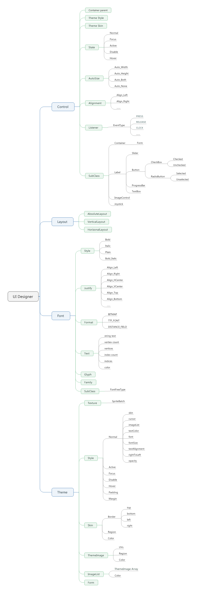

[<< 返回到主页](index.md)

**这里将介绍UI框架的博客文章**  

这里简单介绍UI设计代码以及简单控件   
   

UI设计主要分了几个大模块：   
1. Theme主题  
2. Control控件  
3. Layout布局  

对于UI交互，控件需要做两个事情：显示和交互。  
显示：控件与控件之间可能存在某种布局，则对空间做一个布局管理，Layout处理这个事情；控件存在一些状态来表明是否可交互，这里罗列5个基本状态：正常时，不能交互时，鼠标悬停，焦点时，激活时。对于按钮，可能需要鼠标悬停时的变化效果，对于文字输入可能焦点时的效果，对于没有任何处理时正常显示的效果，对于不需要交互时的显示效果，对于控件被选中激活时的显示效果。这些状态用不同的效果来表现，Theme保存这些信息。   

**布局Layout**   
这里布局分了3中情况：绝对布局、水平布局和垂直布局。  
意思很明了，这个针对控件容器Container而言，所有的控件按照一定的格式显示出来。控件自身带有Margin和Padding参数属性，根据这些信息来计算空间之间的距离。  
Margin和Padding参数在Theme里的Style下设置   

**主题Theme**  
控件除了布局参数，还有控件交互时的状态切换信息。这些信息在Style里设置。Style就包含了normal，hover，active，focus和disable五种设置，每一种样式对应控件的一个状态。   
另外，style还包含了控件的皮肤Skin，ImageList和Cursor，可看成是控件显示时的颜色或者图片。还有Font配置，包含字体库和字体大小等设置。        

**控件Control**   

这里把Container进一步封装，Form继承Container。绘制Form时，需要绘制3个：DrawBorder，DrawImage和DrawText。绘制边框，绘制图片和绘制文字。所有的绘制数据都会保存在SpriteBatch里，最后提交绘制有SpriteBatch来执行。   
SpriteBatch的顶点格式如下：   
```
struct SpriteVertex
{
    float x;
    float y;
    float z;
    float u;
    float v;
    float r;
    float g;
    float b;
    float a;
};
```
每一个主题包含一张贴图Texture.这张贴图是一个纹理集，将所需要的图片打成一个纹理使用，后面对于绘制控件的图片，只需要uv值就可以映射到纹理了。绘制过程中，是需要做裁剪计算的。   

当然，控件可以在屏幕坐标系也可以在世界坐标系也可以在相机空间。这里计算时需要注意坐标的转换。   


