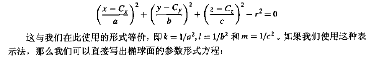

[<< 返回到上页](../index.md)

**这里将介绍圆和椭圆的博客文章**  

**圆**  
定义一个圆的数据主要包含圆心和半径：  
```
public class Circle
{
    public Vector2 mCenter;
    public float mRadius;
}
```

1. 点与圆的关系  
点在圆内判断：  
```
bool IsInCircle(Vector2 center, float r, Vector2 p)
{
    return (p - center).sqrMagnitude <= r * r;
}
```
相等的时候表示点在圆上  

2. 线与圆的关系    
直线与圆相交判断  
直线L：Vector2 p = start + t \* dir  
圆的公式为 (x - cx)^2 + (y - cy)^2 = r^2  
(x0 + t \* dx - cx)^2 + (y0 + t \* dy- cy)^2 = r^2   
得到  
(dx^2 + dy^2)t^2 + 2((x0-cx)dx + (y0-cy)dy)t + (x0-cx)^2 + (y0-cy)^2 - r^2 = 0  
求解一元二次方程t的值，有解表示相交，否则不想交   
```
bool IsLineInsectCircle(Vector2 line1, Vector2 line2, Vector2 center, float r, ref GeoInsectPointArrayInfo insect)
{
    Vector2 direction = line2 - line1;
    float a = Vector2.Dot(direction, direction);
    Vector2 c1 = line1 - center;
    float b = 2 * Vector2.Dot(direction, c1);
    float c = Vector2.Dot(c1, c1) - r * r;
    float discrm = b * b - 4 * a * c;
    if (discrm < 0)
        return false;
    discrm = Mathf.Sqrt(discrm);
    float t1 = -b + discrm;
    float t2 = -b - discrm;
    insect.mIsIntersect = true;
    if (discrm == 0)
    {
        Vector2 temp = line1 + t1 * direction;
        insect.mHitGlobalPoint.mPointArray.Add(new Vector3(temp.x, temp.y, 0.0f));
    }
    else
    {
        Vector2 temp = line1 + t1 * direction;
        insect.mHitGlobalPoint.mPointArray.Add(new Vector3(temp.x, temp.y, 0.0f));
        temp = line1 + t2 * direction;
        insect.mHitGlobalPoint.mPointArray.Add(new Vector3(temp.x, temp.y, 0.0f));
    }
    return true;
}
```
**线段和射线需要做一些限制判断，然后按照直线与圆的关系求解t，还要判断t的取值范围**

3. 圆与圆相交  
圆与圆内切和外切，相交一个点   
圆与圆不相交(外部和内部不相交)   
圆与圆相交(相交两个点)  
a. 求两圆心的方向d和中点c  
b. d旋转90度，得到垂直方向d1    
c. 以中点c和方向d1，构造成直线  
d. 直线与圆求交  

4. 圆外一点到圆的切线  
点：Vector2 p(x0, y0)    
圆的公式为 (x - cx)^2 + (y - cy)^2 = r^2     
假设切线斜率为k，则切线方程为   
y - y0 = k (x - x0)   
即  
kx - y + y0 - kx0 = 0   
圆心到直线的距离d = r   
则   
|(k cx - cy + y0 - kx0)| / ((k^2 + 1)^(0.5)) = r   
(k cx - cy + y0 - kx0)^2 = r^2 \* (k^2 + 1)  
(cx - x0)^2 \* k^2 + 2(cx - x0) \* k + (cy - y0)^2 - r^2 \* (k^2 + 1) = 0   
记  
a = (cx - x0)^2, b = (cx - x0) ,c = (cy - y0)^2 - r^2 \* (k^2 + 1)   
则   
ak^2 + 2bk + c = 0  
求解即可   

5. 点到圆的最短距离点  

```
Vector2 MinPoint(Vector2 p， float& d)
{
    Vector2 dir = center - p;
    float len = dir.Length();
    dir.Normalize();
    d = len - radius;
    return p + d * dir;
}
```

**椭圆**  
椭圆的方程： (x - cx)^2 / a^2 + (y - cy)^2 / b^2 = 1   
现在简化，中心点为原点，即cx = cy = 0,则椭圆方程为   
x^2 / a^2 + y^2 / b^2 = 1   
或者  
b^2x^2 + a^2y^2 - a^2b^2 = 0   

**椭圆是圆在长轴方向上放大或者短轴方向上缩小得到，则有一个变换矩阵M将圆变成了椭圆。计算时可以变换到圆上计算，然后将结果逆变换回来就可以**     

x^2 + k1^2 \* y^2 = a^2  或者  k2^2 \* x^2 + y^2 = b^2  
k1 = b / a  
k2 = a / b  
**可以认为半径为a的圆在y轴上缩小了k1，半径为b的圆在x轴上放大了k2**   

**看下面的公式**   
   
椭圆也可以类似表示   

下面的计算时根据椭圆而来，当然可以转换到圆上在处理，一般来说(在椭圆处理，少了两个矩阵乘法，减少一定的计算量。若对性能要求较高，可以对比选择。)   

定义一个椭圆的数据主要包含中心点和长短轴：  
```
public class Ellipse
{
    public Vector2 mCenter;
    public float mA;  
    public float mB; 
    public bool isX; // 长轴是不是X轴  
}
```
F1(mA, 0), F2(-mA, 0) 两个焦点  
长轴长度为2a，短轴为2b   

1. 点在椭圆内外  
点与两个焦点的距离和 与 2a 比较即可  

2. 点到椭圆的切线和切点   

点：Vector2 p(x0, y0)    
椭圆的方程： b^2x^2 + a^2y^2 - a^2b^2 = 0   
假设切线斜率为k，则切线方程为   
y - y0 = k (x - x0)   
即  
y = kx + y0 - kx0  
带入到椭圆方程  
b^2x^2 + a^2(kx + y0 - kx0)^2 - a^2b^2 = 0   
最后整理得到关于x的一元二次方程   
(b^2 + a^2k^2)x^2 + 2a^2(y0 - kx0)kx+ a^2(y0 - kx0)^2 - a^2b^2 = 0  
记  
m = b^2 + a^2k^2  
n = a^2(y0 - kx0)k  
d = a^2(y0 - kx0)^2 - a^2b^2  
所以  
mx^2 + 2nx + d = 0  
x的一元二次方程，因为相切则交点只有一个，计算delta = 0即可求解k值   

3. 椭圆外一点到椭圆的最短最长距离   

点(m,n),则椭圆上的点(x,y),构造拉格朗日算子  
L(x,y) = (x-m)^2 + (y-n)^2 + l(b^2x^2 + a^2y^2 - a^2b^2)  
分别对x，y, l求偏导  
L'(x) = (x - m) +  l b^2 x = 0  
L'(y) = (y - n) +  l a^2 y = 0  
L'(l) = b^2x^2 + a^2y^2 - a^2b^2 = 0  
得到  
x = m / (l b^2 + 1)  
y = n / (l a^2 + 1)  
带入到L'(l)，求解l值，则可求出x和y值   

4. 线到椭圆的距离  

先假设线与椭圆不相交   
最小最大距离的椭圆上的点的斜率要与线的斜率相等。找出这两个点p1和p2,然后转化为点到线的最短距离  
线的切线为k1，椭圆上一点 (x0, y0),切线为  
k2 = -((x0 - cx) \* b^2) / (a^2 \* (y0 - cy)) = k1  
则 (x0 - cx) \* b^2 = -k1 \* a^2 \* (y0 - cy)  
则 y0 - cy = - (x0 - cx) \* b^2 / (k1 \* a^2)  
带入到椭圆方程  
(y0 - cy)^2 = (1 - (x0 - cx)^2 / a^2) \* b^2   
则   
(x0 - cx)^2 \* b^2 = (k1^2 \* a^4)(b^2 - (x0 - cx)^2 \* b^2 / a^2))
=  k1^2 \* a^4  - (x0 - cx)^2 \* k1^2 \* a^2  
(x0 - cx)^2 = k1^2 \* a^4 / (b^2 + k1^2 \* a^2)  
x0 = cx +- (a^2 \* k1) / (b^2 + k1^2 \* a^2)^(1/2))   
另 t = (a^2 \* k1) / (b^2 + k1^2 \* a^2)^(1/2))  
则  
x0 = cx + t  x0 = cx - t   
然后得到 y0   

5. 线与椭圆的相交   

直线l： p = start + t1 dir  
相交点为V(cx + acos(t2), cy + bsin(t2))   
V - start = (cx - sx + acos(t2), cy - sy + bsin(t2))   
则Cross(V - start, dir) = 0  
即(cx - sx)dy - (cy - sy)dx =  bdx sin(t2) - ady cos(t2)  
设 m= (cx - sx)dy - (cy - sy)dx ,n =bdx , l= - ady  
即 m = nsin(t2)+lcos(t2)  
所以 左右两边同时除以 k = (n^2 + l^2)^(0.5)   
m / k = n/k sin(t2) + l/k cos(t2)  
设 sin(t3) = n/k, cos(t3) = l/k  
则  
m / k = sin(t3 + t2)  
m / k > 1 不相交，<= 1 计算得到(t4可能存在两个值)   
t3 + t2 = t4  
则   
t2 = t4 - t3  

**胶囊形**  

看一下数据结构：  
```
public class Capsule
{
    float radius;
    float height;
    Vector2 center;
}
```
胶囊是带有两个半圆和一个矩形组合而成，其中半圆的半径指定为radius，矩形的高为height，宽为2\*radius  
需要注意 height 和 2radius 的大小关系，这个可以确定半圆是在y轴向上向下或者在x轴向左向右。   

**胶囊是所有到中轴线段的距离等于radius的点的集合**  
注意，是线段(矩形的中轴线段)   


1. 点是否在胶囊内 

点到线段的最短距离是否小于radius  

2. 线与胶囊的相交  

线段与线的最短距离，可判断是否相交  

3. 圆与胶囊的相交测试  

a. 圆心到线段的最短距离d  
b. 胶囊半径+圆心半径r  
c. 比较d与r的大小    

4. 胶囊与胶囊的相交测试  

a. 计算两个线段的最短距离d  
b. 两个胶囊的半径之和r  
c. 比较d与r的大小  


