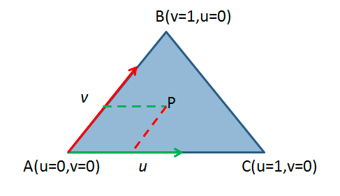

[<< 返回到上页](../index.md)

**这里将介绍2d三角形和多边形的博客文章**  

**三角形**  
相交问题留到3d里面里面讲，主要讲一下点在三角形内的判断  

重心坐标系  
   
任意的一个点都可以由这个坐标系表示   

1. 点在三角形里   
P = A + u \* (C - A) + v \* (B - A)  
则  
u \* (C - A) + v \* (B - A) = P - A  
求解u和v即可。若点在三角面内，需满足u >= 0, v >= 0且 u + v <= 1  
```
bool IsPointInTriangle2(Vector2 p1, Vector2 p2, Vector2 p3, ref Vector2 p)
{
    // Compute vectors
    Vector2 v0 = p2 - p1;
    Vector2 v1 = p3 - p1;
    Vector2 v2 = p - p1;
    // Compute dot products
    float dot00 = Vector2.Dot(v0, v0);
    float dot01 = Vector2.Dot(v0, v1);
    float dot02 = Vector2.Dot(v0, v2);
    float dot11 = Vector2.Dot(v1, v1);
    float dot12 = Vector2.Dot(v1, v2);
    // Compute barycentric coordinates
    float invDenom = 1.0f / (dot00 * dot11 - dot01 * dot01);
    float u = (dot11 * dot02 - dot01 * dot12) * invDenom;
    float v = (dot00 * dot12 - dot01 * dot02) * invDenom;
    // Check if point is in triangle
    return (u >= 0.0f) && (v >= 0.0f) && (u + v <= 1.0f);
}
```
**可以通过点在三条边向量的左侧和右侧来判断或者面积法来判断**  

2. 三角形面积  

两条相邻的边向量求叉积取绝对值乘以0.5即可得到面积   

**多边形**  

这里讨论不自相交的简单多边形：凸多边形和凹多边形   
凹多边形主要是内部角度存在大于180度的多边形。在计算时，凸多边形具有很多特性，可以加速计算   
1. 多边形是逆时针还是顺时针判断  
面积法(格林公式)   
```
public static float CalcualetArea(List<Vector3> polyPoints)
{
    float area = 0.0f;
    int count = polyPoints.Count;
    for (int i = 0; i < count; ++i)
    {
        int j = (i + 1) % count;
        area += (polyPoints[i][0] * polyPoints[j][1]) - (polyPoints[j][0] * polyPoints[i][1]);
    }
    area *= 0.5f;
    return area;
}
PolygonDirection CalculatePolygonArea(GeoPointsArray2 poly, ref float area)
{
    area = CalcualetArea(poly);
    if (area > 0)
        return PolygonDirection.CCW;
    else
    {
        return PolygonDirection.CW;
    }
}
```

最小值最大值点：   
求最底部的一点p，然后可以得到前后的两个点pre，next。   
得到 p - next = dir 方向  
得到 pre - next 得到一个点p'  
然后计算p'在dir的左边还是右边。若在左边，则为逆时针；否则为顺时针   

```
// 判断 p 是否在 p1 -> p2 的左边，即逆时针方向
public static float CounterClockwiseGL0(Vector2 p1, Vector2 p2, Vector2 p)
{
    return (p2[0] - p1[0]) * (p[1] - p1[1]) - (p[0] - p1[0]) * (p2[1] - p1[1]);
}
```
下面是判断一个点p在p1->p2的左侧还是右侧，从而判断逆时针还是顺时针  

2. 判断凹多边形还是凸多边形  

首先这里确定了多边形是逆时针的，然后才有下面的角度判断  
遍历所有的点，得到前后相连的顶点，然后判断点所在的方向，来判断是不是凹凸   
```
public static bool IsConvexAngle(Vector2 p1, Vector2 p2, Vector2 p)
{
    return CounterClockwiseGL0(p1, p2, p) >= 0;
}

public static bool IsConvexPolygon2(GeoPointsArray2 points)
{
    int count = points.Count;
    for (int i = 0; i < points.Count; ++i)
    {
        int pre = (i - 1 + count) % count;
        int next = (i + 1) % count;
        if (!IsConvexAngle(points[pre], points[i], points[next]))
        {
            return false;
        }
    }
    return true;
}
```

3. 点在凸多边形内  
 
逆时针放下下判断，二分法确定点p被哪两个线包夹，然后再通过方向判断左侧还是右侧    
```
public static bool IsPointInConvexPolygon2(GeoPointsArray2 poly, ref Vector2 point)
{
    int n = poly.mPointArray.Count;
    float t1 = CounterClockwiseGL0(poly.mPointArray[0], poly.mPointArray[1], point);
    float t2 = CounterClockwiseGL0(poly.mPointArray[0], poly.mPointArray[n - 1], point);
    if (t1 < -GeoUtils.PRECISION || t2 > GeoUtils.PRECISION)
    {
        return false;
    }
    int low = 2;
    int high = n - 1;
    while (low < high)
    {
        int mid = (low + high) >> 1;
        if (CounterClockwiseGL0(poly.mPointArray[0], poly.mPointArray[mid], point) < -GeoUtils.PRECISION)
        {
            high = mid;
        }
        else
        {
            low = mid + 1;
        }
    }
    float t3 = CounterClockwiseGL0(poly.mPointArray[low], poly.mPointArray[low - 1], point);
    if (t3 > GeoUtils.PRECISION)
    {
        return false;
    }
    return true;
}
```

4. 点在一般多边形内   

```
bool IsPointInPolygon2(GeoPointsArray2 poly, ref Vector2 point)
{
    bool res = false;
    int i, j = poly.Count - 1;
    for (i = 0; i < poly.Count; i++)
    {
        if ((((poly[i][1] < point[1]) && (poly[j][1] >= point[1])) || ((poly[j][1] < point[1]) && (poly[i][1] >= point[1])))
            && (poly[j][0] <= point[0] || poly[i][0] <= point[0]))
        {
            res ^= (poly[i][0] + (point[1] - poly[i][1]) / (poly[j][1] - poly[i][1]) * (poly[j][0] - poly[i][0]) < point[0]);
        }
        j = i;
    }
    return res;
}
```
