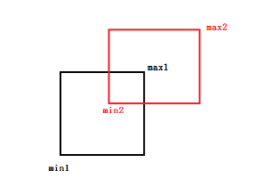

[<< 返回到上页](../index.md)

**这里将介绍矩形和正方形的博客文章**  

正方形是矩形的一个特殊形状，普遍性用矩形表示，若对计算要求高，需将正方形单独处理。   

```
class Rect
{
    // 最小最大表示法
    Vector2 min;
    Vector2 max;
    // 中心点和半宽高表示法
    Vector2 center;
    Vector2 halfSize;
    // 矩形的宽和高的单位方向向量
    Vector2 dir1;
    Vector2 dir2;
}
```

1. 点是否在矩形内部  

点Vector2 p，矩形 Rect r;  
若矩形是一个规则的矩形，没有经过旋转，可以简单计算点的范围来判断：  
```
r.min[0] < p[0] < r.max[0]
&& 
r.min[1] < p[1] < r.max[1]
```
若矩形有经过旋转，则一般性计算：   
```
public static bool IsPointInRect(Rect rect, Vector2 p)
{
    Vector2 pc = p - rect.center;
    float pj = Vector2.Dot(rect.dir1, pc);
    if (pj > rect.halfSize[0])
        return false;
    pj = Vector2.Dot(rect.dir2, pc);
    if (pj > rect.halfSize[1])
        return false;
    return true;
}
```
构造点到中心点的向量，然后投影到两个方向上，计算投影距离(绝对值)。只有投影距离同时小于对应的haslSize，表明点在矩形内部；否咋在外部。(在边上不考虑)    
投影其实对点做变换。  

2. 点到矩形的最短距离  

将矩形按照中心点和两个dir确定一个坐标系，将点变换到这个坐标系(做投影)，得到一个坐标值(u, v)  

通过u，v值可判断点在哪一个象限，然后象限中的矩形的点就是最短距离的那一个    
```
u > 0, v > 0  
u > 0, v < 0  
u < 0, v > 0  
u < 0, v < 0  
```
四种情况   

3. 线与矩形相交  

矩形有4条边，则计算线与4条边是否相交即可   
垂直于x轴有两条，垂直于y轴有两条。  
直线上点的表达式为： p(x, y) = p0(x0, y0) + t \* dir(x, y)   
则有  
x = x0 + t \* dx  
y = y0 + t \* dy  
所以  
t = (x - x0) / dx  
t = (y - y0) / dy  
取 x = min[0] 和 max[0]  
得到 tx1 和 tx2  
取 y = min[1] 和 max[1]  
得到 ty1 和 ty2  
最后加一些限制判断得到最后的两个相交的比例系数  
near和far  

```
bool IsLineInsectAABB2(Vector2 line1, Vector2 line2, Vector2 min, Vector2 max，out float dnear, out float dfar)
{
    // 直线方向向量
    Vector2 dir = line2 - line1;
    float invx = 1.0f / dir[0];
    float t1;
    float t2;
    float dnear;
    float dfar;
    if (invx > 0)
    {
        t1 = (min[0] - line1[0]) * invx;
        t2 = (max[0] - line1[0]) * invx;
    }
    else
    {
        t2 = (min[0] - line1[0]) * invx;
        t1 = (max[0] - line1[0]) * invx;
    }
    dnear = t1;
    dfar = t2;
    if (dnear > dfar || dfar < 0.0f)
    {
        return false;
    }
    float invy = 1.0f / dir[1];
    if (invy > 0)
    {
        t1 = (min[1] - line1[1]) * invy;
        t2 = (max[1] - line1[1]) * invy;
    }
    else
    {
        t2 = (min[1] - line1[1]) * invy;
        t1 = (max[1] - line1[1]) * invy;
    }
    if (t1 > dnear)
    {
        dnear = t1;
    }
    if (t2 < dfar)
    {
        dfar = t2;
    }
    if (dnear > dfar || dfar < 0.0f)
    {
        return false;
    }
    return true;
}
```

注意： 
**需要判断射点的起始点，线段的两个端点是否在矩形内**  
**射线和线段需要判断dnear和dfar的符号和范围。**   

4. 矩形与矩形相交  

   

矩形1： Rect(min1, max1)  
矩形2： Rect(min2, max2)   
若两个矩形相交，必定重叠为一个小矩形。  
min = max(min1, min2)  
max = min(max1, max2)   
若 min > max ,则不相交  
反之相交   