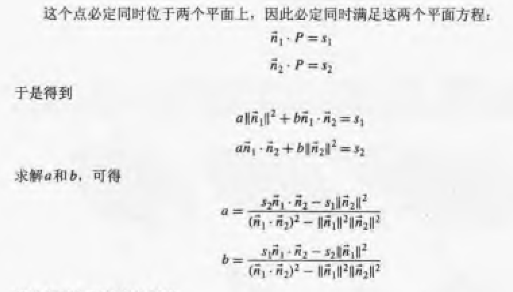

[<< 返回到上页](../index.md)

**这里将介绍3d面和三角面和曲面以及网格面的博客文章**  

**面** 
面分正面和反面，正反由面的法线方向指定。  
过一点P(x,y,z)且法向为N(a,b,c)的平面方程为：   
ax + by + cz + d = 0  
这称为点法式,面的数据结构：  
```
public class Plane
{
    public Vector3 mNormal;
    public float mD;
}
```
面的单位化是左右两边同时除以法线向量的长度  

1. 面与面相交  

先不考虑平面平行和共面的情形，一般化两个平面相交为一条直线  
面1： Plane p1(a1,b1,c1,d1)  
面2： Plane p2(a2,b2,c2,d2)  
求这条直线分两步：求出直线的方向向量和求直线经过的一点  
方向向量为两平面法线的叉积 dir = Corss(normal1, normal2)  
直线的点v(x,y,z)，另z=0(选择一个分量部位0的轴)，则v(x,y,0),带入到两个平面方程求解x,y值即可  
即  
a1x + b1y + d1 = 0  
a2x + b2y + d2 = 0  
还有另一种处理方式，两个法向量可以确定一个平面，这个平面与直线是垂直的。这个平面上的点表示为：  
P = a normal1 + b normal2  
点必须在两个平面上，则这个点是唯一的，带入到两个平面方程求解a和b值  
  

```
bool IsPlaneInsectPlane(Vector3 normal1, float d1, Vector3 normal2, float d2, ref GeoInsectPointArrayInfo insect)
{
    Vector3 lineDirection = Vector3.Cross(normal1, normal2);
    if (lineDirection.sqrMagnitude < GeoUtils.PRECISION) // 平行
    {
        return false;
    }
    float n1n2 = Vector3.Dot(normal1, normal2);
    float m = n1n2 * n1n2 - 1;
    float a = (-d2 * n1n2 + d1) / m;
    float b = (-d1 * n1n2 + d2) / m;
    Vector3 p = a * normal1 + b * normal2;
    insect.mIsIntersect = true;
    insect.mHitGlobalPoint.mPointArray.Add(p); // 直线 上一点
    insect.mHitGlobalPoint.mPointArray.Add(lineDirection); // 直线 方向
    return true;
}
```

2. 点在面的正向判断  

将点代入到坐标公式计算得到带符号的距离(法线单位化)
```
float PointDistanceToPlane(Vector3 normal, float d, Vector3 p)
{
    // float dot = Vector3.Dot(plane.mNormal, point - plane.mPoint);
    // return dot; 
    // or
    float dot = Vector3.Dot(normal, p);
    return dot + d;
}
```
若小于0，表示在平面的背面；反之则在平面上或者正面  

3. 点到面的距离和投影点    

距离：将上面的距离求绝对值即可  
投影点：距离d，投影点为pv = v - d \* normal    

4. 线与面的交点  
直线L： 点P(x,y,z) 方向dir  
公式 v = p + t dir  
这个点在平面上  
a v[0] + bv[1] +cv[2]+d = 0  
即 Dot(v, normal) + d = 0  
Dot(p + t dir, normal) + d = 0   
Dot(p, normal) + d + t Dot(dir, normal) = 0  
则   
t = (Dot(p, normal) + d) / Dot(dir, normal)   
```
bool IsPlaneInsectLine(Vector3 normal, float d, Vector3 p1, Vector3 p2, ref GeoInsectPointInfo insect)
{
    Vector3 direction = p2 - p1;
    float t = Vector3.Dot(normal, direction);
    if (t == 0) // 平行 或 在平面内
    {
        if (IsPointOnPlane(normal, d, p1))
        {
            // 在平面内
            return false;
        }
        else
        {
            // 平行
            return false; 
        } 
    }
    float up = Vector3.Dot(normal, p1) + d;
    t = up / t;
    insect.mIsIntersect = true;
    insect.mHitGlobalPoint = p1 + t * direction;
    return true;
}
```

上面计算t时，若计算射线，t > 0 才相交；线段满足 t > 0 && t < 1 相交  

**三角面**  
顶点表示：  
```
public class Triangle
{
    public Vector3 v1;
    public Vector3 v2;
    public Vector3 v3;
}
```
三角面3个顶点需要保证顺序；三角面确定一个平面Plane;    

1. 三角面相交  
**解题思路：**  
若两个三角面共面，则可以转化为平面上的三角形相交；   
若两个三角面平行，则不相交；   
若不平行，则先计算两个平面相交的直线，然后直线与三角形相交问题。  

2. 线与三角面的交点  
**解题思路：**  
若线与三角面平行不共面，则不相交；  
若线与三角面共面，则转化为平面上直线与三角形的相交问题  
若线与三角面不平行且不共面，则先计算线与平面的交点，然后判断点是否在三角形内  

或者  

线的参数： p = start + t dir  
三角面的重心坐标系： p = A + u ab＋　ｖ ac  
则  start + t dir  = A + u ab＋　ｖ ac  
求解 t，u，v值即可  
其中 u >= 0 v >= 0 且 u + v <= 1   

3. 三角面与平面的相交  
只考虑一般情况：相交  
**解题思路：**  
先三角面与平面相交的直线求取;  
后直线与三角面相交的求取；  

4. 点到三角面的最短距离   
先计算点到平面的投影(最短距离)   
后计算点到三角行的最短距离   

**曲面**  

曲面的构造与曲线类似，使用BSpline均匀有理样条   

**网格面**  

网格面为很多三角面或者四边形面连接而成。若基础面较多，则网格面会更加逼真。  