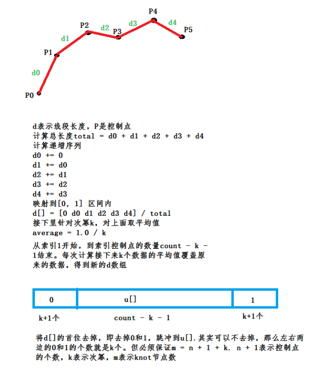

[<< 返回到上级](index.md)

**这里将介绍点，向量，矩阵，线和曲线的基本知识点**  

点是最基础的元素，表示方式依赖坐标系，以下为笛卡尔坐标系的表示：  
在2d中表示`Point(x, y)`，在3d中表示`Point(x,y,z)`  
其中x,y,z表示坐标轴上的值。点在齐次坐标系下，最后一维是1     

向量是一个矢量。一般由两个点做差`v(x,y,z) = P1(x,y,z) - P2(x,y,z)`.一般点可以作为相对于原点的向量。向量的长度描述了两个点之间的距离，距离为各维度值的平方和开平方根。向量在齐次坐标系下，最后一维是0    

矩阵变换主要指图形学里的缩放，旋转和平移变换，对于线性代数的矩阵具有一定的特殊性，通常的表示方式会在齐次坐标系下描述。矩阵的存储分列存储和行存储。  

线主要有直线，线段和射线三类。直线和线段无方向，射线有方向。直线和射点的表示一般是点和方向描述，线段用两个点描述。  

曲线可看成是直线的一种扩展，没有固定的方向，故曲线一般在某个点上有切向或者法向。曲线的表示一般由多个点，并通过对点进行拟合得到一条曲线。    

**1. 向量**  
1. 求两点的距离  
```
float Vector2::Distance(const Vector2 &v) const
{
    float dx = v.data[0] - data[0];
    float dy = v.data[1] - data[1];
    return sqrt(dx * dx + dy * dy);
}
```
当计算长度时，只需要做一些比较操作，可以不用开平方；若对精度要求不高，可以提哈U呢sqrt，采用泰勒展开求取  

2. 两个向量做点积，在一个单位方向上求投影长度或求cos余弦值，可以判断方向   
```
float Vector2::DotProduct(const Vector2 &v) const
{
    return (data[0] * v.data[0] + data[1] * v.data[1]);
}
```

3. 两个向量做叉积，求面积或者求法线向量或者旋转轴，可以对有符号的面积值判断方向  
```
2d下
float Vector2::CrossProduct(const Vector2 &v) const
{
    return (data[0] * v.data[1] - data[1] * v.data[0]);
}
以右手坐标系逆时针为正方向，则结果大于0，点v在左侧；小于0在右侧。另外值的绝对值代表了两个向量构成的平行四边形的面积。  

3d下
inline void VectorCrossProduct3f(const Point3f p1, const Point3f p2, Point3f vResult)
{
        vResult[0] = p1[1] * p2[2] - p1[2] * p2[1];
        vResult[1] = p1[2] * p2[0] - p1[0] * p2[2];
        vResult[2] = p1[0] * p2[1] - p1[1] * p2[0];
}
p1到p2叉积得到的仍是一个向量，这个向量垂直于p1和p2确定的平面，即得到平面的法向量
```

**2. 矩阵变换**  

两种旋转：主动旋转和被动旋转，在右手坐标系，正向旋转指逆时针旋转。    
坐标轴旋转：  
  
向量旋转：  
  

主动旋转： 坐标系不变，向量旋转  
被动旋转：向量或点不变，坐标系旋转   
被动旋转相当于主动旋转的逆操作。比如主动旋转，v向量逆时针旋转theta,则变成v'向量。而被动旋转，坐标轴旋转theta(v保持不变)，可以想象，若v跟随坐标轴一起旋转，则就会变成v',若要保证v不变，则将v'旋转到v就可以。对于旋转矩阵，一般保持正交矩阵，正交矩阵求逆矩阵，只需要将矩阵求转置即可。  

旋转矩阵会构建成一个新的坐标空间，假设有一个坐标空间为m1, 另一个坐标空间为m2。则m1到m2 存在一个旋转矩阵m。若问题是一个物体在m1下表示为p.   
1. 这个p不变，在m2空间表示为多少，此时m旋转矩阵表示什么？  
2. 若另一个物体在m2空间也是p，那么两个物体都是p，他们之间的关系是什么，m表示什么？  
上面的两种情形就是两种旋转矩阵变换。问题一，m表示被动旋转；问题二，m表示主动旋转，两个p是通过m变换得到。  

平移变换也可以类似旋转来理解，需要清楚你的变换时针对坐标轴还是针对向量，那么变换矩阵就有所不同，互为逆操作。  

缩放变换在使用过程中，一般认为是主动缩放。  

在游戏世界中，局部坐标系与世界坐标系是主动变换，对点或者说是向量进行旋转和平移是主动变换，得到世界坐标系下的点；世界坐标系与相机空间的旋转和平移变换是被动变换，将世界坐标系中的点P在相机空间中表示为P’。  
通常情况下，主动变换对向量，被动对点操作  

在3D下很容易扩展上面的旋转，接下来的旋转为向量旋转。过原点的是不用做平移处理，只研究旋转   
1. 点绕过原点的坐标轴旋转  
这里通过2d的旋转而来，旋转矩阵如下：  
     
右乘点向量即可得到旋转后的坐标点  

2. 点绕过原点的任意轴旋转  
对这个问题进行拆分：先任意轴旋转到坐标轴，此时旋转轴为一个坐标轴；再做点绕坐标轴处理，同上；再做一个逆变换   
任意轴旋转到坐标轴与坐标轴旋转到任意轴是一个逆操作，我们说一下坐标轴旋转到任意轴。  
假设Z轴为坐标轴旋转到任意轴AXIS。先将AXIS投影到ZOX平面，得到一个投影向量PV。将Z轴向量绕Y轴旋转到PV向量，旋转矩阵为M1,此时PV和Z轴重合;然后将PV向量绕X轴旋转到AXIS向量，旋转矩阵为M2,此时AXIS与Z轴就重合了。复合旋转矩阵为M2 \* M1。那么任意轴AXIS旋转到Z轴的变换为其逆矩阵(M2 \* M1)^-1  
若最初需要变换的点是P点，则经过上面的(M2 \* M1)^-1旋转后，得到P1 = (M2 \* M1)^-1 \* P. 然后将P1做绕Z轴旋转处理，若旋转矩阵为M3，则得到的点P2 = M3 \* P1。最后将P2变换回去得到最终的点   
X = M2 \* M1 \* P2 = M2 \* M1 \* M3 \* (M2 \* M1)^-1 \* P   
这里涉及到5个旋转矩阵，其中两对是逆变换，正交矩阵做转置即可。  

3. 一个向量v1到另一个向量v2的旋转矩阵  
首先将v1与v2做叉积，得到旋转轴，然后v1和v2的点积获取旋转角度。   
上面的问题就转化成了 一个点绕旋转轴旋转theta角度的变换，同上面的处理了。   

4. 旋转矩阵，欧拉角和四元素  
旋转矩阵最普通的一种形式，其内存开销大，不能做插值。   
欧拉角，意义比较明显，但会出现旋转轴重合的万向锁问题。  
四元素，意义不直观，但内存开销小，可以做插值。  
一般使用四元素来描述一个旋转矩阵，着色器计算一般采用旋转矩阵。  

**3. 曲线**  
主要介绍均匀有理样条曲线，贝塞尔和Nurbs不做过多介绍  

BSpline曲线包含的信息多，且改变一个控制点只会影响局部曲线，而贝塞尔曲线会全局作用。  
BSPline有控制点数据，Knot数据和一个度k(可以看成曲线的次数)。  
根据控制点求Knot数据，如图：  
  
```
    public void CalculateKnots()
    {
        int count = mControlPnts.Count;
        if (count < mK + 1)
        {
            return;
        }
        // parameters t
        float[] distance = new float[count];
        float total = 0.0f;
        distance[0] = 0;
        for (int i = 1; i < count; ++i)
        {
            float tmp = (mControlPnts[i] - mControlPnts[i - 1]).magnitude;
            distance[i] = distance[i - 1] + tmp;
            total += tmp;
        }
        float rt = 1.0f / total;
        for (int i = 1; i < count; ++i) 
        {
            distance[i] *= rt;
        }
        // knots
        mKontPoints.Clear();
        for (int i = 0; i < mK + 1; ++i)
        {
            mKontPoints.Add(0.0f);
        }     
        float avera = 1.0f / mK;
        for (int i = 1; i < count - mK; ++i)
        {
            float u = 0.0f;
            for (int j = i; j < i + mK; ++j)
            {
                u += distance[j];
            }
            mKontPoints.Add(u * avera);
        }
        for (int i = count + 1; i < count + mK + 2; ++i)
        {
            mKontPoints.Add(1.0f);
        }
    }
```
上面代码就算得到Knot节点数据，然后根据节点数据插值计算新的点：  
```
private Vector3 CalculatePoint(float knot)
{
    int count = 0;
    Vector3 v = new Vector3(0.0f, 0.0f);
    foreach (Vector3 it in mControlPnts)
    {
        float value = CalculateDeboorValue(count, mK, knot);
        v += it * value;
        count++;
    }
    return v;
}

private float CalculateDeboorValue(int i, int k, float knot)
{
    if (k != 0)
    {
        float lup = knot - mKontPoints[i];
        float ldown = mKontPoints[i + k] - mKontPoints[i];
        float l = 0.0f;
        if (ldown > 0 && lup > 0)
        {
            l = lup / ldown * CalculateDeboorValue(i, k - 1, knot);
        }
        float rup = mKontPoints[i + 1 + k] - knot;
        float rdown = mKontPoints[i + 1 + k] - mKontPoints[i + 1];
        float r = 0.0f;
        if (rdown > 0 && rup > 0)
        {
            r = rup / rdown * CalculateDeboorValue(i + 1, k - 1, knot);
        }
        return r + l;
    }
    else
    {
        if ((mKontPoints[i] <= knot) && (knot < mKontPoints[i + 1]))
        {
            return 1.0000f;
        }
        else
        {
            return 0.0000f;
        }
    }
}
```
这里面主要涉及到一个递推公式Deboor:  
  
上面代码可以做一些优化，对计算过的值做一个缓存，可以加速。便于理解，这里没做处理  

## **4. 线**  
介绍线的相交，点到线的距离和点是否在线上的判断   

**4.1 线与线相交**  

一般性介绍，3D中，两条异面直线，那么存在一条公垂线段，如果两个直线相交，那么公垂线段两端点必定相等且为交点。那么，先求一般性的公垂线段。  
直线L1:  Vector3 p1, Vector3 p2  
直线L2:  Vector3 p3, Vector3 p4  
则L1的方向为 dir1 = (p2 - p1)  
则L2的方向为 dir2 = (p4 - p3)  
假定L1和L2的公垂线段为MN，M是L1上的垂足，N是L2上的垂足。  
假设M： m = p1 + t1 \* dir1, n = p3 + t2 \* dir2,  
则MN的方向为 mn = (p3 + t2 \* dir2) - (p1 + t1 \* dir1)  
又由MN垂直dir1，dir2，则  
Dot(mn, dir1) = 0, Dot(mn, dir2) = 0, 即   
(p3 + t2 \* dir2) \* dir1 - (p1 + t1 \* dir1)\* dir1 = 0   
(p3 + t2 \* dir2) \* dir2 - (p1 + t1 \* dir1)\* dir2 = 0   
进一步得到   
Dot(p3,dir1)+t2\*Dot(dir2,dir1)-Dot(p1,dir1)-t1\*Dot(dir1,dir1) = 0   
Dot(p3,dir2)+t2\*Dot(dir2,dir2)-Dot(p1,dir2)-t1\*Dot(dir1,dir2) = 0   
调整为   
Dot(dir1,dir1) \* t1 - Dot(dir2,dir1) \* t2 = Dot(p3-p1,dir1)    
Dot(dir1,dir2) \* t1 - Dot(dir2,dir2) \* t2 = Dot(p3-p1,dir2)    
设   
f1ab = Dot(dir1,dir1),    
f1cd = Dot(dir2,dir2),  
f2 = Dot(dir1,dir2),    
f3ab = Dot(p3-p1,dir1),   
f3cd = Dot(p3-p1,dir2)     
则   
```
   t1 * f1ab - t2 * f2 = f3ab
   t1 * f2 - t2 * f1cd = f3cd
   
   t = [
         t1 
         t2 
       ]
   A = [
         f1ab   -f2
         f2   -f1cd 
       ]
   b = [
           f3ab
           f3cd
       ] 
   A * t = b
   A-1 = 1 / |A| * [
                       f1cd   -f2
                        f2   -f1ab
                   ]
   A-1 * b = [
               (f1cd * -f3ab) + (-f2 * -f3cd)
               (f2 * -f3ab) + (-f1ab * -f3cd)
             ]
               / |A|
```
根据克拉默法则可以求得 参数 t1 和 t2 , 从而带入参数得到两个垂足点   
以上公垂线段的求取具有普遍性   
```
public static bool LineLineClosestPoint(Vector3 line1, Vector3 line2, Vector3 line3, Vector3 line4, out Vector3 closest1, out Vector3 closest2)
{
    Vector3 ab = line2 - line1;
    Vector3 cd = line4 - line3;
    Vector3 ac = line3 - line1;
    float f1ab = Vector3.Dot(ab, ab);// ab.x * ab.x + ab.y * ab.y + ab.z * ab.z;
    float f1cd = Vector3.Dot(cd, cd); //cd.x * cd.x + cd.y * cd.y + cd.z * cd.z;
    float f2 = Vector3.Dot(ab, cd);//ab.x * cd.x + ab.y * cd.y + ab.z * cd.z;
    float f3ab = Vector3.Dot(ab, ac); // ab.x * ac.x + ab.y * ac.y + ab.z * ac.z;
    float f3cd = Vector3.Dot(cd, ac);// cd.x * ac.x + cd.y * ac.y + cd.z * ac.z;

    float det = (-f1ab * f1cd) + f2 * f2;
    if (det > -GeoUtils.PRECISION && det < GeoUtils.PRECISION) // 平行 共线
    {
        closest1 = new Vector3();
        closest2 = new Vector3();
        return false;
    }
    det = 1.0f / det;
    float t1 = f2 * f3cd - f1cd * f3ab;
    t1 *= det;
    float t2 = f1ab * f3cd - f2 * f3ab;
    t2 *= det;
    closest1 = t1 * ab + line1;
    closest2 = t2 * cd + line3;
    return true;
}
```
计算2d情况时可以将点扩展到3d上，这样可以统一接口。如果对计算要求较高，则需要单独设计，这里做统一处理。平行问题可以提前处理，下面的介绍不讨论平行问题。  

1. 直线与直线相交  

先计算上面的参数t1 和 t2,在计算两个点M和N，若M和N两点相等，则交点可得；否则不相交。2d下的计算，必定相交。  

2. 直线与射线相交  

先计算上面的参数t1 和 t2, 若t2 < 0,则不相交；不然相交   

3. 直线与线段相交  

先计算上面的参数t1 和 t2, 若t2 < 0 或者 t2 > 1,则不相交；不然相交   
注意：上面计算方向时并没有单位化，则线段的参数控制在[0, 1]下   

4. 射线与射线相交  

先计算上面的参数t1 和 t2, 若t1 < 0 或 t2 < 0,则不相交；不然相交  

5. 射线与线段相交  

先计算上面的参数t1 和 t2, 若t1 < 0 或 (t2 < 0或 t2 > 1)则不相交；不然相交  

6. 线段与线段相交  
先计算上面的参数t1 和 t2, 若(t1 < 0或 t1 > 1) 或 (t2 < 0或 t2 > 1)则不相交；不然相交  

根据计算得到的 t1 和 t2，可以很方便计算线段与线段之间的最短距离等。   

**4.2 点到线的最短距离**  

一般性，计算点在线上的投影点。   
直线L1:  Vector3 p1, Vector3 p2  
点： Vector3 p   
直线L1方向Vector3 dir1 = (p2 - p1).Normalize()  
p1指向p的向量：Vector v = (p - p1)  
然后计算v在dir1上的投影： float pv = Dot(dir1, v)     

1. 点到直线的最短距离  

计算投影float pv，然后计算向量 v1 = v - pv \* dir1   
求向量的模即为距离值  

2. 点到射线的最短距离  

计算投影float pv  
若pv > 0, 即为点到直线的距离   
若pv <= 0, 则最短距离为p到p1点的距离   

3. 点到线段的最短距离   
计算线段的长度 length ，计算投影float pv    
若pv >= length, 即最短距离为p到p2点的距离   
若pv > 0 且 pv < length，即为点到直线的距离   
若pv <= 0 , 即最短距离为p到p1点的距离   

**4.3 点在线上**   
点到线的最短距离d，若等于0，则表示点在线上    
1. 点在直线上  
2. 点在射线上  
3. 点在线段上  


