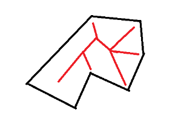

[<< 返回到上页](../index.md)

**这里将介绍中轴提取的博客文章**  

对于一个简单多边形，有时候需要获取这个多边形的基本骨架信息，也可以称之为图形的中轴线。   
  
其中黑色即为简单多边形，红色为多边形的中轴。中轴抽象的描述了多边形的形状。   

下面的代码中是根据图像处理获取图像骨架的骨架提取算法，这里是查表法。其原理很简单：对于一个像素点，与之相邻的有八个点。然后根据这8个点的信息，可以标识当前点是否需要剔除。所以8个点的全排列就有256种可能(00000000)，每一种情形对应这个点是否可去掉，所以用0或者1来表示。  
在计算几何算法中，这种骨架称之为中轴。这可可以了解一下，这里并没有对其实现。  
由于采用图像处理，则需要先对多边形进行填充，然后根据像素点的信息来判断每一个点的情形。  
每一次计算，都会剔除掉最外层的像素点，如此迭代下去。   

```
using System;
using System.Collections.Generic;
using System.Linq;
using System.Text;

namespace KayAlgorithm
{
    public class ImageSkeleton
    {
        // 2^8 = 256
        private static int[] TABLE_ARRAY = new int[256]{
         0,0,1,1,0,0,1,1,1,1,0,1,1,1,0,1,
         1,1,0,0,1,1,1,1,0,0,0,0,0,0,0,1,
         0,0,1,1,0,0,1,1,1,1,0,1,1,1,0,1,
         1,1,0,0,1,1,1,1,0,0,0,0,0,0,0,1,
         1,1,0,0,1,1,0,0,0,0,0,0,0,0,0,0,
         0,0,0,0,0,0,0,0,0,0,0,0,0,0,0,0,
         1,1,0,0,1,1,0,0,1,1,0,1,1,1,0,1,
         0,0,0,0,0,0,0,0,0,0,0,0,0,0,0,0,
         0,0,1,1,0,0,1,1,1,1,0,1,1,1,0,1,
         1,1,0,0,1,1,1,1,0,0,0,0,0,0,0,1,
         0,0,1,1,0,0,1,1,1,1,0,1,1,1,0,1,
         1,1,0,0,1,1,1,1,0,0,0,0,0,0,0,0,
         1,1,0,0,1,1,0,0,0,0,0,0,0,0,0,0,
         1,1,0,0,1,1,1,1,0,0,0,0,0,0,0,0,
         1,1,0,0,1,1,0,0,1,1,0,1,1,1,0,0,
         1,1,0,0,1,1,1,0,1,1,0,0,1,0,0,0};

        /// <summary>
        /// Be aware that the height and the width of the image should be equal.
        /// </summary>
        /// <param name="image">source data</param>
        /// <param name="num">count loop</param>
        /// <returns></returns>
        public static byte[,] Skeletonization(byte[,] image, int num = 10)
        {
            byte[,] data = CleanData(image);
            for (int i = 0; i < num; ++i)
            {
                VThin(data);
                HThin(data);
            }
            return data;
        }

        private static string ImageToString(byte[,] image)
        {
            int w = image.GetLength(0);
            int h = image.GetLength(1);
            string temp = "";
            for (int i = 0; i < w; ++i)
            {
                for (int j = 0; j < h; ++j)
                {
                    temp = string.Format("{0}_{1}", image[i, j], temp);
                }
            }
            return temp;
        }

        private static byte[,] CleanData(byte[,] image) // otsu can be applied
        {
            int w = image.GetLength(0);
            int h = image.GetLength(1);
            byte[,] result = new byte[w, h];
            for (int i = 0; i < w; ++i)
            {
                for(int j = 0; j < h; ++j)
                {
                    result[i, j] = image[i, j] > 10 ? (byte)255 : (byte)0;
                }    
            }
            return result;
        }

        private static void HThin(byte[,] image)
        {
            int h = image.GetLength(1);
            int w = image.GetLength(0);
            int next = 1;
            for (int j = 0; j < w; ++j)
            {
                for (int i = 0; i < h; ++i)
                {
                    if (next == 0)
                    {
                        next = 1;
                    }
                    else
                    {
                        int m = -1;
                        if (i > 0 && i < h - 1)
                        {
                            m = image[i - 1, j] + image[i, j] + image[i + 1, j];
                        }
                        else
                        {
                            m = 1;
                        }
                        if (image[i, j] == 0 && m != 0)
                        {
                            int[] a = new int[9] { 0, 0, 0, 0, 0, 0, 0, 0, 0 };
                            for (int k = 0; k < 3; ++k)
                            {
                                for (int l = 0; l < 3; ++l)
                                {
                                    int i1 = i - 1 + k;
                                    int j1 = j - 1 + l;
                                    if (-1 < i1 && i1 < h && -1 < j1 && j1 < w && image[i1, j1] == 255)
                                    {
                                        a[k * 3 + l] = 1;
                                    }
                                }
                            }
                            int sum = a[0] * 1 + a[1] * 2 + a[2] * 4 + a[3] * 8 + a[5] * 16 + a[6] * 32 + a[7] * 64 + a[8] * 128;
                            image[i, j] = (byte)(TABLE_ARRAY[sum] * 255);
                            if (TABLE_ARRAY[sum] == 1)
                            {
                                next = 0;
                            }
                        }
                    }
                }
            }
        }

        private static void VThin(byte[,] image)
        {
            int h = image.GetLength(1);
            int w = image.GetLength(0);
            int next = 1;

            for (int i = 0; i < h; ++i)
            {
                for (int j = 0; j < w; ++j)
                {
                    if (next == 0)
                    {
                        next = 1;
                    }
                    else
                    {
                        int m = -1;
                        if (0 < j && j < w - 1)
                        {
                            m = image[i, j - 1] + image[i, j] + image[i, j + 1];
                        }
                        else
                        {
                            m = 1;
                        }
                        if (image[i, j] == 0 && m != 0)
                        {
                            int[] a = new int[9] { 0, 0, 0, 0, 0, 0, 0, 0, 0 };
                            for (int k = 0; k < 3; ++k)
                            {
                                for (int l = 0; l < 3; ++l)
                                {
                                    int i1 = i - 1 + k;
                                    int j1 = j - 1 + l;
                                    if (-1 < i1 && i1 < h && -1 < j1 && j1 < w && image[i1, j1] == 255)
                                    {
                                        a[k * 3 + l] = 1;
                                    }
                                }
                            }
                            int sum = a[0] * 1 + a[1] * 2 + a[2] * 4 + a[3] * 8 + a[5] * 16 + a[6] * 32 + a[7] * 64 + a[8] * 128;
                            image[i, j] = (byte)(TABLE_ARRAY[sum] * 255);
                            if (TABLE_ARRAY[sum] == 1)
                            {
                                next = 0;
                            }
                        }
                    }
                }
            }
        }
    }
}

```