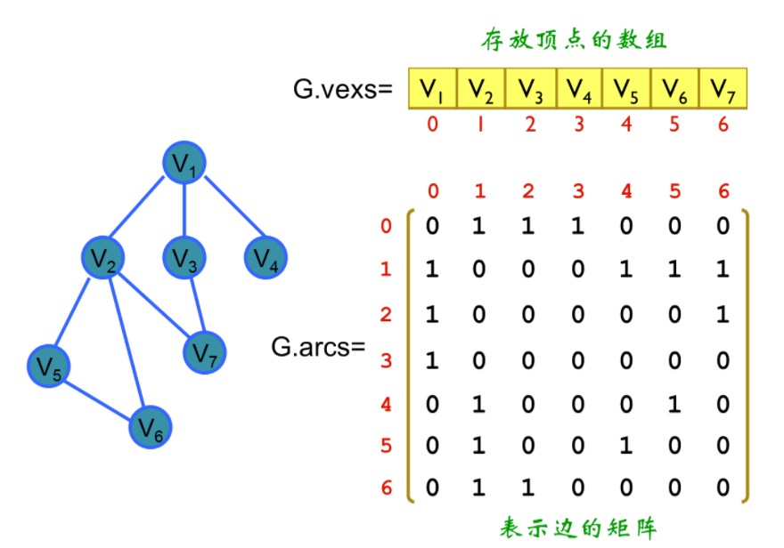
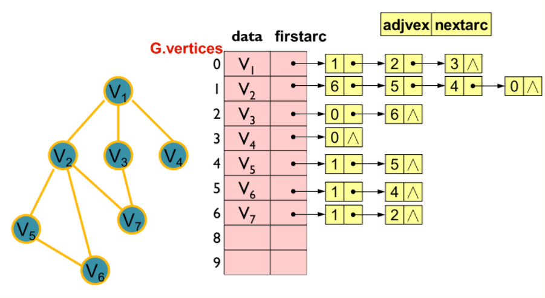

[<< 返回到主页](index.md)

**这里将介绍邻接表和邻接矩阵的博客**   

邻接矩阵见下图：  
   

1. 逻辑结构分为两部分：Vexs[]（存储顶点）和Arcs[][]（邻接矩阵）集合。因此，用一个一维数组存放图中所有顶点数据；用一个二维数组存放顶点间关系（边或弧）的数据，这个二维数组称为邻接矩阵。   
2. 邻接矩阵又分为有向图邻接矩阵和无向图邻接矩阵。  

对于邻接矩阵的应用，可参见[迪杰斯特拉算法](Dijkstra.md)  

邻接表见下图：  
   
邻接表与邻接矩阵类似，有点像HashTable的结构。与顶点相连的边记录在链表中，所有的顶点可以用数组表示(顶点只需用索引对应即可)。   

接下来主要说明对邻接表的遍历：深度搜索和回溯   
当有环时，需要做一个遍历剔除操作   
当邻接表中元素较多时，暴力遍历进行计算是非常耗时的，并且递归可能使得线程栈内存溢出   
```
    public interface IAdjacent
    {
        int Previous();
        int Next();
    }

    public class AdjacentTest : IAdjacent
    {
        public int mIndex;
        public int mNext;
        public float mWeight;
        public AdjacentTest(int idx, int next, float weight)
        {
            mIndex = idx;
            mNext = next;
            mWeight = weight;
        }

        public int Next()
        {
            return mNext;
        }
        public int Previous()
        {
            return mIndex;
        }

        public static void Test()
        {
            List<List<AdjacentTest>> all = new List<List<AdjacentTest>>();
            int count = 20;
            for (int i = 0; i < count - 1; ++i)
            {
                List<AdjacentTest> row = new List<AdjacentTest>();
                if (i != 1 && i != 10 && i != 15)
                {
                    for (int j = i + 1; j < count; ++j)
                    {
                        AdjacentTest test = new AdjacentTest(i, j, i * count + j);
                        row.Add(test);
                    }
                }
                all.Add(row);
            }
            List<AdjacentTest> group = new List<AdjacentTest>();
            List<List<AdjacentTest>> groups = new List<List<AdjacentTest>>();
            AdjacentGraphTravel(all, groups, group);

            foreach (List<AdjacentTest> adj in groups)
            {
                string str = "";
                for (int i = 0; i < adj.Count; ++i)
                {
                    str = string.Format("{0} {1} {2}", str, adj[i].Previous(), adj[i].Next());
                }
                Debug.Log(str);
            }
        }

    }

    // 邻接表 遍历
    // 当层次很多时，递归较慢，可能内存溢出
    public static void AdjacentGraphTravel<T>(List<List<T>> graph, List<List<T>> groups, List<T> group, int index = 0) where T : IAdjacent
    {
        List<T> temp = graph[index];
        for (int i = 0; i < temp.Count; ++i)
        {
            T adj = temp[i];
            // 有环时，这里需要注意。样例是无环结构  
            group.Add(adj);
            int idx = adj.Next();
            if (idx < graph.Count)
            {
                AdjacentGraphTravel(graph, groups, group, idx);
            }
            else
            {
                List<T> final = new List<T>();
                final.AddRange(group);
                groups.Add(final);
            }
            if (group.Count > 0)
            {
                group.RemoveAt(group.Count - 1);
            }
        }
    }
```

