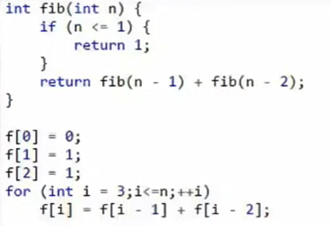

[<< 返回到主页](index.md)

**这里将介绍动态规划**   

**定义**   
1. 动态规划的本质：递归   
2. 原问题(N) -> 子问题(N-1) -> 原问题(N)    
3. 最优子结构  
    1. 子问题最优决策可导出原问题最优决策  
    2. 无后效性   
4. 重叠子问题   
    1. 去冗余   
    2. 空间换时间(注意分析时空复杂度)   

递归解决问题，意义在于解决问题的方法，重点不在于性能。  
无后效性：处理一个子问题，后面的子问题还是都能被处理，而不能出现不能被处理的子问题。   
去冗余：缓存计算过的  

递推和递归的区别  

**问题共性**   
1. 套路   
    1. 最优  
    2. 最大、最小  
    3. 最长  
    4. 计数  
2. 离散问题  
    1. 容易设计状态(整数01背包问题，若是连续的或者小数之类的，可能不好用动态规划处理)   
3. 最优子结构   
    1. N-1可以推导出N  

**基本步骤**   
1. 设计暴力算法，找到冗余    
2. 设计并存储状态(一维，二维或者map)  
3. 递归式(状态转移方程)   
4. 自底向上计算最优解(编程方式)   

注意：优化时，可以将递归转递推，用循环；递推注意边界条件；代码并不优美，易读性没有递归好。  

用斐波拉契说明递归和递推：  
   

对于不可用状态时，用0来代替。边界条件需要注意     

问题：   
1. 01背包问题   
2. 最长公共子序列   

