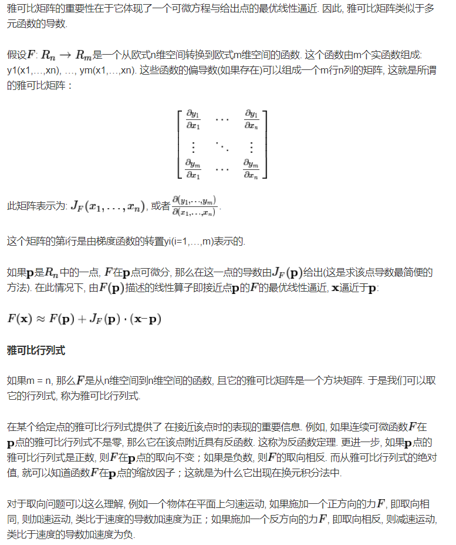
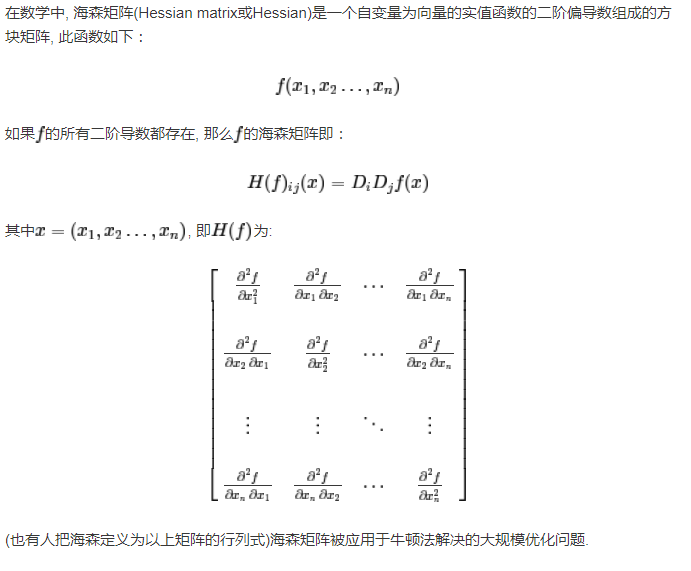
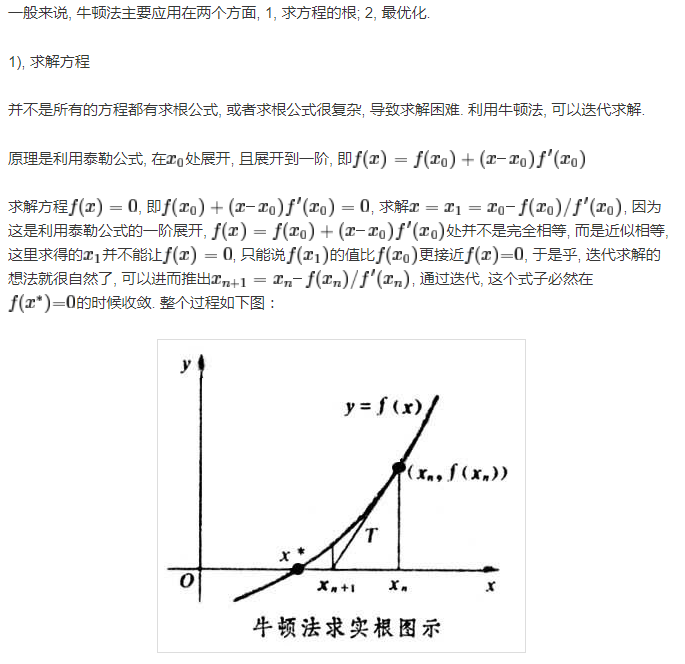
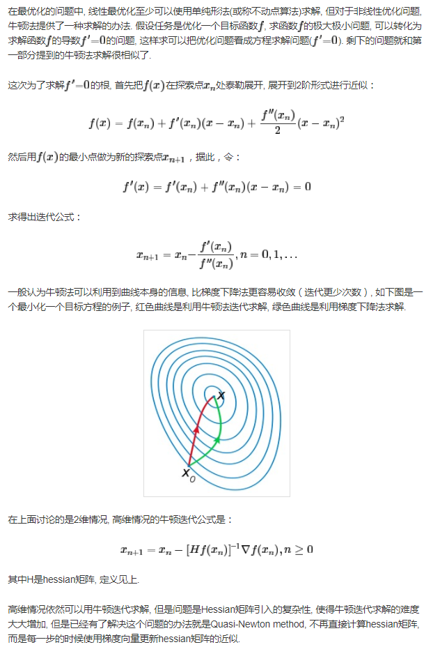
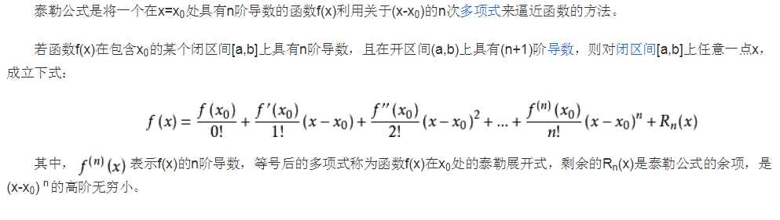
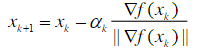
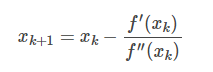
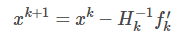

[<< 返回到主页](../index.md)

**这里将介绍数值分析**  
这里说的数值分析，目前只针对下降法和迭代法，后面再添加插值等内容。  

雅可比矩阵(Jacobian)和海森矩阵(Hessian)   
**雅可比矩阵：多元一阶求导**  
  

**海森矩阵:多元二阶求导**：正定，半正定，负定和不定   
    
对于求根：  
     
对于最优化：  
     

**下降法**  
所求解为局部最优解，而非全局最优，除非是凸函数；初始值的设定很重要。收敛速度而言，学习率的大小也很重要。牛顿法的收敛速度比梯度下降要快，所得值的准确性比较没有意义。  

先回顾一下泰勒展开：  
   
当然可以改写：  
```
f(x0+h) = f(x0) + f'(x0)*h + f''(x0)*h*h/2! + f'''(x0)*h*h*h/3! + ...
```

1. 梯度下降法：一阶导   
对于泰勒公式，上图中取n=1，得到`f(x+h) = f(x)+f'(x)*h`，最小化`f(x+h)`=>`f(x)+f'(x)*h`=>`f'(x)*h`   
这里需要注意：当多元函数时，f'(x)是一个梯度向量，h是一个增量向量，两者的积采用内积。  
那么`f'(x)*h`=`|f'(x)|*|h|*cos(theta)`,则theta=180度时，值最小，等于0时，值最大。  
所以取值`h`用`f'(x)`梯度表示，若`h=-f'(x)`梯度上升，`h=-f'(x)`梯度下降。  
梯度下降法的一般性公式：  
   
系数a为学习率。   
其几何意义为：求极值点时，从一个点出发，沿着最快 方向达到。而梯度(一阶导数)就是最快的方向。学习率用来调整快慢，这个值是个动态的，最开始较大，快速迭代；后面较小，得到更精确的值。迭代结束条件为误差在设定的阈值内，当然可以设置迭代次数。  
下面为基于梯度下降法的扩展算法：   
a. 随机梯度下降法  
b. 批量梯度下降法  
c. 小批量梯度下降法  

2. 牛顿法：二阶导   
对于泰勒公式，取n=2，得到`f(x0+h) = f(x0) + f'(x0)*h + f''(x0)*h*h/2!`.这里保留到二阶泰勒，后面的高阶无穷小略去。对于求极值点的做法是求导数，令导数等于0.对h求导，得
`f'(x0+h) = f'(x0) + f''(x0)*h`,求极值则得`f'(x0) + f''(x0)*h=0`,故
`h=-f'(x0)/f''(x0)`.牛顿法的一般公式为：   
   
对于多元函数，则公式为：   
   

下面为基于牛顿法的优化算法：
a. 拟牛顿法   

**迭代**  
上面介绍的下降法包含了迭代过程，接下来介绍的迭代法主要针对`Ax=b`求解`x`.   
在介绍之前，可以先了解一下雅可比矩阵的一个应用，[链接](https://blog.csdn.net/noahzuo/article/details/54314112)   
其中有一个广义逆，这个是很有用的东西。  

1. 雅可比迭代法   
   

2. 高斯赛德尔迭代法   
   

3. PGS高斯赛德尔迭代法变种   
   


