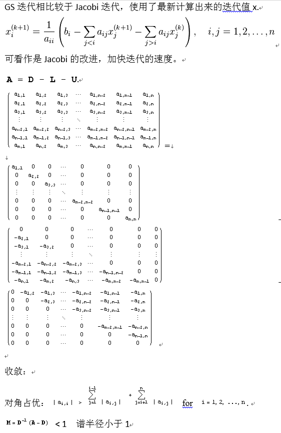
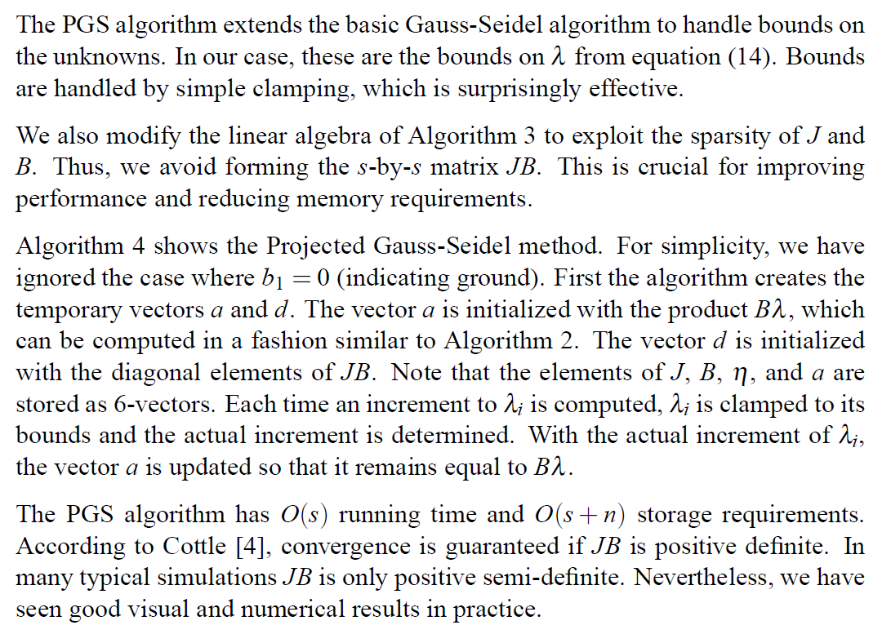

[<< 返回到主页](../index.md)

**这里将介绍数值分析**  
这里说的数值分析，目前只针对下降法和迭代法，后面再添加插值等内容。  

**下降法**  
// https://www.cnblogs.com/pinard/p/5970503.html  

1. 梯度下降法   
    1. 随机梯度下降法  
    2. 批量梯度下降法  
    3. 小批量梯度下降法  

// https://blog.csdn.net/itplus/article/details/21897443   

2. 牛顿法   
    1. 拟牛顿法   

3. 最小二乘法   

**迭代**  
雅可比矩阵   
// https://blog.csdn.net/noahzuo/article/details/54314112   

1. 雅可比迭代法   
   

2. 高斯赛德尔迭代法   
   

3. PGS高斯赛德尔迭代法变种   
   

