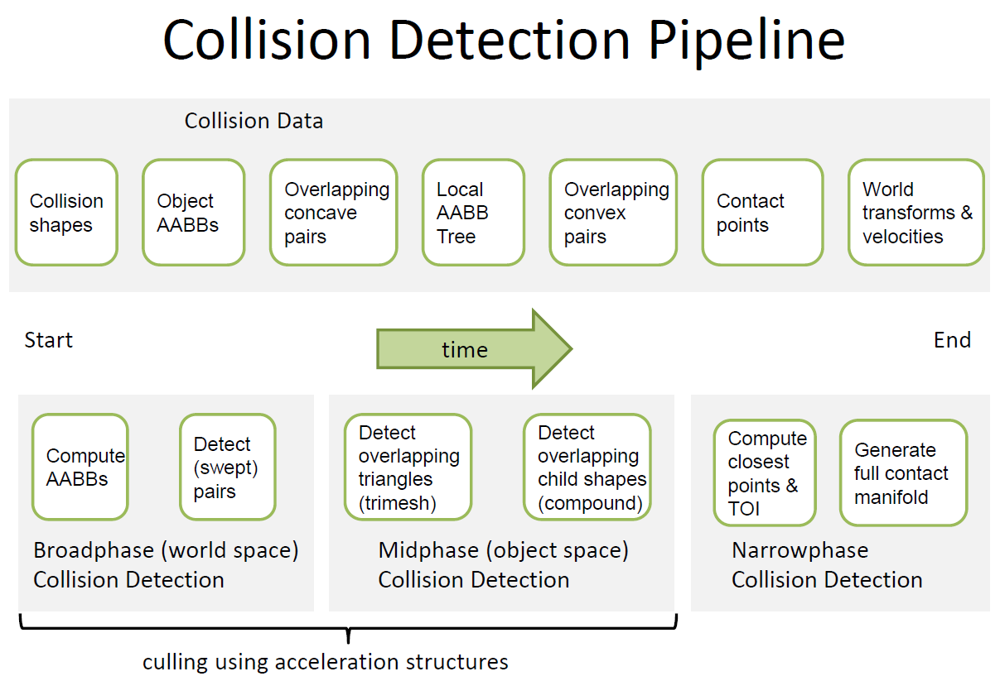

[<< 返回到主页](../index.md)

**这里将介绍物理引擎设计的博客文章**  

这里物理引擎介绍基于Bullet这款开源物理引擎   

**为什么需要物理引擎**  
为了模拟更真实的画面感，运用运动学和动力学来处理物理碰撞。  

**物理引擎与游戏引擎的结合点**   
游戏场景中需要进行物理模拟的物体会带一个碰撞体。物体的移动会导致碰撞体在物理引擎里的移动，然后通过物理求解得到碰撞体的下一帧的运动信息(主要是空间位置：旋转，平移)，将这个信息同步到场景中的物体的世界变换矩阵。简而言之，物体的状态在游戏和物理之间同步。 

[基本概念](base.md)     
1. 速度：线速度，角速度  
2. 加速度：先加速度和角加速度    
2. 质量和转动惯量，惯性张量     
3. 力和力矩  
4. 动量和冲量   
5. 牛顿三大定律   
6. 运动学和动力学  
7. 离散和连续碰撞CCD     
8. 影响时间TOI   

**物理模拟管线**   
   

**碰撞检测管线**  
   

另外，框架图如下：   
     
     

```
the motion solver will first compute scripted bodies, then all external forces, and finally any constraint forces(the constrainter solver)
the constrainter solver are distinguished as either bilaterial (=) or unilaterial(>=) constraints. retrieve the constraint forces which are used by the ODEs to compute the continuous motion of objects(prevent objects from penetrating each other).to compute the contact forces, queries the conllision detection for the contact regions between the objects  
```

```
1 predictUnconstraintMotion(timeStep);
    btRigidBody* body = m_nonStaticRigidBodies[i];
    if (!body->isStaticOrKinematicObject())
    {
        body->applyDamping(timeStep);
        body->predictIntegratedTransform(timeStep,InterpolationWorldTransform);  
    }
2 createPredictiveContacts(timeStep);
    btRigidBody* body = m_nonStaticRigidBodies[i];
    if (body->isActive() && (!body->isStaticOrKinematicObject()))
    {
        body->predictIntegratedTransform(timeStep, predictedTrans);
        btScalar squareMotion = (getOrigin()-getOrigin()).length2();
        if (body->getCollisionShape()->isConvex())
        {
            convexSweepTest(...);
            if (sweepResults.hasHit() && m_closestHitFraction < 1.f))
            {
                btPersistentManifold* manifold = m_dispatcher1->getNewManifold();
                m_predictiveManifolds.push_back(manifold);
                int index = manifold->addManifoldPoint(newPoint, isPredictive);
                btManifoldResult::calculateCombinedFriction(...);              
            }            
        }        
    }

3 performDiscreteCollisionDetection();
    updateAabbs(...);
    {
        for ( int i=0;i<m_collisionObjects.size();i++)
            btCollisionObject* colObj = m_collisionObjects[i];
            if (m_forceUpdateAllAabbs || colObj->isActive())
                updateSingleAabb(colObj);
                {
                    btVector3 minAabb,maxAabb;
                    btBroadphaseInterface* bp = m_broadphasePairCache;
                    bp->setAabb(...);
                    {
                        if(Intersect(proxy->leaf->volume,aabb)
                            m_sets[0].update(..., DBVT_BP_MARGIN)
                        listremove(proxy,m_stageRoots[proxy->stage]);
                        listappend(proxy,m_stageRoots[m_stageCurrent]);
                        m_sets[0].collideTTpersistentStack(...);
                        {
                            pbp->m_paircache->addOverlappingPair(pa,pb);
                        }
                    }
                }
    }
    computeOverlappingPairs(...);
    {
        m_broadphasePairCache->calculateOverlappingPairs(m_dispatcher1);
        {
            collide(dispatcher);
            {   
                m_stageCurrent=(m_stageCurrent+1)%STAGECOUNT;
                btDbvtProxy*    current=m_stageRoots[m_stageCurrent];
                do{} while()            
                m_sets[0].collideTTpersistentStack();
            }
            performDeferredRemoval(dispatcher);
            ...
            if(!Intersect(pa->leaf->volume,pb->leaf->volume))
                // to find duplicates and to sort 'invalid' pairs to the end
                m_paircache->removeOverlappingPair(pa,pb,dispatcher);
        }
    }
    dispatcher->dispatchAllCollisionPairs(...);
    {
        pairCache->processAllOverlappingPairs(&collisionCallback,dispatcher)    
        {
            btBroadphasePair* pair = &m_overlappingPairArray[i];

            // CleanPairCallback RemovePairCallback
            if (callback->processOverlap(*pair))
                removeOverlappingPair(...);//btHashedOverlappingPairCache
        }
    }

4 calculateSimulationIslands();
    getSimulationIslandManager()->updateActivationState();
    {
        collisionObject->setIslandTag(index++);
        initUnionFind( index );
        {
            resize();// element[i].id = i, sz = 1;
        }
        findUnions(dispatcher,colWorld);
        {
            ///filter static, kinematic and object without contact response 
            if (((colObj0) && ((colObj0)->mergesSimulationIslands())) &&
                ((colObj1) && ((colObj1)->mergesSimulationIslands())))
                m_unionFind.unite(...);
                {
                    // merge the chain collision object into a island
                }
        }
    }
    // merge islands based on speculative contact manifolds too
    for (int i=0;i < m_predictiveManifolds.size();i++)
    {
        getSimulationIslandManager()->getUnionFind().unite(...);
    }
    // constraint
    int numConstraints = int(m_constraints.size());
    for (i=0;i< numConstraints ; i++ )
        btTypedConstraint* constraint = m_constraints[i];
        const btRigidBody* colObj0 = &constraint->getRigidBodyA();
        const btRigidBody* colObj1 = &constraint->getRigidBodyB();
        getSimulationIslandManager()->getUnionFind().unite();

    //Store the island id in each body
    getSimulationIslandManager()->storeIslandActivationState(...);
    {
        for (i=0;i<colWorld->getCollisionObjectArray().size();i++)
            if (!collisionObject->isStaticOrKinematicObject())
                collisionObject->setIslandTag( m_unionFind.find(index) );
                m_unionFind.getElement(index).m_sz = i;
                index++;
                collisionObject->setCompanionId(-1);
            else
                collisionObject->setIslandTag(-1);
                collisionObject->setCompanionId(-2);
    }

5 solveConstraints(getSolverInfo());
    m_solverIslandCallback->setup()
    {
        m_solverInfo = solverInfo;
        m_sortedConstraints = sortedConstraints;
        m_numConstraints = numConstraints;
    }
    m_constraintSolver->prepareSolve()
    /// solve all the constraints for this island
    m_islandManager->buildAndProcessIslands()
    {
        buildIslands(dispatcher,collisionWorld);
        {
            // 排序后，连续一段的id会是一样的，及属于一个岛，这类object一起处理，并且每个element记录了collisionObject的index
            // 1 1 2 3 3 3 3 4 4 4 5 6 6 6 6 6 6 6，找到startIndex和endIndex处理区间
            getUnionFind().sortIslands();
            //update the sleeping state for bodies, if all are sleeping                     colObj0->getActivationState()；
                allSleeping;
            // 激活
            for (i=0;i<maxNumManifolds ;i++)
                if (colObj0->hasContactResponse())
                    colObj1->activate();
                
                //filtering for response
                if (dispatcher->needsResponse(colObj0,colObj1))
                    m_islandmanifold.push_back(manifold);
        }
        //InplaceSolverIslandCallback:public ationIslandManager::IslandCallback
        callback->processIsland(...);
        {
            if (islandId<0)
                m_solver->solveGroup()
                {
                    solveGroupCacheFriendlySetup(...);
                    {
                        // fill tmpSolverBodyPool
                        int bodyId= getOrInitSolverBody();
                        btSolverBody& solverBody = m_tmpSolverBodyPool[bodyId];
                        if (body->getFlags()&BT_ENABLE_GYROPSCOPIC_FORCE)
                            GYROPSCOPIC
                        // constraint, build Jacobian matrix
                        btTypedConstraint* constraint = constraints[j];
                        constraint->buildJacobian();
                        constraint->internalSetAppliedImpulse(0.0f);
                        // m_tmpConstraintSizesPool
                        // //calculate the total number of contraint rows   
                        btConstraintInfo1& info1 = m_tmpConstraintSizesPool[i];
                        btJointFeedback* fb = constraints[i]->getJointFeedback();
                        constraints[i]->getInfo1(&info1);
                        totalNumRows += info1.m_numConstraintRows;
                        m_tmpSolverNonContactConstraintPool.r (totalNumRows);
                        ///setup the btSolverConstraints
                        currntConstintRow=&m_tmpSerNotactintol[curRow];
                        btRigidBody& rbA = constraint->getRigidBodyA();
                        btRigidBody& rbB = constraint->getRigidBodyB();
                        int solverBodyIdA = getOrInitSolverBody(rbA,);
                        int solverBodyIdB = getOrInitSolverBody(rbB, eStep);
                         btSolverBody* bodyAPtr = &m_tmpl[solvedA];
                         btSolverBody* bodyBPtr = &m_tmpSolverBodyPool[soldB];
                    }
                    solveGroupCacheFriendlyIterations(...);
                    solveGroupCacheFriendlyFinish(...);
                }
            else
                
        }
    }
    m_solverIslandCallback->processConstraints();
    m_constraintSolver->allSolved(solverInfo, m_debugDrawer);

6 integrateTransforms(timeStep);

7 updateActions(timeStep);

8 updateActivationState( timeStep );

```

**简要概述**   
时间管理，碰撞检测系统，约束求解系统   
```
1. 基础数据组织   
    1. AABB Tree(BVH)   
    2. Overlapping   
    3. Contact Points(Manifold)  
2. 碰撞检测系统  
    1. Broadphase Collision  
    2. Midphase   
    3. Narrowphase   
3. 约束求解：接触约束和非接触约束  
    1. 接触约束：接触点，法向量，接触深度  
        1. 渗透约束(法向量)  
        2. 滑动摩擦约束(切向量)  
        3. 滚动摩擦约束(力矩，惯性张量)  
    2. 非接触约束：Jacobian矩阵  
        1. Point2Point  
        2. Hinge  
        3. Gear  
```


**代码简述**   
这里还没有全部分析完，先写在这里   
```
1. Kinematic状态处理
    根据Kinematic插值变换矩阵与现在的变换矩阵计算线速度和角速度

2. 对Dynamic施加重力，改变当前的m_totalForce

3. 一帧的时间进行模拟
    计算模拟次数
    1. 固定时间单步模拟
        1. predictUnconstraintMotion(预测变换举证)
            1. 对所有dynamic施加阻尼damp，改变其线速度和角速度
            2. 预测固定时间内的插值变换矩阵interpolationTransform
        2. createPredictiveContacts(预测预期碰撞点)
            1. 对所有dynamic objects预测出predictedTrans，此处保存到一个临时变量里头
            2. 根据predictedTrans，得到位移偏移长
            3. 满足连续碰撞 并且 位移变化量超过预先设定的阈值，则进行碰撞检测
                1. 只对凸包的object做检测
                    1. 去掉旋转，保留平移，得到射线ray的信息(起点，方向等)
                    2. convexSweepTest 扫描测试，获得碰撞信息
                    3. 存在碰撞，则计算碰撞点(根据 距离，方向，ray起点，得到碰撞点)
                        1. 创建 menifold ，放入到m_predictiveManifolds
                        2. 计算碰撞点的相关信息(摩擦力，点坐标在世界坐标系下)，保存到menifold
        3. performDiscreteCollisionDetection(碰撞检测)
            1. updateAabbs()
                1. 对所有active以及需要强制更新aabb的物体，做aabb的更新
                    1. 动态dynamic，连续碰撞的刚体，合并现在的aabb与预期的aabb，然后做更新
                    2. 更新aabb如下 btDbvtBroadphase::setAabb
                        1. 将静态树下的object插入到动态树下(前提 active 或 强制)
                        2. 动态树下的object，先做预测是否碰撞，碰撞则需要expand再update，否则直接update
                        3. 维护m_stageRoots列表，将active的object从原来的列表转移放入到m_stageCurrent列表
                        4. 若需要，进行碰撞检测，将碰撞对保存到overlappingCache数组里
            2. computeOverlappingPairs()
                btDbvtBroadphase::calculateOverlappingPairs()
                    1. collide(dispatcher)
                        1. optimizeIncremental() 按照地址对树节点排序(内存读取优化)
                        2. 根据updateAabbs将active与inactive分离出来的两个list，
                            对非m_currentStage list的object(即inactive list)
                            移到静态树下，并做相关信息的调整
                        3. 碰撞检测，保存碰撞对
                        4. 清除没有相交的碰撞对
                    2. performDeferredRemoval(dispatcher)
                        1. 进一步剔除，清理重复或者没有相交的pair
            3. dispatcher->dispatchAllCollisionPairs()
                1. pairCache->processAllOverlappingPairs()
                    1. btCollisionPairCallback::processOverlap()
                        1. btCollisionDispatcher::defaultNearCallback()
                            1. dispatcher.needsCollision() 判断是否碰撞
                            2. dispatcher.findAlgorithm() 找到碰撞对属于那种类型，并找到相关的处理算法
                            3. collisionPair.m_algorithm->processCollision() 计算碰撞点或点集合，保存到menifold
                                (对于连续性碰撞，计算 影响时间toi)
        4. calculateSimulationIslands() (只对 dynamic object)
            1. getSimulationIslandManager()->updateActivationState()
                1. 对现在世界里的dynamic objects编号
                2. initUnionFind( index )
                    1. 根据dynamic objects的总个数，初始化m_unionFind里面的 m_elements 的个数
                    2. 并将m_elements里头元素的m_id对应dynamic object的islandtag
                3. findUnions()
                    对updateAabbs里头setAabb求得的碰撞对做分类处理
                    1. 过滤掉static, kinematic objects and objects without collision response
                    2. 将碰撞对里头的每个object的islandtag合并为一组
                        1. 前一个object对应的element的m_id 记录后一个object对应的element的m_id
                        2. 若element所在m_elements的下标不等于其m_id,则根据m_id值在m_elements数组中循环遍历
                            直到element的m_id与其下标相等(期间，起始和结束的element就是同一组)
            2. 对m_predictiveManifolds做合并
                getSimulationIslandManager()->getUnionFind().unite()
            3. 对m_constraints做合并
                getSimulationIslandManager()->getUnionFind().unite()
            4. getSimulationIslandManager()->storeIslandActivationState()
                1. 对dynamic object重新设置IslandTag，此时同一个Island的object的IslandTag值相等
        5. solveConstraints()
            1. btAlignedObjectArray<btTypedConstraint*>  m_sortedConstraints;
                将所有的约束m_constraints临时存放在这个数组，并排序(排序规则：constrain对应的两个object的islandtag值来从小到大排)
            2. m_solverIslandCallback->setup()
                保存一些基本信息
            3. m_constraintSolver->prepareSolve() // nothing here
            4. m_islandManager->buildAndProcessIslands()
                1. buildIslands(dispatcher,collisionWorld)
                    1. getUnionFind().sortIslands() // 根据m_id排序，把同一Island的排在连续的位置
                    2. 找到同一island的起始和结束位置，然后遍历里面所有的物体
                        allSleep 的处理
                            1. 同一island里头存在ACTIVE_TAG 和 DISABLE_DEACTIVATION的物体，则allSleep = false
                        根据allSleep值，重置同一Island里头所有的object的 activationState为同一值
                    3. 对overlapPair处理
                        pair里存在的 != ISLAND_SLEEPING 的object
                        1. 针对(Kinematic Objects)，若其hasContactResponse，则激活另一个物体active
                        2. 若m_splitIslands(处理按组来进行)
                            则将其碰撞的menifold保存到m_islandmanifold
                2. 若m_splitIslands为false，则将所有的menifold一起处理；反之，则对m_islandmanifold处理；sleep island 不处理
                    callback->processIsland() (m_solverIslandCallback)
                    注意几点就好了：
                    1. 处理Island为-1的，即直接及时处理
                    2. island >= 0的，集中处理。所谓集中，是将bodies，constraints，menifolds保存下来，
                        当数量超过一定值后，一起处理(如此，最后会有一部分没超过的没有处理，在外边需要直接调用一次，就是处理剩下的)
                        1. 直接处理，调用m_solver->solveGroup()
                        2. 超过数量处理，调用processConstraints()
                            就是处理保存下来的，然后再传给m_solver->solveGroup()处理，最后释放容器供后面的处理
                        m_solver->solveGroup(btCollisionObject** bodies,int numBodies,btPersistentManifold** manifoldPtr, int numManifolds,btTypedConstraint** constraints,int numConstraints,const btContactSolverInfo& infoGlobal,btIDebugDraw* debugDrawer,btDispatcher* /*dispatcher*/)
                            1. solveGroupCacheFriendlySetup()
                                初始化数据
                            2. solveGroupCacheFriendlyIterations()
                                PGS迭代求解
                            3. solveGroupCacheFriendlyFinish()
                                释放内存，重置
            5. m_solverIslandCallback->processConstraints();
                处理剩下的保留部分，不可漏掉
            6. m_constraintSolver->allSolved(solverInfo, m_debugDrawer); // nothing here     
    2. 同步motionStates
        插值计算body的变换矩阵，并设置为motionState的变换矩阵
        
介绍： 
// bodies collisionBody 数组
// numBodies 数组元素个数 
// manifoldPtr 碰撞对menifold数组
// numManifolds  碰撞对数组元素的个数
// constraints 约束数组
// numConstraints 约束个数
// infoGlobal 约束的一些其他数据，并有默认值
btSequentialImpulseConstraintSolver里头，临时数据结构成员，根据上诉参数进行转换或生成
    btAlignedObjectArray<btSolverBody>      m_tmpSolverBodyPool;
    btConstraintArray           m_tmpSolverContactConstraintPool; // 所有的接触点。相对于点
    btConstraintArray           m_tmpSolverNonContactConstraintPool;// 相对于Jacbian组成的矩阵，所有的行，成为nonContact
    btConstraintArray           m_tmpSolverContactFrictionConstraintPool;// 所有的点，需要计算摩擦力的
    btConstraintArray           m_tmpSolverContactRollingFrictionConstraintPool;// 所有的点，需要计算滚动摩擦力的

    btAlignedObjectArray<int>   m_orderTmpConstraintPool; // 接触点构成约束的索引
    btAlignedObjectArray<int>   m_orderNonContactConstraintPool;// 雅克比组成行数，每行的索引
    btAlignedObjectArray<int>   m_orderFrictionConstraintPool;// 摩擦约束的索引
    btAlignedObjectArray<btTypedConstraint::btConstraintInfo1> m_tmpConstraintSizesPool; // 存储每个btTypedConstraint的Jacbain的行列数

btSequentialImpulseConstraintSolver::solveGroup(btCollisionObject** bodies,int numBodies,btPersistentManifold** manifoldPtr, int numManifolds,btTypedConstraint** constraints,int numConstraints,const btContactSolverInfo& infoGlobal,btIDebugDraw* debugDrawer,btDispatcher* /*dispatcher*/)
1. solveGroupCacheFriendlySetup()
    1. m_tmpSolverBodyPool的初始化，对btCollisionObject的封装
        for (int i=0;i<numBodies;i++)
            bodyId = getOrInitSolverBody(*bodies[i],infoGlobal.m_timeStep)
            btSolverBody& solverBody = m_tmpSolverBodyPool[bodyId];
    2. 所有约束生成对应的Jacbian矩阵
        constraint->buildJacobian();
        constraint->internalSetAppliedImpulse(0.0f);
    3. m_tmpConstraintSizesPool 初始化，记录每个约束的info1，即行数和列数
        m_tmpConstraintSizesPool.resizeNoInitialize(numConstraints);
    4. m_tmpSolverNonContactConstraintPool 初始化，每一个元素 btSolverConstraint 对应constraint雅克比的一行
        m_tmpSolverNonContactConstraintPool.resizeNoInitialize(totalNumRows);
    5. 计算btSolverConstraint， btSolverBody的数据
        初始化currentConstraintRow = &m_tmpSolverNonContactConstraintPool[currentRow]的相关信息
        初始化m_tmpSolverBodyPool[solverBodyIdA]， solverbody 的相关信息
    6. convertContacts(manifoldPtr,numManifolds,infoGlobal);
        上面1-5，对body和constraint的处理，6对menifold的处理
        1. convertContact(manifold,infoGlobal);每一个menifold处理
            1. menifold里面所有的接触点处理
                for (int j=0;j<manifold->getNumContacts();j++)
                    btManifoldPoint& cp = manifold->getContactPoint(j);
                        1. 每一个点对应一个btSolverConstraint，保存在m_tmpSolverContactConstraintPool
                            btSolverConstraint& solverConstraint = m_tmpSolverContactConstraintPool.expandNonInitializing();
                            每个constraint记录一个索引值
                        2. setupContactConstraint() // 计算相关信息
                        3. rollingFriction
                            1. applyAnisotropicFriction()
                            2. addRollingFrictionConstraint()添加一个rollingContraint
                                btSolverConstraint& solverConstraint = m_tmpSolverContactRollingFrictionConstraintPool.expandNonInitializing();
                                记录对应的contactConstraint的索引值
                        4. Friction
                            1. applyAnisotropicFriction()
                            2. addFrictionConstraint() 添加一个frictionConstraint
                                btSolverConstraint& solverConstraint = m_tmpSolverContactFrictionConstraintPool.expandNonInitializing();
                                记录对应的contactConstraint的索引值
                        5. setFrictionConstraintImpulse( solverConstraint, solverBodyIdA, solverBodyIdB, cp, infoGlobal);
                            body->internalApplyImpulse() // 冲量计算
                            
2. solveGroupCacheFriendlyIterations()
    1. solveGroupCacheFriendlySplitImpulseIterations()
        渗透的计算,迭代 消除渗透
        1. SIMD resolveSplitPenetrationSIMD()
        2. NOT resolveSplitPenetrationImpulseCacheFriendly()
            body1.internalApplyPushImpulse()
    2. PGS迭代求解
        1. solve all joint constraints
        for ( int iteration = 0 ; iteration< maxIterations ; iteration++)
            solveSingleIteration()
                1. for (int j=0;j<m_tmpSolverNonContactConstraintPool.size();j++)
                    btSolverConstraint& constraint = m_tmpSolverNonContactConstraintPool[m_orderNonContactConstraintPool[j]];
                    resolveSingleConstraintRowGeneric();
        2. solve all contact constraints
            resolveSingleConstraintRowLowerLimit()
        3. solve all friction constraints
            resolveSingleConstraintRowGeneric()
        4. rollingFriction
            resolveSingleConstraintRowGeneric()
3. solveGroupCacheFriendlyFinish()
    1. // to do 
    ...   
    ...   
```

以下是将碰撞物体分类的算法代码分析图：  
   


