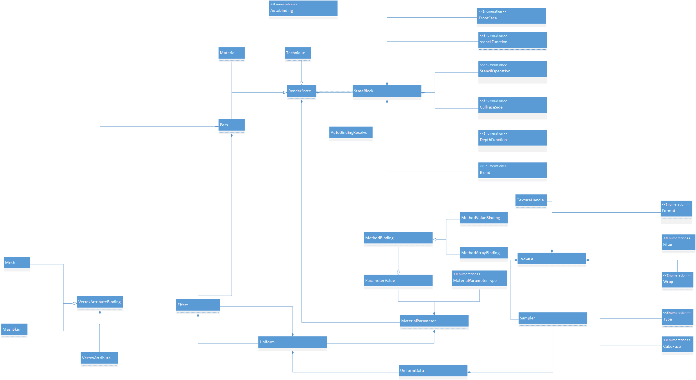

[<< 返回到主页](index.md)

**这里将介绍材质系统的博客文章**  

介绍完模型数据结构以及在引擎中使用中的格式后，接下来介绍材质系统。  

**概括图**  

  

先对上面的类做一个简单分析：
1. VertexAttributeBinding: 顶点属性绑定，对应着色器shader attribute变量  
2. RenderState： 渲染状态，主要是OpenGl参数设置  
3. Uniform： 着色器uniform变量，其中Uniform保存着UniformData，而UniformData包含了Sampler，Sampler保留了Texture  

上面三个主要信息都保存在Pass里，则Pass是主要分析的对象。   

**1 材质文件介绍**  
先看一下一个材质文件的格式：  
```
material house_12
{
    technique 0
    {
        pass 0
        {
            //shaders and defines
            vertexShader = res/shaders/textured.vert
            fragmentShader = res/shaders/textured.vert
            defines = 
            //uniforms
            u_worldViewProjectionMatrix = WORLD_VIEW_PROJECTION_MATRIX

            //samplers
            sampler u_diffuseTexture
            {
                path = house_12_1.png
                mipmap = true
            }
            renderState
            {
                depthTest = true
            }
        }
    }
}
material house_12_1
{
    technique 0
    {
        pass 0
        {
            //shaders and defines
            vertexShader = res/shaders/textured.vert
            fragmentShader = res/shaders/textured.vert

            //uniforms
            u_worldViewProjectionMatrix = WORLD_VIEW_PROJECTION_MATRIX

            //samplers
            sampler u_diffuseTexture
            {
                path = house_12_1.png
                mipmap = true
            }
            renderState
            {
                depthTest = true
            }
        }
    }
}
```
上面的材质文件解析由Properties类来完成，获得命名空间以及空间名称，获得key-value对等信息  

通过材质文件可以清楚的知道：  
1. material可以有多个，当有多个时认为模型存在多个子模型，子模型记录了材质名对应到材质文件里的材质。material下面存在Technique，可以是多个。这里主要记录了渲染状态以及包含不止1个Pass。Pass很重要，里面记录了渲染状态，着色器文件，贴图以及着色器里需要绑定Uniform数据(程序预留了多个变量，材质里面写上这边变量时，程序会自动解析然后设置参数到着色器的Uniform变量里)。     
2. 其中Material和Technique层设置的变量为系统预留的变量，这部分的值针对着色器对应的变量，这部分的数据是规定的，所以不能自己随意去写  
3. u_worldViewProjectionMatrix就是一个预留的变量，着色器里需要有这个uniform变量。程序会根据WORLD_VIEW_PROJECTION_MATRIX这个值来获取具体的数据传递给着色器u_worldViewProjectionMatrix变量  
4. defines变量是针对着色器文件文言。着色器文件有多个宏设置编译选项，材质文件加上defines可以改变着色器的编译。  
5. vertexShader和fragmentShader对应的是着色器的文件路径  
6. sampler定义了纹理贴图的格式，包含了参数Wrap和Filter以及mipmap是否开启  
7. renderState即为OpenGL的渲染状态值设置。  

**2 绘制代码**  
```
for (unsigned int i = 0; i < partCount; ++i)
{
    SubModel *subModel = mSubModels[i];
    if (!subModel->IsVisible())
        continue;
    MeshPart *part = subModel->GetMeshPart();
    GP_ASSERT(part);

    // Get the material for this mesh part.
    Material *material = GetMaterial(i);
     // No mesh parts (index buffers).
    if (material)
    {
        if (mNode)
            material->SetNodeBinding(mNode);
        Technique *technique = material->GetTechnique();
        GP_ASSERT(technique);
        unsigned int passCount = technique->GetPassCount();
        for (unsigned int j = 0; j < passCount; ++j)
        {
            Pass *pass = technique->GetPassByIndex(j);
            GP_ASSERT(pass);
            pass->Bind();
            GL_ASSERT(glBindBuffer(GL_ELEMENT_ARRAY_BUFFER, part->GetIndexBuffer()));
            if (!wireframe || !DrawWireframe(part))
            {
                GL_ASSERT( glDrawElements(part->GetPrimitiveType(), part->GetIndexCount(), part->GetIndexFormat(), 0) );
            }
            pass->Unbind();
            triangleCount += part->GetTriangleCount();
        }
    }
}
```
解释：  
1. mNode是包含了世界坐标变换等信息，模型本地信息与世界信息的桥梁  
2. SubModel表示每一个子模型，与MeshPart对应  
3. `material->SetNodeBinding(mNode);`这句绑定着色器uniform的一些内置变量值，当然pass里面可以进行覆盖。这句内部，Technique也执行了同样的处理   
4. `pass->Bind();`这个很重要，主要完成了3个绑定：  
    1. `mEffect->Bind();`这句是glProgram的使用，事先就已经创建，并且链接和编译了着色器，也通过OpenGL函数获取了里面的Uniform和Attribute变量数组  
    2. `RenderState::Bind(this);`这个就是一些OpenGL状态的设定，通过材质获得状态信息  
    3. `mVaBinding->Bind();`这句是绑定vao。在此之前就创建了vao以及绑定了顶点数据的vbo且设置好了顶点属性信息，如此着色器能解析到attribute数据  
5. `glBindBuffer`这里是绑定索引数据的vbo，此之前vao已绑定。接下来glDrawElements完成一次绘制  
6. 当一次Pass使用完后，进行`pass->Unbind();`,然后再使用下一个Pass，Technique和Material，如果存在的话  

**3 初始化创建**  
上面介绍了材质文件和绘制代码结构，那么接下来描述数据如何创建。  

**3.1 材质文件读取**  
由于一个模型可能存在多个子模型，则遍历所有的模型并建立对应的材质：  
```
if (materialFileName && strlen(materialFileName))
{
    for (__u32 i=0; i<mesh->GetPartCount(); i++)
    {
        Material *material = 0;
        std::string materialPath = materialFileName;
        materialPath.append("#");
        materialPath.append(model->GetSubModel(i)->GetMaterialName());
        material = Material::Create(materialPath.c_str());
    }
}
```
每个材质文件包含了多个子模型的材质，按照子模型的材质名找到对应的材质。  
如下进行创建材质，首相需要读取材质文件信息：  
```
Properties *Properties::Create(const char *url)
{
    std::string urlString = url;
    std::string fileString;
    std::vector<std::string> namespacePath;
    calculateNamespacePath(urlString, fileString, namespacePath);
    Stream stream(Open(fileString.c_str(),READ, true));
    Properties *properties = new Properties(stream.get());
    properties->ResolveInheritance();
    stream->Close();
    Properties *p = getPropertiesFromNamespacePath(properties, namespacePath);
    p->SetDirectoryPath(FileSystem::GetDirectoryName(fileString.c_str()));
    return p;
}
```

然后根据材质信息进行Material数据的设置：  
```
Material *Material::Create(Properties *materialProperties, PassCallback callback, void *cookie)
{
    // Create new material from the file passed in.
    Material *material = new Material();
    material->SetId(materialProperties->GetId());  
    // Load uniform value parameters for this material.
    LoadRenderState(material, materialProperties);
    Properties *techniqueProperties = NULL;
    while ((techniqueProperties = materialProperties->GetNextNamespace()))
    {
        if (strcmp(techniqueProperties->GetNamespace(), "technique") == 0)
        {
            LoadTechnique(material, techniqueProperties, callback, cookie);
        }
    }
    // Set the current technique to the first found technique.
    if (material->GetTechniqueCount() > 0)
    {
        Technique *t = material->GetTechniqueByIndex(0);
        if (t)
        {
            material->mCurrentTechnique = t;
        }
    }
    return material;
}
```
1. `LoadRenderState(material, materialProperties);`读取配置参数数据：  
    1. 内置变量(这里是一个string值)  
    2. 自定义变量(NONE,STRING,NUMBER,VECTOR2,VECTOR3,VECTOR4,MATRIX)。其中非常用的类型均使用String来保存且记为自动绑定变量    
    3. 读取Sampler子命名空间  
        1. 读取path    
        2. 读取mipmap  
        3. 读取wrapS  
        4. 读取wrapT  
        5. 读取minFilter  
        6. 读取magFilter  
    4. 读取RenderState子命名空间  
        1. 读取 blend  
        2. 读取 blendSrc 或 srcBlend  
        3. 读取 blendDst 或 dstBlend   
        4. 读取 cullFace  
        5. 读取 cullFaceSide  
        6. 读取 frontFace  
        7. 读取 depthTest  
        8. 读取 depthWrite  
        9. 读取 depthFunc  
        10. 读取 stencilTest  
        11. 读取 stencilWrite  
        12. 读取 stencilFunc  
        13. 读取 stencilFuncRef  
        14. 读取 stencilFuncMask  
        15. 读取 stencilOpSfail  
        16. 读取 stencilOpDpfail  
        17. 读取 stencilOpDppass  
2. 寻找Technique命名空间，进行加载数据  
    1. `LoadRenderState(technique, materialProperties);`与上面类似  
    2. 需找所有的Pass进行加载  
        1. 读取 vertexShader  
        2. 读取 fragmentShader  
        3. 读取 defines  
        4. `LoadRenderState(pass, materialProperties);`与上面类似    
        5. 根据着色器和defines初始化Pass   
            1. 创建 Effect `Effect::CreateFromFile(vshPath, fshPath, defines);`  
                1. 将defines信息插入到着色器的文本信息开头处  
                2. glCreateShader，glShaderSource，glCompileShader编译着色器  
                3. glCreateProgram，glAttachShader，glLinkProgram，glDeleteShader创建program  
                4. glGetActiveAttrib，glGetAttribLocation 保存所有的顶点attribute的索引等信息  
                5. glGetProgramiv， glGetActiveUniform，glGetUniformLocation创建Uniform数组保存uniform变量信息  
                6. 设置program id等值到Effect  
3. Material设置一个Technique  

解释：  
1. Uniform变来那个分自动绑定变量和自定义变量  
    1.  自定义变量：NUMBER,VECTOR2,VECTOR3,VECTOR4,MATRIX这类数据，通过Effect的SetValue来直接设置  
    2.  自动绑定变量： 变量名的值是内置的STRING。这部分的数据保存在一张map<string, string>结构里，uniform变量名和内置变量值。  
        1. 内置解析器  
            1. WORLD_MATRIX  
            2. VIEW_MATRIX  
            3. PROJECTION_MATRIX  
            4. WORLD_VIEW_MATRIX  
            5. VIEW_PROJECTION_MATRIX  
            6. WORLD_VIEW_PROJECTION_MATRIX  
            7. INVERSE_TRANSPOSE_WORLD_MATRIX  
            8. INVERSE_TRANSPOSE_WORLD_VIEW_MATRIX  
            9. CAMERA_WORLD_POSITION  
            10. CAMERA_VIEW_POSITION  
            11. MATRIX_PALETTE  
            12. SCENE_AMBIENT_COLOR  
        2. 自定义解析器(TerrainAutoBindingResolver)  
            1. TERRAIN_LAYER_MAPS  
            2. TERRAIN_NORMAL_MAP  
            3. TERRAIN_ROW  
            4. TERRAIN_COLUMN          
    3.  对于自动绑定变量进一步解析,获得 MaterialParameter   

上面的过程时完成了Material的解析创建，将Material与Model进行绑定：  
```
model->SetMaterial(material, i);
```
其中i表示第i个子模型  
代码内部主要执行代码：  
```
void Model::BindMaterial(Material *material)
{
    for (unsigned int i = 0, tCount = material->GetTechniqueCount(); i < tCount; ++i)
    {
        Technique *t = material->GetTechniqueByIndex(i);
        for (unsigned int j = 0, pCount = t->GetPassCount(); j < pCount; ++j)
        {
            Pass *p = t->GetPassByIndex(j);
            VertexAttributeBinding *b;
            if (mSkin && !mSkin->IsHardwareSkinning())
                b = VertexAttributeBinding::Create(mSkin, p->GetEffect());
            else
                b = VertexAttributeBinding::Create(mMesh, p->GetEffect());
            p->SetVertexAttributeBinding(b);
        }
    }
}
```
上面的信息主要是创建 VertexAttributeBinding ，分了MeshSkin 和 Mesh 创建。  
接下来就看下 VertexAttributeBinding 的创建过程：  
```
VertexAttributeBinding *VertexAttributeBinding::Create(MeshSkin *skin, const VertexFormat &vertexFormat, void *vertexPointer, Effect *effect)
{
    // Create a new VertexAttributeBinding.
    VertexAttributeBinding *b = new VertexAttributeBinding();
    if (skin && glGenVertexArrays)
    {
        GL_ASSERT( glBindBuffer(GL_ARRAY_BUFFER, 0) );
        GL_ASSERT( glBindBuffer(GL_ELEMENT_ARRAY_BUFFER, 0) );
        
        // Use hardware VAOs.
        GL_ASSERT( glGenVertexArrays(1, &b->mHandle) );
        
        if (b->mHandle == 0)
        {
            GP_ERROR("Failed to create VAO handle.");
            SAFE_DELETE(b);
            return NULL;
        }
        
        // Bind the new VAO.
        GL_ASSERT( glBindVertexArray(b->mHandle) );
        
        // Bind the Mesh VBO so our glVertexAttribPointer calls use it.
        GL_ASSERT( glBindBuffer(GL_ARRAY_BUFFER, skin->GetVertexBuffer()) );
    }
    
    if (skin)
    {
        b->mSkin = skin;
    }  
    b->mEffect = effect;
    effect->AddRef();
    std::string name;
    unsigned int offset = 0;
    for (unsigned int i = 0, count = vertexFormat.GetElementCount(); i < count; ++i)
    {
        const VertexFormat::Element &e = vertexFormat.GetElement(i);
        VertexAttribute attrib;
        switch (e.usage)
        {
            case VertexFormat::POSITION:
                attrib = effect->GetVertexAttribute(VERTEX_ATTRIBUTE_POSITION_NAME);
                break;
            case VertexFormat::NORMAL:
                attrib = effect->GetVertexAttribute(VERTEX_ATTRIBUTE_NORMAL_NAME);
                break;
            case VertexFormat::COLOR:
                attrib = effect->GetVertexAttribute(VERTEX_ATTRIBUTE_COLOR_NAME);
                break;
            case VertexFormat::TANGENT:
                attrib = effect->GetVertexAttribute(VERTEX_ATTRIBUTE_TANGENT_NAME);
                break;
            case VertexFormat::BINORMAL:
                attrib = effect->GetVertexAttribute(VERTEX_ATTRIBUTE_BINORMAL_NAME);
                break;
            case VertexFormat::BLENDWEIGHTS:
                attrib = effect->GetVertexAttribute(VERTEX_ATTRIBUTE_BLENDWEIGHTS_NAME);
                break;
            case VertexFormat::BLENDINDICES:
                attrib = effect->GetVertexAttribute(VERTEX_ATTRIBUTE_BLENDINDICES_NAME);
                break;
            case VertexFormat::TEXCOORD0:
                if ((attrib = effect->GetVertexAttribute(VERTEX_ATTRIBUTE_TEXCOORD_PREFIX_NAME)) != -1)
                    break;
                
            case VertexFormat::TEXCOORD1:
            case VertexFormat::TEXCOORD2:
            case VertexFormat::TEXCOORD3:
            case VertexFormat::TEXCOORD4:
            case VertexFormat::TEXCOORD5:
            case VertexFormat::TEXCOORD6:
            case VertexFormat::TEXCOORD7:
                name = VERTEX_ATTRIBUTE_TEXCOORD_PREFIX_NAME;
                name += '0' + (e.usage - VertexFormat::TEXCOORD0);
                attrib = effect->GetVertexAttribute(name.c_str());
                break;
            default:
                // This happens whenever vertex data contains extra information (not an error).
                attrib = -1;
                break;
        }
        void *pointer = vertexPointer ? (void*)(((unsigned char*)vertexPointer) + offset) : (void*)offset;
        b->SetVertexAttribPointer(attrib, (GLint)e.size, GL_FLOAT, GL_FALSE, (GLsizei)vertexFormat.GetVertexSize(), pointer);
        offset += e.size * sizeof(float);
    }
    return b;
}

void VertexAttributeBinding::SetVertexAttribPointer(GLuint indx, GLint size, GLenum type, GLboolean normalize, GLsizei stride, void *pointer)
{
    if (mHandle)
    {
        // Hardware mode.
        GL_ASSERT( glVertexAttribPointer(indx, size, type, normalize, stride, pointer) );
        GL_ASSERT( glEnableVertexAttribArray(indx) );
    }
}
```
这里的代码可以看到，创建VertexAttributeBinding时，先根据VertexFormat的信息来锁定VertexAttribue的location值，然后根据location值来激活并且设置其大小  
解释：  
1. GLSL顶点attribute的变量命名规则   
```
// Graphics (GLSL)
#define VERTEX_ATTRIBUTE_POSITION_NAME              "a_position"
#define VERTEX_ATTRIBUTE_NORMAL_NAME                "a_normal"
#define VERTEX_ATTRIBUTE_COLOR_NAME                 "a_color"
#define VERTEX_ATTRIBUTE_TANGENT_NAME               "a_tangent"
#define VERTEX_ATTRIBUTE_BINORMAL_NAME              "a_binormal"
#define VERTEX_ATTRIBUTE_BLENDWEIGHTS_NAME          "a_blendWeights"
#define VERTEX_ATTRIBUTE_BLENDINDICES_NAME          "a_blendIndices"
#define VERTEX_ATTRIBUTE_TEXCOORD_PREFIX_NAME       "a_texCoord"
```
2. 根据VertexFormat的Usage来锁定变量名  
3. 根据变来那个名就能在Effect查找到location  
4. 通过location就能激活并且结合VertexFormat的size设置大小  


**总结**  
1. 此篇介绍了材质文件格式和加载过程,创建 Effect，创建Program，并保存Uniform和Attribute的信息   
2. 模型设置材质时初始化创建 VertexAttributeBinding， 创建 VAO且激活和设置顶点属性信息  
3. RenderState绑定代码中  
    1. 设置OpenGL状态  
```
    void RenderState::StateBlock::Restore(long stateOverrideBits)
{
    GP_ASSERT(mDefaultState);

    // If there is no state to restore (i.e. no non-default state), do nothing.
    if (mDefaultState->mBits == 0)
    {
        return;
    }

    // Restore any state that is not overridden and is not default
    if (!(stateOverrideBits & RS_BLEND) && (mDefaultState->mBits & RS_BLEND))
    {
        GL_ASSERT( glDisable(GL_BLEND) );
        mDefaultState->mBits &= ~RS_BLEND;
        mDefaultState->mBlendEnabled = false;
    }
    if (!(stateOverrideBits & RS_BLEND_FUNC) && (mDefaultState->mBits & RS_BLEND_FUNC))
    {
        GL_ASSERT( glBlendFunc(GL_ONE, GL_ZERO) );
        mDefaultState->mBits &= ~RS_BLEND_FUNC;
        mDefaultState->mBlendSrc = RenderState::BLEND_ONE;
        mDefaultState->mBlendDst = RenderState::BLEND_ZERO;
    }
    if (!(stateOverrideBits & RS_CULL_FACE) && (mDefaultState->mBits & RS_CULL_FACE))
    {
        GL_ASSERT( glDisable(GL_CULL_FACE) );
        mDefaultState->mBits &= ~RS_CULL_FACE;
        mDefaultState->mCullFaceEnabled = false;
    }
    if (!(stateOverrideBits & RS_CULL_FACE_SIDE) && (mDefaultState->mBits & RS_CULL_FACE_SIDE))
    {
        GL_ASSERT( glCullFace((GLenum)GL_BACK) );
        mDefaultState->mBits &= ~RS_CULL_FACE_SIDE;
        mDefaultState->mCullFaceSide = RenderState::CULL_FACE_SIDE_BACK;
    }
    if (!(stateOverrideBits & RS_FRONT_FACE) && (mDefaultState->mBits & RS_FRONT_FACE))
    {
        GL_ASSERT( glFrontFace((GLenum)GL_CCW) );
        mDefaultState->mBits &= ~RS_FRONT_FACE;
        mDefaultState->mFrontFace = RenderState::FRONT_FACE_CCW;
    }
    if (!(stateOverrideBits & RS_DEPTH_TEST) && (mDefaultState->mBits & RS_DEPTH_TEST))
    {
        GL_ASSERT( glDisable(GL_DEPTH_TEST) );
        mDefaultState->mBits &= ~RS_DEPTH_TEST;
        mDefaultState->mDepthTestEnabled = false;
    }
    if (!(stateOverrideBits & RS_DEPTH_WRITE) && (mDefaultState->mBits & RS_DEPTH_WRITE))
    {
        GL_ASSERT( glDepthMask(GL_TRUE) );
        mDefaultState->mBits &= ~RS_DEPTH_WRITE;
        mDefaultState->mDepthWriteEnabled = true;
    }
    if (!(stateOverrideBits & RS_DEPTH_FUNC) && (mDefaultState->mBits & RS_DEPTH_FUNC))
    {
        GL_ASSERT( glDepthFunc((GLenum)GL_LESS) );
        mDefaultState->mBits &= ~RS_DEPTH_FUNC;
        mDefaultState->mDepthFunction = RenderState::DEPTH_LESS;
    }
    if (!(stateOverrideBits & RS_STENCIL_TEST) && (mDefaultState->mBits & RS_STENCIL_TEST))
    {
        GL_ASSERT( glDisable(GL_STENCIL_TEST) );
        mDefaultState->mBits &= ~RS_STENCIL_TEST;
        mDefaultState->mStencilTestEnabled = false;
    }
    if (!(stateOverrideBits & RS_STENCIL_WRITE) && (mDefaultState->mBits & RS_STENCIL_WRITE))
    {
        GL_ASSERT( glStencilMask(RS_ALL_ONES) );
        mDefaultState->mBits &= ~RS_STENCIL_WRITE;
        mDefaultState->mStencilWrite = RS_ALL_ONES;
    }
    if (!(stateOverrideBits & RS_STENCIL_FUNC) && (mDefaultState->mBits & RS_STENCIL_FUNC))
    {
        GL_ASSERT( glStencilFunc((GLenum)RenderState::STENCIL_ALWAYS, 0, RS_ALL_ONES) );
        mDefaultState->mBits &= ~RS_STENCIL_FUNC;
        mDefaultState->mStencilFunction = RenderState::STENCIL_ALWAYS;
        mDefaultState->mStencilFunctionRef = 0;
        mDefaultState->mStencilFunctionMask = RS_ALL_ONES;
    }
    if (!(stateOverrideBits & RS_STENCIL_OP) && (mDefaultState->mBits & RS_STENCIL_OP))
    {
        GL_ASSERT( glStencilOp((GLenum)RenderState::STENCIL_OP_KEEP, (GLenum)RenderState::STENCIL_OP_KEEP, (GLenum)RenderState::STENCIL_OP_KEEP) );
        mDefaultState->mBits &= ~RS_STENCIL_OP;
        mDefaultState->mStencilOpSfail = RenderState::STENCIL_OP_KEEP;
        mDefaultState->mStencilOpDpfail = RenderState::STENCIL_OP_KEEP;
        mDefaultState->mStencilOpDppass = RenderState::STENCIL_OP_KEEP;
    }
}
```
2. 设置Uniform值，这里需要结合Node信息  
3. 贴图的Uniform设置  
```
void Effect::SetValue(Uniform *uniform, const Texture::Sampler *sampler)
{
    GP_ASSERT(uniform->GetType() == GL_SAMPLER_2D || uniform->GetType() == GL_SAMPLER_CUBE);
    GP_ASSERT((sampler->GetTexture()->GetType() == Texture::TEXTURE_2D && uniform->mType == GL_SAMPLER_2D) ||
              (sampler->GetTexture()->GetType() == Texture::TEXTURE_CUBE && uniform->mType == GL_SAMPLER_CUBE));

    bool needed = false;
    GL_ASSERT( glActiveTexture(GL_TEXTURE0 + uniform->GetIndex()) );
    const_cast<Texture::Sampler*>(sampler)->Bind();
    GL_ASSERT( glUniform1i(uniform->GetLocation(), uniform->GetIndex()) );
}
```
4. 材质存在层级关系，则在设置OpenGL状态值的时候，需要从上往下进行设置。  
    1. 上层设置  
        1. 子层设置，重置为子层  
        2. 子层没设置，以上层设置为准    
    2. 上层没设置  
        1. 子层设置，设置  
        2. 子层没设置，使用默认的    