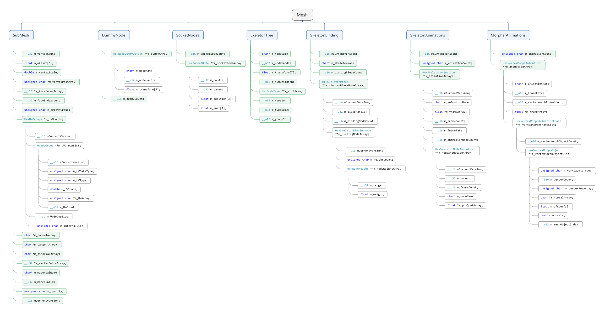
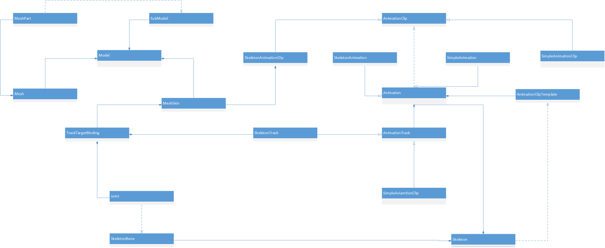
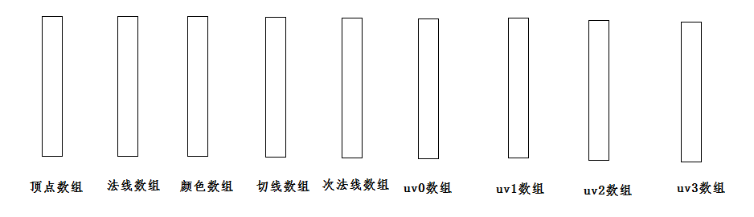
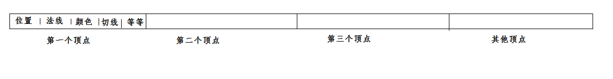
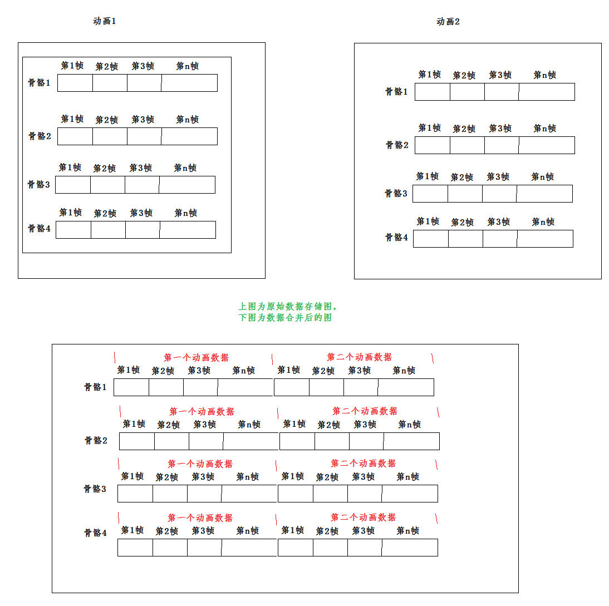

[<< 返回到主页](index.md)

**这里将介绍模型文件数据格式以及解析处理的博客文章**  

在前面的介绍中，清楚了模型数据分基础数据和动画数据，动画实质上是改变部分基础数据的值，但不改变其内存大小。其中可以将模型分成两类，一类是基本模型，不带动画；一类是动画模型，带有动画。  
对于这两类模型，OpenGL创建vbo，并设置缓冲区数据的参数是不一样的，一个是静态，一类是动态。静态的渲染比动态的性能高，原因是静态模型只需要一次传输(内存到显存)，而动态的模型需要每一帧都设置，传输时间上的消耗以及动画包房对数据改变的计算小韩。  

接下来介绍的模型格式是之前参与游戏引擎开发时自定义的一套采用二进制的文件格式。其中包含了基础数据和动画数据(包含节点动画，网格动画和骨骼动画)。在动画数据的介绍时，侧重点在骨骼动画。    

## **认识一些概念**  

1. 三角面存储格式  
    1. 顶点索引模式  
    2. 三角面模式  
    3. 三角带模式  
2. 数据压缩： float转short数据压缩  
3. 模型数据可有多个子模型  
4. 骨骼动画分两块数据：一是骨骼参考位置信息；二是动画中每根骨骼的关键帧数据  
5. 蒙皮绑定骨骼，涉及到顶点与骨骼的权重关系数据，一般一个顶点最多受4根骨骼影响  
6. 骨骼数据和蒙皮数据都坐标系：若蒙皮坐标系看成世界坐标系，则骨骼坐标系看成局部坐标系。蒙皮跟随骨骼变化而变化的计算过程：
    1. 将蒙皮数据v变换到受影响的骨骼坐标系下vl(骨骼参考信息求逆矩阵得到该变换矩阵)  
    2. 而后骨骼在关键帧下的变化，计算出改变换的世界坐标变换mr  
    3. 计算获得蒙皮v经过变化得到世界坐标系的位置vw = mr \* vl  
    4. 这里的世界坐标系即为蒙皮的坐标系，这个坐标系放在游戏场景下会是一个局部坐标系  
7. 对于一个物体的所有动画共用同一套骨骼    
8. 骨骼动画位移可带可不带  
9. 每个顶点信息包含  
    1. position 位置 3个float  
    2. normal   法线 3个float  
    3. color    颜色 4个float  
    4. tangent  切线 3个float  
    5. binormal 次发现 3个float  
    6. blend weight  权重值  4个float  
    7. blend indices 骨骼索引值 4个float   
    8. TEXCOORD0   默认贴图坐标 2个float  
    9. TEXCOORD1   光照贴图坐标 2个float  
    ...  
10. 关于morpher动画，节点动画和物体挂点后面会涉及到  

## **与模型相关的数据组织结构**  

先看一下整体的结构图：  
  

如果定义每个子物体为MeshObject，则数据定义为：  
```
enum MeshObjectOptionEnum
{
    MOO_LARGE_MESH          = 0x0080,
    MOO_COLLIDER            = 0x0040,
    MOO_CONTROLLABLE        = 0x0020,
    MOO_VERTEX_ANIMATION    = 0x0010,
    MOO_NO_COLLISION        = 0x0008,
    MOO_UVDIVIDED           = 0x0004,
    MOO_DENSITY             = 0x0002,
    MOO_INVISIBLE           = 0x0001,
};
enum
{
    MOT_UNKNOWN             = 0,
    MOT_TRIANGLES           = 1,
    MOT_INDEXED_PRIMITIVES  = 2,
    MOT_TRIANGLE_STRIPS     = 3,
};
enum
{
    DST_DEFAULT             = 0,
    DST_SHORT               = 1,
    DST_FLOAT               = 2,
};

// 版本号
__u16 mCurrentVersion;
// 一个掩码，有两个标识，低8位表示MeshObjectOptionEnum，8-12位表示数据是否压缩，高4位表示子模型是顶点索引模式，三角带还是三角面模式存储
__u16 m_mask;
// 模型名称
char m_meshObjectName[];
// 一个id，指父节点id
__u32 m_meshObjectHandle;
// 此模型id
__u32 m_parentHandle;

// 顶点个数
__u32 m_vertexCount;  
// 如果压缩，m_offset 为点集的中心点位置，做偏移处理
float m_offset[3];
// 缩放系数，同uv一样
double m_vertexScale; 
// 顶点数据可能被压缩 
unsigned char *m_vertexPosArray;  
// 如果是顶点索引模式，这里m_faceIndexArray != 0
__u16 *m_faceIndexArray;
// 面索引数量
__u32 m_faceIndexCount;
// 是否做了平滑处理
unsigned char m_smoothGroup;

// 法线数组
char *m_normalArray;
// 切向量数组
char *m_tangentArray;
// 次发现数组
char *m_binormalArray;
// 顶点颜色数组
__u32 *m_vertexColorArray;
// uv组
HexUVGroups *m_uvGroups;
// 材质名
char m_materialName[];
// 材质id
__u32 m_materialId; 
// 是否透明设置
unsigned char m_opacity;
```

其中HexUVGroups:  
```
HexUVGroup **m_UVGroupList; // uv组，默认美术会提供一套  
__u32 m_UVGroupSize; // 若大于65535，则为较大的模型
unsigned char m_internalSize; // uv组个数
__u16 mCurrentVersion;// 版本号
```

HexUVGroup信息为：  
```     
enum
{
    UVT_DEFAULT     = 0,        //default, equal uv for base-texture
    UVT_NORMAL_MAP  = 1,        //uv for normal/gloss map
    UVT_LIGHT_MAP   = 2,        //uv for light-map
    UVT_RESERVE     = 3,        //maxium texture layer 
};

__u16 mCurrentVersion; // 版本号
unsigned char m_UVDataType; // 压缩为short，非压缩为float
unsigned char m_UVType; // 默认贴图，光照贴图，法线贴图
double m_UVScale; // 压缩后，缩放系数  
unsigned char *m_UVArray;// uv数据，根据m_UVDataType读取，每两个为一个坐标
__u32 m_UVCount; // uv的个数
```

节点动画单个节点结构HexSocketNode：  
```
// 当前id
__u32 m_handle;
// 当前父id
__u32 m_parent;
// 位置
float m_position[3];
// 旋转
float m_quat[4];
```
节点动画结构:  
```
__u16 m_socketNodeCount;
HexSocketNode **m_socketNodeArray;
```

物体的一个挂点结构HexNodeDummyObject：  
```
// 挂点名
char m_nodeName[]; 
// 挂点id
__u32 m_nodeHandle;
// 挂点空间信息
float m_transform[7];
```

物体的一个挂点数组HexNodeDummy：  
```
// 挂点数
__u16 m_dummyCount;
// 挂点数组
HexNodeDummyObject **m_dummyArray;
```

骨骼带有层级关系，用一棵树来描述HexNodeTree：  
```
// 版本号
__u16 mCurrentVersion;
// 骨骼名称
char m_nodeName[];
// id
__u32 m_nodeHandle;
// 初始值，平移3个float，旋转4个float
float m_transform[7];
// 子节点数
__u16 m_numChildren;
// 子节点数组
HexNodeTree **m_children;
// 组id(对骨骼分组)
__u16 m_groupId;
```

接下来说明每一个顶点绑定到骨骼的数据HexSkeletonBindingNode：  
```
struct HexNodeWeight
{
    // 骨骼id
    __u32 m_target;
    // 权重值
    float m_weight;
}
// 顶点受骨骼影响的数量(最多为4个)
unsigned char m_weightCount;
// 权重数组
HexNodeWeight **m_nodeWeightArray;
// 当前版本号
__u16 mCurrentVersion;
```

每一个子模型对应的绑定数据HexSkeletonPiece：
```
// 版本号
__u16 mCurrentVersion;
// id值，对应子模型
__u32 m_pieceHandle;
// 对应子模型顶点数
__u16 m_bindingNodeCount;
// 子模型顶点绑定数组
HexSkeletonBindingNode **m_bindingNodeArray;
```

每一个模型的绑定数据HexSkeletonBinding：  
```
// 名称
char m_skeletonName[];
// 对应子模型个数
__u16 m_bindingPieceCount;
// 子模型数组
HexSkeletonPiece **m_bindingPieceNodeArray;
// 当前版本号
__u16 mCurrentVersion;
```

接下来分析骨骼动画数据：   
单独一根骨骼在一个动画上的关键帧数据HexSkeletonNodeAnimation：  
```
// 版本号
__u16 mCurrentVersion;
// 父id
__u32 m_parent;
// 帧数
__u16 m_frameCount;
// 7 * m_frameCount 关键帧数组
float *m_posQuatArray;
// 骨骼名
char m_boneName[64];
```

所有骨骼在一个动画上的数据HexSkeletonAnimation：  
```
// 动画名
char m_animationName[ANIM_NAME_SIZE + 1];
// 关键时间点序列 m_frameCount 个 float
float *m_frameArray;
// 帧数
__u16 m_frameCount;
// 帧率
__u16 m_frameRate;
// 所有骨骼的关键帧数据
HexSkeletonNodeAnimation **m_nodeAnimationArray;
// 骨骼数量
__u16 m_animationNodeCount;
// 版本号
__u16 m_version;
```

多个动画集合HexSkeletonAnimations：  
```
// 动画数量
unsigned char m_animationCount;
// 动画数据数组
HexSkeletonAnimation **m_animationArray;
// 版本号
__u16 mCurrentVersion;
```

变形Morpher动画数据分析  
每一个点的数据HexVertexMorphObject：  
```
// 数据类型
unsigned char m_vertexDataType; 
// 顶点维度
__u16 m_vertexCount;
// 顶点
unsigned char *m_vertexPosArray;
// 法线
char *m_normalArray;
// 偏移值
float m_offset[3];
// 缩放值
double m_scale;
// 对应object索引
__u32 m_meshObjectIndex;
```

一个顶点的morpher序列HexVertexMorphAnimationFrame：  
```
// 所有点的变形位置数组
HexVertexMorphObject **m_vertexMorphObjectList;
// 序列数量
__u16 m_vertexMorphObjectCount;
```

一个morpher动画所有顶点的序列HexVertexMorphAnimation：  
```
// 动画名
char m_animationName[];
// 顶点序列数组
HexVertexMorphAnimationFrame **m_vertexMorphFrameList;
// 顶点数
__u16 m_vertexMorphFrameCount;
// 帧率
__u16 m_frameRate;
// 时间序列
float *m_frameArray;
```

所有morpher动画HexVertexMorphAnimations：  
```
// 动画数量
unsigned char m_animationCount;
// 动画数组
HexVertexMorphAnimation **m_animationArray;
```

## **渲染引擎对物体数据封装**  

先看一个简易的图片：  
  
先做简单的分析：  
1. 最顶层为Model类，其组合了Mesh，SubModel，MeshSkin  
2. Mesh包含了MeshPart，就是子模型  
3. SubModel对应MeshPart的数据，进一步封装  
4. MeshSkin针对骨骼动画模型文件，与Mesh的封装有所不同，因为MeshSkin的顶点数据会随着动画而发生改变，所以每次都需要将数据传输带显卡里进行渲染   
5. Skeleton记录了动画骨骼和挂点骨骼，并且保留了Animation实例  
6. SkeletonBone封装的是动画骨骼初始化数据，以及骨骼的层级关系  
7. Joint是对SkeletonBone的封装，将树形的骨骼转化成数组，通过骨骼的id来遍历。  
8. MeshSkin保留Joint数组  
9. AnimationClipTemplate封装了一个动画的元数据。其中包含了动画名称，在SkeletonTrack的起始和结束索引，以及动画持续时长等等。  
10. Animation记录了所有AnimationTrack，以及所有动画的AnimationClipTemplate。根据动画名可以锁定一个的AnimationClipTemplate，然后通过AnimationClipTemplate可以创建一个AnimationClip  
11. SkeletonTrack继承子AnimationTrack记录一根动画骨骼在所有动画中的关键帧数据，关键帧数据在不同的动画之间插入一个末尾帧数据，其实就是合并所有的动画关键帧数据。  
12. SkeletionAnimation继承自Animation，主要针对骨骼动画，记录的就是SkeletonTrack。  
13. SimpleAnimation继承自Animation，主要针对一般性的动画，记录的就是SimpleAnimationTrack  
14. SkeletonClip继承自AnimationClip，针对骨骼动画  
15. SimpleAnimationClip继承自AnimationClip。针对一般动画  
16. Skeleton记录了动画骨骼和挂点骨骼，并且保留了Animation实例  
17. TrackTargetBinding将Joint和SkeletonTrack进行绑定，针对的是同一根骨骼。当SkeletonTrack变化时，将数据同步到Joint内，然后MeshSkin在渲染时根据Joint的数据对顶点做变换处理得到最新的位置，如此完成动画的播放。  

注意：根据第10点，如果动画是SkeletionAnimation，记录的是SkeletonTrack，则根据AnimationClipTemplate创建SkeletonClip；如果动画是SimpleAnimation，记录的是SimpleAnimationTrack，则根据AnimationClipTemplate创建SimpleAnimationClip。  

**对基础数据的处理**  

先前介绍的顶点数据格式：  
  
然后解析时，顶点数据格式为：  
  

通过这两张图片可以对比，最终所有的顶点的信息以一张大的一维数组表示，比如每个顶点的字节数为stripe,顶点的个数为 n，则总大小为 n \* stripe， 接下来分析stripe到底是多大？   
由模型数据可以定位是否有位置，法线，颜色，切线，次法线，uv等信息的：  
```
enum Usage
{
    POSITION = 1,
    NORMAL = 2,
    COLOR = 3,
    TANGENT = 4,
    BINORMAL = 5,
    BLENDWEIGHTS = 6,
    BLENDINDICES = 7,
    TEXCOORD0 = 8,
    TEXCOORD1 = 9,
    TEXCOORD2 = 10,
    TEXCOORD3 = 11,
    TEXCOORD4 = 12,
    TEXCOORD5 = 13,
    TEXCOORD6 = 14,
    TEXCOORD7 = 15
};
class Element
{
public:
    Usage usage;
    unsigned int size;
};
VertexFormat::Element vertexElements[16];
__u32 count = 0;
if (hadVertex)
{
    vertexElements[count].usage = VertexFormat::POSITION;
    vertexElements[count].size = 3;
    count ++;
}
if (hadNormal)
{
    vertexElements[count].usage = VertexFormat::NORMAL;
    vertexElements[count].size = 3;
    count ++;
}
if (hadTangent)
{
    vertexElements[count].usage = VertexFormat::TANGENT;
    vertexElements[count].size = 3;
    count ++;
    vertexElements[count].usage = VertexFormat::BINORMAL;
    vertexElements[count].size = 3;
    count ++;
}
if (hadVertexColor)
{
    vertexElements[count].usage = VertexFormat::COLOR;
    vertexElements[count].size = 4;
    count ++;
}
if (assignBoneBinding)
{
    vertexElements[count].usage = VertexFormat::BLENDINDICES;
    vertexElements[count].size = 4;
    count ++;
    vertexElements[count].usage = VertexFormat::BLENDWEIGHTS;
    vertexElements[count].size = 4;
    count ++;
}
if (hadBaseUV)
{
    vertexElements[count].usage = VertexFormat::TEXCOORD0;
    vertexElements[count].size = 2;
    count ++;
}
if (hadLightMap)
{
    vertexElements[count].usage = VertexFormat::TEXCOORD1;
    vertexElements[count].size = 2;
    count ++;
}
if (hadNormalMap)
{
    vertexElements[count].usage = VertexFormat::TEXCOORD2;
    vertexElements[count].size = 2;
    count ++;
}

VertexFormat *vertexFormat = new VertexFormat(vertexElements, count);
```
上面的 VertexFormat 记录了 基础数据每一个点很重要的元数据信息。另外模型的顶点数vertexCount以及模型是否带有骨骼来设定dynamic，则根据这三个基础信息可以初始化Mesh：   
```
Mesh *Mesh::CreateMesh(const VertexFormat &vertexFormat, unsigned int vertexCount, bool dynamic)
{
    GLuint vbo;
    GL_ASSERT( glGenBuffers(1, &vbo) );
    GL_ASSERT( glBindBuffer(GL_ARRAY_BUFFER, vbo) );
    GL_ASSERT( glBufferData(GL_ARRAY_BUFFER, vertexFormat.GetVertexSize() * vertexCount, NULL, dynamic ? GL_DYNAMIC_DRAW : GL_STATIC_DRAW) );   
    Mesh *mesh = new Mesh(vertexFormat);
    mesh->mVertexCount = vertexCount;
    mesh->mVertexBuffer = vbo;
    mesh->mDynamic = dynamic;
    return mesh;
}
```
上面的glBufferData只是开辟了一块空间，并没有设置数据。根据之前的数据组织模型，可以读取模型所有顶点数据，并通过下面的方式设置：   
```
void Mesh::SetVertexData(const float *vertexData, unsigned int vertexStart, unsigned int vertexCount)
{
    GL_ASSERT( glBindBuffer(GL_ARRAY_BUFFER, mVertexBuffer) );
    if (vertexStart == 0 && vertexCount == 0)
    {
        GL_ASSERT( glBufferData(GL_ARRAY_BUFFER, mVertexFormat.GetVertexSize() * mVertexCount, vertexData, mDynamic ? GL_DYNAMIC_DRAW : GL_STATIC_DRAW) );
    }
    else
    {
        if (vertexCount == 0)
        {
            vertexCount = mVertexCount - vertexStart;
        }     
        GL_ASSERT( glBufferSubData(GL_ARRAY_BUFFER, vertexStart * mVertexFormat.GetVertexSize(), vertexCount * mVertexFormat.GetVertexSize(), vertexData) );
    }
}
```
我们这里的三角面的绘制模式为顶点索引，上面是设置了顶点数据，那索引的数据通过下面的方式爱设定：  
```
MeshPart *MeshPart::Create(Mesh *mesh, unsigned int meshIndex, const char *id, Mesh::PrimitiveType primitiveType, Mesh::IndexFormat indexFormat, unsigned int indexCount, bool dynamic, __u32 startingVertex, __u32 vertexCount)
{
    // Create a VBO for our index buffer.
    GLuint vbo;
    GL_ASSERT( glGenBuffers(1, &vbo) );
    GL_ASSERT( glBindBuffer(GL_ELEMENT_ARRAY_BUFFER, vbo) );
    
    unsigned int indexSize = 0;
    switch (indexFormat)
    {
        case Mesh::INDEX8:
            indexSize = 1;
            break;
        case Mesh::INDEX16:
            indexSize = 2;
            break;
        case Mesh::INDEX32:
            indexSize = 4;
            break;
        default:
            GP_ERROR("Unsupported index format (%d).", indexFormat);
            glDeleteBuffers(1, &vbo);
            return NULL;
    }
    
    GL_ASSERT( glBufferData(GL_ELEMENT_ARRAY_BUFFER, indexSize * indexCount, NULL, dynamic ? GL_DYNAMIC_DRAW : GL_STATIC_DRAW) );

    MeshPart *part = new MeshPart(id, startingVertex, vertexCount);
    part->mMesh = mesh;
    part->mMeshIndex = meshIndex;
    part->mPrimitiveType = primitiveType;
    part->mIndexFormat = indexFormat;
    part->mIndexCount = indexCount;
    part->mIndexBuffer = vbo;
    part->mDynamic = dynamic;
 
    switch (primitiveType)
    {
        case Mesh::TRIANGLES:
            part->mTriangleCount = part->mIndexCount / 3;
            break;
        case Mesh::TRIANGLE_STRIP:
            part->mTriangleCount = part->mIndexCount - 2;
            break;
        default:
            part->mTriangleCount = 0;
            break;
    }
    return part;
}
void MeshPart::SetIndexData(const void *indexData, unsigned int indexStart, unsigned int indexCount)
{
    GL_ASSERT( glBindBuffer(GL_ELEMENT_ARRAY_BUFFER, mIndexBuffer) );
    
    unsigned int indexSize = 0;
    switch (mIndexFormat)
    {
        case Mesh::INDEX8:
            indexSize = 1;
            break;
        case Mesh::INDEX16:
            indexSize = 2;
            break;
        case Mesh::INDEX32:
            indexSize = 4;
            break;
        default:
            GP_ERROR("Unsupported index format (%d).", mIndexFormat);
            return;
    }
    
    unsigned int count;
    if (indexStart == 0 && indexCount == 0)
    {
         GL_ASSERT( glBufferData(GL_ELEMENT_ARRAY_BUFFER, indexSize * mIndexCount, indexData, mDynamic ? GL_DYNAMIC_DRAW : GL_STATIC_DRAW) );
    }
    else
    {
        if (indexCount == 0)
        {
            indexCount = mIndexCount - indexStart;
        }
        
        GL_ASSERT( glBufferSubData(GL_ELEMENT_ARRAY_BUFFER, indexStart * indexSize, indexCount * indexSize, indexData) );
    }
}
```
上面创建索引的vbo和设置数据，与顶点数据类似，区别主要是这里是GL_ELEMENT_ARRAY_BUFFER而不是GL_ARRAY_BUFFER绑定vbo和设置数据。  

对上面的处理过程进行回顾：  
1. 所有的顶点以GL_ARRAY_BUFFER的模式放在一个Buffer里，这里会创建一个vbo。  
2. 然后每个子模型记录着每一个三角面在顶点数组中三个顶点的索引，从而构成一个索引数组，这个数组以GL_ELEMENT_ARRAY_BUFFER绑定和设置。有多少个子模型就会创建几个vbo。  
3. 在对一个模型进行渲染时，OpenGL需要一个VAO，这个vao数据会在材质那里创建，这里只是对数据进行绑定和设置。  

将上面建立好的Mesh结构创建一个Model，同时Mesh的MeshPart会对应到SubModel：  
```
Model *model = Model::Create(mesh);
```
到此，对基础数据解析与处理就介绍完成。那么，接下来介绍带有骨骼动画的模型。     

**对骨骼的处理**  

与骨骼相关的数据，封装到Skeleton类，其关联了骨骼数据和骨骼动画数据。  

处理挂点骨骼：  
```
void LoadDummy(Skeleton *skeleton, SkeletonBone *parent, HexNodeDummy *pNodeDummy)
{
    if (!pNodeDummy)
        return;
    for (__u16 i=0; i<pNodeDummy->GetNodeCount(); i++)
    {
        HexNodeDummy::HexNodeDummyObject *pObject = (*pNodeDummy)[i];
        FastMath::Vector3 pos(pObject->GetPosition());
        FastMath::Quaternion q(pObject->GetQuaternion());
        SkeletonBone *dummy = skeleton->AddBone(parent, pObject->GetNodeName(), pObject->GetNodeHandle(), pos, q, 0);//pNodeTree->GetGroupId());
    }
}
```
挂点都是独立的，并不存在根骨骼   

模型带有骨骼动画数据时，骨骼的层级关系会保存到一颗树形结构里，这棵树用SkeletonBone来构建  
```
SkeletonBone *LoadSkeletonBone(Skeleton *skeleton, SkeletonBone *parent, HexNodeTree *pNodeTree)
{
    Vector3 pos(pNodeTree->GetPosition());
    Quaternion q(pNodeTree->GetQuaternion());
    SkeletonBone *bone = skeleton->AddBone(parent, pNodeTree->GetNodeName(), pNodeTree->GetNodeHandle(), pos, q, pNodeTree->GetGroupId());
    assert(bone); 
    for (__u16 i=0; i<pNodeTree->GetChildrenCount(); i++)
    {
        SkeletonBone *child = LoadSkeletonBone(skeleton, bone, (*pNodeTree)[i]);
        assert(child);
    }    
    return bone;
}
```
Skeleton保存一个骨骼数组mRootBones，记录了挂点骨骼和骨骼动画的根骨骼。至此，骨骼的初始数据处理完毕。  

**骨骼动画数据处理**  
看一张动画关键帧数据的存储图：  
  

模型文件里每一个动画的数据为上图所示，每一根骨骼的在整个动画过程中的关键帧数据为一个数组。而在引擎处理时，将所有的动画叠加在一个，构成一个大的数组，并且建立动画元信息进行索引动画。  
1. SkeletonTrack记录一根根据的数据，即为下图所示
2. AnimationClipTemplate记录了每个动画的名称，关键帧在SkeletonTrack的起始和结束索引以及持续时长  
3. SkeletonAnimationClip对应的就是一个骨骼动画  
对于动画的处理暂时先介绍到这里，接下来介绍蒙皮相关的信息  

**蒙皮处理**  
蒙皮定义的类为MeshSkin。在模型数据里记录了蒙皮顶点受哪些骨骼影响以及影响的权重值，这一块的数据记录在MeshSkin里。  
蒙皮上的顶点最多受4根骨骼影响:    
```
HexSkeletonBinding *bindings = mMeshFile.GetSkeletonBinding();
if (bindings)
{
    unsigned int boneCount = skeleton->GetBoneCount(); 
    unsigned int bindingIndex = 0;
    for (unsigned int i=0; i<bindings->GetSkeletonBindingCount(); i++)
    {
        HexSkeletonPiece *bindingPiece = (*bindings)[i];
        for (unsigned int j=0; j<bindingPiece->GetBindingNodeCount(); j++)
        {
            HexMeshFileLibrary::HexSkeletonBindingNode *node = (*bindingPiece)[j];
            if ((boneCount > 32) || mForceSoftwareSkin)
            {
                switch (node->GetWeightCount())
                {
                    case 1:
                        meshSkin->SetBindingWeight(bindingIndex, (*node)[0]->m_weight, (*node)[0]->m_target);
                        break;
                    case 2:
                        meshSkin->SetBindingWeight(bindingIndex, (*node)[0]->m_weight, (*node)[0]->m_target, (*node)[1]->m_weight, (*node)[1]->m_target);
                        break;
                    case 3:
                        meshSkin->SetBindingWeight(bindingIndex, (*node)[0]->m_weight, (*node)[0]->m_target, (*node)[1]->m_weight, (*node)[1]->m_target, (*node)[2]->m_weight, (*node)[2]->m_target);
                        break;
                    case 4:
                        meshSkin->SetBindingWeight(bindingIndex, (*node)[0]->m_weight, (*node)[0]->m_target, (*node)[1]->m_weight, (*node)[1]->m_target, (*node)[2]->m_weight, (*node)[2]->m_target, (*node)[3]->m_weight, (*node)[3]->m_target);
                        break;
                    default:
                        meshSkin->SetBindingWeight(bindingIndex);
                        break;
                }
                bindingIndex ++;
            }
        }
    }
}
```

**MeshSkin设置变化的数据信息**
```
unsigned int vertexStride = 0;
for (unsigned int i=0; i<vertexFormat->GetElementCount(); i++)
{
    switch (vertexFormat->GetElement(i).usage)
    {
        case VertexFormat::POSITION:
        case VertexFormat::NORMAL:
        case VertexFormat::TANGENT:
        case VertexFormat::BINORMAL:
            vertexStride += sizeof(float) * 3;
            break;
    }
}
meshSkin->SetDynamicData(vertexData, vertexStride, vertexFormat->GetVertexSize());
```
什么样的数据是会被改变呢？就是顶点坐标，法线，切向量和次法线。这里先计算出一个顶点能被改变的字节数 vertexStride。下面代码中，mDynamicVertexStride表示一个点的字节数，vertexStride表示变化的字节数。meshData表示所有点的数据信息。  
```
void MeshSkin::SetDynamicData(const float *meshData, unsigned int vertexStride, unsigned int dynamicVertexStride)
{
    mDynamicVertexStride = dynamicVertexStride;
    mVertexStride = vertexStride;
    assert(meshData);
    assert(mBindingWeightCount);
    assert(mDynamicVertexStride);
    if (!mDynamicSkinData)
    {
        mVertices = (float *)realloc(mVertices, mBindingWeightCount * mVertexStride);
        mDynamicSkinData = (float *)realloc(mDynamicSkinData, mBindingWeightCount * mDynamicVertexStride);
    }
    memcpy(mDynamicSkinData, meshData, mBindingWeightCount * mDynamicVertexStride);
    for (unsigned int i=0; i<mBindingWeightCount; i++)
    {
        float *p = (float *)&((char *)mDynamicSkinData)[i * mDynamicVertexStride];
        SetSkinVertex(i, p);
    }
}
```

对MeshSkin穿件VBO的形式为(GL_DYNAMIC_DRAW)：  
```
void MeshSkin::CreateVertexBuffer(const VertexFormat &vertexFormat, unsigned int vertexCount)
{
    if (mVertexBuffer)
    {
        glDeleteBuffers(1, &mVertexBuffer);
        mVertexBuffer = 0;
    }
    GLuint vbo;
    GL_ASSERT( glGenBuffers(1, &vbo) );
    GL_ASSERT( glBindBuffer(GL_ARRAY_BUFFER, vbo) );
    mCachedVertexBufferSize = vertexFormat.GetVertexSize() * vertexCount;
    GL_ASSERT( glBufferData(GL_ARRAY_BUFFER, mCachedVertexBufferSize, NULL, GL_DYNAMIC_DRAW) );
    mVertexBuffer = vbo;
}
void MeshSkin::UpdateVertexData()
{
    GL_ASSERT( glBindBuffer(GL_ARRAY_BUFFER, mVertexBuffer) );
    GL_ASSERT( glBufferData(GL_ARRAY_BUFFER, mCachedVertexBufferSize, mDynamicSkinData, GL_DYNAMIC_DRAW) );
}
```
其中mDynamicSkinData数据是会变化的，比如动画在播放。  

**蒙皮数据随骨骼动画而改变的计算**  
Skeleton里记录的是根骨骼，是一个带有层次的，在MeshSkin将这个层次结构转换成了数组形式，以Joint表示，并与骨骼的id值对应。代码如下：  
```
void MeshSkin::SetBindingSkeleton(Skeleton *skeleton, bool cachedOneFirst, bool forceReset)
{
    //using cached skeleton-animation only when it defined in skeleton
    Skeleton::MeshMorpherDefine *cacheDefine = 0;
    if (cachedOneFirst)
        cacheDefine = skeleton->TryGetAnimationCache(this, false);

    bool forced = (cacheDefine && (mCachedAnimation == 0)) || (!cacheDefine && (mCachedAnimation != 0));
    forced |= forceReset;
    
    if ((skeleton == mBindingSkeleton) && !forced)
        return;
    ClearTrackBindings();
    if (mBindingSkeleton)
        mBindingSkeleton->Release();
    mBindingSkeleton = skeleton;
    OnAnimationCached(0);
    if (mBindingSkeleton)
    {
        mBindingSkeleton->AddRef();

        //build Joint list
        BuildJoints();
        //build track-target binding list
        BuildTrackTargetBindings(cacheDefine);
        
        if (cacheDefine)
            OnAnimationCached(cacheDefine->GetMeshMorpher());
    }
}

void MeshSkin::BuildJoints()
{
    SetJointCount(mBindingSkeleton->GetBoneCount());
    unsigned int jointIndex = 0;
    //Call Skeleton::BoneById to cache the bone id(s)
    mBindingSkeleton->BoneById(0);
    for (unsigned int i=0; i<mBindingSkeleton->GetMaximumBoneId() + 1; i++)
    {
        SkeletonBone *bone = mBindingSkeleton->BoneById(i);
        if (bone == 0)
            continue;
        Joint *joint = Joint::Create(bone->GetBoneName(), bone->GetBoneId());
        joint->SetJointTranslation(bone->GetBoneTranslation());
        joint->SetJointRotation(bone->GetBoneRotation());
        joint->SetJointColor(bone->GetBoneColor());

        joint->SetTranslation(bone->GetBoneTranslation());
        joint->SetRotation(bone->GetBoneRotation());
        joint->SetInverseBindPose(bone->GetInverseBindPos());

        SetJoint(joint, jointIndex);
        
        //restore herited structure
        SkeletonBoneList *parent = bone->GetOwner();
        if (parent && parent->IsBone())
        {
            Joint *parentJoint = GetJoint(static_cast<SkeletonBone *>(parent)->GetBoneName());
            assert(parentJoint);
            parentJoint->AddChild(joint);
        }
        jointIndex ++;
    }
    if (GetJointCount() > 0)
        SetRootJoint(GetJoint((unsigned int)0));
}
```

接下来说明数据是如何改变的SkeletonAnimationClip：  
```
void SkeletonAnimationClip::ApplyAnimationValues(float percentage, unsigned int startIndex, unsigned int endIndex, unsigned index, float currentTime)
{
    if (startIndex != (unsigned int)(-1))
    {
        __u32 enabledGroup = mTemplate->GetEnabledGroup();
        for (unsigned int i=0; i<mMeshSkin->GetTrackBindingCount(); i++)
        {
            MeshSkin::TrackTargetBinding &binding = mMeshSkin->GetTrackTargetBinding(i);
            if (!binding.enabled || !binding.target || !binding.track)
                continue;
            SkeletonTrack *track = binding.track;
            __u32 trackGroup = track->GetGroupId();
            if ((enabledGroup > 0) && (trackGroup > 0) && (trackGroup != enabledGroup))
                continue;
            AnimationValue *value = mValues[i];
            
            // Evaluate the point on track
            track->Evaluate(percentage, startIndex, endIndex, index, value->GetValues(), static_cast<Joint *>(binding.target)->GetLocalCurve());
            
            // Set the animation value on the target property.
            binding.target->SetAnimationPropertyValue(track->GetPropertyId(), value, GetBlendWeight());
        }
    }
}
```
上面在动画类中，保留了MeshSkin的实例，通过获得TrackTargetBinding(SkeletonTrack和Joint)，完成Joint值的改变。  
最后在Model的Draw函数里
```
void Draw()
{
    ....
    if (mSkin)
    {
        mSkin->ApplySoftwareSkin();
        mSkin->ApplyVertexMorphing();
    }
    ....
}

void MeshSkin::ApplySoftwareSkinPositionOnly(unsigned int dynamicDataWidth)
{
    float *vertexData = mVertices;
    float *dynamicVertexData = mDynamicSkinData;
    for (unsigned int i=0; i<mBindingWeightCount; i++)
    {
        //get skin vertex base data
        FastMath::Vector3 v(vertexData);
        MeshSkin::BindingWeight &weight = mBindingWeights[i];
        FastMath::Vector3 newV;
        for (unsigned int j=0; j<weight.count; j++)
        {
            Joint *joint = GetJointById(weight.boneIds[j]);
            FastMath::Vector3 v1 = v;
            
            FastMath::Matrix4 m;
            FastMath::Matrix4::Multiply(joint->GetWorldMatrix(), joint->GetInverseBindPose(), &m);
            m.TransformPoint(&v1);
            newV += v1 * weight.weights[j];
        }
        memcpy(dynamicVertexData, newV.data, sizeof(FastMath::Point3f));
        vertexData += 3;
        dynamicVertexData += dynamicDataWidth;
    }
}
```

上面的介绍中，描述了模型文件数据结构，骨骼动画如何改变蒙皮数据等等，还遗留了一个问题：介绍了vbo，但是没看到vao的创建？接下来在介绍材质系统的时候，会说到在哪里创建vao。

