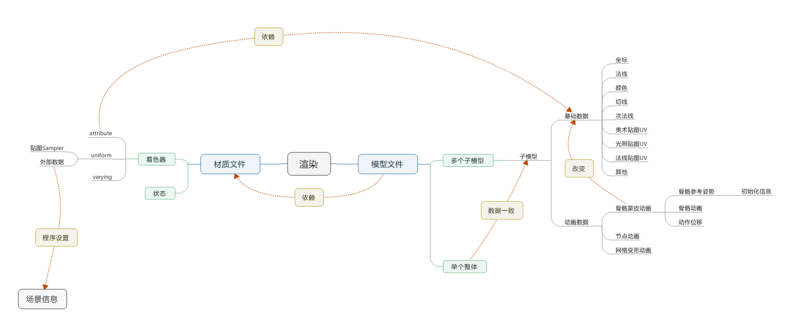

[<< 返回到主页](index.md)

**这里将介绍游戏场景的博客文章**  

**认识场景**  
1. 场景定义的坐标系为世界坐标系  
2. 物体自身的坐标系与世界坐标系通过一个Node来描述(Node包含了Transform变换数据)  
3. 物体与物体之间可能存在父子关系，兄弟关系或没关系等，通过Node来描述(Node是一颗树形结构且子节点是一颗双链表)  
4. 场景中必须包含相机，用Camera来表示  
5. 场景需要支持渲染操作RenderScene  
6. 场景进行渲染时，必须要遍历所有的物体，则Node的双链表结构来保存所有的Node，记录第一个Node和最后一个Node(Node两用)  
7. 场景除了遍历物体外，还需要支持查找物体  
8. 其他  

**场景附加信息**  
1. 场景名  
2. 场景绑定的背景音乐  
3. 场景的地形，用Terrain表示  
4. 场景的环境光设置，针对所有物体  
5. 场景中静态物体的光照贴图  
6. 其他  

**扩展功能**  
1. 通过给定一个包围球，查询包含的所有物体  
2. 通过给定一个包围盒，查询包含的所有物体  
3. 通过一条射线，查询相交的所有物体(并包含最近最远距离信息)  
4. 渲染前，使用截头体剔除来减少渲染物体  
5. 截头体剔除后，使用遮挡剔除，进一步减少完全被遮挡的物体  
6. 脚本功能(比如Lua支持)   
7. 其他  

**场景渲染队列**  
场景渲染需按照渲染队列来分类渲染  
1. 物体按层次分为天空，模型，界面，附加  
2. 物体按透明度有不透明和半透明之分  

则对所有物体根据层次和透明度分为：
天空不透明  
天空透明  
模型不透明  
模型透明  
界面半透明  
附加半透明  
物体渲染按照上面6种队列顺序绘制   

**物体真实渲染过程**     
接下来介绍物体被渲染的分解组成。根据OpenGL骨架代码可以清楚的认识，一个模型的渲染可以分3个主要模块：  
**1. 基础模块：OpenGL函数**  
**2. 材质模块：着色器和贴图**   
**3. 几何数据：模型文件**  

基础模块就像一颗大脑，支配着整个渲染过程；几何数据就是躯体，构建完美的形状；材质模块就像血液滋润着躯体。对于基础模块可以参考OpenGL基础介绍，接下来主要介绍几何数据和材质模块。

接下来看一张抽象图：  
  

这张图基本上包含了渲染的核心数据。简单做一个解释：  
1. 渲染需要的数据有材质数据和模型数据，同时模型数据会指定材质数据  
2. 模型文件中可能是一个完整的模型，也可能是由多个子模型组成，而完整的模型可以看成是只有一个子模型的模型结构，故主要分析子模型  
    1. 子模型包含了基础数据和动画数据  
    2. 基础数据构建了躯体的轮廓，以及包含了材质所需要的一些参数  
    3. 动画数据，实质上是对改变部分基础数据的值。在渲染之前，将动画对基础数据的改变进行同步，然后再进行渲染。   
    4. 基础数据包含：坐标，法线，切线，次法线，顶点颜色，默认uv，光照贴图uv，法线贴图uv等。  
    5. 动画数据，包含了节点动画，网格动画和骨骼动画。骨骼动画结合了节点动画和网格动画，目前使用最多的就是这类。其实还有物理动画，这个不在这里介绍。  
        1. 动画能改变的基础数据为坐标，法线，切线，次法线。  
        2. 动画数据包括一套基础骨骼，多个动作动画。基础骨骼作为其他动作设计的基本参考位置，每一个动作包含了每一根骨骼的关键帧数据。一般动作位移针对根骨骼而言。  
3. 材质文件涵盖两块信息：OpenGL的状态数据和可编程的着色器文件。  
    1. OpenGL是一个状态机，这些状态值可认为是全局变量，每绘制一个模型都应当去重置这些状态值，这样能保证各个独立模型之间的绘制想互不干扰。当然某些状态值可以共用，这需要你的应用业务比较熟悉。   
    2. 着色器文件：早前是固定的编程渲染管线，硬件来完成各阶段的计算；后来，对某些功能开放出来，供开发人员自行定义。目前必要的着色器是顶点着色器和片段着色器，着色器可看成应用程序与硬件计算的连接桥梁。接下来主要介绍着色器程序里的uniform和attribute变量，varying变量暂不作介绍。  
        1. Uniform： 这类变量的数据值是通过应用程序通过OpenGL API传入。解释下，应用程序的数据在内存里，那么需要将内存里的数据传入到着色器变量的显存里，OpenGL提供了这类函数。  
        2. Attribute： 这类数据是应用程序通过OpenGL函数指定数据片段位置。解释下，应用程序先将基础数据传入到显存而不是内存，应用程序再指定每一个attribute变量应该在显存里如何读取数据。  
        3. Textue纹理：这一块的数据属于uniform限定符，不过其数据的设置与一般的不同。纹理设置有单独的处理方式，在使用时留意一下。  

小结一下：  
1. uniform参数通过应用程序设置，attribute参数对应到几何数据。这两种操作方式都有对应的OpenGL函数。着色器可以看成是几何数据与模型材质的组成。在应用层封装时，通常将着色器封装到材质系统的一部分。  
2. 模型渲染实质上是数据驱动的抽象模式，对于渲染业务逻辑抽象，模型和材质作为实质的数据传入。  
接下来，会先分析模型数据  