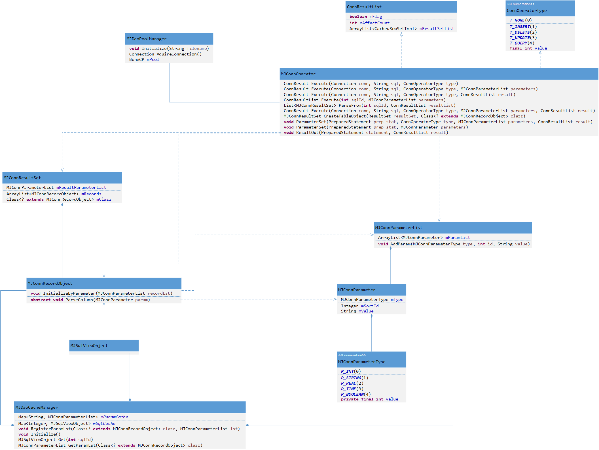

[<< 返回到上页](index.md)

**这里将介绍数据库封装的博客文章**  

[1. SQL的业务封装](#1)  
[2. 数据库连接池的封装](#2)  
[3. 结果集处理](#3)  

  

<span id="1"></span>
## **1. SQL的业务封装**  
对数据库的操作，是需要写SQL脚本，而SQL脚本有参数和执行结果集。那么将数据进行拆分为3块：  
1. sql参数  
2. sql执行结果  
3. sql脚本  

比如从t_user表里查找name="kay"的人，sql语句为:  
```
select name from t_user where name="kay";
```
返回一个结果：  

|name|
|:-:|
|kay|  

java里支持sql引入参数，通过程序去设置参数值：   
```
PreparedStatement pstmt = con.prepareStatement("UPDATE EMPLOYEES SET SALARY = ? WHERE ID = ?");
pstmt.setBigDecimal(1, 153833.00)
pstmt.setInt(2, 110592)
```

那么对上面的sql语句做改写：  
```
select name from t_user where name=?;
```
那么参数可以通过一定的规则进行封装。  
```
    public enum MJConnParameterType
    {
        P_INT(0),
        P_STRING(1),
        P_REAL(2),
        P_TIME(3),
        P_BOOLEAN(4);   
        private final int value;
        
        MJConnParameterType(int value) 
        {
            this.value = value;
        }
        public int getValue() 
        {
            return value;
        }
    }

    public class MJConnParameter implements Comparable<MJConnParameter>
    {
        public MJConnParameterType mType;
        public Integer mSortId;
        public String mValue;     
        public int toInt()
        {
            return Integer.valueOf(mValue);
        }
        public MJConnParameter()
        {
            
        }      
        public MJConnParameter(MJConnParameterType type, int id, String value)
        {
            mType = type;
            mSortId = id;
            mValue = value;
        }      
        public String toString()
        {
            return mValue;
        }      
        public float toReal()
        {
            return Float.valueOf(mValue);
        }       
        public boolean toBoolean()
        {
            return Boolean.valueOf(mValue);
        }     
        public Timestamp toTimestamp()
        {
            return Timestamp.valueOf(mValue);
        }    
        public MJConnParameterList toList()
        {
            MJConnParameterList list = new MJConnParameterList();
            list.AddParam(this);
            return list;
        }
        @Override
        public int compareTo(MJConnParameter o) {
            // TODO Auto-generated method stub
            return mSortId.compareTo(o.mSortId);
        }   
    }
```
其中参数是需要指定位置，即参数是在所有参数中的顺序索引mSortId。并且制指定其类型MJConnParameterType，参数值统一用String来表示。  

则上面的参数可以定义为：  
```
MJConnParameter para = new MJConnParameter(MJConnParameterType.P_STRING, 1, "kay");
```

一般sql会出现无参数或者至少存在一个参数的情形，那么我们的sql参数用一个数组来表示：  
```
public class MJConnParameterList
{
    ArrayList<MJConnParameter> mParamList;
    
    public MJConnParameterList()
    {
        mParamList = new ArrayList<>();
    }
    
    public void AddParam(MJConnParameterType type, int id, String value)
    {
        AddParam(new MJConnParameter(type, id, value));
    }
    
    public void AddParam(MJConnParameter param)
    {
        mParamList.add(param);
    }
    
    public void Sort()
    {
        Collections.sort(mParamList);
    }
    
    public int Size()
    {
        return mParamList.size();
    }
    
    public MJConnParameter GetAt(int index)
    {
        return mParamList.get(index);
    }
}
```

最后对sql语句和参数进行绑定，代码为：  
```
private void ParameterSet(PreparedStatement prep_stat, ConnOperatorType type, MJConnParameterList parameters, ConnResultList result) throws SQLException
{
    if (prep_stat != null)
    {
        int size = parameters.Size();
        for (int i = 0; i < size; ++i)
        {
            ParameterSet(prep_stat, parameters.GetAt(i));
        }
    }
}

private void ParameterSet(PreparedStatement prep_stat, MJConnParameter parameters) throws SQLException
{
    switch (parameters.mType)
    {
    case P_INT:
        prep_stat.setInt(parameters.mSortId, parameters.toInt());
        break;
    case P_STRING:
        prep_stat.setString(parameters.mSortId, parameters.toString());
        break;
    case P_REAL:
        prep_stat.setFloat(parameters.mSortId, parameters.toReal());
        break;
    case P_TIME:
        prep_stat.setTimestamp(parameters.mSortId, parameters.toTimestamp());
        break;
    case P_BOOLEAN:
        prep_stat.setBoolean(parameters.mSortId, parameters.toBoolean());
        break;
    default:
        break;
    }
}
```

参数的问题就处理完成了。接下来我们在对返回结果进行封装。  
一般sql操作为增删改查导，即：  
```
public enum ConnOperatorType
{
    T_NONE(0),
    T_INSERT(1),
    T_DELETE(2),
    T_UPDATE(3),
    T_QUERY(4);

    private final int value;

    ConnOperatorType(int value) {
        this.value = value;
    }

    public int getValue() {
        return value;
    }
}
```
对于增删改导返回的结果为影响行数，故对这一类返回值封装为：  
```
public class ConnResult
{
    public int mCountAffacted;
    public boolean mFlag;
    public ConnResult()
    {
        mCountAffacted = 0;
        mFlag = true;
    }
}
```
对于查询，会返回结果集，对这类返回值封装为：  
```
public class ConnResultList
{
    public boolean mFlag;
    public int mAffectCount;
    // 因为结果集可能是多个，所以用数组表示  
    private ArrayList<CachedRowSetImpl> mResultSetList;
    public ConnResultList()
    {
        mResultSetList = new ArrayList<>();
    }
    
    public int Size()
    {
        return mResultSetList.size();
    }
    
    public ResultSet Get(int index)
    {
        return mResultSetList.get(index);
    }
    
    public void AddResult(CachedRowSetImpl set)
    {
        mResultSetList.add(set);
    }
}
```

接下来sql参数和结果返回都已封装完毕，那么sql语句自身我们采用配置的形式，将其数据放在一个表里，每一个sql语句都会有一个唯一id值，后面通过id值来索引sql语句。  

<span id="2"></span>
## **2. 数据库连接池的封装**  
当然，我们最重要的就是数据库连接池了，通过与数据库的Connect来完成sql的操作。这里选用java的BoneCP包来封装数据里连接池。目前这个库已经不再维护，而转移到HikariCP这个库，可以用HikariCP来替换BoneCP。  

先来看一下数据库连接池的配置信息：  
```
<bonecp-config>
    <named-config name="default-config">
        <property name="minConnectionsPerPartition">3</property>
        <property name="maxConnectionsPerPartition">40</property>
        <property name="acquireIncrement">2</property>
        <property name="partitionCount">2</property>
        <property name="idleConnectionTestPeriodInMinutes">240</property>                
        <property name="idleMaxAgeInMinutes">60</property>
        <property name="idleMaxAgeInSeconds">3600</property>
        <property name="statementsCacheSize">2</property>
        <property name="closeConnectionWatch">false</property>
        <property name="acquireRetryDelayInMs">7000</property>
        <property name="lazyInit">false</property>
        <property name="transactionRecoveryEnabled">false</property>
        <property name="acquireRetryAttempts">5</property>
        <property name="disableJMX">false</property>
        <property name="queryExecuteTimeLimitInMs">30000</property>
        <property name="poolAvailabilityThreshold">20</property>
        <property name="disableConnectionTracking">false</property>
        <property name="connectionTimeoutInMs">30000</property>
        <property name="closeConnectionWatchTimeoutInMs">10</property>
        <property name="maxConnectionAgeInSeconds">1</property>
        <property name="statisticsEnabled">false</property>
        <property name="jdbcUrl">jdbc:mysql://localhost:3306/mj_server?useSSL=true&amp;characterEncoding=UTF-8</property>
        <property name="username">root</property>
        <property name="password">123qwe!@#</property>
        <property name="driverClass">com.mysql.jdbc.Driver</property>
        <property name="externalAuth">false</property>
    </named-config>
</bonecp-config>
```
BoneCP默认会选择default-config这个配置来启动连接池，当然可以自定义然后手动选择。这些参数你可以根据需求进行修改。  

对数据库连接池进行封装，全局类：  

```
public class MJDaoPoolManager
{
    public static MJDaoPoolManager instance = new MJDaoPoolManager();
    boolean isInitialized = false;
    private BoneCP mPool;
    
    private MJDaoPoolManager()
    {
        
    }
    
    public Connection AquireConnection() throws SQLException
    {
        return mPool.getConnection();
    }
    
    public void Initialize(String filename)
    {
        if (!isInitialized)
        {
            FileInputStream fileInputStream = null;
            try
            {
                fileInputStream = new FileInputStream(filename);
                BoneCPConfig config = new BoneCPConfig( fileInputStream, "default-config");
                mPool = new BoneCP(config);
            }
            catch (Exception e)
            {
                e.printStackTrace();
            }
            finally
            {
                if (fileInputStream != null)
                {
                    try 
                    {
                        fileInputStream.close();
                    } 
                    catch (IOException e) 
                    {
                        e.printStackTrace();
                    }
                }
            }
            isInitialized = true;
        }
    }
}
```
其中主要包括初始化连接池和获取连接AquireConnection()，到此数据库连接池就已经封装好了，很简单的使用。  

<span id="3"></span>
## **3. 结果集处理**  
对于有了连接，sql语句，参数，那么接下来就是执行获得结果。对于增删改操作而言，返回结果较容易，不做具体处理。这里对查询结果集做进一步封装。  
```
public class MJConnOperator
{
    public static MJConnOperator instance = new MJConnOperator();
    /// update insert delete, without parameters
    public ConnResult Execute(Connection conn, String sql, ConnOperatorType type)
    {
        return Execute(conn, sql, type, null, null);
    }
    
    /// update insert delete, within parameters
    public ConnResult Execute(Connection conn, String sql, ConnOperatorType type, MJConnParameterList parameters)
    {
        return Execute(conn, sql, type, parameters, null);
    }
    
    // query,without parameters
    public ConnResult Execute(Connection conn, String sql, ConnOperatorType type, ConnResultList result)
    {
        return Execute(conn, sql, type, null, result);
    }
    
    public ConnResultList Execute(int sqlId, MJConnParameterList parameters)
    {
        MJSqlViewObject sqlView = MJDaoCacheManager.Get(sqlId);
        if (sqlView == null)
        {
            return null;
        }
        if (sqlView.mOperatorType == MJConnOperator.ConnOperatorType.T_NONE)
        {
            return null;
        }
        ConnResultList resultList = new ConnResultList();
        Connection connection;
        try 
        {
            connection = MJDaoPoolManager.instance.AquireConnection();
            ConnResult result = Execute(connection, sqlView.mSqlStatement, sqlView.mOperatorType, parameters, resultList);
            resultList.mAffectCount = result.mCountAffacted;
            resultList.mFlag = result.mFlag;
        }
        catch (SQLException e) 
        {
            e.printStackTrace();
        }
        return resultList;
    }

}
```
其中最重要的函数为`ConnResultList Execute(int sqlId, MJConnParameterList parameters)`:  
1. 通过sqlId获得sql语句  
2. 通过MJDaoPoolManager.instance.AquireConnection()获得connection  
3. 然后执行sql语句获得结果集(这里只介绍结果集的处理)  
其中结果集会做进一步处理：  
```
public class MJConnResultSet
{
    private MJConnParameterList mResultParameterList;
    private ArrayList<MJConnRecordObject> mRecords;
    private Class<? extends MJConnRecordObject> mClazz;
    
    public MJConnResultSet(Class<? extends MJConnRecordObject> clazz)
    {
        mClazz = clazz;
        mResultParameterList = MJDaoCacheManager.GetParamLst(clazz);
        mRecords = new ArrayList<>();
    }
    
    public void HandleResult(ResultSet set)
    {
        try 
        {
            if (mResultParameterList == null)
            {
                mClazz.newInstance();
                mResultParameterList = MJDaoCacheManager.GetParamLst(mClazz);
            }
            while (set.next())
            {
                MJConnRecordObject t = mClazz.newInstance();
                Parse(set, t);
                mRecords.add(t);
            }
        } 
        catch (Exception e) 
        {
            e.printStackTrace();
        }
    }
    
    public ArrayList<MJConnRecordObject> GetObjects()
    {
        return mRecords;
    }
    
    private void Parse(ResultSet resultSet, MJConnRecordObject t) throws SQLException
    {
        int size = mResultParameterList.Size();
        // should have default constructor
        for (int i = 0; i < size; ++i)
        {
            MJConnParameter param = mResultParameterList.GetAt(i);
            param.mValue = resultSet.getString(param.mSortId.intValue());   
        }
        t.InitializeByParameter(mResultParameterList);
    }
}
```
根据结果集，可以分析：  
1. 结果集可能是多个  
2. 每个结果集存在多条记录  
3. 每条记录包含多个字段，则可以对每条记录封装成一个MJConnRecordObject  

```
public abstract class MJConnRecordObject
{   
    public MJConnRecordObject()
    {
        
    }
    // implement by derived class
    public void InitializeByParameter(MJConnParameterList recordLst)
    {
        int size = recordLst.Size();
        for (int i = 0; i < size; ++i)
        {
            MJConnParameter parameter = recordLst.GetAt(i);
            ParseColumn(parameter);
        }
    }
    
    protected abstract void ParseColumn(MJConnParameter param); 
    

}
```
这个是对每条记录的封装，具体的处理逻辑由子类完成，主要分两步：  
1. 初始化记录的解析参数  
2. 解析每一条记录  

其中初始化记录的解析参数需要注册到一张map表，示例：  
```
public class MJSqlViewObject extends MJConnRecordObject
{
     static
     {
         MJConnParameterList pLst = new MJConnParameterList();
         MJConnParameter parameter = pLst.new MJConnParameter();
         parameter.mType = MJConnParameterList.MJConnParameterType.P_INT;
         parameter.mSortId = 1;
         pLst.AddParam(parameter);
         parameter = pLst.new MJConnParameter();
         parameter.mType = MJConnParameterList.MJConnParameterType.P_STRING;
         parameter.mSortId = 2;
         pLst.AddParam(parameter);
         parameter = pLst.new MJConnParameter();
         parameter.mType = MJConnParameterList.MJConnParameterType.P_STRING;
         parameter.mSortId = 3;
         pLst.AddParam(parameter);
         parameter = pLst.new MJConnParameter();
         parameter.mType = MJConnParameterList.MJConnParameterType.P_INT;
         parameter.mSortId = 4;
         pLst.AddParam(parameter);
         MJDaoCacheManager.RegisterParamLst(MJSqlViewObject.class, pLst);
     }
    
    @Override
    protected void ParseColumn(MJConnParameter param) 
    {
        switch (param.mSortId)
        {
        case 1:
            mSqlId = param.toInt();
            break;
        case 2:
            mObjectIds = param.toString();
            break;
        case 3:
            mSqlStatement = param.toString();
            break;
        case 4:
            mOperatorType = GetType(param.toInt());
            break;
        }
    }
    
    ///
    ///T_INSERT(1),
    ///T_DELETE(2),
    ///T_UPDATE(3),
    ///T_QUERY(4);
    static ConnOperatorType GetType(int type)
    {
        switch(type)
        {
        case 1:
            return ConnOperatorType.T_INSERT;
        case 2:
            return ConnOperatorType.T_DELETE;
        case 3:
            return ConnOperatorType.T_UPDATE;
        case 4:
            return ConnOperatorType.T_QUERY;
        }
        return ConnOperatorType.T_NONE;
    }

    @Override
    public String toString() {
        StringBuilder builder = new StringBuilder();
        builder.append("MJSqlViewObject ( _sqlId: ").append(mSqlId).append(" _objectIds: ").append(mObjectIds).append(" _sql: ").append(mSqlStatement).append(" _type: ").append(mOperatorType).append(" )");
        return builder.toString();
    }
    
    public int mSqlId;
    public String mObjectIds;
    public String mSqlStatement;
    public ConnOperatorType mOperatorType;
}
```
这个MJSqlViewObject继承MJConnRecordObject，表明是一条结果集的记录。这条记录包含了结果集的每一个字段，其中：  
1. mSqlId为sql id，是一个int型  
2. mObjectIds为物体id，是一个String类型  
3. mSqlStatement具体的sql语句，String类型  
4. mOperatorType表明这个sql的操作类型，int类型  
故在最开始的static 函数里：  
```
         MJConnParameterList pLst = new MJConnParameterList();
         MJConnParameter parameter = pLst.new MJConnParameter();
         parameter.mType = MJConnParameterList.MJConnParameterType.P_INT;
         parameter.mSortId = 1;
         pLst.AddParam(parameter);
         parameter = pLst.new MJConnParameter();
         parameter.mType = MJConnParameterList.MJConnParameterType.P_STRING;
         parameter.mSortId = 2;
         pLst.AddParam(parameter);
         parameter = pLst.new MJConnParameter();
         parameter.mType = MJConnParameterList.MJConnParameterType.P_STRING;
         parameter.mSortId = 3;
         pLst.AddParam(parameter);
         parameter = pLst.new MJConnParameter();
         parameter.mType = MJConnParameterList.MJConnParameterType.P_INT;
         parameter.mSortId = 4;
         pLst.AddParam(parameter);
         MJDaoCacheManager.RegisterParamLst(MJSqlViewObject.class, pLst);
```
提供了解析格式，如此得到的每一条记录按照这个顺序：  
```
    protected void ParseColumn(MJConnParameter param) 
    {
        switch (param.mSortId)
        {
        case 1:
            mSqlId = param.toInt();
            break;
        case 2:
            mObjectIds = param.toString();
            break;
        case 3:
            mSqlStatement = param.toString();
            break;
        case 4:
            mOperatorType = GetType(param.toInt());
            break;
        }
    }
```
获得对应的数据，最后就是一个完整的实例。  

最后，我们看一下外部初始化数据库操作的整体流程以及上述过程的调用关系：  
```
MJDaoPoolManager.instance.Initialize(MJPathConfig.getValue("bonecp_config"));       
MJDaoCacheManager.Initialize();
```
第一步为数据库连接池的初始化，这个很简单，第二部为初始化sql缓存，具体如下：  
```
    public static void Initialize()
    {
        try
        {
            // 此处为创建一个返回值，并没有什么数据
            ConnResultList result = MJConnOperator.instance.new ConnResultList();
            // 获得一个数据库连接
            Connection connection = MJDaoPoolManager.instance.AquireConnection();
            // 执行一条初始化sql语句，获取所有的sql配置信息，得到结果集
            ConnResult flag = MJConnOperator.instance.Execute(connection, "select sql_id, object_ids, sql_statement, sql_type from t_sql_view;", MJConnOperator.ConnOperatorType.T_QUERY, null, result);
            if (flag.mFlag)
            {
                // 对结果集进行处理(指明每一条记录为MJSqlViewObject对象，并按照这个对象的解析格式解析记录)
                MJConnResultSet resultSet = MJConnOperator.instance.CreateTableObject(result.Get(0), MJSqlViewObject.class);
                // 对结果集解析完成后，得到对象实例数组
                ArrayList<MJConnRecordObject> objects = resultSet.GetObjects();
                for (MJConnRecordObject obj : objects)
                {
                    System.out.println(obj);    
                    MJSqlViewObject sqlObject = (MJSqlViewObject)obj;
                    // 将sql id与sql语句做一个Hashmap，后面通过sql id来找到处理的sql
                    mSqlCache.put(sqlObject.mSqlId, sqlObject);
                }
            }
        } 
        catch (Exception e) 
        {
            e.printStackTrace();
        }
    }
```
