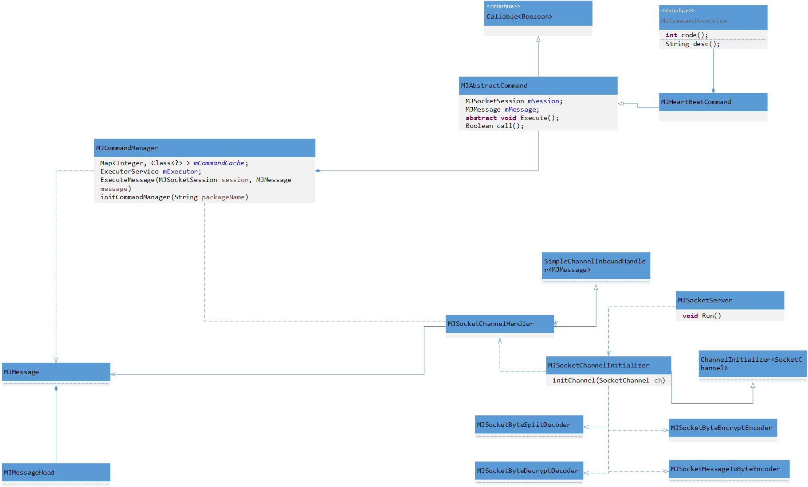

[<< 返回到上页](index.md)

**这里将介绍服务端业务封装的博客文章**  

此文基于java语言，使用netty网络库进行业务封装的骨架说明。  

[1. 全局配置](#1)  
[2. 命令行指令](#2)  
[3. 网络IP配置](#3)  
[4. 协议处理](#4)  

<span id="1"></span>
## **1. 全局配置**  

在做服务端开发之前，需要想清楚一些全局数据需要单独写在配置文件里。这部分数据是必要的且容易变化(基本上是固定的)且开发人员环境不同导致数据不同等等原因。可以理解成数据驱动，业务逻辑与数据值本身无关。那么配置这些数据，在程序运行时读取解析使用就显得非常必要了。有一部分原因是hard code这样的硬编码不利于后期数据变化导致重新打包等因素。  
在这里罗列一些基础的需要配置的数据：  

```
# 连接池配置文件
bonecp_config=./res/bonecp_config.xml
# 命令所在包名,动态加载
command=com.kl.command.impl
# 日志记录配置文件
log=./res/log4j.properties
# http 资源路径
http_res=./res
# 服务端ip和监听端口
ip_port=0:172.10.13.44:9898,1:172.10.13.44:8080
# 线程池的大小
thread_pool_size=400
# 是否开启数据库
openDb=0
...
...
```
配置信息即为参数信息，在java开发中使用Properties数据结构，类似于Map表。  
配置文件解析，加载到内存：  
```
public class MJPathConfig
{
    public static Properties mProperties = null;
    private static ReadWriteLock mLock = new ReentrantReadWriteLock(true);
    private static String mPath;

    public static boolean initConfig(String path)
    {
        if (path == null || path.equals(""))
        {
            return false;
        }

        mPath = path;
        if (mProperties == null)
        {
            return loadProperties(path);
        }
        return true;
    }

    public static boolean refreshProperties()
    {
        if (mPath == null || mPath.isEmpty())
            return false;

        try
        {
            Properties temp = new Properties();
            InputStream inputStream = new BufferedInputStream(
                    new FileInputStream(mPath));
            temp.load(inputStream);

            mLock.writeLock().lock();
            mProperties = temp;
        }
        catch (FileNotFoundException e)
        {
            return false;
        }
        catch (IOException e)
        {
            return false;
        }
        finally
        {
            mLock.writeLock().unlock();
        }
        return true;
    }

    private static boolean loadProperties(String path)
    {
        try
        {
            mLock.writeLock().lock();
            mProperties = new Properties();
            InputStream inputStream = new BufferedInputStream(
                    new FileInputStream(path));
            mProperties.load(inputStream);
            return true;
        }
        catch (FileNotFoundException e)
        {
            return false;
        }
        catch (IOException e)
        {
            return false;
        }
        finally
        {
            mLock.writeLock().unlock();
        }
    }

    public static String getValue(String key)
    {
        if (mProperties == null)
        {
            return null;
        }
        String value = mProperties.getProperty(key);
        if (null == value)
            return null;
        try
        {
            return new String(value.getBytes(), "utf-8");
        }
        catch (UnsupportedEncodingException e)
        {
            return null;
        }
    }

    public static Object setValue(String key, String value)
    {
        return mProperties.put(key, value);
    }
    public static boolean checkValue(String key)
    {
        String ips = MJPathConfig.getValue("AdminIP");
        if (ips != null && key != null && !key.isEmpty())
        {
            for (String s : ips.split("\\|"))
            {
                if (s.equals(key))
                    return true;
            }
        }
        return false;
    }
}
```

<span id="2"></span>
## **2. 命令行指令**  

服务端开启后，有时需要在控制台窗口进行操作，则提供一些必要的命令行参数操作服务端。某些时候，这块的功能可以提供一个客户端的形式，通过点击事件以http的形式请求服务端处理，效果类似。  

对这个业务逻辑进行封装：  
1. 控制台参数输入并解析  
2. 解析完后，找出对应的命令处理，同时参数以需要的格式传递  
3. 外部调用启动接口，注册所有命令的响应处理实例并完成控制台响应  

```
public class CmdlineType
{
    public final static String TEST = "test";
    public final static String TOTLE = "total";
}

public class CmdParameters
{
    private String mName;
    private List<String> mValues = new ArrayList<>();
    
    //value形式为：v1 v2 v3
    public CmdParameters(String name, String value)
    {
        this.mName = name;
        String[] temps = value.split(" ");
        for (String item : temps)
        {
            item = item.trim();
            mValues.add(item);
        }
    }
    
    //value的形为 以空格分隔的一串字符串，第一个字符为 name，后面的为参数
    public CmdParameters(String value)
    {
        String[] temps = value.split(" ");
        if (temps.length > 0)
        {
            this.mName = temps[0].trim();
        }
        for (int i = 1; i < temps.length; i++)
        {
            mValues.add(temps[i].trim());
        }
    }

    public String name()
    {
        return mName;
    }

    public List<String> values()
    {
        return mValues;
    }

}

public abstract class CmdlineCommand
{
    private String mCmdLineType;
    private String mDescription;
    private List<CmdParameters> mParameters;
    
    public CmdlineCommand(String type, String des)
    {
        mParameters = new ArrayList<>();
        this.mCmdLineType = type;
        this.mDescription = des;
    }
    
    public final void execute() throws Exception
    {
        System.out.println("命令: " + this.mCmdLineType + " description: " + mDescription + " 运行开始.");
        executeBefore();
        executeRunning();
        executeAfter();
        System.out.println("命令: " + this.mCmdLineType + " description: " + mDescription + " 运行完成.");
    }

    //对参数进行验证等功能，在执行函数之前执行
    protected abstract void executeBefore() throws Exception;
    //对命令进行执行的函数
    protected abstract void executeRunning() throws Exception;
    //命令执行完毕之后的处理
    protected abstract void executeAfter() throws Exception;

    public String cmdLineType()
    {
        return mCmdLineType;
    }

    public String description()
    {
        return mDescription;
    }

    public List<CmdParameters> parameters()
    {
        return mParameters;
    }

    public void addParameter(String value)
    {
        this.mParameters.add(new CmdParameters(value));
    }
}

public class CmdlineServices
{
    private static Logger mLogger = LogManager.getLogger(CmdlineServices.class);
    private HashMap<String, Class<? extends CmdlineCommand>> mCommands = new HashMap<>();
    private static CmdlineServices instance = new CmdlineServices();

    private CmdlineServices()
    {
        initCommands();
    }

    public static CmdlineServices instance()
    {
        return instance;
    }

    private void initCommands()
    {
        mCommands.put(CmdlineType.TOTLE, TotalCommandLine.class);
    }

    public void print() throws InstantiationException, IllegalAccessException
    {
        for (Entry<String, Class<? extends CmdlineCommand>> entry : mCommands.entrySet())
        {
            String str = entry.getKey();
            Class<? extends CmdlineCommand> cmdClazz = entry.getValue();
            CmdlineCommand cmd = cmdClazz.newInstance();
            System.out.println("命令行  输入 参数 ：" + str + "  --  " + cmd.description());
        }
    }
    
    public void startCmdline()
    {
        BufferedReader br = new BufferedReader(new InputStreamReader(System.in));

        String cmd;
        
        while (true)
        {
            try
            {
                System.out.print("> ");
                cmd = br.readLine();
                cmd = cmd == null ? cmd : cmd.trim();
            
                if (cmd == null || cmd.equals(""))
                {
                    continue;
                }

                String[] temp = cmd.split("-");
                String type = temp[0].trim();
                type = type.toUpperCase();
                if (type.isEmpty() || type.contains(" "))
                {
                    mLogger.info("命令类型只支持单字命令");
                    continue;
                }
                executeCmd(type, temp);
            }
            catch (IOException e)
            {
                e.printStackTrace();
            }
        }

    }

    private void executeCmd(String type, String[] temp)
    {
        try
        {
            Class<? extends CmdlineCommand> clazz = mCommands.get(type);
            if (clazz == null)
            {
                mLogger.info("命令: " + type + " 不存在");
                return;
            }
            CmdlineCommand command = clazz.newInstance();
            for (int i = 1; i < temp.length; i++)
            {
                command.addParameter(temp[i].trim());
            }
            command.execute();
        }
        catch (Exception e)
        {
            e.printStackTrace();
        }
    }
}
```

外部调用接口,即开启响应控制台：  
```
CmdlineServices.instance().startCmdline();
```
这里有几个类需要说明：  
1. CmdlineCommand: 所有命令行命令都需要继承此类  
2. CmdlineServices 
    1. 提供外部调用接口，开启命令行响应  
    2. 注册命令行命令处理类，需要继承CmdlineCommand  
3. CmdParameters: 按照固定的格式，对控制台参数进行解析后，创建协议参数  
4. CmdlineType: 左右命令行命令的名称  

<span id="3"></span>
## **3. 网络服务封装**  

整体框架图：  
  

对于最核心重要的，莫过于网络库的封装，这里是基于Netty的封装：  
需要准备：  
1. 服务端绑定的ip和端口号  
2. 主线程和工作线程的初始化  
3. IO模式的选择  
4. 通道选项设定(长连接，tcp nodelay，reuseaddr等)  
5. 接收和发送数据的处理器设定  

根据Netty官方提供的测试代码以及修改：  
```
    public void Run()
    {
        // 主线程池
        EventLoopGroup bossGroup = new NioEventLoopGroup(1);
        // 工作线程池
        EventLoopGroup workerGroup = new NioEventLoopGroup(8);
        try
        {
            ServerBootstrap b = new ServerBootstrap();
            // 添加服务的配置信息
            b.group(bossGroup, workerGroup)
             .channel(NioServerSocketChannel.class)
             .option(ChannelOption.SO_BACKLOG, 1024)
             .option(ChannelOption.SO_REUSEADDR, true)
             .option(ChannelOption.ALLOCATOR, PooledByteBufAllocator.DEFAULT)
             .childOption(ChannelOption.ALLOCATOR, PooledByteBufAllocator.DEFAULT)
             .childOption(ChannelOption.TCP_NODELAY, true) 
             .childOption(ChannelOption.SO_KEEPALIVE, true)
             //.handler(new LoggingHandler(LogLevel.INFO))
             .childHandler(new MJSocketChannelInitializer()); 
            // Start the server.
            mServerChannel = b.bind(mIP, mPort).sync().channel();
            // Wait until the server socket is closed.
            mServerChannel.closeFuture().sync();
        }
        catch (Exception e)
        {
            mLogger.debug("server: " + e.getMessage());
        }
        finally 
        {
            // Shut down all event loops to terminate all threads.
            bossGroup.shutdownGracefully();
            workerGroup.shutdownGracefully();
        }
    }
```
java中nio成为new io，与标准IO有几点不同：  
1. 标准的IO基于字节流和字符流进行操作的，而NIO是基于通道（Channel）和缓冲区（Buffer）进行操作，数据总是从通道读取到缓冲区中，或者从缓冲区写入到通道中。  
2. NIO可以让你非阻塞的使用IO，例如：当线程从通道读取数据到缓冲区时，线程还是可以进行其他事情。当数据被写入到缓冲区时，线程可以继续处理它。从缓冲区写入通道也类似。  
3. NIO引入了选择器select的概念，选择器用于监听多个通道的事件（比如：连接打开，数据到达）。因此，单个的线程可以监听多个数据通道。  
注意：nio实质上是对标准io的进一步封装。  
同步非阻塞IO: 用户线程向内核发起read()请求时，内核不管数据有没有都会有返回值。  
select: 内核提供的阻塞函数，用户线程将io操作的socket注册到select中，然后等待阻塞函数select返回。当数据到达后，socket被激活，select返回，用户可以进行read操作。  
```
{
// 注册
select(socket);
// 轮询
while(true) {
    // 阻塞
    sockets = select();
    // 数据到达, 解除阻塞
    for(socket in sockets) {
        if(can_read(socket)) {
        // 数据已到达, 那么socket阻不阻塞无所谓
　　　　　　　read(socket, buffer);
        process(buffer);
        }
    }
}
}
```
在IO几种模式上，一般选择IO多路复用，可以给select注册多个socket, 然后不断调用select读取被激活的socket，实现在同一线程内同时处理多个IO请求的效果.把select轮询抽出来放在一个线程里, 用户线程向其注册相关socket或IO请求，等到数据到达时通知用户线程，则可以提高用户线程的CPU利用率.这样, 便实现了异步方式。  

所以有主线程和工作线程之分，主线程调用select函数，阻塞等待。工作线程负责处理select注册的socket监听事件。  
socket通过3次握手建立连接后，有一个连接成功的事件，此时进行两步操作:  
1. socket注册读，写，异常3个事件到select，后面当有这些事件发生时工作线程响应  
2. 工作线程响应事件，此处设置了8个工作线程  

对于事件的注册，netty都已经封装好了。对应用层来说只需要继承ChannelInitializer<SocketChannel>并重载initChannel(SocketChannel ch)即可，然后通过 childHandler 注册子类实例。  

netty channel读字节和写字节对应两个ChannelHandler（ChannelInboundHandler和ChannelOutboundHandler）。将字节的处理按功能划分，主要是ByteToMessage，MessageToMessage，MessageToByte等，且功能有解码(读)和编码(写)处理。   

那么，注册的子类实例需要完成：  
1. 断包粘包处理  
2. 解压缩解密处理  
3. 压缩加密处理  
4. 组装成能够处理的协议包或者发送包   
5. 处理协议包  

管道设置即：  
```
@Override
protected void initChannel(SocketChannel ch) throws Exception 
{
    ChannelPipeline pipeline = ch.pipeline();
    // 断包粘包处理
    pipeline.addLast(new MJSocketByteSplitDecoder());
    // 收包解密处理
    pipeline.addLast(new MJSocketByteDecryptDecoder());
    // Message对象转字节流
    pipeline.addLast(new MJSocketMessageToByteEncoder());
    // 加密
    pipeline.addLast(new MJSocketByteEncryptEncoder());
    // 收包handle处理器
    pipeline.addLast(new MJSocketChannelHandler());
}
```

断包粘包处理：  
```
public class MJSocketByteSplitDecoder  extends ByteToMessageDecoder
{
    @Override
    protected void decode(ChannelHandlerContext ctx, ByteBuf in, List<Object> out) throws Exception 
    {
        ByteBuf remain = ctx.channel().attr(MJSocketChannelKey.SESSIONBUF).get();
        remain.writeBytes(in);
        MJMessageHead head = ctx.channel().attr(MJSocketChannelKey.HEAD).get();
        while (true)
        {
            if (!ctx.channel().attr(MJSocketChannelKey.IsSharedHeadFilled).get())
            {
                boolean success = MJByteBufHelper.ReadHead(remain, head);
                if (!success)
                {
                    break;
                }
                ctx.channel().attr(MJSocketChannelKey.IsSharedHeadFilled).set(true);
            }
            if (ctx.channel().attr(MJSocketChannelKey.IsSharedHeadFilled).get())
            {
                if (head.mLength == 0)
                {
                    out.add(new MJMessage(head.Clone(), null));
                    ctx.channel().attr(MJSocketChannelKey.IsSharedHeadFilled).set(false);
                }
                else if (MJByteBufHelper.CanRead(remain, head.mLength))
                {
                    byte[] content = MJByteBufHelper.readBytes(remain, head.mLength);
                    out.add(new MJMessage(head.Clone(), content));
                    ctx.channel().attr(MJSocketChannelKey.IsSharedHeadFilled).set(false);
                }
                else
                {
                    break;
                }
            }
        }
        remain.discardReadBytes();
    }
}
```

加密解密处理：  
```
public class MJSocketByteEncryptEncoder extends MessageToMessageEncoder<MJMessage>{

    @Override
    protected void encode(ChannelHandlerContext ctx, MJMessage msg, List<Object> out) throws Exception 
    {
        msg.Encrypt();
        out.add(msg);
    }
}
public class MJSocketByteDecryptDecoder extends MessageToMessageDecoder<MJMessage>
{
    @Override
    protected void decode(ChannelHandlerContext ctx, MJMessage msg, List<Object> out) throws Exception 
    {
        out.add(msg);
    }
    
}
```

发包处理：  
```
public class MJSocketMessageToByteEncoder extends MessageToByteEncoder<MJMessage>
{
    @Override
    protected void encode(ChannelHandlerContext ctx, MJMessage msg, ByteBuf out) throws Exception 
    {
        out = msg.GetByteBuf();
        ctx.writeAndFlush(out);
        out.release();
    }

}
```

通道处理器(此处有连接成功，断开连接，连接异常，有数据可读等事件的处理),最好将这些事件放在一个类里，便于开发定位：  
```
public class MJSocketChannelHandler extends SimpleChannelInboundHandler<MJMessage>
{
    private static Logger mLogger = LoggerFactory.getLogger(MJSocketChannelHandler.class);
    @Override
    protected void channelRead0(ChannelHandlerContext ctx, MJMessage msg) throws Exception 
    {
        MJSocketSession session = ctx.channel().attr(MJSocketChannelKey.SESSION).get();
        MJCommandManager.instance.ExecuteMessage(session, msg);
    }
    
    @Override
    public void channelActive(ChannelHandlerContext ctx) throws Exception
    {
        MJSocketSession session = new MJSocketSession();
        MJSessionManager.manager.AddSession(session);
        
        ByteBuf buf = PooledByteBufAllocator.DEFAULT.directBuffer(MJMessageHead.Size());
        MJMessageHead head = new MJMessageHead();
        head.mSession = session.id();
        session.Channel(ctx.channel());
        
        ctx.channel().attr(MJSocketChannelKey.SESSION).set(session);
        ctx.channel().attr(MJSocketChannelKey.SESSIONBUF).set(buf);
        ctx.channel().attr(MJSocketChannelKey.HEAD).set(head);
        ctx.channel().attr(MJSocketChannelKey.IsSharedHeadFilled).set(false);
        
        InetSocketAddress saddr =  (InetSocketAddress)ctx.channel().remoteAddress();
        session.IP(saddr.getHostString());
        session.port(saddr.getPort());
        System.out.println("connected: " + session.IP() + " " + session.port());
        mLogger.info("connected: " + session.IP() + " " + session.port());
    }


    @Override
    public void channelInactive(ChannelHandlerContext ctx) throws Exception
    {
        MJSocketSession session = ctx.channel().attr(MJSocketChannelKey.SESSION).get();
        ctx.channel().attr(MJSocketChannelKey.SESSIONBUF).get().release();
        MJSessionManager.manager.Remove(session.id());
        System.out.println("disconnected: " + session.IP() + " " + session.port());
        mLogger.info("disconnected: " + session.IP() + " " + session.port());
        ctx.close(); 
    }
    
    @Override
    public void exceptionCaught(ChannelHandlerContext ctx, Throwable cause)
            throws Exception {
        System.out.println("exception: " + cause.getMessage());
        ctx.close();
    }
}

```

<span id="4"></span>  
## **4. 协议处理**  

**4.1 协议格式**  

协议格式包含协议头和协议体。一般协议头的大小固定，且按照固定字节大小读取，其中包含协议id，协议体或整个协议的字节长度。如果需要，可以加上数据校验，可以判断数据是否被修改。另外的一些信息，根据自身业务需求添加。  

协议头：  
```
public class MJMessageHead 
{
    public int mType = 0;
    // 报文长度，不包含消息头，目前最大允许1K
    // 单包大于1k的上行请求消息，将会被丢弃并且会关闭SOCKET
    public int mLength = 0;
    // 返回码
    public int mResult = 0;
    // 会话id，供服务之间使用，客户端无需关心
    public int mSession = 0;
    // 源地址，接入服务会将此项值与SOCKET绑定，是应答或者通知消息下发路由的一句
    // 具体的游戏需要使用相同的填充规则，比如同一田聪USERID
    public long mFrom = 0;

    // 目的地址，功能与from字段类似
    public long mTo = 0;

    // 业务掩码，服务器根据此字段对消息做路由转发
    // 比如：如果填充房间id，那么消息会转发到相同的服务节点
    // 如果填0，则做负载均衡分发
    public long mMask = 0;
    // 附加的字段，服务端会鸳鸯返回
    // 客户端可填充序列号，用于确认一条特定的消息的应答
    public long mAddition = 0;
    
    public MJMessageHead Clone()
    {
        MJMessageHead head = new MJMessageHead();
        head.mType = mType;
        head.mLength = mLength;
        head.mResult = mResult;
        head.mSession = mSession;    
        head.mFrom = mFrom;
        head.mTo = mTo;
        head.mMask = mMask;
        head.mAddition = mAddition;
        return head;
    }
    
    public static int Size()
    {
        return 48; // 4 + 4 + 4 + 4 + 8 + 8 + 8 + 8;
    }

}
```

协议包(此时并没有对包体进行解析，到协议处理时再进行处理)：  
```
public class MJMessage 
{
    public MJMessageHead mHead;
    public byte[] mContent;
    
    public MJMessage()
    {
        mHead = new MJMessageHead();
        mContent = new byte[MJMessageHead.Size()];
    }
    
    public MJMessage(MJMessageHead head, byte[] content)
    {
        mHead = head;
        mContent = content;
    }
    
    public ByteBuf GetByteBuf()
    {
        ByteBuf buf = MJByteBufHelper.WriteHead(mHead);     
        if (mContent != null && mContent.length > 0)
        {
            buf.writeBytes(mContent);
        }
        return buf;
    }
    
    public void Encrypt()
    {
        // to do
    }
    
}
```

当然，还有一个协议号：  
```
public class MJMessageType 
{
    public final static int HEARTBEAT_RES = 1;
}
```
根据协议号会找到对应的处理器，完成消息的响应  

**4.2 协议处理**  

上一步是收到的消息，并且能获得该消息的消息码，这一步将会对协议体做解析。  
对于协议处理的封装，其主要功能是收到消息和收发消息的通道并做响应，而不同的消息有不同的响应，但是抽象层的逻辑处理是一致的，则很容易想到面向对象思想的多态。  

封装思路：  
1. 对抽象层的封装，提供一个处理函数让子类去实现  
2. 子类继承抽象类，并实现处理函数  
3. 对所有的子类注册到一张map表(协议号--处理类)  
4. 由于多态，map表存储的类类型即为抽象父类  

抽象类：  
```
public abstract class MJAbstractCommand implements Callable<Boolean> 
{   
    protected MJSocketSession mSession;
    protected MJMessage mMessage;
    protected List<MJMessage> mOut;
    // private long _start;
    public MJAbstractCommand()
    {
        mOut = new ArrayList<MJMessage>();
    }
    public MJAbstractCommand(MJSocketSession session, MJMessage message)
    {
        this();
        mSession = session;
        mMessage = message;
        // _start = System.currentTimeMillis();
    }  
    public MJSocketSession Session()
    {
        return mSession;
    } 
    public abstract void Execute();
    @Override
    public Boolean call() throws Exception
    {
         Execute();
         for (MJMessage msg : mOut) 
         {
             mSession.WriteMessage(msg, null);
         }
         mOut.clear();
         // System.out.println("task cost: " + (System.currentTimeMillis() - _start));
         return true;
    }
}
```
其中，抽象类继承了 Callable<Boolean>，目的是底层收到完成信息后，将信息放进消息队列。另一个线程则不断是取出消息并处理，实质上是消费者和生产者模型。这里的生产者即为工作线程，而消费者为一个线程池(能同时处理多个消息)。  

代码如下：  
```
public class MJCommandManager
{   
    private static Logger mLogger = LoggerFactory.getLogger(MJCommandManager.class);
    public static Map<Integer, Class<?> > mCommandCache = new HashMap<>();
    public static MJCommandManager instance = new MJCommandManager();
    private ExecutorService mExecutor = Executors.newCachedThreadPool();

    private MJCommandManager()
    {
        
    }
    
    public void ExecuteMessage(MJSocketSession session, MJMessage message)
    {
        Class<?> type = getClass(message.mHead.mType);
        if (type != null)
        {
            try {
                Constructor<?> constructor = type.getConstructor(MJSocketSession.class, MJMessage.class);
                if (constructor != null)
                {
                    MJAbstractCommand command = (MJAbstractCommand) constructor.newInstance(session, message);
                    mExecutor.submit(command);
                }
            } 
            catch (Exception e) {
                
                e.printStackTrace();
            } 
        }
        else
        {
            mLogger.info("not exists type: " + message.mHead.mType);
        }
    } 
    public Class<?> getClass(int type)
    {
        if (mCommandCache.containsKey(type))
        {
            return mCommandCache.get(type);
        }
        return null;
    }   
    public static boolean initCommandManager(String packageName)
    {
        List<Class<?>> allClasses = MJClassFileUtil.getClasses(packageName);
        try 
        {
            for (Class<?> clazz : allClasses)
            {
                MJCommandAnnotion cmd = clazz.getAnnotation(MJCommandAnnotion.class);
                if (cmd == null)
                {
                    continue;
                }

                if (mCommandCache.containsKey(cmd.code()))
                {
                    mLogger.info(String.format(
                            "Duplicated first command code: [0x%x|%d].",
                            cmd.code(), cmd.code()));

                    return false;
                }

               mCommandCache.put(cmd.code(), clazz);
            }
             mLogger.info(String.format("command size: %d", mCommandCache
                    .size()));
            return true;
        } 
        catch (Exception e) 
        {
            e.printStackTrace();
            mLogger.error("加载command类   : " + e.getMessage());
            return false;
        }
    }
}
```
协议处理管理器完成：  
1. 对所有协议处理器的注册  
2. 将收到的协议消息放到线程池(线程池会自动去处理消息)  

子类心跳包的实现：  
```
@MJCommandAnnotion(code = MJMessageType.HEARTBEAT_RES, desc = "心跳包")
public class MJHeartBeatCommand extends MJAbstractCommand
{
    public MJHeartBeatCommand()
    {
        
    }
    
    public MJHeartBeatCommand(MJSocketSession session, MJMessage message)
    {
        super(session, message);
    }
    
    @Override
    public void Execute() 
    {
        mOut.add(mMessage);
    }
    
}
```
这里使用了java的注解，将协议号以注解的形式绑定到子类上，后面通过类加载器将所有的处理子类加载并解析成map表完成注册。  


